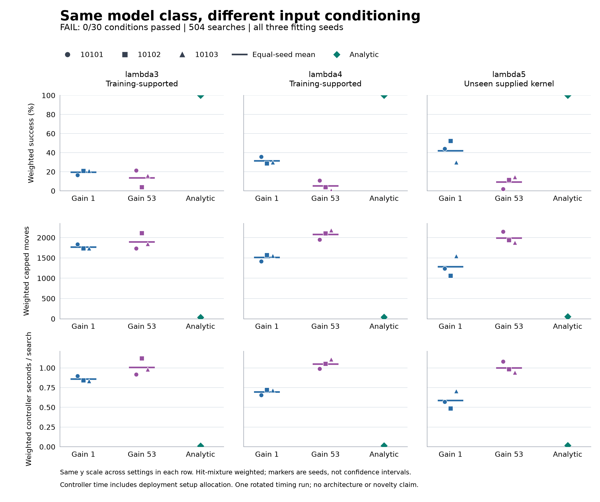

# Autonomous search after input conditioning

**FAIL: 0/30 frozen conditions passed.** Gain53 competence: 0/18; paired conditioning improvement: 0/12. Gain1 descriptive competence: 0/18.

The tested gain53 recipe lowers equal-seed weighted success from **19.51% / 31.41% / 42.02%** to **13.57% / 5.10% / 9.20%** across lambda3/4/5. It also increases capped moves and complete controller cost in every setting. Analytic control finds the source in all **72/72** cases. Neither learned family meets the absolute competence requirement.

This compares two training parameterizations of the same width-eight MLP, using six unchanged checkpoints and an analytic control. It establishes no new architecture, recurrence or connectome advantage. The earlier scalar screen remains **FAIL, 3/6 conditions passed**.

All 504 searches are retained: seven arms on 24 paired cases per setting, with a 2,188-move cap. Lambda3/4 are training-supported; lambda5 has an unseen sensing length with the exact kernel supplied on the same grid. This is supplied-model parameter transfer, not unknown-model adaptation. Multiple fitting seeds share cases and are not independent environmental samples.

Raw means weight the three balanced initial-hit strata equally. Weighted means use the setting-specific initial-hit mixture; family means equally average all three fitting seeds. Failures contribute 2,188 moves. Controller seconds include initialization, branches/features, gain scaling, readout, selection, updates and allocated deployment setup. Only measured nested artifact I/O is excluded. No confidence intervals are claimed.

## lambda3

| Arm | Raw found / 24 | Weighted success | Raw moves | Weighted moves | Raw controller s | Weighted controller s |
|---|---:|---:|---:|---:|---:|---:|
| gain1@10101 | 9/24 (37.5%) | 16.62% | 1374.750 | 1834.033 | 0.665644 | 0.897554 |
| gain53@10101 | 3/24 (12.5%) | 21.28% | 1918.417 | 1732.146 | 1.011698 | 0.916745 |
| gain1@10102 | 11/24 (45.8%) | 20.95% | 1194.042 | 1733.387 | 0.580513 | 0.842019 |
| gain53@10102 | 3/24 (12.5%) | 3.72% | 1915.917 | 2107.034 | 1.014728 | 1.121076 |
| gain1@10103 | 11/24 (45.8%) | 20.95% | 1200.958 | 1733.886 | 0.575959 | 0.833449 |
| gain53@10103 | 5/24 (20.8%) | 15.72% | 1733.333 | 1845.201 | 0.916632 | 0.979342 |
| analytic_inbounds | 24/24 (100.0%) | 100.00% | 23.542 | 35.235 | 0.007247 | 0.010901 |

Equal-seed weighted family means (success / capped moves / controller s): gain1: 19.51% / 1767.102 / 0.857674; gain53: 13.57% / 1894.794 / 1.005721.

| Arm | H=1 s/search | H=100 s/search | H=10,000 s/search |
|---|---:|---:|---:|
| gain1@10101 | 8.950075 | 0.978058 | 0.898337 |
| gain53@10101 | 9.442542 | 1.001983 | 0.917577 |
| gain1@10102 | 8.603126 | 0.919612 | 0.842777 |
| gain53@10102 | 9.660598 | 1.206454 | 1.121912 |
| gain1@10103 | 8.647495 | 0.911571 | 0.834212 |
| gain53@10103 | 9.665461 | 1.066185 | 0.980193 |
| analytic_inbounds | 0.010901 | 0.010901 | 0.010901 |

## lambda4

| Arm | Raw found / 24 | Weighted success | Raw moves | Weighted moves | Raw controller s | Weighted controller s |
|---|---:|---:|---:|---:|---:|---:|
| gain1@10101 | 10/24 (41.7%) | 35.78% | 1283.292 | 1417.090 | 0.593200 | 0.653773 |
| gain53@10101 | 2/24 (8.3%) | 10.99% | 2007.125 | 1950.008 | 1.020020 | 0.988885 |
| gain1@10102 | 12/24 (50.0%) | 28.68% | 1101.542 | 1568.312 | 0.506036 | 0.720590 |
| gain53@10102 | 4/24 (16.7%) | 3.89% | 1824.292 | 2103.150 | 0.917256 | 1.052973 |
| gain1@10103 | 12/24 (50.0%) | 29.76% | 1108.542 | 1548.184 | 0.509640 | 0.713568 |
| gain53@10103 | 1/24 (4.2%) | 0.43% | 2096.875 | 2178.504 | 1.062011 | 1.106048 |
| analytic_inbounds | 24/24 (100.0%) | 100.00% | 27.417 | 43.188 | 0.008990 | 0.014738 |

Equal-seed weighted family means (success / capped moves / controller s): gain1: 31.41% / 1511.195 / 0.695977; gain53: 5.10% / 2077.221 / 1.049302.

| Arm | H=1 s/search | H=100 s/search | H=10,000 s/search |
|---|---:|---:|---:|
| gain1@10101 | 8.706294 | 0.734276 | 0.654556 |
| gain53@10101 | 9.514682 | 1.074123 | 0.989718 |
| gain1@10102 | 8.481697 | 0.798184 | 0.721349 |
| gain53@10102 | 9.592495 | 1.138351 | 1.053809 |
| gain1@10103 | 8.527615 | 0.791690 | 0.714331 |
| gain53@10103 | 9.792167 | 1.192892 | 1.106899 |
| analytic_inbounds | 0.014738 | 0.014738 | 0.014738 |

## lambda5

| Arm | Raw found / 24 | Weighted success | Raw moves | Weighted moves | Raw controller s | Weighted controller s |
|---|---:|---:|---:|---:|---:|---:|
| gain1@10101 | 15/24 (62.5%) | 44.03% | 842.583 | 1237.560 | 0.387524 | 0.569231 |
| gain53@10101 | 2/24 (8.3%) | 1.83% | 2006.000 | 2148.059 | 1.008750 | 1.080322 |
| gain1@10102 | 15/24 (62.5%) | 52.22% | 862.750 | 1063.393 | 0.397055 | 0.485883 |
| gain53@10102 | 3/24 (12.5%) | 11.45% | 1915.750 | 1939.004 | 0.962833 | 0.982122 |
| gain1@10103 | 13/24 (54.2%) | 29.82% | 1029.833 | 1542.189 | 0.474890 | 0.703258 |
| gain53@10103 | 5/24 (20.8%) | 14.33% | 1733.833 | 1875.789 | 0.865598 | 0.938698 |
| analytic_inbounds | 24/24 (100.0%) | 100.00% | 38.500 | 53.685 | 0.012631 | 0.018064 |

Equal-seed weighted family means (success / capped moves / controller s): gain1: 42.02% / 1281.047 / 0.586124; gain53: 9.20% / 1987.617 / 1.000381.

| Arm | H=1 s/search | H=100 s/search | H=10,000 s/search |
|---|---:|---:|---:|
| gain1@10101 | 8.621752 | 0.649734 | 0.570014 |
| gain53@10101 | 9.606119 | 1.165560 | 1.081154 |
| gain1@10102 | 8.246990 | 0.563477 | 0.486641 |
| gain53@10102 | 9.521644 | 1.067500 | 0.982958 |
| gain1@10103 | 8.517304 | 0.781380 | 0.704021 |
| gain53@10103 | 9.624818 | 1.025542 | 0.939549 |
| analytic_inbounds | 0.018064 | 0.018064 | 0.018064 |

## Paid costs and scope

Autonomous worker: 1532.450 s; original parent: 1533.520 s; independent saved audit: 384.927 s. Worker time is nested inside parent time, not additional to it.

Previously paid scalar fitting worker: 62.217 s, including preparation 1.511 s and initial function pairing 1.219 s. No fitting occurred in the autonomous study.

| Fixed checkpoint | Original fit s | Deployment load/validation s |
|---|---:|---:|
| gain1@10101 | 7.799052 | 0.001362 |
| gain53@10101 | 8.272478 | 0.001209 |
| gain1@10102 | 7.507950 | 0.001045 |
| gain53@10102 | 8.286367 | 0.001044 |
| gain1@10103 | 7.560818 | 0.001117 |
| gain53@10103 | 8.432978 | 0.001030 |

Autonomous shared setup: 1.741092 s; learned module setup: 0.001384 s. Each head load is allocated over 72 searches; learned module setup over 432.

Separate predeployment qualification: worker 13.640 s, parent 14.051 s, saved audit 12.516 s. It used 96 head/state comparisons and zero native calls; full evaluation did not repeat parity.

H columns are accounting scenarios U + (L + P/6 + D)/H, not extra searches. U removes deployment allocation, L is that head's original fit time, P is shared fitting preparation, and D is its load plus one sixth of learned module setup. Qualification, initial pairing and other diagnostics are reported separately, not silently added to this formula. Analytic initialization is paid per search. Timing is specific to one rotated run and this runtime.

## Every frozen condition

Values below are rounded for reading. Decisions use the saved unrounded inequalities; no epsilon or rule is changed.

### Gain53 competence (18)

| Rule | Value | Required bound | Result |
|---|---:|---:|---|
| lambda3.gain53.10101.success | 0.212760034 | >= 0.95 | FAIL |
| lambda3.gain53.10101.moves | 1732.14641 | <= 36.9972496 | FAIL |
| lambda3.gain53.10102.success | 0.0372399664 | >= 0.95 | FAIL |
| lambda3.gain53.10102.moves | 2107.03354 | <= 36.9972496 | FAIL |
| lambda3.gain53.10103.success | 0.157229492 | >= 0.95 | FAIL |
| lambda3.gain53.10103.moves | 1845.20072 | <= 36.9972496 | FAIL |
| lambda4.gain53.10101.success | 0.109904914 | >= 0.95 | FAIL |
| lambda4.gain53.10101.moves | 1950.0081 | <= 45.3469177 | FAIL |
| lambda4.gain53.10102.success | 0.0388744295 | >= 0.95 | FAIL |
| lambda4.gain53.10102.moves | 2103.15015 | <= 45.3469177 | FAIL |
| lambda4.gain53.10103.success | 0.00434212874 | >= 0.95 | FAIL |
| lambda4.gain53.10103.moves | 2178.50376 | <= 45.3469177 | FAIL |
| lambda5.gain53.10101.success | 0.0182784511 | >= 0.95 | FAIL |
| lambda5.gain53.10101.moves | 2148.05889 | <= 56.3690157 | FAIL |
| lambda5.gain53.10102.success | 0.114512022 | >= 0.95 | FAIL |
| lambda5.gain53.10102.moves | 1939.00412 | <= 56.3690157 | FAIL |
| lambda5.gain53.10103.success | 0.143278451 | >= 0.95 | FAIL |
| lambda5.gain53.10103.moves | 1875.78932 | <= 56.3690157 | FAIL |

### Paired improvement (12)

| Rule | Value | Required bound | Result |
|---|---:|---:|---|
| lambda3.success | 0.135743164 | >= 0.195056294 | FAIL |
| lambda3.moves | 1894.79356 | <= 1678.74663 | FAIL |
| lambda3.positive_blocks | 3 | >= 6 | FAIL |
| lambda3.cost | 1.00572084 | <= 0.857674045 | FAIL |
| lambda4.success | 0.0510404907 | >= 0.314066877 | FAIL |
| lambda4.moves | 2077.22067 | <= 1435.6356 | FAIL |
| lambda4.positive_blocks | 1 | >= 6 | FAIL |
| lambda4.cost | 1.04930197 | <= 0.695977233 | FAIL |
| lambda5.success | 0.0920229746 | >= 0.420246543 | FAIL |
| lambda5.moves | 1987.61744 | <= 1216.9949 | FAIL |
| lambda5.positive_blocks | 1 | >= 6 | FAIL |
| lambda5.cost | 1.00038062 | <= 0.586124117 | FAIL |

### Gain1 competence (18 descriptive controls, outside the 30-condition screen)

| Rule | Value | Required bound | Result |
|---|---:|---:|---|
| lambda3.gain1.10101.success | 0.166167119 | >= 0.95 | FAIL |
| lambda3.gain1.10101.moves | 1834.03261 | <= 36.9972496 | FAIL |
| lambda3.gain1.10102.success | 0.209500882 | >= 0.95 | FAIL |
| lambda3.gain1.10102.moves | 1733.38696 | <= 36.9972496 | FAIL |
| lambda3.gain1.10103.success | 0.209500882 | >= 0.95 | FAIL |
| lambda3.gain1.10103.moves | 1733.88557 | <= 36.9972496 | FAIL |
| lambda4.gain1.10101.success | 0.357836214 | >= 0.95 | FAIL |
| lambda4.gain1.10101.moves | 1417.09026 | <= 45.3469177 | FAIL |
| lambda4.gain1.10102.success | 0.28680573 | >= 0.95 | FAIL |
| lambda4.gain1.10102.moves | 1568.31191 | <= 45.3469177 | FAIL |
| lambda4.gain1.10103.success | 0.297558687 | >= 0.95 | FAIL |
| lambda4.gain1.10103.moves | 1548.18394 | <= 45.3469177 | FAIL |
| lambda5.gain1.10101.success | 0.440323331 | >= 0.95 | FAIL |
| lambda5.gain1.10101.moves | 1237.56015 | <= 56.3690157 | FAIL |
| lambda5.gain1.10102.success | 0.522173687 | >= 0.95 | FAIL |
| lambda5.gain1.10102.moves | 1063.3926 | <= 56.3690157 | FAIL |
| lambda5.gain1.10103.success | 0.298242611 | >= 0.95 | FAIL |
| lambda5.gain1.10103.moves | 1542.18904 | <= 56.3690157 | FAIL |

## Interpretation and provenance

A pass supports separately frozen confirmation of this optimization recipe, not novelty or optimality. A failure does not rule out other conditioning, coverage, spatial or recurrent mechanisms. Full public belief is supplied to every arm; this study does not test learned memory. The independent audit reconstructs public trajectories, saved learned readouts and aggregates. Actual native randomness, historical optimization and timing truth remain authenticated execution evidence.

Independent audit: 28,585,241 comparisons and 651,596 saved-checkpoint readouts (10,425,536 branch rows). The reporter performed no model or simulator calls.

[Protocol](otto-conditioning-control-protocol.md) | [Prior scalar result](otto-conditioning-results.md) | [Frozen plan](../output/otto-conditioning-control-v1/plan-01.json) | [Worker summary](../output/otto-conditioning-control-v1/run-01/summary.json) | [Independent audit](../output/otto-conditioning-control-v1/audit-01/summary.json) | [Worker receipt](../output/otto-conditioning-control-v1/run-01/receipt.json) | [Audit receipt](../output/otto-conditioning-control-v1/audit-01/receipt.json) | [Original parent](../output/otto-conditioning-control-v1/run-process-01.terminal.json)

The numerical summary records 28,585,241 comparisons before final closure; the completed audit receipt records **28,585,498** including the final 257 authentication checks. All numerical differences are zero. This counting distinction does not change any condition.

[Complete raw release](https://github.com/kw2828/OpenJev/releases/tag/otto-conditioning-control-v1) includes the original six fitted heads, three kernels, all current worker/qualification/audit records, and source files. Its restoration notes identify earlier data dependencies and the original-path requirement for strict numerical replay.

The tested scaling recipe is rejected as a fix for this pilot. It does not identify the cause of the learning failure. The next [spatial design](otto-spatial-design-review.md) is a separate, unimplemented proposal with convolutional, dense, neighbor-free and familiar-statistics controls; no training or performance result is claimed for it.
