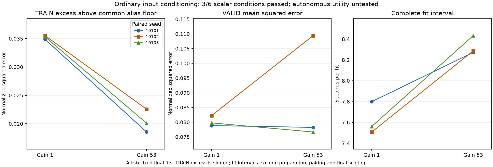

# OTTO: fixed spatial-input conditioning

**FAIL: 3/6 scalar conditions passed.** All three training-excess conditions pass; all three required validation improvements fail. Scaling the spatial inputs by 53 reduces mean training error above the empirical floor by **42.11%**, but raises mean validation MSE by **9.73%**. Validation improves slightly in seeds 10101 and 10103 and worsens in 10102. Equal-seed averages do not replace the individual conditions.

The fixed scalar screen passed **3/6 conditions**; its overall flag is **false**. Both gains completed all three seeds. This is an ordinary optimization control with the same width-eight model class, not an architectural advance. Fresh autonomous evaluation is required regardless of this scalar result.

Each fresh model used 5,589 cached TRAIN prefixes, uniform Monte Carlo targets `(T-t)/64`, 80 epochs and 3,520 Adam updates. All 1,109 exposed VALID prefixes were evaluated at the fixed final checkpoint. No new policy or simulator was run. The gain-53 spatial weights were inversely scaled at initialization; all three approximate initial-function checks passed before any optimizer update. The raw mass baseline and context features were unchanged.

The common empirical TRAIN alias floor is **0.06400578187**. Excess below is signed MSE minus that floor. MSE uses normalized return units; physical MAE restores the factor of 64. Negative counts refer to signed final predictions and are not clipped.

| Gain | Seed | TRAIN MSE | TRAIN excess | VALID MSE | TRAIN MAE | VALID MAE | Negative TRAIN / VALID | Fit seconds |
|---|---:|---:|---:|---:|---:|---:|---:|---:|
| gain1 | 10101 | 0.098882196 | 0.034876414 | 0.078847131 | 13.7177 | 13.1701 | 4 / 1 | 7.799 |
| gain53 | 10101 | 0.082548532 | 0.018542751 | 0.078235098 | 11.9938 | 12.9738 | 77 / 45 | 8.272 |
| gain1 | 10102 | 0.099529688 | 0.035523907 | 0.082254738 | 14.0423 | 13.6391 | 0 / 0 | 7.508 |
| gain53 | 10102 | 0.086567725 | 0.022561943 | 0.10940644 | 12.7754 | 14.1676 | 9 / 7 | 8.286 |
| gain1 | 10103 | 0.099329947 | 0.035324165 | 0.079760751 | 13.8294 | 13.287 | 3 / 0 | 7.561 |
| gain53 | 10103 | 0.084105059 | 0.020099278 | 0.076664347 | 12.1738 | 12.9637 | 72 / 29 | 8.433 |

| Arm | Total fit seconds | Mean fit seconds |
|---|---:|---:|
| gain1 | 22.868 | 7.623 |
| gain53 | 24.992 | 8.331 |

Preparation took 1.511 s and initial pairing 1.219 s. The worker interval was 62.217 s; its enclosing supervisor interval was 62.562 s. The separate independent audit took 15.798 s. These nested worker/parent intervals must not be summed. Worker peak RSS was 2383.5 MiB; audit peak RSS was 2042.3 MiB. Per-arm fit intervals include initialization, optimizer work, journals and checkpoint publication, but exclude preparation, initial pairing and final scalar diagnostics. Timing is one CPU-thread pass, not a replicated latency benchmark.

The audit independently replayed 300 local saved-model readouts covering 73,842 rows, including initial and final parity witnesses. It reconstructed cached features, targets, the alias floor and all six decisions. Torch initialization, optimization and timing truth remain authenticated execution evidence. Scalar fitting cannot establish action quality or autonomous success. Gain changes Adam steps, clipping geometry and rounding together; no isolated causal mechanism is established. All previous failed study decisions remain unchanged.

## Complete fixed conditions

| Condition | Value | Maximum allowed | Passed |
|---|---:|---:|:---:|
| gain53.10101.train_excess | 0.01854275054 | 0.0279011311 | True |
| gain53.10101.valid_mse | 0.07823509796 | 0.07096241789 | False |
| gain53.10102.train_excess | 0.02256194287 | 0.02841912522 | True |
| gain53.10102.valid_mse | 0.1094064425 | 0.07402926457 | False |
| gain53.10103.train_excess | 0.02009927754 | 0.02825933183 | True |
| gain53.10103.valid_mse | 0.07666434655 | 0.07178467554 | False |

Decisions use unrounded values, without epsilon or clipping. All six are required for the scalar flag.

[Protocol](otto-conditioning-protocol.md) | [Plan](../output/otto-conditioning-v1/plan-01.json) | [Worker receipt](../output/otto-conditioning-v1/run-01/receipt.json) | [Parent terminal](../output/otto-conditioning-v1/run-process-01.terminal.json) | [Independent audit](../output/otto-conditioning-v1/audit-01/receipt.json) | [Complete audit summary](../output/otto-conditioning-v1/audit-01/summary.json) | [Exact plotted values](../output/otto-conditioning-v1/report-01/plotted-values.json) | [Publication receipt](../output/otto-conditioning-v1/report-01/receipt.json)

The fixed gain follows the known 53x53 support size. It is ordinary input conditioning, with no gain sweep, extra data or extra parameters. It improves fit on this cache without meeting the validation rule. It does not establish useful decisions, recurrence, biological wiring or a new architecture.

The [proposed autonomous comparison](../output/otto-conditioning-v1/autonomous-design-review.md) retains both gains and all three fits on 72 fresh cases / 504 episodes, with analytic control and separately reported supplied-kernel transfer. It is **unexecuted** and requires its own deployed-branch qualification and frozen plan. The scalar failure does not cancel it.

[Complete evidence archive](https://github.com/kw2828/OpenJev/releases/tag/otto-conditioning-v1). Historical input caches remain separate dependencies of the [original scalar release](https://github.com/kw2828/OpenJev/releases/tag/otto-return-value-v1); the [capacity release](https://github.com/kw2828/OpenJev/releases/tag/otto-capacity-v1) supplies the authenticated initialization/training control.
