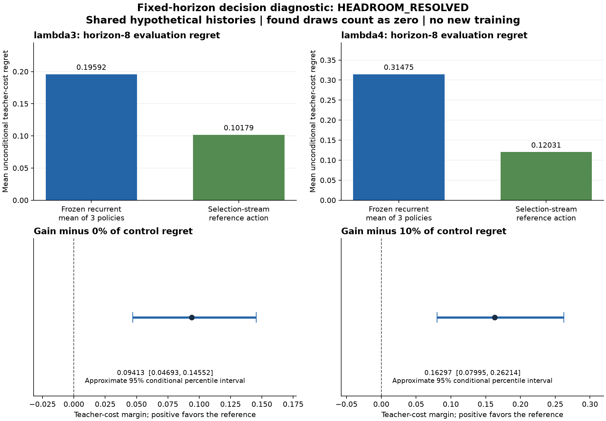

# Fixed-horizon decision diagnostic: HEADROOM_RESOLVED

**This measures decision headroom for frozen models, not a newly improved model.** All three original processes and the independent audit completed. The previous paired-action study remains `DEV_FAIL 6/18`. This diagnostic changes neither that result nor any training authorization.

At horizon 8, 128 selection draws choose one lowest-mean-cost reference action per public prefix. A separate 128-draw evaluation stream measures that fixed action and all frozen policies on the same histories. The control averages regrets of three `paired_recurrent` policies making separate decisions; it does not average their predicted costs into a new policy. Every retained prefix counts equally, and found draws contribute zero.

| Setting | Prefixes | Frozen recurrent regret | Reference regret | Gain | Required fraction | Gain minus requirement | Approx. 95% interval | Gate |
|---|---:|---:|---:|---:|---:|---:|---|---|
| lambda3 | 24 | 0.195918 | 0.101792 | 0.094127 | 0% | 0.094127 | [0.046926, 0.145517] | pass |
| lambda4 | 24 | 0.314752 | 0.120309 | 0.194443 | 10% | 0.162968 | [0.079950, 0.262143] | pass |

The criterion requires a positive lower margin endpoint, positive control regret, at least 16 retained prefixes per setting, and at least 32 survivors in each stream for every prefix with positive exact survival probability. Conditions are retained separately:

| Setting | Minimum cases | MC support | Positive control regret | Positive lower margin |
|---|---|---|---|---|
| lambda3 | True | True | True | True |
| lambda4 | True | True | True | True |

Intervals are approximate hierarchical bootstrap percentiles, conditional on the retained prefixes, realized selection streams and fixed policies. They omit selection-algorithm variability. Fit seeds share evaluation data and are not independent datasets.

## Support and estimands

Retained **48/64** attempted prefixes; **16** terminated within the eight observed analytic-policy transitions and were excluded without replacement. No actual native continuation follows the prefix.

| Setting | Retained | Exact zero-survival prefixes | Positive-survival prefixes below MC support | Min select/eval survivors | Mean exact survival | Mean evaluation-MC survival |
|---|---:|---:|---:|---|---:|---:|
| lambda3 | 24 | 0 | 0 | 72/82 | 0.892691 | 0.893880 |
| lambda4 | 24 | 0 | 0 | 92/95 | 0.941362 | 0.945312 |

Horizon 4 enumerates all 256 odor histories under the declared 53-bit root/sensor grid law. Its information and approximation terms are exact for that numerical reference, subject to recorded float arithmetic. Horizon 8 uses the evaluation stream for a descriptive plug-in decomposition, with its empirical survival denominator. The separately reported exact survival probability does not replace that denominator. The plug-in adaptive minimum is not an unbiased estimate or proof of a true information floor.

For each prefix, unconditional regret is survival mass times conditional regret. These per-prefix values are averaged with zero-support prefixes retained as zero. Multiplying a conditional cohort mean by average survival mass would be a different quantity. The prior study's random average over surviving rows is also a different estimand.

## All twelve frozen policies

Every entry is unconditional mean teacher-cost regret. H4 is the finite-grid expectation; H8 is evaluation MC. All policy-level decomposition terms and the H4 sampling errors/estimated standard errors remain in the linked JSON.

| Frozen policy | Fit seed | H4 lambda3 | H4 lambda4 | H8 lambda3 | H8 lambda4 |
|---|---|---:|---:|---:|---:|
| Effect recurrent | 330000001 | 0.132346 | 0.262377 | 0.176885 | 0.259306 |
| Effect recurrent | 330000002 | 0.140023 | 0.226241 | 0.202972 | 0.313166 |
| Effect recurrent | 330000003 | 0.145494 | 0.169483 | 0.180627 | 0.249983 |
| Paired recurrent | 330000001 | 0.106225 | 0.222340 | 0.162128 | 0.358817 |
| Paired recurrent | 330000002 | 0.138490 | 0.185452 | 0.217081 | 0.303284 |
| Paired recurrent | 330000003 | 0.197255 | 0.199724 | 0.208546 | 0.282155 |
| Paired action blind | 330000001 | 0.198969 | 0.218858 | 0.465605 | 0.364146 |
| Paired action blind | 330000002 | 0.224737 | 0.210147 | 0.340093 | 0.285702 |
| Paired action blind | 330000003 | 0.238127 | 0.263129 | 0.401125 | 0.283967 |
| Paired direct | 330000001 | 0.134742 | 0.282868 | 0.375868 | 0.263127 |
| Paired direct | 330000002 | 0.125062 | 0.237210 | 0.398110 | 0.280842 |
| Paired direct | 330000003 | 0.180412 | 0.196701 | 0.224585 | 0.365274 |

## Charged computation and interpretation

| Original phase | Worker seconds |
|---|---:|
| collection | 887.834 |
| prediction | 1.858 |
| audit | 26.974 |

Total new worker time: **916.666s**, including collection, frozen inference/analysis and independent audit. Collection records **23557** teacher annotations and **450** actual prefix steps. Nested operation times must not be added to wall times. Qualification and publication are outside this total. Historical parent-model construction costs and all twelve inference timings are retained in the JSON; this is not a training-speed comparison.

Publication clarification made before outcome inspection: the frozen protocol describes the reference as having richer information. The student actually reads all nine prefix rows, which retain the initial and eight later odor indicators, eight preceding-action indicators, discrete positions and sensing length. With the known law, that observed history may be reconstructible from the student inputs. This diagnostic therefore does not establish strictly extra observed information or irreducible input-compression loss.

The reference instead has explicit belief reconstruction, the known sampling law, filter computation and teacher lookahead. Those computations carry costs and are not the learned 28-dimensional recurrent state. Information loss within that learned state is possible but is not established by this comparison. The reference receives no realized future observations when selecting its action. All costs are teacher labels, not demonstrated environment return.

The audit independently checks public strict/legacy filtering, finite-grid weights, saved random draws, horizon-four lookup identities, scalar decomposition and bootstrap. It reconciles teacher costs with recorded forward masses and values without re-evaluating the teacher. No model is trained here, no policy runs autonomous continuations, and no architecture, biological-learning, robotics-transfer or novelty claim follows.

[Complete scalars and support](otto-cost-information-results/summary.json) | [Protocol](otto-cost-information-protocol.md) | [Original closure](../output/otto-cost-information-v1/closure-01.json)
