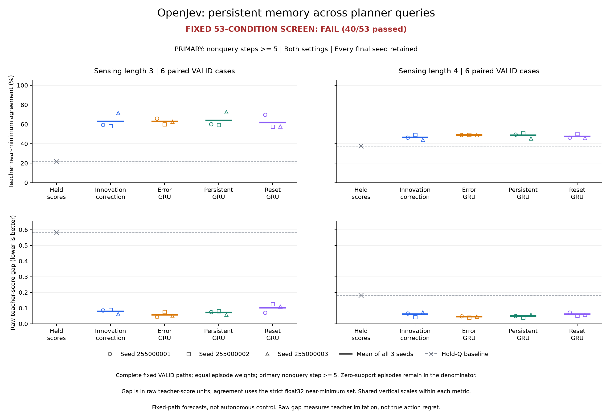

# Cross-query correction: closed forecast comparison

**The frozen continuation rule failed: 40 of 53 conditions passed, with 13 failures.** The explicit `innovation` correction improved on holding the last queried scores, but did not improve on ordinary persistent recurrence in either sensing setting. Its three-fit primary teacher-score gaps were 0.079717 and 0.061036, versus 0.071971 and 0.049753 for `persistent_direct`; its agreement was also lower in both settings. Collection, all 12 fits and the independent saved-output audit completed successfully. This experiment is closed and does not admit an autonomous follow-up under its rule.

The result concerns forecasts along fixed trajectories. It establishes no architecture, autonomous-control, reinforcement-learning, world-model or biological advantage. Raw gap measures disagreement with the fixed teacher's action scores, not true action value or realized search regret.

[Protocol](otto-cross-query-forecast-protocol.md) · [Engineering and capacity qualification](otto-cross-query-engineering.md) · [Evidence layout](../output/otto-cross-query-forecast-v1/README.md) · [Release evidence](https://github.com/kw2828/OpenJev/releases/tag/otto-cross-query-forecast-v1)

[Vector figure](../docs/assets/otto-cross-query-forecast.svg) · [All 53 conditions](../docs/assets/otto-cross-query-conditions.png) · [Complete metric CSV](../output/otto-cross-query-forecast-v1/figures-02/forecast-metrics.csv) · [Condition operands](../output/otto-cross-query-forecast-v1/figures-02/conditions.csv)

The four fixed families receive the same 31 public features and real teacher queries at steps 0, 4, 8 and onward. `innovation` adds a learned error correction to persistent hidden state; `innovation_gru` feeds its own teacher-score prediction error through an ordinary GRU. `persistent_direct` retains state while processing each new query; `reset_direct` resets at each query. Their parameter counts are 5,978, 5,996, 5,862 and 5,862. No skipped teacher label enters model inputs. This tests the correction mechanism against ordinary recurrence and explicit-error controls at similar capacity.

There were 54 TRAIN paths and 36 VALID paths, with analytic, neural and period-four-held-score collectors for every case, preserving the 2,188-step horizon and final updates. TRAIN used nine cases per setting and VALID used six. All 90 paths closed: 77 found the source and 13 were horizon-censored. These are collector outcomes, not learned-controller evaluations. The paths contained 30,128 steps: 22,782 TRAIN and 7,346 VALID.

TRAIN retained all 5,715 genuine query inputs plus 795 selected nonquery loss rows from 291 uniformly sampled period-four windows. For each episode, `W=ceil(T/4)`, `k=min(8,W)` and `M=T-W`; selected loss rows carry weight `W/(k*54*M)`, with zero when `M=0`, without renormalizing realized weights. Three TRAIN episodes had no nonquery support. VALID used the complete census. Each fit ran 80 epochs, 720 Adam updates, learning rate 0.003 and clip norm 5, with six whole episodes per batch and 32-step truncated backpropagation. State crossed query and chunk boundaries; gradients stopped at chunk boundaries. All 12 final checkpoints were saved and byte-checked before any VALID array decoding. No fit or checkpoint was selected from VALID.

Primary metrics use **nonquery steps at absolute step 5 or later**, after the first genuine correction at step 4. Agreement uses the original strict float32 near-minimum set; gap is the teacher score of the predicted action minus its best legal score. Each episode has equal weight and divides it among its eligible rows. Episodes with zero support retain their denominator share and contribute zero to both metrics. Agreement percentages below are therefore episode-weighted scores, not pooled action accuracy or search-success rates.

All 12 fixed fits and the hold reference follow. Agreement is higher-is-better; raw teacher-score gap is lower-is-better.

| Family | Fit seed | λ3 agreement | λ3 gap | λ4 agreement | λ4 gap |
| --- | --- | --- | --- | --- | --- |
| hold | - | 21.58% | 0.582258 | 37.55% | 0.180899 |
| innovation | 255000001 | 59.41% | 0.084945 | 46.42% | 0.065417 |
| innovation_gru | 255000001 | 65.95% | 0.043737 | 49.06% | 0.047891 |
| persistent_direct | 255000001 | 60.00% | 0.075651 | 49.55% | 0.049899 |
| reset_direct | 255000001 | 69.77% | 0.070440 | 46.25% | 0.071670 |
| innovation | 255000002 | 58.06% | 0.090640 | 49.24% | 0.043937 |
| innovation_gru | 255000002 | 60.16% | 0.076203 | 49.19% | 0.041161 |
| persistent_direct | 255000002 | 59.41% | 0.081103 | 51.17% | 0.041220 |
| reset_direct | 255000002 | 57.65% | 0.125549 | 50.19% | 0.052004 |
| innovation | 255000003 | 71.76% | 0.063566 | 44.27% | 0.073756 |
| innovation_gru | 255000003 | 62.74% | 0.050303 | 48.90% | 0.046974 |
| persistent_direct | 255000003 | 72.67% | 0.059159 | 45.58% | 0.058139 |
| reset_direct | 255000003 | 57.92% | 0.110972 | 46.20% | 0.059133 |

The following means include all three seeds. Full-path columns include nonquery steps 1-3 and are descriptive except for the four frozen nonregression checks against `reset_direct`. Centered MSE is in squared raw teacher-score units, without the training-only division by 64.

| Family | Setting | Primary agreement | Primary gap | Primary MSE | Full agreement | Full gap |
| --- | --- | --- | --- | --- | --- | --- |
| hold | λ3 | 21.58% | 0.582258 | 0.352363 | 18.66% | 0.623850 |
| hold | λ4 | 37.55% | 0.180899 | 0.120371 | 38.48% | 0.280345 |
| innovation | λ3 | 63.08% | 0.079717 | 0.098448 | 64.65% | 0.095559 |
| innovation | λ4 | 46.64% | 0.061036 | 0.059014 | 59.04% | 0.069003 |
| innovation_gru | λ3 | 62.95% | 0.056748 | 0.088556 | 71.79% | 0.064287 |
| innovation_gru | λ4 | 49.05% | 0.045342 | 0.050716 | 63.32% | 0.046087 |
| persistent_direct | λ3 | 64.03% | 0.071971 | 0.094382 | 65.75% | 0.090478 |
| persistent_direct | λ4 | 48.76% | 0.049753 | 0.056845 | 59.99% | 0.054576 |
| reset_direct | λ3 | 61.78% | 0.102320 | 0.095482 | 67.27% | 0.106625 |
| reset_direct | λ4 | 47.55% | 0.060936 | 0.054163 | 61.45% | 0.064680 |

Six distinct cases were scheduled per VALID setting, with three paired collector paths per case. Primary support came from 16 of 18 episodes and all six cases at λ3, and 12 of 18 episodes and five cases at λ4. Thus even perfect supported-episode agreement would produce primary aggregate scores of 88.89% and 66.67%, respectively, under the frozen zero-support convention. Supported-episode metrics remain in the saved records; they were not substituted into the rule. Three collector paths do not create three independent cases, and three fit seeds do not enlarge the case cohort.

Each age below rebuilds its within-episode weights independently. All six support conditions, requiring at least four distinct cases, passed.

| Setting | Age since query | Primary rows | Supported episodes | Supported cases | Weight mass |
| --- | --- | --- | --- | --- | --- |
| λ3 | 1 | 1146 | 16/18 | 6/6 | 0.888889 |
| λ3 | 2 | 1141 | 14/18 | 6/6 | 0.777778 |
| λ3 | 3 | 1138 | 12/18 | 6/6 | 0.666667 |
| λ4 | 1 | 658 | 12/18 | 5/6 | 0.666667 |
| λ4 | 2 | 656 | 12/18 | 5/6 | 0.666667 |
| λ4 | 3 | 655 | 12/18 | 5/6 | 0.666667 |

There were 5,394 primary rows and 5,492 full-path nonquery rows. Per-case, per-collector, age and full-path results are retained in the [audited summary](../output/otto-cross-query-forecast-v1/audit-01/audit.json) and the metric CSV; no short path or unsupported episode was replaced.

| Frozen condition group | Passed |
| --- | --- |
| Technical closure | 1/1 |
| Distinct-case age support | 6/6 |
| Each candidate fit versus hold | 12/12 |
| Each candidate fit and age versus hold | 17/18 |
| Primary candidate mean versus learned controls | 3/12 |
| Full-path mean versus reset control | 1/4 |

All 13 failed conditions follow. Agreement values are proportions; gaps use raw teacher-score units. Thresholds already include the frozen 10% control-gap margin where applicable. Exact unrounded operands and every passing condition are in the linked CSV. This development continuation rule is not a significance test.

| Failed condition | Observed | Required relation | Threshold |
| --- | --- | --- | --- |
| `lambda3.mean_gap_vs_innovation_gru` | 0.079716881 | <= | 0.051072945 |
| `lambda3.mean_agreement_vs_persistent_direct` | 0.630762141 | >= | 0.640260579 |
| `lambda3.mean_gap_vs_persistent_direct` | 0.079716881 | <= | 0.064773938 |
| `lambda3.full.mean_agreement_vs_reset_direct` | 0.646528094 | >= | 0.672651544 |
| `lambda4.255000003.age1.gap_vs_hold` | 0.064045915 | <= | 0.056802903 |
| `lambda4.mean_agreement_vs_innovation_gru` | 0.466414481 | >= | 0.490482838 |
| `lambda4.mean_gap_vs_innovation_gru` | 0.061036359 | <= | 0.040807797 |
| `lambda4.mean_agreement_vs_persistent_direct` | 0.466414481 | >= | 0.487647206 |
| `lambda4.mean_gap_vs_persistent_direct` | 0.061036359 | <= | 0.044777442 |
| `lambda4.mean_agreement_vs_reset_direct` | 0.466414481 | >= | 0.475457568 |
| `lambda4.mean_gap_vs_reset_direct` | 0.061036359 | <= | 0.054842073 |
| `lambda4.full.mean_agreement_vs_reset_direct` | 0.590416473 | >= | 0.614492598 |
| `lambda4.full.mean_gap_vs_reset_direct` | 0.069003191 | <= | 0.064679560 |

The 12 candidate-versus-hold conditions all passed, while one of 18 age comparisons failed. Only three of 12 primary learned-control comparisons passed. Candidate agreement and gap both trailed `persistent_direct` in both settings; better agreement than `innovation_gru` at λ3 did not coincide with a lower gap. Three of four full-path reset-control comparisons failed. These results do not isolate whether the limitation came from the correction parameterization, truncated training, data coverage or objective alignment.

Final sampled TRAIN loss below is a fresh full-history rescore at the final in-memory weights, before writing the checkpoint, with fixed `/64` scaling and sampled loss weights. It is not raw-unit VALID MSE. Each NPZ was reloaded to verify exact saved tensor bytes; VALID inference used the corresponding retained in-memory model, not a separately restored deployment model. Fit time includes initialization and optimization; rescore and checkpoint intervals are separate. Every row completed 80 epochs and 720 updates.

| Family | Seed | Final sampled TRAIN loss | Fit seconds | Rescore seconds | Checkpoint seconds |
| --- | --- | --- | --- | --- | --- |
| innovation | 255000001 | 1.06571606e-05 | 65.207 | 0.670 | 0.001354 |
| innovation_gru | 255000001 | 8.99996667e-06 | 75.368 | 0.776 | 0.001236 |
| persistent_direct | 255000001 | 9.7946413e-06 | 52.496 | 0.522 | 0.003069 |
| reset_direct | 255000001 | 1.34703341e-05 | 51.384 | 0.504 | 0.001253 |
| innovation | 255000002 | 1.04984192e-05 | 66.953 | 0.658 | 0.001057 |
| innovation_gru | 255000002 | 8.16136981e-06 | 76.750 | 0.741 | 0.001111 |
| persistent_direct | 255000002 | 1.0370095e-05 | 52.810 | 0.509 | 0.001472 |
| reset_direct | 255000002 | 1.21341454e-05 | 54.574 | 0.529 | 0.001151 |
| innovation | 255000003 | 1.30481976e-05 | 66.452 | 0.671 | 0.001345 |
| innovation_gru | 255000003 | 1.11597637e-05 | 75.314 | 0.783 | 0.001189 |
| persistent_direct | 255000003 | 1.32031691e-05 | 52.021 | 0.484 | 0.001362 |
| reset_direct | 255000003 | 1.25916258e-05 | 51.200 | 0.493 | 0.001384 |

There were 8,640 optimizer updates, 439,680 training forward chunks and 21,870,720 training row evaluations. Final TRAIN rescoring added 273,384 row evaluations; VALID added 88,152 model row evaluations. Zero-target chunks still carried state, and zero-target batches still advanced Adam with materialized zero gradients. Paired families used identical per-seed episode orders.

The original successful process timings were:

| Phase | Worker seconds | Original parent seconds | Peak worker RSS bytes |
| --- | --- | --- | --- |
| Collection | 581.522849 | 581.805288 | 728,563,712 |
| Training, rescoring and VALID | 754.357448 | 754.646994 | 311,541,760 |
| Independent saved-output audit | 1.864190 | 1.982884 | 112,279,552 |

The three original parent intervals total **1338.435166 seconds**. This excludes prior fabricated qualification, synthetic capacity screening and later publication work. Collection and training each had a 7,200-second, single-CPU-thread, 4 GiB RSS, 2 GiB output allocation; the audit had 120 seconds, 2 GiB RSS and 128 MiB output. All original processes exited successfully, with no remaining process group or cleanup error.

The [collection cost record](../output/otto-cross-query-forecast-v1/collection-01/costs.json) separates setup (3.819994 s), TRAIN collection (303.591480 s), TRAIN serialization (0.049657 s), VALID collection (273.568287 s) and VALID serialization (0.015093 s). These intervals are disjoint. Its 13,889 teacher returns comprise 7,854 deployed queries and 6,035 annotation-only calls. Teacher scoring took 479.278282 s, including 465.219280 s of TensorFlow value calls; these nested timings must not be added. Native stepping took 53.902465 s over 30,128 moves. Public annotation replay retained 54 resets and 22,782 updates. The partial 4.080104 s journal-I/O timer overlaps physical intervals and is not an extra cost or a complete I/O measurement.

Training setup took 1.247473 s; the full fitting loop, including 12 rescoring and checkpoint intervals, took 747.894153 s; VALID loading, forecasting, reduction and publication took 4.878287 s. Authentication, hashing and remaining overhead are retained in worker and parent totals. These are collection and forecast-study costs, not measurements of an autonomous deployed controller or evidence of query savings.

The independent audit completed **697,122 final checks**, including final closure checks; its saved `audit.json` contains the earlier count of 696,862. It checked the 126-source closure, original processes, 90 collected episodes, selected TRAIN targets and weights, full query inputs, 12 checkpoints, 13 saved prediction files, 17,280 work events, all reported metrics and all 53 conditions. It decoded 32 saved NPZ files and made zero model, native-environment or optimizer calls. Neural predictions, original teacher values, native/public-filter numerical truth, gradients and physical timing truth remain authenticated inherited evidence, not independently regenerated calculations. The worker's technical condition was provisional; only successful original audit closure completes that condition, giving final 40/53 without changing scientific conditions.

The first presentation attempt, [figures-01](../output/otto-cross-query-forecast-v1/figures-01/receipt.json), failed because the authenticated audit JSON was 17.01 MiB, above the renderer's 16 MiB read bound. A separate presentation-only repair raised that bound to 32 MiB for this authenticated audit file. [Figures-02](../output/otto-cross-query-forecast-v1/figures-02/receipt.json) completed with all 52 individual plotted points, 16 mean points and all 53 conditions. The failed attempt is preserved. No scientific source, outcome, criterion or fit changed, and the 697,122 scientific audit checks do not claim to validate the failed rendering attempt.

A possible future test would hold data, query information and compute fixed while comparing the candidate and ordinary persistent GRU under MSE versus one prospectively specified decision-focused objective. This follows the distinction between predictive error and decision quality in [decision-focused learning](https://arxiv.org/abs/1809.05504). It requires a fresh protocol and held-out cases; it is not a diagnosis of this failure or permission to alter this study. The present comparison provides no basis for promoting the correction mechanism or launching an autonomous experiment under its failed rule.

Principal immutable evidence pins follow. Full scope, per-case metrics, work ledgers, qualifications and checkpoints are preserved in the [release evidence](https://github.com/kw2828/OpenJev/releases/tag/otto-cross-query-forecast-v1).

| Record | SHA-256 |
| --- | --- |
| [Collection plan](../output/otto-cross-query-forecast-v1/collection-plan-01.json) | `611db153fd54f0e3d6fe97266de0c6f2f877cb5069a952f23e5b7b56bafad26a` |
| [Collection worker](../output/otto-cross-query-forecast-v1/collection-01/receipt.json) | `c7d4825c6d4beda93579aa336e851fc2efb99adfe3093501a32575751e9e0877` |
| [Collection original parent](../output/otto-cross-query-forecast-v1/collection-supervisor-01.terminal.json) | `d0790196fd713fc2d787deae4dca0c2422b773d4e43b4fe2308083f55914de2d` |
| [Training plan](../output/otto-cross-query-forecast-v1/training-plan-01.json) | `3053da90e545933ab9f3da8b57a4ae68b1a7309885835d926bae5590667969ac` |
| [Training worker](../output/otto-cross-query-forecast-v1/training-01/receipt.json) | `71b4be62b5d4f291a2da3a04e0f9e3182fd63606073413eebb3de050a806b6c0` |
| [Training original parent](../output/otto-cross-query-forecast-v1/training-supervision-01.terminal.json) | `f3c068638786bdd9a529108c8f31ea36928a103e309f53cf878338ecbf3729cc` |
| [Independent audit worker](../output/otto-cross-query-forecast-v1/audit-01/receipt.json) | `1c1c1cc7ad1a8254f2cb850c5f54ff4f3608be137487425a43bae779ef0454e2` |
| [Audit original parent](../output/otto-cross-query-forecast-v1/audit-supervision-01.terminal.json) | `504e0b73cafdf62ad4c0f2130b5455769b5541c30c7c6452045ca205b1d55c71` |
| [Completed figures-02](../output/otto-cross-query-forecast-v1/figures-02/receipt.json) | `eb0d3b9cf3c126a08774d126e8bc0791be38882b7aed2311e067de1c8c3fcda0` |

