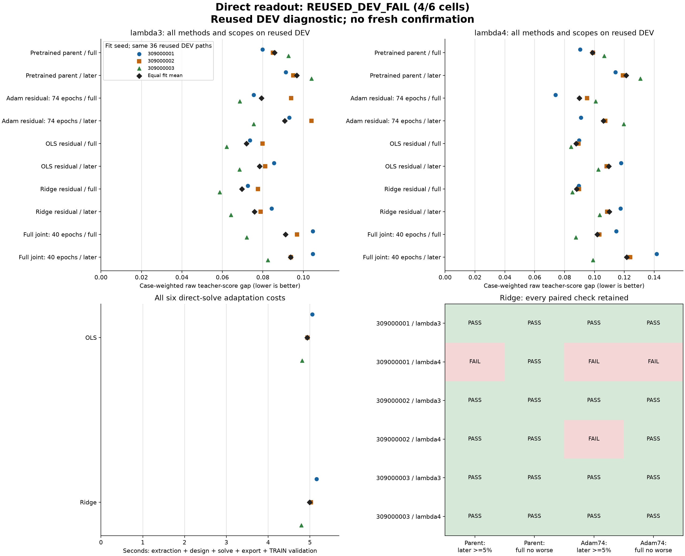

# A stronger solved-readout baseline, with a scenario regression

**Audited REUSED_DEV_FAIL: 4/6 seed/setting comparisons passed.** A fixed ridge
solve lowers mean later decision gap by **16.49%** versus Adam74 in lambda3 but
is **3.71% worse** in lambda4. This is a useful conventional baseline and an
explicit regression, not a novel architecture or a general performance gain.

[All scores and checks](otto-direct-readout-results/README.md) ·
[Registered protocol](otto-direct-readout-protocol.md) ·
[Checkpoints and audit evidence](https://github.com/kw2828/OpenJev/releases/tag/otto-direct-readout-v1).

## What was tested

All three original recurrent parents remain fixed. For each, we extracted a
canonical TRAIN cache and solved the 116-parameter action head in its 87
identifiable contrast coordinates. There are two fixed controls: ordinary
least squares (OLS) and ridge with coefficient 0.0001 on the head increment,
including biases. No coefficient search or solver selection occurred. Ridge
was the prospectively declared candidate.

The same 54 TRAIN paths contain 31,693 states. The cache uses physical batch one,
32-step chronological chunks and period-four observations. Its float64 quadratic
is a new numerical surrogate; historical Adam used shuffled batches of six.
Each exported head is evaluated through the ordinary float32 recurrent model.
All twelve parent/Adam/OLS/ridge TRAIN parity checks passed the fixed tolerance.
The six backbone tensors stayed byte-identical for every solved head.

After all solves and export checks, five methods per seed were evaluated on
the **already exposed 36 DEV paths**, with 14,338 states. These paths are held
out from fitting but are reused development evidence. The nine historical
parent/Adam/joint reports were reproduced. No fresh confirmation, original TEST,
teacher, simulator or Astra calls occurred.

## Decision quality

The entries below average all three fit-specific case-weighted raw teacher-cost
gaps. Lower is better. Later covers nonquery steps at or after step five.
All fits share the same six environment cases per setting and three fixed
collectors per case; fit seeds are not independent evaluation cohorts.

| Method | lambda3 full | lambda3 later | lambda4 full | lambda4 later |
| --- | ---: | ---: | ---: | ---: |
| Pretrained parent | 0.085830745 | 0.096793920 | 0.098638627 | 0.121238352 |
| Adam74 readout | 0.079307997 | 0.090825247 | 0.089889451 | 0.105909377 |
| Full-joint40 | 0.091204945 | 0.093645988 | 0.101804900 | 0.121489170 |
| Direct OLS | 0.071842200 | 0.078398826 | 0.087736009 | 0.109477415 |
| Fixed ridge | 0.069603828 | 0.075851051 | 0.088106906 | 0.109837375 |

Ridge's later mean is 19.00% / 9.59% below full-joint40 and 21.64% / 9.40%
below the parent. Those means do not establish across-seed superiority.
The first lambda4 fit is **29.15% worse than Adam74** on later gap and 21.16%
worse on full gap. The second lambda4 fit is 1.30% worse on later gap.
All three lambda3 fits and the third lambda4 fit pass the rule requiring at
least 5% lower later gap and no full-gap regression against both Adam and parent.
Ridge also loses later gap to full-joint40 at the third lambda4 fit.

Both solvers reduce the common cached TRAIN loss versus Adam in all three seeds.
Every data design has numerical rank 87 at the fixed SVD cutoff. Lower supervised
loss therefore does not remove the scenario-dependent decision-quality problem.
The full report includes cached, exported-cached and ordinary-model TRAIN losses;
the ridge penalized objective is kept separate from unpenalized prediction loss.

## Measured computation

Each direct adaptation took **4.79 to 5.16 seconds**, including the full shared
feature extraction/design cost, its solve, checkpoint export and its ordinary
TRAIN inference validation. The shared cache/design cost is charged in full to
each solver. The historical Adam74 fits took approximately 142 seconds each.
These are different implementations and nonconcurrent measurements, not a
matched speed benchmark. No inference-speed gain is established: both still
execute the same recurrent model.

The original complete producer ran for **61.566 seconds**, including all controls,
validation and DEV views. The original independent audit ran for **18.750 seconds**.
Shared pretraining and previously collected data remain prior costs. No new
autonomous learner trajectories were generated.

## What changes next

Retain the solved head as a stronger cheap baseline. Do not launch a regularizer
sweep on this exposed DEV panel or promote OLS after the ridge rule failed.
The next architectural question is [action-conditioned prediction through genuine
observation gaps](otto-action-latent-proposal.md). The current recurrent model
already receives actions and observations; its missing capability is predicting
under a proposed action block without future observation inputs.

That proposal requires separate collection and registration. It borrows established
world-model mechanisms and would need a specific mechanism and fresh matched
evidence before any novelty, planning, connectome or conference claim.

## Evidence closure

Registration and sources were pushed in commit `a6653ba6` before empirical
decoding. Qualification passed 150 fabricated tests, lint and bounded producer/
audit capacity checks; the earlier failed fixture check is retained. The
independent audit decoded 49 array archives, including 15 checkpoints, and checked
all 27 prediction views and six solves without model inference or fitting. It checked scalar losses and
gradients but did not rerun SVD or reproduce neural inference.

The [official closure](../output/otto-direct-readout-v1/closure-01.json) has SHA256
`6b06c9e12ac348e5d0cdfbffd4e9a1bf86cc11aa108eacb856a60d8ba325bc87`.
The archive retains sources, caches, checkpoints, predictions, receipts, failed
qualification evidence and authenticated prior lineage. Pinned environments,
native assets and absolute registered paths remain external installation
constraints; the release is not a portable standalone application.
