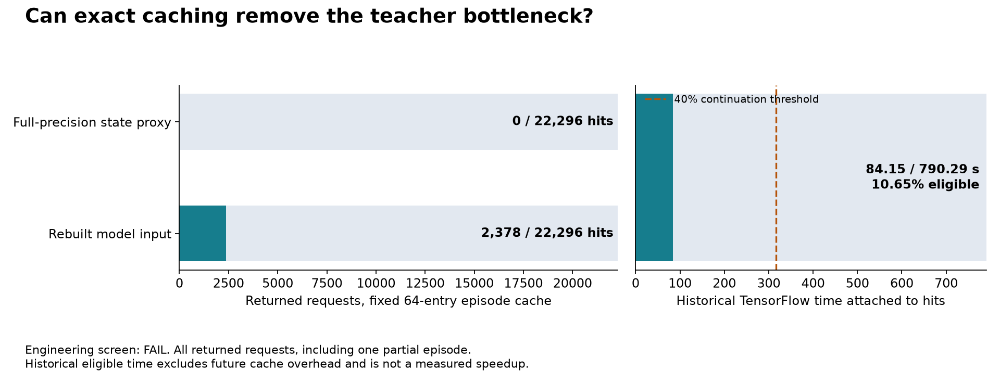

# Exact teacher-value reuse

**Exact replay passed; the cache opportunity screen failed, 3/4 conditions.**
The fixed cache found **2,378 hits in 22,296 requests**, associated with
**84.15 of 790.29 seconds (10.65%)** of historical TensorFlow work. The protocol
required at least 40%. Native cache integration is therefore not admitted by
this screen. This is potential avoided work before cache overhead, not a
measured speedup.

This is a systems diagnostic of the stopped planner-score collection. It does
not train a model, complete that collection or evaluate its 45 forecast
conditions. The [prospective protocol](otto-exact-cache-protocol.md) fixes one
64-entry LRU, cleared at every episode boundary, with no cache-size search.

## Metadata precursor

The complete saved sample stream contains **22,296 returned requests** across
67 complete episodes and one interrupted episode's 1,368-step returned prefix.
The full-precision public-state key produced **zero hits**, 22,296 misses and
20,452 evictions. All twelve declared stage/setting/collector groups are
reported, including the three unstarted VALID groups in the changed setting.

The scan completed in 0.793 seconds of worker time, using 32,178,176 bytes peak
RSS. Its parent closed in 0.841 seconds with a reaped worker, absent process
group and no cleanup errors. It decoded metadata through the gzip trailer and
consumed no numerical scores or arrays. This is not a speed benchmark.

Distinct float64 states can still become identical float32 model inputs.
The separately frozen input replay ran regardless of this precursor result.
Public-state repetitions alone cannot establish model reuse.

## Complete input replay

Every reconstructed posterior and branch-probability array matched the saved
witnesses exactly. Every reused set of sixteen model values matched that
request's historical float32 value bytes. The replay retained all **68 resets,
22,296 public updates and 22,296 branch constructions**, including final updates.
It consumed all five gzip streams through their trailers and reconciled the
267,972 original operation records, including the unreturned final call.

| Stage | Setting | Collector | Returned requests | Hits | Historical time attached to hits |
|---|---|---|---:|---:|---:|
| TRAIN | Length 3 | Analytic | 140 | 0 | 0 s |
| TRAIN | Length 3 | Neural | 134 | 0 | 0 s |
| TRAIN | Length 3 | Period-four hold | 6,676 | 1,876 | 66.254 s |
| TRAIN | Length 4 | Analytic | 216 | 0 | 0 s |
| TRAIN | Length 4 | Neural | 222 | 0 | 0 s |
| TRAIN | Length 4 | Period-four hold | 8,868 | 9 | 0.318 s |
| VALID | Length 3 | Analytic | 139 | 0 | 0 s |
| VALID | Length 3 | Neural | 92 | 0 | 0 s |
| VALID | Length 3 | Period-four hold, including partial prefix | 5,809 | 493 | 17.579 s |
| VALID | Length 4 | Analytic, unstarted | 0 | 0 | 0 s |
| VALID | Length 4 | Neural, unstarted | 0 | 0 | 0 s |
| VALID | Length 4 | Period-four hold, unstarted | 0 | 0 | 0 s |
| **Total** | | | **22,296** | **2,378** | **84.151 s** |

The replay completed in **30.505 seconds** of worker time; the original parent
closed in **30.592 seconds**, below its fixed 120-second cap. Peak RSS was
**142,360,576 bytes**. Maximum retained input-key storage was **45,158,400 bytes**;
the sixteen-value entries occupied another **4,096 bytes**. These describe this
offline replay process, not a deployed cache benchmark.

There were **zero new learned-model, TensorFlow, native-environment or optimizer
calls**. Two public likelihood arrays were decoded. The TRAIN dataset was not
used for fitting and the forecast criteria were not evaluated.

The original collection saved no model-input hashes. Input reconstruction
therefore relies on the pinned original arithmetic, qualified geometry, exact
public-posterior witnesses and exact branch masses. The replay does not compare
against independently recorded original input bytes.

## Implementation

The pure NumPy helper reproduces the released policy's sixteen action/hit
branches. It retains the original float64 arithmetic before converting to the
model's float32 input. The cache compares complete input bytes and stores only
sixteen model values. Current branch probabilities stay outside the cache.
Identical model inputs can arise with different branch probabilities, so
caching the four final action scores would be incorrect.

Thirty-two fabricated checks passed in the original NumPy runtime. They cover
branch geometry, blocked moves, tiny probability masses, byte distinctions,
LRU eviction, ownership, failed callbacks, episode resets, metadata coverage,
stream joins, final updates, gzip corruption and interrupted work accounting.
These qualify those fixture behaviors; they establish no architecture gain.

A first engineering preflight rejected a source hash that changed during final
review, before launching tests. Its `not_started_source_pin_mismatch` receipt
is retained. After source review closed, all ten replay tests passed once;
the other twenty-two fixtures had already passed. Both empirical diagnostics
ran once, with no retries, extensions, alternate cache capacities or key search.

## Decision

The cache has verified retrospective consistency on this prefix, but too little
reuse to meet the frozen headroom requirement. Both settings had hits, although
length 4 had only nine. This result does not justify the proposed native cache
probe or a cache-assisted learning run under this protocol.

The next design should reduce annotation cost explicitly, with a declared
sampling rule and correct training/evaluation weights. It must preserve full
trajectory coverage and the original comparison question, establish its cost
before execution, and use a fresh cohort under a separate protocol. No such
replacement learning run has started.

The original [incomplete learning experiment](otto-score-forecast-results.md),
its failed receipt and all original artifacts remain unchanged.

[Protocol](otto-exact-cache-protocol.md) ·
[Metadata summary](../output/otto-exact-cache-v1/proxy-01/summary.json) ·
[Input replay summary](../output/otto-exact-cache-v1/replay-01/summary.json) ·
[Evidence layout](../output/otto-exact-cache-v1/README.md) ·
[Complete preserved archive](https://github.com/kw2828/OpenJev/releases/tag/otto-exact-cache-v1).
