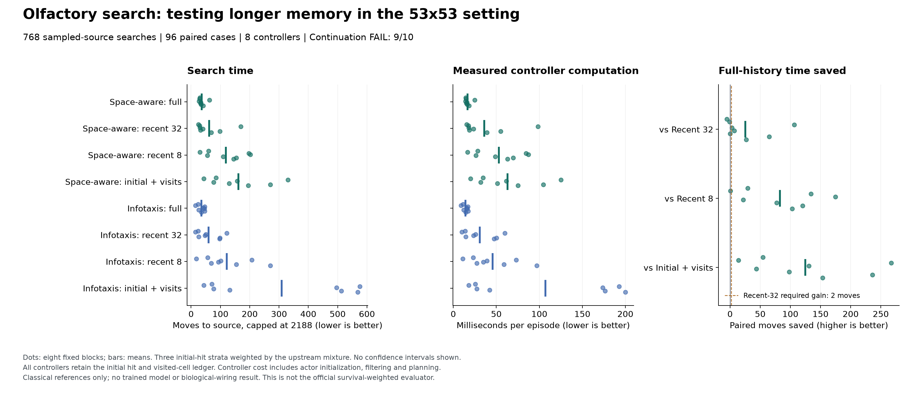

# Larger olfactory search: substantial mean memory benefit, inconsistent across blocks

Follow-up: the [saved-history evidence diagnostic](otto-memory-evidence-results.md)
traces the concentrated gains and distinguishes old detections from old zeros.
It adds no episodes or training and leaves the result below unchanged.

21 September 2026. All **768 searches succeeded** in the released 53x53 OTTO
setting. Space-aware infotaxis using full odor history averaged **36.1795 moves**,
versus **61.4544** with the most recent 32 observations: **41.13% fewer moves**.
However, it improved in only **5/8 paired blocks**, below the required six.
**Nine of ten conditions passed; the continuation rule failed.** This establishes
a descriptive classical memory benefit in this cohort, not a learned recurrent,
connectome or world-model advantage. No model was trained.

## What changed from the small task

The [19x19 pilot](otto-memory-results.md) found only a 1.14% improvement over
recent-32, with most searches ending before that window expired. This follow-up
uses the released [isotropic-53x53 configuration](https://github.com/auroreloisy/otto-benchmark/blob/a6aaef6507cffd2aff79291c1019f506f616bbef/isotropic/evaluate/parameters/isotropic-53x53.py):
two dimensions, Euclidean sensing, `lambda_over_dx=3`, `R_dt=2`, and automatic
selection of 53 cells per axis and four hit categories. The last category means
three or more detections. Both geometry and sensor parameters change, so this
is not an isolated grid-size ablation.

The [protocol](otto-large-memory-protocol.md), runner, tests and hash manifest
were committed as `64ad6c7` before native execution. This is an exploratory
development study selected after the small-task result, not a confirmatory
test of a learned model. Its failures and the earlier RockSample failures remain
unchanged.

## Fixed comparison

Eight controllers ran the same **96 paired cases**, with a **2,188-move cap**,
eight fixed blocks and rotating arm order. Each block contains four cases in
each positive initial-hit stratum. Results use the upstream mixture weights,
not an unweighted average of the balanced cases:

| Initial hit | Cases | Mixture weight |
| --- | ---: | ---: |
| 1 | 32 | 83.099824% |
| 2 | 32 | 12.891797% |
| 3 or more | 32 | 4.008380% |

Both unchanged one-step policies retain the initial-hit-conditioned prior and
a permanent ledger of cells visited without finding the source. Within each
policy, the four arms differ only in retaining all later odor observations,
the last 32, the last eight, or none. Zero detections count as evidence. Windowed beliefs are reconstructed
from the initial prior and visitation ledger, never from a full posterior at
the window boundary. Thus this tests **older odor evidence beyond a shared
visitation ledger**, not memory versus a memoryless controller.

An actor uses a separate public model. It receives public position, odor,
actions and episode boundaries, never the sampled source, random streams or
simulator posterior. The reproducible sampling adapter preserves the upstream
categorical distributions while replacing its three unseeded sampling sites.
Movement, sensor likelihoods, source-found handling and Bayesian updates are
unchanged. The official evaluator reports survival-weighted beliefs; this study
measures sampled-source search times and does not reproduce its published score.

## Every controller

All 768 searches finished before the cap, so capping changes none of these means.
Controller cost includes the public model's initialization, likelihood
construction, filtering and planning. Environment stepping and its resource
checks are separate. Window replay is not an optimized streaming implementation;
these measurements are not a matched-compute architecture comparison.

| Policy | Odor history | Weighted moves | Success | Controller ms/episode | Environment ms/episode |
| --- | --- | ---: | ---: | ---: | ---: |
| Space-aware infotaxis | Full | 36.1795 | 100% | 16.7204 | 56.3982 |
| Space-aware infotaxis | Recent 32 | 61.4544 | 100% | 35.8231 | 98.3342 |
| Space-aware infotaxis | Recent 8 | 118.8340 | 100% | 53.0199 | 190.5679 |
| Space-aware infotaxis | Initial only | 160.9580 | 100% | 63.0232 | 257.8349 |
| Infotaxis | Full | 34.7816 | 100% | 14.0811 | 55.0799 |
| Infotaxis | Recent 32 | 59.9834 | 100% | 30.6798 | 95.3808 |
| Infotaxis | Recent 8 | 121.1781 | 100% | 45.5581 | 193.7991 |
| Infotaxis | Initial only | 309.4371 | 100% | 106.9596 | 495.7236 |

For space-aware infotaxis, **26/96 full-history searches exceeded 32 moves**;
the longest took 179. Full and recent-32 public trajectories were identical
on 79 cases. All 17 differing cases also differed in completion time, with
first public trajectory differences at steps 34 through 46. The longest search
across all eight controllers took 2,081 moves.

The full-history benefit over recent-32 varies substantially across blocks.
Positive values below mean fewer moves using full history. Blocks 3 and 7
account for much of the favorable mean; two blocks regress and one ties.
This is a post-run description of the saved cohort, not a new selection rule.

| Fixed block | Weighted moves saved |
| --- | ---: |
| 1 | -5.4372 |
| 2 | -0.7709 |
| 3 | 106.4897 |
| 4 | 3.0087 |
| 5 | 7.0635 |
| 6 | 0.0000 |
| 7 | 64.8379 |
| 8 | 27.0074 |

## Every continuation condition

The primary policy remains space-aware infotaxis. The second policy cannot
replace it after outcomes are known. All ten requirements must pass.

| Requirement | Observed | Decision |
| --- | ---: | --- |
| Full-history success at least 95% | 100% | Pass |
| At least 10% fewer moves than recent-32 | 41.1279% | Pass |
| At least two fewer moves than recent-32 | 25.2749 | Pass |
| Strict improvement in at least 6/8 weighted blocks | 5/8 | **Fail** |
| No failure regression versus recent-32 | Both 0% failures | Pass |
| No failure regression versus recent-8 | Both 0% failures | Pass |
| Strict time improvement versus recent-8 | 82.6545 moves | Pass |
| Strict time improvement versus initial-only | 124.7785 moves | Pass |
| Complete valid cohort | 768/768 | Pass |
| Structural qualification | 17/17 checks | Pass |

These are practical development thresholds, not significance tests. We do not
interpret the failed rule as proof that older evidence has no value. It means
this frozen study does not admit the proposed learning pilot. There were no
replacement seeds, extra episodes, threshold changes or budget extensions.

## Verification and artifacts

The implementation passed **184 synthetic tests** before execution. Seventeen
native checks then qualified geometry, all three initial-hit priors, the
four-category analytic likelihood, seeded and forced-hit replay, boundary
actions, terminal handling and public-filter/policy parity. Full public filtering
matched the simulator posterior exactly on all recorded full-history updates,
with maximum absolute difference **0.0**.

The supervised process exited 0 in **98.245381 suspend-inclusive seconds**.
Peak worker RSS was **222,789,632 bytes**. All **42,456 native calls** returned:
**764 qualification calls and 41,692 cohort moves**. No TensorFlow neural policy,
Gym wrapper or PBVI policy was loaded. Training updates and external model
calls were both zero.

A separate saved-trace reader reconstructed all episodes, the three-stratum
mixture, costs, 768 aggregate comparisons and all ten conditions. Maximum
aggregate disagreement was **5.68e-13**. It made no simulator or model calls.
The independent mathematical auditor agrees on **338,090 scalar comparisons**,
with maximum arithmetic and action-score difference **7.11e-15**. It reconstructs
likelihoods, seeded draws, beliefs, action scores and decisions from saved
artifacts, without new simulator or model calls. Its receipt is linked below.
Timing and input isolation additionally depend on the frozen source and native
process witnesses, not numerical reconstruction alone.

- [Frozen plan and source hashes](../output/otto-large-memory-v1/plan-01.json)
  and [synthetic qualification](../output/otto-large-memory-v1/engineering-01/receipt.json).
- [Native qualification](../output/otto-large-memory-v1/run-01/qualification.json),
  [public transitions](../output/otto-large-memory-v1/run-01/transitions.jsonl),
  [episodes and random-draw witnesses](../output/otto-large-memory-v1/run-01/episodes.jsonl),
  and [all strata, blocks and decisions](../output/otto-large-memory-v1/run-01/summary.json).
- [Worker receipt](../output/otto-large-memory-v1/run-01/receipt.json), SHA-256
  `3414409b692053c40929604daa7f4f03d2d42ba63ab4d38d4a65f71bac242249`,
  and [actual supervisor terminal](../output/otto-large-memory-v1/run-process-01.terminal.json).
- [Independent artifact auditor](../scripts/audit_otto_large_memory.py),
  [audit receipt](../output/otto-large-memory-v1/audit-01/receipt.json),
  and [execution witnesses](../output/otto-large-memory-v1/execution-witness.json).
- [Standalone figure PDF](../output/otto-large-memory-v1/figure-01/otto-large-memory.pdf)
  and [plotted values](../output/otto-large-memory-v1/figure-01/plotted-values.json).

## Research consequence

The larger task shows more room for useful odor retention than the small task,
but the consistency requirement failed. The next useful analysis is why the
benefit concentrates in a subset of trajectories, using these saved episodes.
That analysis must preserve the failed rule and label any new hypotheses as
post hoc. This run does not authorize extending the same cohort until it passes.

A future model experiment would need a separately justified protocol and strong
small-memory controls. Useful targets include a compact recurrent posterior
with adaptive retention, compared with a parameter-matched GRU, fixed retention,
recent-history filtering and a finite-state/timer controller. Recurrence and
small odor memories already have prior art; a connectome mask or JEPA loss by
itself is not a contribution. Any later claim must isolate a mechanism's effect
on autonomous search, belief quality and total cost, then survive a task shift.
This study supplies neither that learned comparison nor ICLR-level novelty.
