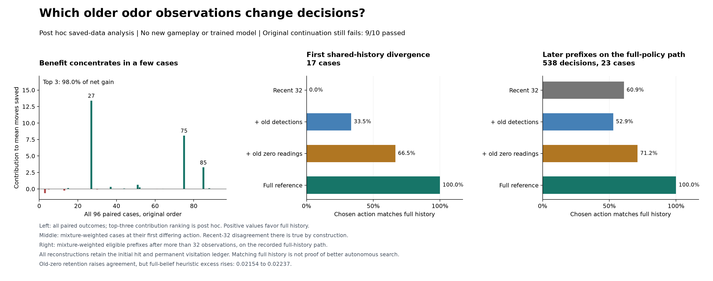

# Old detections and old absences change different decisions

21 September 2026. A saved-history diagnostic narrows the memory question:
restoring old zero-odor observations reproduces the full-history controller's
first differing action in **11 of 17 cases**; restoring old positive detections
does so in the other **six**. Neither category alone consistently preserves
later decisions. The largest three search-time gains begin after discarding
only **three, five and three old zero readings**.

This is a post hoc explanation of recorded decisions, **not a new gameplay or
trained-model result**. The original 53x53 comparison still fails its continuation
rule, with 9/10 conditions passed. No simulator episodes or model fits were added.

## The favorable mean is concentrated

The original full-history and recent-32 controllers produced **12 wins, 79 ties
and five losses** across 96 paired cases. Their weighted mean difference is
25.2749 moves: positive contributions sum to 26.3548, while negative contributions
sum to -1.0799. The three largest positive cases explain **94.00% of positive
contributions and 98.02% of the net improvement**. Ranking these cases is a
post hoc description; they were not selected for the original cohort or its rule.

| Initial-hit stratum | Wins / ties / losses | Within-stratum mean moves saved | Contribution to original weighted mean |
| --- | --- | ---: | ---: |
| 1 | 9 / 20 / 3 | 30.5000 | 25.3454 |
| 2 | 1 / 29 / 2 | -0.6250 | -0.0806 |
| 3 or more | 2 / 30 / 0 | 0.2500 | 0.0100 |

Deleting any one case leaves a favorable weighted mean, ranging from 12.2604
to 26.7358 moves. Deleting any one fixed block leaves 13.6728 to 29.6623 moves.
Each omission recomputes the remaining within-stratum means while preserving
the original mixture weights. These sensitivity descriptions are **not confidence
intervals** and do not replace the failed requirement to improve in six blocks.

## Four reconstructions on identical public histories

The [diagnostic protocol](otto-memory-evidence-protocol.md) and implementation
were fixed in `989a1d5` before the new analytic calculations. All constructions
receive the same initial-hit-conditioned prior, all cells visited without
finding the source, and the most recent 32 completed odor observations. The
four variants add neither old evidence category, old positives, old zeros, or
both. Category 3 means at least three detections. A zero reading is observed
negative evidence, not a missing observation.

At the first differing action of each actual full/recent-32 pair, their earlier
public histories are identical. At that prefix:

| Evidence retained beyond recent-32 | Full action reproduced | Conditional mixture-weighted agreement |
| --- | ---: | ---: |
| None | 0/17 | 0.00% |
| Old positive detections | 6/17 | 33.46% |
| Old zero readings | 11/17 | 66.54% |
| Both | 17/17 | 100.00% |

The recent-32 disagreement is true by construction in this selected population.
No first-divergence case was reproduced by both single-category additions, and
none required adding both categories to reproduce that particular action.
That does not show that one category can be discarded throughout an episode.

For the three largest original gains:

| Case seed | Original paired moves saved | First different action | Old zeros discarded | Old positives discarded |
| --- | ---: | ---: | ---: | ---: |
| 610027 | 516 | 36 | 3 | 0 |
| 610075 | 312 | 38 | 5 | 0 |
| 610085 | 126 | 36 | 3 | 0 |

In each, adding back the old zeros restores the full-history decision at that
first divergence. The remainder of each trajectory then depends on later actions
and observations. We have not executed the hybrid controller, so these results
do not attribute all subsequent moves saved to those few readings.

## Selective retention is not a clean solution

We also reconstructed **every one of the 2,164 full-history decisions** and
verified its original action and scores. Among these, **538 prefixes in 23
cases** have more than 32 completed observations and enter the four-way analysis.
Coverage by initial-hit stratum is 444 prefixes in 15 cases, 76 in six, and 18
in two. The other 73 cases remain in the coverage ledger. Three full-history
episodes last 33 moves but have no decision after more than 32 completed
observations, explaining the difference from the earlier count of 26 episodes
longer than 32 moves.

Below, each eligible prefix carries its case's original mixture weight divided
by 32, normalized over all eligible prefixes. All variants see the **full-history
controller's recorded path**, and their proposed actions are not executed.

| Older evidence | Action agrees with full | Mean total variation from full belief | Mean full-belief objective excess |
| --- | ---: | ---: | ---: |
| None | 60.93% | 0.43743 | 0.02154 |
| Positive detections only | 52.94% | 0.57288 | 0.03932 |
| Zero readings only | 71.15% | 0.31849 | 0.02237 |
| Both | 100.00% | 0.00000 | 0.00000 |

Objective excess evaluates each proposed action under the full belief and
subtracts its best one-step heuristic score. It is dimensionless and lower is
better; it is not realized search-time regret or an optimal value function.
Although retaining old zeros raises action agreement, its average objective
excess is slightly **worse** than recent-32 alone. Retaining only old positive
detections worsens all three summaries. Selective evidence can change a belief
in a less useful direction than forgetting both categories.

Giving each eligible case equal weight instead yields agreement of
78.79% / 78.27% / 82.90% for none / positives / zeros. Applying the initial-hit
mixture to eligible-case means yields 76.25% / 76.33% / 83.79%. The prefix-weighted
table emphasizes longer histories more. All three aggregation methods and all
2x2 contrasts are available in the saved summary, with explicit denominators.
No weighting was selected as a new pass condition.

## Implication for the next architecture

The evidence favors investigating **compact spatial accumulation of both
detections and absences**, rather than preserving positive events alone or
adding a timer. In the supplied static-source model, log evidence adds over
time; a zero reading contributes a spatial field `-mu(s,x)`. Discarding it
removes evidence against nearby source hypotheses even when visited cells
remain excluded. This is a mathematical property of the sensor model, not a
new architecture or a demonstrated compact implementation.

The [mechanism and prior-art note](otto-compact-evidence-directions.md) develops
that hypothesis with controls from belief compression, fly ON/OFF behavior and
action-conditional recurrent filtering. Fixed additive compression must compete
with learned updates before any benefit is attributed to gates or biological
wiring. Total decoder and visitation-ledger cost must be counted. A later
autonomous study needs its own prospective rationale and untouched evaluation;
this diagnostic does not admit training under the failed original rule.

## Verification and artifacts

The diagnostic passed **26 synthetic tests**, including independent log-product
belief reconstruction, window boundaries, saturated counts, terminal handling,
shared visitation masks and unequal-stratum weighting. Source review found no
material issue. The analytic run completed once in **4.589700 seconds**, with
**74,465,280 bytes** peak RSS. All 2,164 reconstructed full decisions matched
their saved selected action; maximum action-score error was **5.33e-15**.
There were zero environment, neural-model or external-model calls.

A separate reader agrees on **41,768 scalar comparisons**, including all
conditional means, factorial contrasts, coverage counts and first-divergence
joins. It checks saved numerical parity on the 538 persisted eligible prefixes
and 17 recent-history comparisons. The other 1,626 full-decision parity checks
remain authenticated diagnostic execution witnesses rather than independently
rescored outputs. A second check reconstructs all **68 first-divergence beliefs**
in log space, with zero action mismatches, maximum total-variation discrepancy
**1.50e-14** and action-score discrepancy **1.29e-14**. That check shares the
pinned auditor's action-score mathematics and does not cover every later prefix.

- [Frozen diagnostic plan](../output/otto-memory-evidence-v1/plan-01.json)
  and [synthetic qualification](../output/otto-memory-evidence-v1/engineering-01/receipt.json).
- [All paired outcome descriptions](../output/otto-memory-evidence-v1/paired-01/analysis.json)
  and [authenticated reader receipt](../output/otto-memory-evidence-v1/paired-01/receipt.json).
- [All 96 cases](../output/otto-memory-evidence-v1/diagnostic-01/cases.jsonl),
  [538 eligible prefixes](../output/otto-memory-evidence-v1/diagnostic-01/prefixes.jsonl),
  [conditional summaries](../output/otto-memory-evidence-v1/diagnostic-01/summary.json),
  and [diagnostic receipt](../output/otto-memory-evidence-v1/diagnostic-01/receipt.json).
- [Outcome reader](../scripts/analyze_otto_paired_outcomes.py),
  [public-history reconstruction](../scripts/diagnose_otto_memory_evidence.py),
  and [figure renderer](../scripts/plot_otto_memory_evidence.py).
- [Figure PDF](../output/otto-memory-evidence-v1/figure-02/memory-evidence.pdf)
  and [plotted values](../output/otto-memory-evidence-v1/figure-02/plotted-values.json).
- [Execution and independent-check witnesses](../output/otto-memory-evidence-v1/execution-witness.json).

The original native execution, input isolation and sensor semantics remain
supported by the [previous qualification and independent audit](otto-large-memory-results.md).
Saved-prefix agreement alone establishes neither planner optimality nor a
new controller's autonomous performance.
