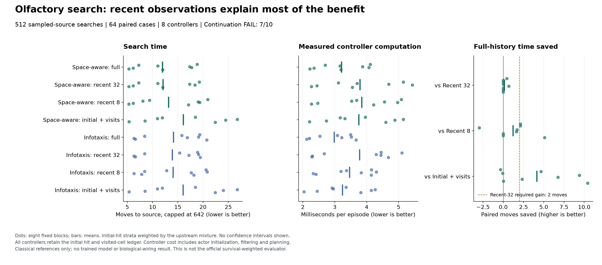

# Olfactory search: the small task offers little benefit from older odor evidence

Follow-up: the [completed 53x53 comparison](otto-large-memory-results.md) finds a
larger average memory benefit, but still fails its fixed block-consistency rule.
The original 19x19 result below is unchanged.

21 September 2026. We qualified the OTTO sampled-source simulator and completed
**512 searches with eight classical controllers**. All searches succeeded.
Space-aware infotaxis with full odor history averaged **11.9659 moves**, versus
**12.1038** with the most recent 32 observations. The **1.14%** improvement falls
below the predeclared 10% requirement. **7/10 conditions passed; the learned
memory opportunity rule failed.** No model was trained and no biological-wiring
or architecture advantage is established.

## What is now qualified

The unchanged upstream [OTTO benchmark](https://github.com/auroreloisy/otto-benchmark/tree/a6aaef6507cffd2aff79291c1019f506f616bbef)
uses fresh unseeded random generators at three sampling sites. Our explicit
adapter replaces these with independent, reproducible initial-hit, source and
later-hit streams. The original movement, sensor, source-found and Bayesian
update code remains unchanged. This preserves categorical distributions, not
the original unseeded trajectories.

The isolated NumPy/SciPy runtime passed **14 native qualification checks** using
284 counted steps, after **181 synthetic tests**. Qualification covered the
19x19 geometry, three hit categories, independent analytic likelihoods, both
initial-hit priors, seeded and forced-hit replay, boundary actions, terminal
handling, public filtering and policy parity. Category 2 means two or more
detections. No TensorFlow neural policy, Gym wrapper or PBVI policy was loaded.

The public actor has its own model, separate from the live simulator. Its
inputs contain position, current hit, terminal status, step and legal moves.
Source locations, simulator posterior and random streams remain evaluator-only.
Full public filtering matched the native posterior exactly at every recorded
full-history update: maximum absolute difference **0.0**. This is an analytic
filter under supplied task rules, not a learned world model.

## Fixed comparison

The [protocol](otto-memory-protocol.md), implementation, tests and manifest were
committed as `446162d` before native execution. The official isotropic-19x19
parameters were used with sampled-source episodes and a fixed **642-move**
horizon. There were 64 paired cases, balanced across the two positive initial
hits, with eight controllers per case and rotated arm order. Results weight
those strata by the upstream initial-hit mixture: **84.91874% hit 1 and
15.08126% hit 2**. They are not unweighted averages of the balanced cohort.

Both one-step infotaxis policies receive the same initial-hit-conditioned prior
and permanent record of cells visited without finding the source. Full history
retains all subsequent odor readings; recent controls retain 32 or eight;
initial-only retains none. Zero hits count as evidence. Recent beliefs are
rebuilt from the initial prior, not a saved full posterior. Thus this tests
**odor memory beyond a common visitation ledger**, not all forms of memory.

The task's official evaluator uses survival-weighted beliefs rather than
sampled-source completion times. This pilot is not a reproduction of its score
or its published neural-policy results. Our primary metric is mean capped
search time, accompanied by failure rate. Here every search succeeded, so the
cap did not affect the means.

## Every controller

Controller costs are elapsed milliseconds measured on CPU per complete episode, including
each public model's initialization, likelihood construction, filtering and
planning. Environment stepping and its resource-check wrapper are separate.
Whole-run time also includes simulator construction, parity checks and logging.
Window replay is not an optimized streaming implementation; these are not
deployment latency measurements or matched-compute comparisons.

| Policy | Odor history | Weighted moves | Success | Controller milliseconds |
| --- | --- | ---: | ---: | ---: |
| Space-aware infotaxis | Full | 11.9659 | 100% | 3.2116 |
| Space-aware infotaxis | Recent 32 | 12.1038 | 100% | 3.7921 |
| Space-aware infotaxis | Recent 8 | 13.1772 | 100% | 3.8462 |
| Space-aware infotaxis | Initial only | 16.1127 | 100% | 3.7530 |
| Infotaxis | Full | 14.1454 | 100% | 2.9816 |
| Infotaxis | Recent 32 | 13.9178 | 100% | 3.7788 |
| Infotaxis | Recent 8 | 14.0829 | 100% | 3.4647 |
| Infotaxis | Initial only | 16.0561 | 100% | 3.2423 |

For the primary space-aware policy, **60/64 full-history searches ended within
32 moves**. Only four lasted longer. Full and recent-32 public trajectories
were identical on 60 cases, and their completion times differed on only two.
The longest full-history search took 60 moves; the longest search among all
controllers took 78. These counts explain why this cohort offers little room
for odor evidence older than 32 moves. They do not show that history in general
is unnecessary: full history improves over the initial-only control by 4.1467
weighted moves.

## Every continuation condition

All conditions were fixed before the run. The primary policy was space-aware
infotaxis; the infotaxis results cannot replace it after observing outcomes.

| Requirement | Observed | Decision |
| --- | ---: | --- |
| Full-history success at least 95% | 100% | Pass |
| At least 10% fewer moves than recent-32 | 1.1394% | Fail |
| At least two fewer moves than recent-32 | 0.1379 | Fail |
| Strict improvement in at least 6/8 weighted blocks | 2/8 | Fail |
| No failure regression versus recent-32 | Both 0% failures | Pass |
| No failure regression versus recent-8 | Both 0% failures | Pass |
| Strict time improvement versus recent-8 | 1.2113 moves | Pass |
| Strict time improvement versus initial-only | 4.1467 moves | Pass |
| Complete valid cohort | 512/512 | Pass |
| Structural qualification | 14/14 checks | Pass |

These are practical development thresholds, not statistical significance tests.
All cases were retained. There were no replacement seeds, model fits, API calls,
threshold changes or budget extensions. The earlier RockSample failures remain
unchanged.

## Verification and artifacts

The process exited 0 in **19.786006 suspend-inclusive seconds**, with peak worker
RSS **142,508,032 bytes**. It executed **5,834 cohort moves plus 284 qualification
moves**, with all 6,118 attempted calls returned. A separate saved-trace reader
reconstructed all episodes, the initial-hit mixture, 704 aggregate values and
all ten decisions, agreeing within **1.42e-14**. It made no simulator or model
calls.

The independent artifact auditor also agrees on **49,725 scalar comparisons**.
It reconstructs the analytic likelihoods, initial-hit mixture, seeded categorical
draws, public beliefs, four action scores, costs and all continuation conditions.
The largest action-score difference is **4.44e-15**. Saved posterior byte hashes
are authenticated witnesses, not claimed bitwise reproductions. Actual native
execution, input isolation and measured timing remain supported by the frozen
source, qualification and process receipts; this auditor does not establish
planner optimality or make additional environment calls.

- [Frozen plan and source hashes](../output/otto-memory-v1/plan-01.json)
  and [synthetic qualification](../output/otto-memory-v1/engineering-01/receipt.json).
- [Native qualification and replay](../output/otto-memory-v1/run-01/qualification.json),
  [all public transitions](../output/otto-memory-v1/run-01/transitions.jsonl),
  [all episodes and draw logs](../output/otto-memory-v1/run-01/episodes.jsonl),
  [strata, blocks and decisions](../output/otto-memory-v1/run-01/summary.json).
- [Worker receipt](../output/otto-memory-v1/run-01/receipt.json), SHA-256
  `0176d84f7df645cb2f064cf2ec2743bdbad1b29167d2724233216c68f7a1a6ca`,
  and [actual supervisor terminal](../output/otto-memory-v1/run-process-01.terminal.json).
- [Independent saved-output auditor](../scripts/audit_otto_memory.py),
  [audit receipt](../output/otto-memory-v1/audit-01/receipt.json)
  and [execution witnesses](../output/otto-memory-v1/execution-witness.json).
- [Standalone figure PDF](../output/otto-memory-v1/figure-01/otto-memory.pdf)
  and [plotted values](../output/otto-memory-v1/figure-01/plotted-values.json).

## Research consequence

The simulator and public-information route are usable, and the classical
controller is competent. The small task's short searches do not justify a new
long-memory architecture under this protocol.

The next informative setting is the released
[isotropic-53x53 configuration](https://github.com/auroreloisy/otto-benchmark/blob/a6aaef6507cffd2aff79291c1019f506f616bbef/isotropic/evaluate/parameters/isotropic-53x53.py),
with a separately frozen cohort and the same strong recent-history controls.
Its larger geometry and different sensor parameters still require native
qualification. A model comparison should follow evidence of useful retained
state, then separate state compression, update dynamics and biological wiring.
This pilot does not establish ICLR-level novelty or qualify those future claims.
