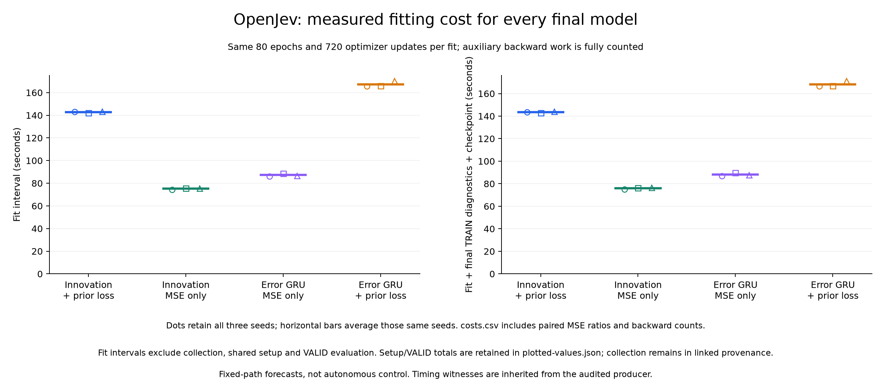

# Prequery supervision: useful objective, failed architecture screen

**Adding loss to the forecast made immediately before each planner query reduced the proposed model's primary teacher-score gap by 20.32% at λ3 and 40.62% at λ4. Its frozen continuation rule still failed: 51 of 55 conditions passed.** A plain error-fed GRU also improved under this loss and achieved a lower gap at λ4. The proposed model lost full-path agreement against its own original-loss baseline in both settings. All 90 paths, 12 fits and the independent audit completed successfully.

This is a controlled training-objective result on recorded paths. It does not establish autonomous control, architectural novelty, a learned world model, biological learning, calibrated uncertainty or an RL improvement. The word calibration in the study identifier refers to score-forecast squared error, not probability calibration.

[Protocol](otto-prequery-calibration-protocol.md) · [Engineering](otto-prequery-engineering.md) · [Evidence layout](../output/otto-prequery-calibration-v1/README.md) · [Complete release](https://github.com/kw2828/OpenJev/releases/tag/otto-prequery-calibration-v1)

[Vector figure](../docs/assets/otto-prequery-forecast.svg) · [All 55 conditions](../docs/assets/otto-prequery-conditions.png) · [Costs](../docs/assets/otto-prequery-costs.png) · [Complete metrics](../output/otto-prequery-calibration-v1/figures-01/forecast-metrics.csv) · [TRAIN and VALID prior metrics](../output/otto-prequery-calibration-v1/figures-01/prior-metrics.csv)

The intervention and controls
-----------------------------

Both recurrent architectures already predict scores before seeing a new query, then use the observed prediction error to update memory. Previously, that prequery prediction was not directly supervised: the returned query output equals the observed score, and the original loss applies only to selected nonquery rows. The new wrapper exposes the existing prior without adding a parameter, forward call or teacher query. This was a mechanism hypothesis, not proof that missing supervision caused the previous failure.

The 2-by-2 comparison holds architecture fixed when changing the loss and holds loss fixed when comparing architectures:

| Family | Architecture | Training objective | Parameters |
| --- | --- | --- | --- |
| `innovation_aux` | Persistent state with explicit learned correction matrix | Original loss plus prequery loss | 5,978 |
| `innovation_mse` | Same explicit correction | Original loss | 5,978 |
| `innovation_gru_aux` | Ordinary persistent GRU fed prediction error | Original loss plus prequery loss | 5,996 |
| `innovation_gru_mse` | Same error-fed GRU | Original loss | 5,996 |

All cells receive the same 31 public features and actual planner queries at steps 0, 4, 8 and onward. The auxiliary loss compares the centered forecast with all four centered observed scores, including finite illegal-action scores, because the correction itself centers all four. Each difference is divided by 64 before squaring. For an episode of length `T`, there are `K=ceil(T/4)-1` later query rows; each receives weight `1/(54*K)`. Episodes with no later query contribute zero while retaining their denominator share. The coefficient is fixed at 1. The original-loss branch never reads auxiliary targets or weights.

For the original nonquery term, TRAIN samples `k=min(8,W)` of `W=ceil(T/4)` windows per episode. With `M=T-W` nonquery rows, each selected row receives `W/(k*54*M)`, without renormalizing realized weights. There were 296 selected windows and 823 nonquery loss rows. All 6,815 genuine TRAIN queries remained inputs; 6,761 later queries also supplied auxiliary targets. Seven of 54 TRAIN episodes had no prior support and retained their denominator share.

Fresh TRAIN cases used seeds 271000001-271000009 at λ3 and 272000001-272000009 at λ4; VALID used 273000001-273000006 and 274000001-274000006. Fit seeds were 275000001-275000003. The study froze its source, loss, seeds, budget and 55 conditions before collection. It does not reuse the previous cohort as a test set.

Each fit used 80 epochs, 720 Adam updates, learning rate 0.003, zero weight decay, gradient clipping at 5, six episodes per batch and 32-step truncated backpropagation. Paired fits retained initialization and episode order. All 12 final checkpoints were saved and verified before VALID arrays were decoded. There was no checkpoint selection or scientific retry. Auxiliary cells performed more backward work; this is matched data and update count, not matched compute.

Results and support
-------------------

Primary metrics use nonquery steps at absolute step 5 or later. Agreement is membership in the unchanged strict float32 teacher near-minimum set. Gap is the fixed teacher score of the predicted legal action minus its best legal score. A lower gap is better; it is not true action regret or search success. Metrics weight episodes equally, including zero-support episodes, rather than pooling all rows.

| Family | Fit seed | λ3 agreement | λ3 gap | λ4 agreement | λ4 gap |
| --- | --- | --- | --- | --- | --- |
| hold | - | 33.33% | 0.432704 | 31.65% | 0.412811 |
| innovation_aux | 275000001 | 49.33% | 0.073101 | 39.72% | 0.058300 |
| innovation_mse | 275000001 | 46.11% | 0.104552 | 35.77% | 0.114175 |
| innovation_gru_mse | 275000001 | 52.82% | 0.077152 | 41.82% | 0.055540 |
| innovation_gru_aux | 275000001 | 56.88% | 0.066762 | 41.02% | 0.061895 |
| innovation_aux | 275000002 | 52.65% | 0.064870 | 44.94% | 0.047192 |
| innovation_mse | 275000002 | 54.55% | 0.072392 | 39.30% | 0.078488 |
| innovation_gru_mse | 275000002 | 52.30% | 0.080736 | 33.61% | 0.101999 |
| innovation_gru_aux | 275000002 | 53.44% | 0.070139 | 39.07% | 0.063592 |
| innovation_aux | 275000003 | 55.25% | 0.069025 | 40.00% | 0.061336 |
| innovation_mse | 275000003 | 52.90% | 0.082834 | 37.43% | 0.088278 |
| innovation_gru_mse | 275000003 | 48.40% | 0.108561 | 39.34% | 0.056753 |
| innovation_gru_aux | 275000003 | 47.90% | 0.101539 | 44.55% | 0.036724 |

The following means retain all three fits. Prior MSE is in squared raw score units over all four centered coordinates. TRAIN prior MSE is a diagnostic for every cell, including the controls that never train that term. Full-path metrics also include nonquery steps 1-3.

| Family | Setting | TRAIN prior MSE | VALID prior MSE | Primary agreement | Primary gap | Full agreement | Full gap |
| --- | --- | --- | --- | --- | --- | --- | --- |
| innovation_aux | λ3 | 0.051079 | 0.067843 | 52.41% | 0.068999 | 73.26% | 0.072417 |
| innovation_aux | λ4 | 0.057839 | 0.072801 | 41.55% | 0.055609 | 49.48% | 0.070333 |
| innovation_mse | λ3 | 0.143320 | 0.123061 | 51.18% | 0.086593 | 75.30% | 0.075001 |
| innovation_mse | λ4 | 0.133319 | 0.122533 | 37.50% | 0.093647 | 51.77% | 0.088889 |
| innovation_gru_mse | λ3 | 0.087548 | 0.102309 | 51.17% | 0.088817 | 74.26% | 0.082264 |
| innovation_gru_mse | λ4 | 0.102437 | 0.098613 | 38.25% | 0.071430 | 55.45% | 0.071368 |
| innovation_gru_aux | λ3 | 0.046214 | 0.069157 | 52.74% | 0.079480 | 73.81% | 0.086830 |
| innovation_gru_aux | λ4 | 0.053695 | 0.065111 | 41.55% | 0.054071 | 52.24% | 0.061307 |

For the explicit correction, auxiliary supervision lowers VALID prior MSE by **44.87% / 40.59%** and primary gap by **20.32% / 40.62%** at λ3 / λ4. Its primary agreement rises by **1.23 / 4.05 percentage points**, but full-path agreement falls by **2.04 / 2.29 points**. The ordinary GRU also reduces primary gap by **10.51% / 24.30%** under the same auxiliary loss. The result therefore supports paying attention to this objective in both architectures; it does not uniquely support the explicit correction mechanism.

There were 54 TRAIN and 36 VALID paths, with analytic, neural and period-four hold collectors for each originating case. The 90 paths contain 45,592 steps: 27,195 TRAIN and 18,397 VALID. Seventy paths found the source and 20 reached the unchanged 2,188-step horizon. Those are collector outcomes, not learned-controller outcomes.

VALID has six originating cases per setting, each with three correlated collector paths. There are 13,696 primary nonquery rows and 13,788 full-path rows. Primary support is 14/18 episodes at λ3 and 12/18 at λ4, covering all six cases in each. Under the frozen denominator convention, the maximum possible primary aggregate agreement is 77.78% and 66.67%. The age-specific support follows; unsupported episodes are never dropped from the denominator.

| Setting | Age since query | Primary rows | Supported episodes | Supported cases | Weight mass |
| --- | --- | --- | --- | --- | --- |
| λ3 | 1 | 2289 | 14/18 | 6/6 | 0.777778 |
| λ3 | 2 | 2288 | 14/18 | 6/6 | 0.777778 |
| λ3 | 3 | 2285 | 12/18 | 6/6 | 0.666667 |
| λ4 | 1 | 2281 | 12/18 | 6/6 | 0.666667 |
| λ4 | 2 | 2278 | 12/18 | 6/6 | 0.666667 |
| λ4 | 3 | 2275 | 11/18 | 5/6 | 0.611111 |

VALID has 4,573 later-query priors. Per-case, per-collector, per-age and supported-episode metrics remain in the saved outputs. Three fit seeds and three collector paths per case do not turn six cases into a larger independent cohort. Absolute metrics should not be compared causally with earlier studies on different cases.

Why continuation failed
-----------------------

| Frozen condition group | Passed |
| --- | --- |
| Technical closure | 1/1 |
| Distinct-case age support | 6/6 |
| Candidate fits versus hold | 12/12 |
| Candidate fits by age versus hold | 18/18 |
| Candidate mean versus learned controls | 10/12 |
| Full-path mean versus own original-loss control | 2/4 |
| Prior MSE versus own original-loss control | 2/2 |

All four failed conditions are below. Agreement is a proportion. The λ4 control-gap threshold requires both at least a 10% reduction and strict improvement; the actual GRU auxiliary gap is 0.054070545, so the candidate misses even strict improvement there.

| Failed condition | Observed | Required relation | Threshold |
| --- | --- | --- | --- |
| `lambda3.mean_agreement_vs_innovation_gru_aux` | 0.524105558 | >= | 0.527402857 |
| `lambda3.full.mean_agreement_vs_innovation_mse` | 0.732572468 | >= | 0.752977404 |
| `lambda4.mean_gap_vs_innovation_gru_aux` | 0.055609239 | <= and < | 0.048663491 |
| `lambda4.full.mean_agreement_vs_innovation_mse` | 0.494795597 | >= | 0.517691462 |

The all-condition rule is a development decision, not a significance test. Its failure remains binding. This run does not authorize an autonomous follow-up under that rule. The ordinary GRU is slightly stronger in λ3 agreement and λ4 gap; the proposed correction has lower λ3 gap. There is no consistent architecture winner.

Costs and verification
----------------------

Every fit ran 720 updates. Loss columns below use the training division by 64 and differ from raw-unit VALID MSE. The prior column is the separately measured final TRAIN diagnostic for all cells; original-loss controls have zero prior contribution to their optimized objective. Fit intervals exclude final TRAIN rescoring and checkpoint serialization.

| Family | Seed | Nonquery TRAIN loss | Prior TRAIN loss | Fit seconds | Rescore seconds | Backward chunks |
| --- | --- | --- | --- | --- | --- | --- |
| innovation_aux | 275000001 | 1.6457276e-05 | 1.3573457e-05 | 142.931 | 0.745 | 40607 |
| innovation_mse | 275000001 | 1.4349227e-05 | 3.3513952e-05 | 74.287 | 0.755 | 8251 |
| innovation_gru_mse | 275000001 | 1.3691489e-05 | 2.2079668e-05 | 86.165 | 0.853 | 8251 |
| innovation_gru_aux | 275000001 | 1.5055954e-05 | 1.318124e-05 | 165.543 | 0.933 | 40607 |
| innovation_aux | 275000002 | 1.4481038e-05 | 1.1753964e-05 | 142.251 | 0.776 | 40131 |
| innovation_mse | 275000002 | 1.3632114e-05 | 3.1147829e-05 | 75.605 | 0.769 | 8206 |
| innovation_gru_mse | 275000002 | 1.2040739e-05 | 2.4049645e-05 | 88.737 | 0.902 | 8206 |
| innovation_gru_aux | 275000002 | 1.3160937e-05 | 1.1145858e-05 | 166.068 | 0.890 | 40131 |
| innovation_aux | 275000003 | 1.6891585e-05 | 1.4559638e-05 | 143.380 | 0.787 | 39402 |
| innovation_mse | 275000003 | 1.3885732e-05 | 3.6646168e-05 | 75.675 | 0.817 | 8211 |
| innovation_gru_mse | 275000003 | 1.0326457e-05 | 2.3445185e-05 | 86.827 | 0.954 | 8211 |
| innovation_gru_aux | 275000003 | 1.3458395e-05 | 1.2260589e-05 | 170.531 | 0.948 | 39402 |

There were 8,640 optimizer updates, 480,560 forward chunks and 26,107,200 training row evaluations. Each architecture used 120,140 backward chunks across its auxiliary fits versus 24,668 in its original-loss fits, **4.87 times as many**. The ratio of summed fit intervals was **1.90x** for the explicit correction and **1.92x** for the GRU. Final TRAIN rescoring added 326,340 model row evaluations; VALID added 220,764. No deployment latency reduction was measured.

| Phase | Worker seconds | Original parent seconds | Peak worker RSS bytes |
| --- | --- | --- | --- |
| Collection | 1052.773105 | 1053.047398 | 757,825,536 |
| Training, rescoring and VALID | 1442.483395 | 1442.811349 | 312,000,512 |
| Saved-output audit | 4.187871 | 4.249095 | 129,826,816 |

The original parent intervals total **2500.107842 seconds**, including process startup, authentication and cleanup. This excludes qualification, the synthetic capacity probe and publication. Collection was bounded at 7,200 seconds, training at 10,800 seconds, with one CPU thread, 4 GiB RSS and 2 GiB output per phase. Audit had 120 seconds, 2 GiB RSS and 128 MiB output. All original parents closed successfully with no remaining process group or cleanup error.

Collection paid for 26,104 teacher returns: 11,827 deployment and 14,277 annotation calls. The [cost record](../output/otto-prequery-calibration-v1/collection-01/costs.json) separates setup, collection and serialization. Its operation timers overlap those physical intervals and must not be added again. The auxiliary objective reused already acquired query targets, with no additional collection calls.

The independent saved-record audit agreed on **775,806 checks**. It authenticated all phase payloads and original supervisors, reconstructed masks, targets, weights and scalar metrics, checked the objective-specific work counts, and reproduced all 55 conditions. It made zero model, optimizer or simulator calls. It does not independently rerun the teacher, gradients, model inference or timing measurements. All 136 precollection source hashes remained unchanged after training. The figure export completed once and all three rendered figures were visually inspected.

What this changes
-----------------

Directly supervising the prior is a useful training intervention in this cohort, with a substantial training cost. It narrows the next question: how can a recurrent model learn an accurate prequery predictor without reducing full-trajectory agreement? The saved records can diagnose that tradeoff before a fresh experiment. Both architectures must remain controls; this result is insufficient to claim that a connectome, Bayesian update, JEPA or world model is responsible.

Learned prediction/correction already appears in [Recurrent Kalman Networks](https://proceedings.mlr.press/v97/becker19a.html), error-directed recurrent memory updates in [Gated Delta Networks](https://arxiv.org/abs/2412.06464), and learning from teacher scores in [Policy Distillation](https://arxiv.org/abs/1511.06295). Our defensible finding is narrower: this particular missing prior-loss term helps both tested recurrent score predictors, but does not clear the fixed architecture and full-path criteria. No ICLR-level novelty or autonomous effectiveness is established yet.

Evidence pins
-------------

The release retains all trajectories, arrays, 12 checkpoints, 25 prediction files, qualifications, original receipts and all failed preparation attempts. The archive records inherited runtime dependencies separately and is not a standalone runtime. No scientific phase was resumed, replaced or refit after validation.

| Record | SHA-256 |
| --- | --- |
| [collection-plan-01.json](../output/otto-prequery-calibration-v1/collection-plan-01.json) | `5ee2eb59792a76267db8e2fc01cde7a5ebb6d2704cd22c87113f7010914a65d0` |
| [collection-01/receipt.json](../output/otto-prequery-calibration-v1/collection-01/receipt.json) | `8b0bb0e829f5c43988d84ce7aed2b30b9da3c2b90e71dfcac58e1cb0869960dc` |
| [collection-supervisor-01.terminal.json](../output/otto-prequery-calibration-v1/collection-supervisor-01.terminal.json) | `536b23fba6e9ff814ede3090e36181912501fc09e328108378b4df0550a80ee9` |
| [training-plan-01.json](../output/otto-prequery-calibration-v1/training-plan-01.json) | `d20fa9abd50bcf660cb5164347f1618cd46ce66d26d94b5f0a048bc18fce605b` |
| [training-01/receipt.json](../output/otto-prequery-calibration-v1/training-01/receipt.json) | `17130415d3964bef4edc5007fc18297178fc35ae187757991bcf66093c1a2751` |
| [training-supervision-01.terminal.json](../output/otto-prequery-calibration-v1/training-supervision-01.terminal.json) | `8b361c8ec9c940c9b9c315b8a7b20beee8757efd654798eae157a9a788e192c8` |
| [audit-01/receipt.json](../output/otto-prequery-calibration-v1/audit-01/receipt.json) | `cf729e3b4307964b35bd205e0ef539f53d1d878b5b450a7059ecd8e72e5b6744` |
| [audit-supervision-01.terminal.json](../output/otto-prequery-calibration-v1/audit-supervision-01.terminal.json) | `0e698db416e74bc8d501ad826632830d10d5f0a8555d3221255790d48229b467` |
| [figures-01/receipt.json](../output/otto-prequery-calibration-v1/figures-01/receipt.json) | `21db4e4f50e727d71798ed4ae5eac0d99fa59f2fe0e175b5b90bbb7e2f6115d3` |
