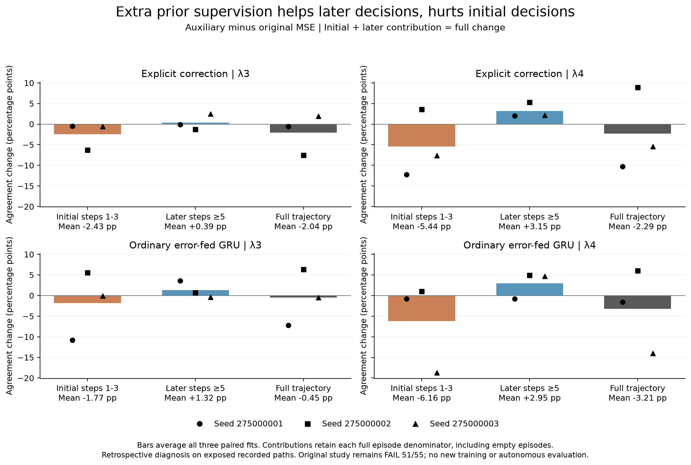

# Where prior supervision hurts decision agreement

**The negative mean full-trajectory agreement change comes from initial steps 1-3 in both recurrent architectures.** Later-step contributions are positive on average in both settings. The individual seeds vary substantially, so this is a localization of the recorded tradeoff, not proof of a universal effect or gradient conflict.

This retrospective analysis uses the already exposed VALID outputs from the [completed prequery study](otto-prequery-calibration-results.md). Its **FAIL51/55** decision remains unchanged. No model, optimizer, simulator or teacher was run for this diagnosis.

[Diagnostic protocol](otto-prequery-decision-diagnosis-protocol.md) · [All saved aggregates](../output/otto-prequery-decision-diagnosis-v1/run-01/summary.json) · [Every episode pair](../output/otto-prequery-decision-diagnosis-v1/run-01/episodes.csv) · [Every correctness transition](../output/otto-prequery-decision-diagnosis-v1/run-01/transitions.csv)

Each comparison is auxiliary minus original MSE within the same architecture and fit seed. Each episode retains its original full-path nonquery denominator. Initial and later contributions therefore add to the full change. Agreement values below are percentage points; positive is better.

| Architecture | Setting | Initial contribution | Later contribution | Full change | Primary change | Reweighting |
| --- | --- | --- | --- | --- | --- | --- |
| innovation | λ3 | -2.4300 | +0.3896 | -2.0405 | +1.2258 | -0.8363 |
| innovation | λ4 | -5.4421 | +3.1525 | -2.2896 | +4.0538 | -0.9013 |
| innovation_gru | λ3 | -1.7731 | +1.3218 | -0.4513 | +1.5673 | -0.2455 |
| innovation_gru | λ4 | -6.1572 | +2.9499 | -3.2073 | +3.2925 | -0.3426 |

The primary metric uses a different denominator: each episode's postcorrection row count. Its change must be combined with the initial contribution and a postcorrection reweighting term to recover the full change. Subtracting the primary metric from the full metric alone would misattribute part of the effect to the initial period.

There are only **92 initial rows among 13,788 eligible rows**, but equal episode weighting gives them substantial influence. At λ3, 50 initial rows carry 36.73% of declared full-metric weight; at λ4, 42 carry 29.87%. Short episodes therefore matter even when they contribute few rows. The two episodes with no eligible rows at λ4 retain their original zero contribution and denominator share. These conventions were fixed before the previous experiment and are not changed here.

The twelve setting-by-seed differences follow. They show why the mean should not be described as consistent across every fit.

| Architecture | Seed | Setting | Initial contribution | Later contribution | Full change |
| --- | --- | --- | --- | --- | --- |
| innovation | 275000001 | λ3 | -0.4630 | -0.0933 | -0.5563 |
| innovation | 275000001 | λ4 | -12.2799 | +1.9829 | -10.2970 |
| innovation | 275000002 | λ3 | -6.2703 | -1.2451 | -7.5154 |
| innovation | 275000002 | λ4 | +3.5524 | +5.3174 | +8.8698 |
| innovation | 275000003 | λ3 | -0.5569 | +2.5071 | +1.9502 |
| innovation | 275000003 | λ4 | -7.5988 | +2.1572 | -5.4416 |
| innovation_gru | 275000001 | λ3 | -10.8038 | +3.6150 | -7.1888 |
| innovation_gru | 275000001 | λ4 | -0.7991 | -0.7961 | -1.5951 |
| innovation_gru | 275000002 | λ3 | +5.5818 | +0.7203 | +6.3021 |
| innovation_gru | 275000002 | λ4 | +1.0440 | +4.9509 | +5.9949 |
| innovation_gru | 275000003 | λ3 | -0.0972 | -0.3699 | -0.4672 |
| innovation_gru | 275000003 | λ4 | -18.7165 | +4.6949 | -14.0216 |

The same decomposition for teacher-score gap is below. Negative is better. The mean initial period worsens gap in all four cells. Later improvements outweigh that loss except for the ordinary GRU at λ3, whose full gap increases despite better primary gap.

| Architecture | Setting | Initial gap contribution | Later gap contribution | Full gap change |
| --- | --- | --- | --- | --- |
| innovation | λ3 | +0.007925 | -0.010509 | -0.002583 |
| innovation | λ4 | +0.008088 | -0.026644 | -0.018556 |
| innovation_gru | λ3 | +0.011644 | -0.007078 | +0.004566 |
| innovation_gru | λ4 | +0.004977 | -0.015038 | -0.010062 |

Correctness transitions expose a second weighting issue. For explicit correction at λ4, the initial period averages 7.67 wrong-to-correct rows and 6.67 correct-to-wrong rows per fit. Despite the favorable raw count, their full-episode-weighted masses are 2.73% and 8.18%, respectively. Losses occur on rows with more weight, producing a net -5.44 percentage-point contribution. Reporting just pooled counts would hide this result. All four transition cells, including correct-to-correct and wrong-to-wrong, remain in the output with their original gaps.

What to test next
-----------------

The existing predictor shares one output layer between prequery forecasts and nonquery action scoring. Both losses also train the recurrent state. A runtime correction is not applied before step 4, so initial-period differences arise through trained parameters rather than a correction applied during those steps. The observed tradeoff is compatible with interference between the training objectives, but the saved outputs do not measure gradients or establish that cause.

The next architectural intervention is to **separate the prior-forecast readout from the decision readout**, retaining the same recurrent state, true-query schedule and public inputs. The [implementation and prospective comparison](otto-separate-prior-engineering.md) add 120 parameters to explicit correction and 116 to the ordinary error-fed GRU, and change the prediction used to form the later correction signal. Shared recurrent gradients remain. This is a test of readout/correction separation, not a guarantee of isolation or a biological-wiring claim.

A fresh comparison should include original-MSE shared head, auxiliary shared head and auxiliary separate head for both architectures, with paired seeds, data and optimizer updates. The central question is whether it retains the prior-forecast gains while recovering full and initial-period decision agreement, at a measured compute cost. These saved VALID cases are development evidence and must not become the next untouched test cohort.

Shared and task-specific representations have substantial prior art, including [Cross-stitch Networks](https://arxiv.org/abs/1604.03539). Auxiliary-gradient protection is a separate control suggested by [gradient similarity](https://arxiv.org/abs/1812.02224) and [PCGrad](https://arxiv.org/abs/2001.06782). None is a novelty claim on its own. An ICLR contribution still needs a specific mechanism, convincing fresh comparisons and autonomous effectiveness.

Execution and limits
--------------------

The diagnostic completed once under its original 120-second supervisor: worker 0.166622 seconds, parent 0.257335 seconds, peak worker RSS 82,411,520 bytes. It decoded 13 authenticated saved NPZ files, retained 216 episode pairs and 1,728 phase-by-correctness cells, and reconciled 1,440 original-metric/additive checks. Maximum absolute residual was 1.11e-16. Twelve unique fabricated tests passed on final source; repeated qualification attempts are not counted as additional cases.

Source review tightened provenance joins, interruption handling and group coverage before the run. Qualification 02 retained a lint failure on intentional broad error preservation; qualification 03 includes the explicit rationale and passes. A preliminary import-order lint issue was also corrected before qualification. No empirical diagnostic was retried. The first plot had labels overlapping seed markers; figure 02 moves mean labels below the axes without changing any values.

The original study's 136 frozen source hashes remain unchanged. The [run receipt](../output/otto-prequery-decision-diagnosis-v1/run-01/receipt.json), [original parent](../output/otto-prequery-decision-diagnosis-v1/supervision-01.terminal.json), [frozen input plan](../output/otto-prequery-decision-diagnosis-v1/plan-01.json), and [independent saved-table review](../output/otto-prequery-decision-diagnosis-v1/saved-review-01.json) retain provenance. That review independently reconstructs all 216 episode pairs from 1,728 transition cells, all 126 per-seed groups and all 42 seed means. Its maximum scalar residual is 2.43e-16. It checks aggregation without rerunning models; it cannot establish the truth of saved predictions or optimizer gradients independently.

This diagnosis establishes neither autonomous utility nor a new architecture advantage. Its contribution is a more specific next experiment: protect initial decision behavior while learning better forecasts before later queries.
