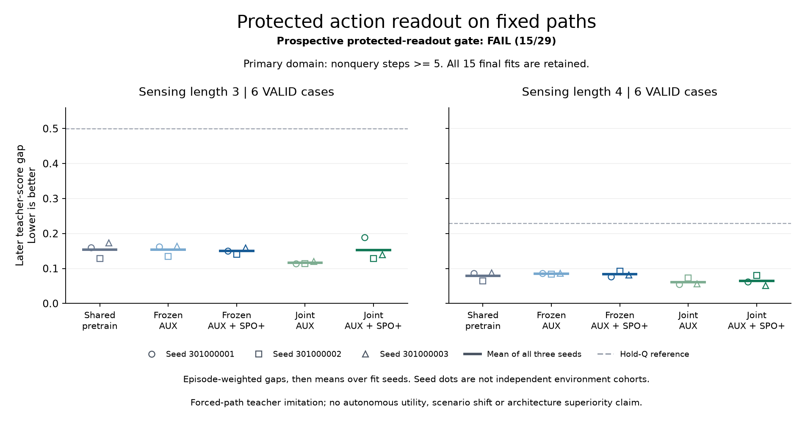
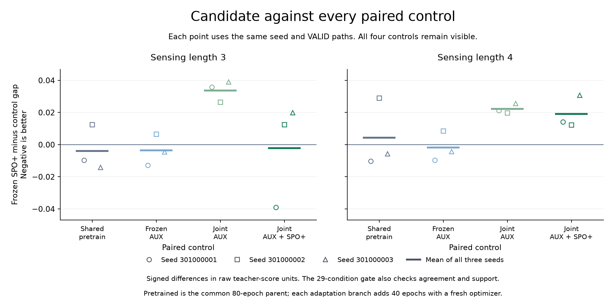
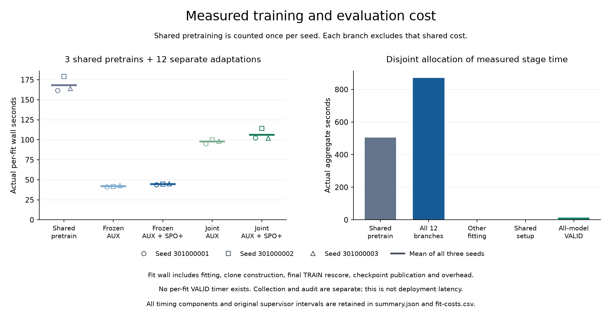

# Preserving forecasts did not produce the required decision improvement

**The protected-readout candidate fails its prospective rule: 15/29 conditions
pass.** All 15 fits and the independent audit completed successfully. Keeping
the recurrent predictor fixed preserved its forecasts exactly, but ordinary
joint MSE adaptation achieved lower mean later teacher-score gaps in both
sensing settings.

[Protocol](otto-protected-readout-protocol.md) ·
[Design](otto-protected-readout-design.md) ·
[All models and evidence](https://github.com/kw2828/OpenJev/releases/tag/otto-protected-readout-v1)

## Matched comparison

The fresh collection contains 54 TRAIN paths and 36 VALID paths. Three
collectors share each originating case: nine TRAIN cases and six VALID cases
per setting. Both settings occur in training, so neither is an unseen scenario
shift. Fit seeds are 301000001, 301000002 and 301000003.

For each seed, an ordinary 5,996-parameter GRU receives 80 AUX pretraining
epochs. Four branches then copy that exact checkpoint, add the same zeroed
116-parameter action residual and receive 40 adaptation epochs. Frozen branches
train only the residual; joint branches can train the recurrent predictor too.
AUX uses the declared MSE terms; the SPO branches add the fixed decision-focused
SPO+ loss. Branches share data, episode orders and optimizer-update counts.
Matching these does not imply equal computation.

All 15 final checkpoints were durable before VALID decoding. There was no
best-epoch, best-seed or held-out coefficient selection. Frozen branch tensors,
base forecasts and priors match their pretrained references bitwise on the same
TRAIN and VALID inputs. Their residual never feeds the recurrent state.

## Primary result

Values are later nonquery teacher-score gaps, at absolute steps at or after 5.
Lower is better. Average eligible rows within each path, retain zero-support
paths in the denominator, then average equally across all three fit seeds.

| Model | Sensing length 3 | Sensing length 4 |
| --- | ---: | ---: |
| Shared pretrained GRU | 0.153728256 | 0.079053799 |
| Frozen AUX | 0.153458284 | 0.085157677 |
| **Frozen AUX + SPO+ candidate** | **0.149862229** | **0.083342704** |
| Joint AUX | 0.116126428 | 0.061154560 |
| Joint AUX + SPO+ | 0.152100414 | 0.064330620 |

The candidate improves on Frozen AUX by only **2.34% / 2.13%**, below the
required 10%. Its gaps are **29.05% / 36.28% higher than Joint AUX**. Joint AUX
has the lowest mean gap in each setting, with **24.46% / 22.64%** reductions
relative to its pretrained reference. These are descriptive control comparisons;
the protocol did not provide a separate rule for promoting Joint AUX.

All eleven common conditions pass. The candidate passes only two of nine
conditions in each setting:

- All eight required 10% mean-gap comparisons fail.
- All four full/initial agreement guards fail.
- Four of six paired-seed nonregression conditions pass. Seed 301000002
  regresses against Frozen AUX in both settings.

The complete per-family, per-seed and per-scope metrics and all 29 condition
values are retained in the release CSVs and audited summary. Better agreement
in an isolated scope cannot replace the declared primary comparisons.

## Completion and cost

The original collection supervisor closed after **611.60 seconds**, training
after **1,392.15 seconds**, and saved-output audit after **4.14 seconds**. Each
closed normally with its worker reaped and process group absent. This fresh
study's valid closure does not repair the earlier interrupted study.

Training executed **6,480 optimizer updates** and **38,880 episode exposures**.
The three shared pretrains took 504.66 seconds in total; all twelve adaptation
fits took 870.80 seconds. Aggregate VALID evaluation took 14.11 seconds.
Training used one CPU thread, with no teacher or simulator calls.

Shared pretraining is counted once per seed. Branch times exclude that shared
cost and include fitting, evaluation-clone construction, final TRAIN rescoring
and checkpoint publication. Per-fit VALID timings were not recorded. These are
training costs, not deployed inference latency or a utility-compute frontier.

The final independent audit receipt records **822,956 checks**, including saved losses,
predictions, forks, weights, support, source hashes, original closures and all
conditions. It made no model, optimizer, teacher or simulator calls. The harness
passed 323 fabricated engineering tests; the separate report passed 22
fabricated tests. All three actual figures were visually inspected.

## Research decision

Do not promote or extend this Frozen-SPO recipe into the conditional autonomous
confirmation. Protection alone did not deliver the required gain under this
data, model and optimization recipe. This does not establish that all gradient
separation or frozen-model methods fail.

Retain Joint AUX as a necessary ordinary-model control for any new hypothesis,
without relabeling its descriptive result as a confirmed improvement. The
[literature audit](protected-memory-literature-audit.md) identifies a distinct
question about when observed errors should update fast memory. That proposal
remains untested and requires its own fresh protocol. It is not a validated
extension of this result.

The current evidence concerns fixed-path teacher imitation. It establishes no
autonomous task gain, calibrated success probability, connectome advantage,
new RL method or novel world-model architecture.
