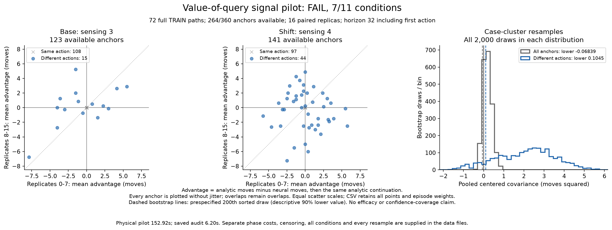

# Paired value-of-query pilot V2

**Completed, independently audited, and failed the continuation rule: 7 of 11 conditions passed. No new model training is admitted.** All 72 TRAIN paths and all 264 available label panels finished in 152.92 seconds under the original 900-second limit. The saved-record audit agrees on 6,606,135 checks.

The base setting shows positive split-half covariance, but differing decisions span only five independent originating cases, below the required six. The shifted setting does not show positive covariance. A positive pooled result for the differing-action subset cannot override these failures.

## What was tested

The [frozen protocol](otto-query-advantage-v2-protocol.md) asks whether the benefit of **one neural-selected action followed by analytic control** varies repeatably across public states. Each available state has 16 paired replicas, each capped at 32 total moves including the forced first action. Paired branches share their sampled source and observation-uniform stream, while preserving their own conditional observation laws. Identical endpoint actions share one physical continuation and have exactly zero advantage.

Advantage is `analytic moves - neural moves`; a positive number favors the neural action. This is a local, capped intervention target. It excludes the computation price of the query and does not measure repeated neural querying, full-episode regret, or optimal action value.

The cohort contains 12 originating cases per setting, each under always-query, never-query and period-two schedules. Its 72 paths made 2,776 native moves. Of 360 prespecified anchor slots, 264 were available and 96 were unavailable because discovery occurred earlier. There were 123 available anchors in length 3 and 141 in length 4. All paths and anchor arrays closed before label generation.

The pilot made 1,406 deployed neural queries and 88 separate annotations, 1,494 scores in total. Labels used 4,224 posterior source draws and 5,168 physical continuations, totaling 98,976 moves; 3,575 continuations found their source. All pending-operation lists are empty and the durable journal closed without errors. There were zero optimizer updates and zero evaluation episodes.

V2 uses fresh seeds after the incomplete [V1 allocation](otto-query-advantage-results.md). It does not resume or replace V1's partial records. The setting named `shift` is length 4 within this TRAIN pilot, not an untouched transfer environment.

## Signal and support

Split replicas once into 0-7 and 8-15. Within each setting, episodes have equal total weight, divided among their available anchors. The different-action subset inherits and renormalizes those weights. Covariance is centered within each setting; repeatability is covariance divided by pooled half variance. Negative estimates are retained.

| Setting | Group | Anchors | Mean advantage, moves | Covariance, moves squared | Repeatability |
|---|---|---:|---:|---:|---:|
| Base, length 3 | All anchors | 123 | -0.039612 | 0.505504 | 0.543995 |
| Base, length 3 | Different actions | 15 | -0.415352 | 5.351460 | 0.570495 |
| Shift, length 4 | All anchors | 141 | -0.120660 | -0.119564 | -0.048462 |
| Shift, length 4 | Different actions | 44 | -0.330742 | -0.387069 | -0.057917 |

Different actions occur at **15 anchors across 12 episodes from 5 cases** in the base setting, and **44 anchors across 31 episodes from 12 cases** in the shifted setting. Their inherited weight masses are 9.54% and 36.48%. The remaining 90.46% and 63.52% are structural-zero weight, not repeated evidence about an uncertain winner. Negative mean advantages in both subsets do not establish that querying helps on average. Positive covariance alone also does not establish that cheap public features can predict useful queries.

The prespecified 2,000 case-cluster bootstrap draws retain each case's three schedules and complete anchors. The lower values are the 200th sorted pooled covariance, index 199, without interpolation or discarded draws: **-0.068393133** for all anchors and **0.104545679** for different actions. The base resamples include one empty different-action group, one zero-variance all-anchor group and eleven zero-variance different-action groups. The shifted resamples have none. These are descriptive small-pilot statistics, without a formal confidence-coverage guarantee.

## All continuation conditions

All eleven conditions were required. The failed conditions remain failed; neither a pooled statistic nor a base-only subset authorizes fitting.

| Condition | Observed | Required | Result |
|---|---:|---:|---|
| `technical_complete` | 1 | >= 1 | PASS |
| `base.different_anchors` | 15 | >= 12 | PASS |
| `base.different_cases` | 5 | >= 6 | **FAIL** |
| `base.covariance.all` | 0.505504356 | > 0 | PASS |
| `base.covariance.different_action` | 5.35146014 | > 0 | PASS |
| `shift.different_anchors` | 44 | >= 12 | PASS |
| `shift.different_cases` | 12 | >= 6 | PASS |
| `shift.covariance.all` | -0.11956399 | > 0 | **FAIL** |
| `shift.covariance.different_action` | -0.387069325 | > 0 | **FAIL** |
| `pooled_lower.all` | -0.0683931327 | > 0 | **FAIL** |
| `pooled_lower.different_action` | 0.104545679 | > 0 | PASS |

## Censoring and costs

Capped ties remain in every calculation. Censoring means not discovered within 32 moves; at-cap includes discovery exactly on move 32, so these rates differ. Percentages below use the declared episode weights and subgroup normalization.

| Setting | Group | Both branches censored | Analytic / neural censored | Analytic / neural at cap |
|---|---|---:|---:|---:|
| Base, length 3 | All anchors | 22.57% | 23.37% / 23.43% | 24.40% / 24.35% |
| Base, length 3 | Different actions | 26.30% | 34.65% / 35.35% | 38.02% / 37.44% |
| Shift, length 4 | All anchors | 25.12% | 27.50% / 28.17% | 28.59% / 29.21% |
| Shift, length 4 | Different actions | 16.78% | 23.30% / 25.14% | 24.44% / 26.14% |

| Physical scope | Seconds |
|---|---:|
| Original producer supervisor, including startup and closure | 152.923802 |
| Producer worker | 152.495220 |
| Setup phase | 3.831568 |
| Native collection phase | 65.436094 |
| Anchor save | 0.006100 |
| Paired-label phase | 82.226651 |
| Journal I/O, nested within other phases | 42.335722 |
| Final journal close, separately recorded | 0.000343 |
| Independent audit supervisor | 6.197621 |

Nested operation timers overlap and must not be added to phase times. The complete [cost table](../output/otto-query-advantage-v2/figure-01/costs.csv) preserves those scopes. Peak producer RSS was 762,462,208 bytes. Sixteen producer payloads occupy 230,601,392 bytes excluding the receipt. The independent audit reads saved records and replays categorical arithmetic, making no new native, filter, neural, sampler or optimizer calls. It inherits qualified numerical filtering and planner correctness rather than re-executing them.

The separately qualified logger achieved **5.103x median speedup on fabricated events**, with identical bytes and per-event fsync in both arms. [All six blocks and engineering checks](otto-query-logging-results.md) are reported separately. V1 and V2 used different cohorts and workloads, so their end-to-end runtimes are not a controlled speedup comparison.

## Decision and next test

This allocation closes with `signal_admitted: false`. Do not fit this failed label recipe, enlarge replica count or horizon automatically, tune its thresholds, or substitute cases. Negative covariance is an uncertain estimate, not proof that no useful query value exists. These results establish no recurrence, world-model, biological-wiring, RL or architecture advantage.

The next candidate is a separately specified **sparse-query control test**: compare periodic, randomized and entropy-triggered querying under the same causal 50% query quota against always-neural and always-analytic references. Freeze any threshold using fresh VALID only, then measure complete episodes on fresh paired cases with separate transfer results and all controller overhead. A simple gate must first preserve useful control while saving total cost. Only then does a recurrent gate have a demonstrated target, with entropy and finite-history MLP controls to beat. If sparse controls fail, investigate the cheap fallback before adding architectural complexity. This proposal has not been executed or admitted by the failed V2 rule.

## Evidence and execution history

[Protocol](otto-query-advantage-v2-protocol.md) · [Independent arithmetic](../output/otto-query-advantage-v2/audit-01/audit.json) · [All plotted values](../output/otto-query-advantage-v2/figure-01/plotted-values.json) · [Evidence layout](../output/otto-query-advantage-v2/README.md) · [Complete release](https://github.com/kw2828/OpenJev/releases/tag/otto-query-advantage-v2).

The producer's original process closed with exit 0 after 152.92 seconds; its separately supervised audit closed with exit 0 after 6.20 seconds. The renderer completed once and passed visual inspection. The final receipt counts 6,606,135 audit checks, including final evidence authentication; the earlier audit summary records 6,605,798 checks at summary creation. Neither count is a statistical sample size.

Engineering executed 52 new journal, integration and audit-contract tests. A further 24 unchanged prior pair/reducer tests remain qualified by their original receipt. The metadata aggregation's first attempt failed with a missing `log` key; its preserved correction copies the original logs without rerunning the tests. The final benchmark lifecycle change has its separate static receipt, as explained in the logging report. All original failed and successful engineering records remain in the release.

| Record | SHA256 |
|---|---|
| [Frozen plan](../output/otto-query-advantage-v2/plan-01.json) | `a3606093ef0fe7b01d3e2cb4b51619f043e0b336cded977e815fcbcf2a05e8d7` |
| [Producer](../output/otto-query-advantage-v2/run-01/receipt.json) | `be6e16a5d797f9e6c50edca2a1ef2bc59bf8dfd021de13fbba098f2a2d6380db` |
| [Original producer terminal](../output/otto-query-advantage-v2/supervision-01.terminal.json) | `7cfe4bbd38b842fd5e15db5d10fa968b34caec992dc36ff729aa0d89613413de` |
| [Independent audit](../output/otto-query-advantage-v2/audit-01/receipt.json) | `b5273b0b2554a61df1c3ffa2c6a1ee70d02ef8661f12de8821686f068a43d7df` |
| [Original audit terminal](../output/otto-query-advantage-v2/audit-supervision-01.terminal.json) | `5314aa69b58530e449f953356b47679bf8ce90a299d0e8278956414ae7c042b8` |
| [Figure](../output/otto-query-advantage-v2/figure-01/receipt.json) | `134881384e049cd62b20a33c749202bb3a209fec5673b56b11e4a1e6b0e47a80` |
