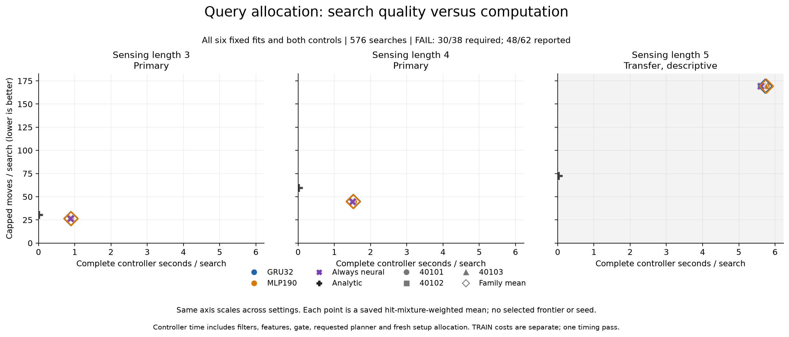

# Learned query gates: every decision still queried

**FAIL: 30/38 required conditions passed; 48/62 reported conditions passed.** All 576 searches found the source, but the six learned gates requested the existing neural planner on **every one of their 18,012 decisions**. Neither the recurrent nor stateless gate saved a single query. Both reproduced the always-neural control's search lengths, with additional controller work. The independent saved-record audit agreed with the result.

On the two primary settings, the neural policy used 12.78% and 24.42% fewer weighted moves than the analytic policy. The learned gates inherited those gains by always querying; the gains do not demonstrate learned query allocation or recurrence superiority. On the descriptive length-five transfer setting, the neural policy and gates required 169.30 weighted moves versus the analytic policy's 72.47, or 133.62% more.

[Every controller metric, with common scales](../docs/assets/otto-query-gate-metrics.png).

## Every controller and setting

The [frozen evaluation protocol](otto-query-gate-evaluation-protocol.md) retained all six final fits and both controls: 24 paired cases at each of sensing lengths three, four and five, for 72 cases and 576 searches. Initial hits one, two and three each have eight cases per setting. The tables use the saved positive-hit probabilities to weight those strata; learned-family rows are equal means of the three fixed seeds. All 24 individual controller/setting cells found 24/24 sources, with no censoring. The move cap remained 2,188; censored searches would retain that final cost and update.

| Sensing length | Controller | Found | Weighted moves | Weighted queries | Controller seconds/search |
|---|---|---:|---:|---:|---:|
| 3 | GRU32, three-seed mean | 100% | 26.371002 | 26.371002 | 0.895841 |
| 3 | MLP190, three-seed mean | 100% | 26.371002 | 26.371002 | 0.899033 |
| 3 | Always neural | 100% | 26.371002 | 26.371002 | 0.880066 |
| 3 | Analytic | 100% | 30.233743 | 0.000000 | 0.010248 |
| 4 | GRU32, three-seed mean | 100% | 44.831060 | 44.831060 | 1.527682 |
| 4 | MLP190, three-seed mean | 100% | 44.831060 | 44.831060 | 1.521513 |
| 4 | Always neural | 100% | 44.831060 | 44.831060 | 1.500268 |
| 4 | Analytic | 100% | 59.317453 | 0.000000 | 0.020749 |
| 5 | GRU32, three-seed mean | 100% | 169.303388 | 169.303388 | 5.731193 |
| 5 | MLP190, three-seed mean | 100% | 169.303388 | 169.303388 | 5.760062 |
| 5 | Always neural | 100% | 169.303388 | 169.303388 | 5.602821 |
| 5 | Analytic | 100% | 72.468908 | 0.000000 | 0.025264 |

All three seeds have the same move and query counts as the always-neural control on every paired case. Their measured time differs; all individual costs are retained below. Across all 24 setting/block pairs, GRU-minus-MLP differences in weighted success, moves and queries are zero. Query-age witnesses contain only age zero at reset and age one thereafter, consistent with querying every step.

| Model | Seed | Controller seconds, length 3 | Length 4 | Length 5 |
|---|---:|---:|---:|---:|
| GRU32 | 40101 | 0.902779 | 1.540332 | 5.730902 |
| MLP190 | 40101 | 0.905364 | 1.517558 | 5.756744 |
| GRU32 | 40102 | 0.890930 | 1.520384 | 5.720893 |
| MLP190 | 40102 | 0.900899 | 1.543092 | 5.768489 |
| GRU32 | 40103 | 0.893814 | 1.522329 | 5.741783 |
| MLP190 | 40103 | 0.890836 | 1.503889 | 5.754952 |

The [complete saved summary](../output/otto-query-gate-learning-v1/evaluation-01/summary.json) retains every arm, hit stratum, eight paired blocks per setting, query-age histogram and criterion. Length five is descriptive and does not enter the required rule.

## What failed

The required rule combines 24 GRU absolute checks, four usefulness checks, six comparisons with the matched MLP and four control checks. The MLP's 24 absolute checks are reported separately. Passing requires every required check, not a majority.

| Criterion group | Passed | Required for continuation? | Failure |
|---|---:|---|---|
| GRU absolute competence and cost | 18/24 | Yes | All six half-neural-cost checks failed |
| GRU usefulness versus analytic | 4/4 | Yes | None; gains match the existing neural policy |
| GRU versus matched MLP | 4/6 | Yes | Both 10% controller-cost improvement checks failed |
| Reference-control competence | 4/4 | Yes | None |
| MLP absolute competence and cost | 18/24 | No, diagnostic | All six half-neural-cost checks failed |

All 14 failed reported checks concern cost. Every learned fit exceeded the required half-neural budget: 0.440033 seconds/search at length three and 0.750134 at length four. GRU family time was 0.895841 versus its MLP-relative limit of 0.809130 at length three, and 1.527682 versus 1.369362 at length four. Timing comes from one physical pass; small GRU/MLP timing differences are not robust speedup evidence. No threshold, seed, checkpoint or criterion changed after this result.

## Collection, fitting and deployment checks

The [collection protocol](otto-query-gate-collection-protocol.md) fixed 12 fresh TRAIN cases across lengths three and four, each under five schedules: always, never, every two steps, every eight steps, and initial step only. Schedule order rotated by case. Every visited state was annotated, while an external annotation on a skipped step did not reset the gate's deployment query history. The cohort retained **all 60 paths and 1,920 rows**: 643 deployed queries plus 1,277 external annotations, for exactly 1,920 neural scoring calls. Actual queries also supplied their state's annotation.

The target was disagreement: whether the analytic action fell outside the existing neural planner's eligible near-minimum action set. This is not a measured advantage from querying, nor a true action-value label. Both gates saw the same 31 public features, including query history. The planner stayed fixed.

The [training protocol](otto-query-gate-training-protocol.md) used three paired seeds, 80 epochs, CPU float32 Adam at 0.0003 and gradient clipping at five. GRU32 has 6,273 parameters; MLP190 has 6,271. Both started with the same constant output function. Episodes received equal total weight. Each batch contained eight episodes in chronological 32-step windows; padding had zero loss, all real tails remained, and the update divisor was fixed at 256. GRU state reset per episode and was detached between windows. Paired families used identical permutations, row exposure and update counts. Deployment kept the frozen probability threshold >= 0.05 and all six final checkpoints.

| Model | Seed | Updates | Fit seconds | Parity seconds | Maximum logit error | Maximum state error |
|---|---:|---:|---:|---:|---:|---:|
| GRU32 | 40101 | 2,232 | 3.619388 | 0.900044 | 9.53674316e-07 | 1.1920929e-07 |
| MLP190 | 40101 | 2,232 | 1.182502 | 0.983189 | 1.43051147e-06 | 0 |
| GRU32 | 40102 | 2,253 | 3.671158 | 1.031444 | 9.53674316e-07 | 1.1920929e-07 |
| MLP190 | 40102 | 2,253 | 1.290601 | 0.985034 | 9.53674316e-07 | 0 |
| GRU32 | 40103 | 2,200 | 3.655693 | 1.075059 | 9.53674316e-07 | 1.1920929e-07 |
| MLP190 | 40103 | 2,200 | 1.246346 | 1.100730 | 9.53674316e-07 | 0 |

All six fits completed 80 epochs. Seed-dependent episode grouping explains the differing update counts; each GRU/MLP pair has equal counts. After loading each saved final checkpoint, independently evolving Torch and NumPy states agreed on **all 11,520 TRAIN query decisions**. Maximum absolute logit/state errors were 1.430511474609375e-6 and 1.1920928955078125e-7, below the fixed 2e-5 limit. This establishes the declared deployment tolerance on those sequences, not bit-identical frameworks or policy efficacy.

## Paid costs and audit scope

| Phase | Worker seconds | Original supervisor seconds |
|---|---:|---:|
| TRAIN collection and annotations | 77.368318 | 77.684577 |
| Six fits and deployment parity | 22.022002 | 22.284459 |
| Fresh autonomous evaluation | 771.638454 | 771.919627 |
| Saved-record audit | 2.779063 | 2.850479 |

Training includes 1.036634 seconds of common setup, 14.665689 seconds of fit intervals and 6.075500 seconds of parity intervals, plus lifecycle/evidence overhead. Collection and training parent times total **99.969036 seconds**, paid once. The saved allocations charge shared collection and remaining training overhead equally across six fits, plus each fit's exclusive fit/parity interval. This assigns 53.566710 seconds to the GRU family and 46.402326 to the MLP family. Amortized over each fit's 72 evaluations, the extra training cost is 0.246168-0.249103 seconds/search for GRU and 0.213477-0.215996 for MLP; it is separate from the online criteria above.

Online controller time includes actor initialization, public filtering, analytic scoring, features, the gate, requested neural scoring and allocated fresh setup. Common setup is divided over 576 searches, TensorFlow model setup over the 504 neural-capable searches, each gate load over its 72 searches and gate-module setup over 432 learned-gate searches. Six fresh loads and zero warmup forwards were recorded. Measured journal I/O is excluded from controller time; environment steps and evaluator checks are separate. Full worker/parent times retain setup, instrumentation and closure. Nested operation timers overlap and must not be added to these physical totals.

The evaluation retained **23,426 native steps and final public updates**, **18,012 NumPy gate decisions**, and **21,014 TensorFlow forwards**, comprising 18,012 learned queries plus 3,002 always-neural queries. There were no evaluation annotations or training updates. All attempts completed; there were no censored episodes or omitted cells.

The [collection/training publication check](../output/otto-query-gate-learning-v1/learning-publication-check-01.json) passed 172,571 assertions covering all paths, fixed fits, paired orders, complete windows, operation ledgers and saved parity decisions. It hashed NPZ files without decoding them; neural parity and hidden-state arithmetic remain producer evidence. Its initial pin-transcription refusal is retained and did not rerun scientific work.

The [independent saved audit](../output/otto-query-gate-learning-v1/audit-01/receipt.json) completed with **4,299,097 checks** and agreement. It authenticated 63 payloads across four completed phases and recomputed episode reductions, all 62 reported/38 required predicates, setup and training allocations, saved-score action selection, query history and operation counts. It checked paired source/uniform witnesses and saved recurrent-state continuity. It did **not** rerun neural predictions, numerical belief filtering, gradients or ancestral experiments; their numerical truth remains inherited evidence. Audit agreement confirms the saved screen, not novel architecture advantage or general robustness.

## Interpretation and next hypothesis

This experiment learned no useful skipping behavior at its frozen operating point. The repeated all-query outcome in both similarly sized models gives no evidence that recurrence helps this decision. It also does not establish that recurrence is generally useless, or isolate a cause among the low threshold, disagreement target, optimization and state distribution.

The next hypothesis should concern the query decision itself: can an explicitly cost-sensitive training objective produce skips while preserving the existing neural policy's competence? The [saved TRAIN diagnosis and proposed follow-up](otto-query-gate-next-experiment.md) show that all six gates also queried on every TRAIN row. The proposal compares a local intervention-advantage target with disagreement under the same query budget, alongside simple schedules and history controls. It requires new frozen data splits and fresh evaluation cases. This is a proposed mechanism test, not a retuning of the completed screen; adding recurrent capacity or increasing optimization alone is not supported by this result.

## Reproducibility

[Public release](https://github.com/kw2828/OpenJev/releases/tag/otto-query-gate-learning-v1) contains the evidence package. Immediate records: [collection plan](../output/otto-query-gate-learning-v1/collection-plan-01.json), [training plan](../output/otto-query-gate-learning-v1/training-plan-01.json), [evaluation plan](../output/otto-query-gate-learning-v1/evaluation-plan-01.json), [six-fit summary](../output/otto-query-gate-learning-v1/training-01/summary.json), and [audited reductions](../output/otto-query-gate-learning-v1/audit-01/audit.json). Existing strict numerical/runtime authenticators require the recorded absolute path layout and qualified runtimes; portable byte inspection alone is not a relocation adapter.

| Evidence | SHA256 |
|---|---|
| collection-01/receipt.json | `51709d4791f82b157d8b519aee5f129fa5df2b4af091cb854b282c0acbf256cf` |
| training-01/receipt.json | `ea97a73b687c8fb7bbde4ae0e63bed7a7cb8cef26cace154eed5207b0989dd26` |
| evaluation-01/receipt.json | `337206eda48e0165db915552affb816e1d328b3c43534b819ea192c9ab512b5b` |
| evaluation-supervision-01.terminal.json | `dcae36ec898d075620136d9b84df6faf487a2114a933723cb79d346f735b7d6e` |
| audit-01/receipt.json | `705108876f9a399f53687ff7e8ec8df39d391573e8c7f814e4a4ebe28b8f9be0` |
| audit-supervision-01.terminal.json | `b31c1b8054b0fe89c409ebfedb9ed0234373fbc66661be0fd52de97437c21771` |
