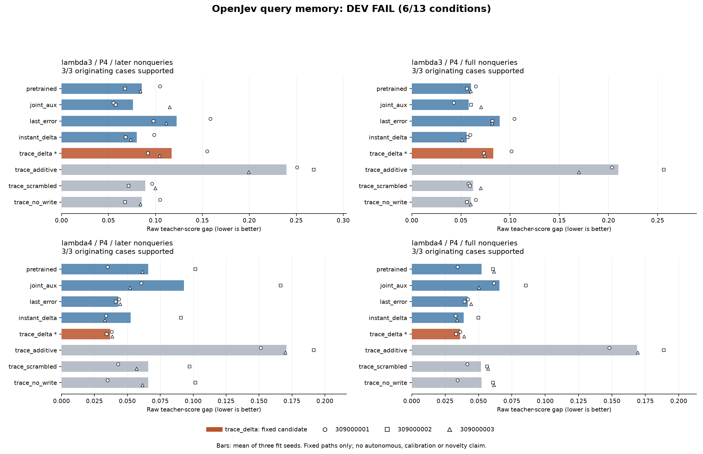

# Error-written memory did not pass its development rule

**The history-conditioned delta-memory candidate fails: 6/13 conditions pass.**
All 18 fits and the independent saved-output audit completed successfully.
Its mean later decision-cost gap is **54.1% higher** than the best predeclared
control at sensing length 3, and **14.3% lower** at sensing length 4. The latter
improvement does not survive every paired-seed check. TEST remains unopened.

[Frozen protocol](otto-query-memory-protocol.md) ·
[Every method, seed and condition](otto-query-memory-dev-results/query-memory-dev.md) ·
[Collection evidence](https://github.com/kw2828/OpenJev/releases/tag/otto-query-memory-collection-v1)

## What was compared

This is an OTTO odor-source-search **fixed-path prediction** comparison. A small
recurrent model forecasts four teacher action scores between scheduled teacher
observations. At later observation times, the candidate writes the observed
prediction error into a small matrix memory. Its read/write key mixes current
and recent hidden features. A score gap measures the teacher's cost of the
predicted choice relative to its best legal choice; lower is better. It is not
realized search return or a calibrated success probability.

The fresh collection contains 54 TRAIN, 18 DEV and 36 unused TEST paths. Each
originating case has three collectors. DEV has three originating cases per
sensing setting, and both settings occur in training. There is no demonstrated
unseen-scenario shift. All paths, including unsupported paths as zero terms,
remain in their declared denominators, with equal case and fit-seed weighting.

Each of three seeds trains a 6,112-parameter GRU for 80 epochs, then five
40-epoch branches copy its final checkpoint. The ordinary joint-training branch
updates all 6,112 parameters. Memory branches freeze those weights and train a
224-parameter feature projection. The candidate, `trace_delta`, was fixed before
collection. Its controls include ordinary continued training, instantaneous
delta memory, last-error correction, additive writes, a rotated-past feature
control and a no-write intervention. The latter uses the candidate's exact
weights; it is not another independently trained model.

The branches share data, episode orders, the declared full-forecast objective
and update counts. Their compute differs and is reported below. All checkpoints
and TRAIN predictions were durable before DEV was decoded. There was no
selection of the best epoch, seed or alternative candidate.

## Result and continuation decision

The primary scope is nonquery steps after the first correction opportunity,
starting at step 5 with a query period of four. Values below are raw teacher-score
gaps, averaged over the three fit seeds and originating cases.

| DEV setting | Candidate later gap | Lowest control later gap | Candidate change |
| --- | ---: | ---: | ---: |
| Sensing length 3 | 0.117199 | 0.076031, joint training | **54.1% higher** |
| Sensing length 4 | 0.036917 | 0.043059, last error | **14.3% lower** |

The predeclared rule requires at least a 10% aggregate later-gap reduction,
full-nonquery nonregression and nonregression against the best same-seed control
for every seed, in each setting. All conditions are required together.

- Technical completion and both case-support checks pass.
- Sensing length 3 fails the aggregate later-gap reduction, full-gap guard and
  all three seed checks.
- Sensing length 4 passes both aggregate checks and seed `309000002`, but fails
  seeds `309000001` and `309000003` against instantaneous delta memory.

The [complete report](otto-query-memory-dev-results/query-memory-dev.md) retains
all eight methods, all seed values, full-nonquery gaps and all thirteen
conditions. A control is not promoted after seeing these results. The no-write
intervention matches the pretrained model as required, but that implementation
check does not establish that useful temporal credit was learned.

**This study stops at DEV.** Its conditional P4/P8 TEST and subsequent autonomous
comparison are not admitted. The held-out split is preserved as unused, not
used to tune or rescue this candidate. The result rules out this recipe under
this protocol; it does not rule out all recurrent or error-driven memory.

## Completion and cost

Every original supervisor closed normally, with a reaped worker and absent
worker process group. The recorded wall times include supervisor cleanup:

| Phase | Wall seconds | Work |
| --- | ---: | --- |
| Collection | 2,154.57 | 108 paths; 52,938 native steps and teacher score calls |
| Fabricated capacity check | 2.78 | Five updates, no empirical arrays or teacher calls |
| Training and TRAIN/DEV evaluation | 4,543.35 | 18 fits; 7,560 updates; 45,360 episode exposures |
| Independent saved-output audit | 12.48 | 70 array decodes; zero model, optimizer, teacher or simulator calls |

Full-census annotation is paid for every recorded state, including the collected
but unused TEST paths. Sparse model inputs do not establish physical teacher-call
savings. Training used CPU float32 with one numerical thread and no teacher or
simulator calls. Peak worker RSS was 300,761,088 bytes during training and
254,984,192 bytes during audit.

| Fitted family, three seeds each | Updates | Episode exposures | Training-batch wall seconds |
| --- | ---: | ---: | ---: |
| Shared pretraining | 2,160 | 12,960 | 1,004.02 |
| Joint training | 1,080 | 6,480 | 483.00 |
| Instantaneous delta | 1,080 | 6,480 | 608.69 |
| **History delta candidate** | **1,080** | **6,480** | **703.86** |
| History additive | 1,080 | 6,480 | 752.20 |
| Rotated-past delta | 1,080 | 6,480 | 835.69 |

Shared pretraining is counted once per seed. These batch timers exclude model
initialization, final rescoring and serialization. Across all 24 views, recorded
TRAIN inference/loss time was 99.26 seconds and DEV inference/loss time was
35.10 seconds; other stage timers remain in the original summary. These are
observed run costs, not an isolated latency benchmark, equal-compute comparison
or deployed utility-versus-compute frontier.

The independent audit reconstructs metrics and the gate from saved outputs,
checks all 7,560 updates and 45,360 exposures, and reconciles 27,432 paired work
calls. It makes zero TEST decodes. The training harness passed 528 fabricated
tests and lint; the separate renderer passed 16. Engineering qualification does
not make the scientific result positive.

## Evidence and next question

[Training closure](../output/otto-query-memory-v1/training-closure-01.json),
[audit closure](../output/otto-query-memory-v1/dev-audit-closure-01.json) and
[render provenance](../output/otto-query-memory-v1/render-01.json) bind the original
processes, saved results and this figure. The separate TRAIN/DEV evidence package
retains every checkpoint and prediction, including the failed candidate.
Native weights, kernels and two recorded runtime environments remain external;
the evidence package is not a self-contained executable reproduction.

A specific next question is whether corrections need uncertainty-dependent
strength rather than this fixed-rate memory write. The
[Bayesian residual-memory reference](otto-query-memory-bayesian-baseline.md)
provides an independently tested baseline for that question, not an empirical
improvement. Any follow-up needs a distinct protocol and fresh evaluation data,
with ordinary joint training, last-error and instantaneous-memory controls.

These results establish no autonomous search improvement, calibrated probability,
biological-wiring advantage, new RL algorithm or novel world-model architecture.
