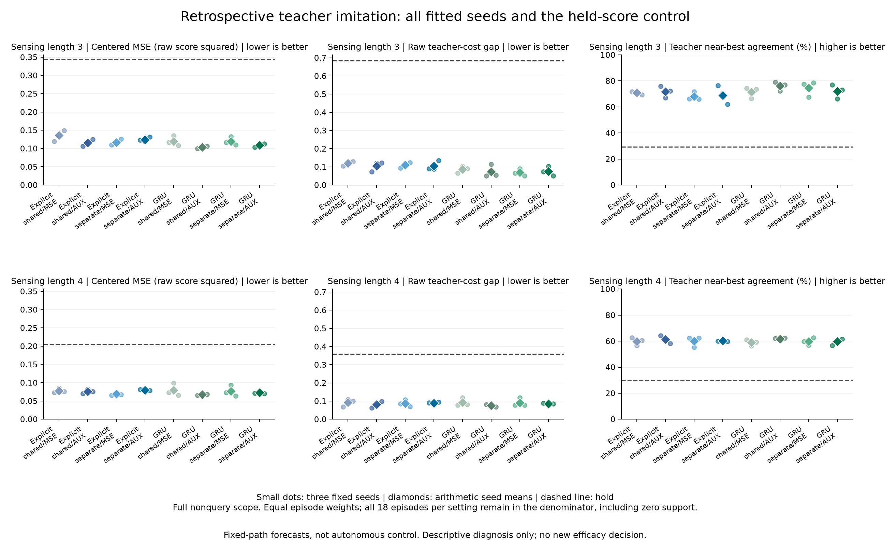
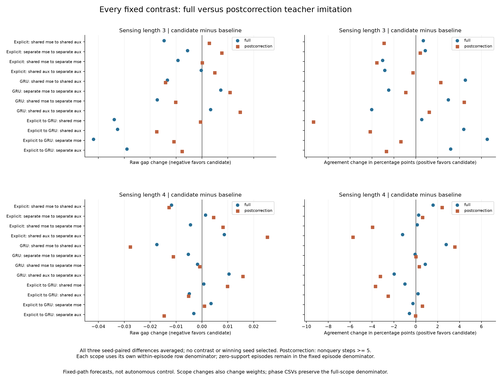

# Better score forecasts can still produce worse choices

**The saved-output diagnosis confirms a mismatch between score error and action quality, but does not support a simple "errors among irrelevant actions" explanation.** Error across the best-action boundary can fall while choices get worse. Separate forecast outputs also fail for a more ordinary reason: compared with shared outputs under the same auxiliary objective, they increase nonquery score error in both architectures and both settings.

This is a retrospective analysis of the [completed 24-fit study](otto-separate-prior-results.md), not new training or an untouched efficacy test. Its three continuation decisions remain **FAIL: 11/19, 10/19 and 14/29**. No new architecture, biological-wiring advantage or autonomous-control improvement is established.

[Protocol](otto-ranking-diagnosis-protocol.md) · [Complete diagnostic evidence](https://github.com/kw2828/OpenJev/releases/tag/otto-ranking-diagnosis-v1) · [Original predictions and checkpoints](https://github.com/kw2828/OpenJev/releases/tag/otto-separate-prior-v1)

## What the analysis measures

The analysis retains all 24 final models, three fit seeds, 36 VALID paths, 12 originating cases and the held-score reference. There are 10,333 nonquery rows in 3,464 windows. Both sensing settings occurred in training; neither is a scenario shift. The three collectors per case are paired paths, not independent cases.

Every comparison evaluates prediction error and chosen actions on **the same legal actions and nonquery rows**. This avoids conflating all-four forecast error at actual queries with decisions made between queries. Each scope averages rows within each episode and then uses the fixed declared episode denominator. Empty episodes contribute zero. Full, initial, later and three age-specific scopes remain separate; their denominators differ.

Legal-centered MSE decomposes exactly into squared score-difference errors for three pair types: both actions teacher-best, one best and one nonbest, or both nonbest. The middle term measures errors across the best-action boundary. It remains an aggregate squared error, not a count of wrong choices or a causal attribution.

The fixed comparison set contains twelve contrast types at three paired seeds, across all 21 overall/setting/collector/case groups. Every correct-to-correct, correct-to-wrong, wrong-to-correct and wrong-to-wrong cell is retained, including zero cells. All 27,990 records are available in the release; group-level tables accompany the figures.

## What changed

The table shows descriptive three-seed means. Negative MSE or gap changes are favorable; positive agreement changes are favorable. "Later" means nonquery steps at or after step 5. The first two rows illustrate a mismatch; the last two provide a counterexample to any claim that lower MSE is generally harmful. These examples were chosen after reading the diagnostic and are not new tests.

| Change | Setting / scope | Legal MSE | Boundary-pair MSE | Agreement | Teacher-score gap |
| --- | --- | ---: | ---: | ---: | ---: |
| Explicit shared MSE to AUX | 3 / later | -9.63% | -12.74% | -2.91 pp | +2.36% |
| GRU separate MSE to AUX | 3 / full | -8.64% | -7.57% | -2.47 pp | +10.64% |
| GRU shared MSE to AUX | 3 / full | -13.69% | -17.69% | +4.53 pp | -15.55% |
| GRU shared MSE to AUX | 4 / full | -15.89% | -19.21% | +2.77 pp | -18.77% |

Across the 48 full/later contrast-setting means, 28 lower legal MSE. Of those, 14 lower agreement and five increase the teacher-score gap. These are overlapping, correlated descriptions of a small exposed cohort, not 48 independent trials or a success rate. The figures and exports retain every contrast, including favorable, unfavorable and mixed outcomes.

### Improvements can accumulate where decisions do not change

For separate-output GRU, adding AUX at sensing length 3 changes full-path MSE from **0.119475 to 0.109149**, while agreement falls from **74.52% to 72.04%** and the raw teacher gap increases from **0.068428 to 0.075711**.

Under the fixed episode weights, **6.61%** of decision mass changes from correct to wrong, compared with **4.14%** changing from wrong to correct. These are weighted masses, not percentages of pooled rows. New mistakes add **0.021941** to the mean teacher gap; repaired mistakes remove **0.013467**; choices that remain wrong improve by **0.001192**. Their sum is the observed **+0.007283** gap regression.

Meanwhile, MSE falls by **0.004467** on correct-to-correct rows and **0.006892** on wrong-to-wrong rows. The latter rows still choose a nonbest action. This explains how aggregate error can improve without enough decisions crossing the correct boundary. It does not show that those score improvements are intrinsically useless.

All three seeds lower agreement and increase the gap in this example, but only two lower MSE. The explicit shared-output later-step example has mixed seed directions. Neither mean is evidence of a population effect.

### The separate-output failure is not concealed by better nonquery MSE

All four shared-AUX to separate-AUX full-path comparisons increase both legal MSE and boundary-pair MSE. Prior-query MSE was a different quantity and cannot rescue that result. Ordinary shared-output GRU remains a necessary control for the next experiment; its favorable mean results do not override the original failed gate.

Initial and later contributions also use a common full-path denominator in the diagnostic. For example, separate-AUX versus shared-AUX GRU at sensing length 3 loses **3.0045 pp** from initial steps and **1.0343 pp** from later steps, totaling **4.0389 pp**. Its separately normalized later agreement improves **1.2145 pp**. Those statements are compatible because short and long episodes receive different weights under the two scopes. Subtracting the independently normalized means would misattribute the regression.

## Verification and limits

Before these new per-row reads, the protocol, inputs and eight source files were frozen and published in commit `9a2f956`. All **52 fabricated tests** and Ruff passed. Original training, collection and audit identities were authenticated, and all 140 original scientific sources remained unchanged.

The diagnostic completed in **3.60 seconds**, and its independently implemented checker in **6.61 seconds**, each under its original 240-second supervisor. Both processes exited successfully and were reaped. The checker agrees exactly on **3,277,674 structural and arithmetic comparisons**, including **2,299,062 numerical comparisons**, the original metrics, all records and the reported decomposition identities. These counts measure verification coverage, not statistical confidence or a model-speed advantage.

There were **zero model, optimizer, teacher or simulator calls**. The original saved predictions and teacher scores remain inherited evidence. No new scientific gate, retry, seed selection or cap extension was introduced. [Closure record](../output/otto-ranking-diagnosis-v1/closure-01.json) · [Diagnostic receipt](../output/otto-ranking-diagnosis-v1/diagnosis-01/receipt.json) · [Independent check](../output/otto-ranking-diagnosis-v1/audit-01/audit.json).

## Next experiment

Test a decision-focused loss with the strong ordinary shared-output GRU control before changing the memory architecture. [SPO+](https://arxiv.org/abs/1710.08005) supplies an established teacher-cost-sensitive surrogate; [policy distillation](https://arxiv.org/abs/1511.06295) supplies a useful alternative control. Keep a score-MSE anchor because forecast differences also drive subsequent recurrent corrections. This diagnosis motivates a question; it does not establish that either loss will help.

Query-written associative memory remains a separate hypothesis. [Fast-weight delta rules](https://proceedings.mlr.press/v139/schlag21a.html) and [DeltaNet](https://arxiv.org/abs/2406.06484) are prior art, so a future comparison needs ordinary recurrent and matched additive-memory controls. A paper-level claim would still require fresh fitting, paid computation, untouched seeds, a scenario shift and autonomous utility. The [next design](otto-action-focused-design.md) is development work, not a promoted model.
