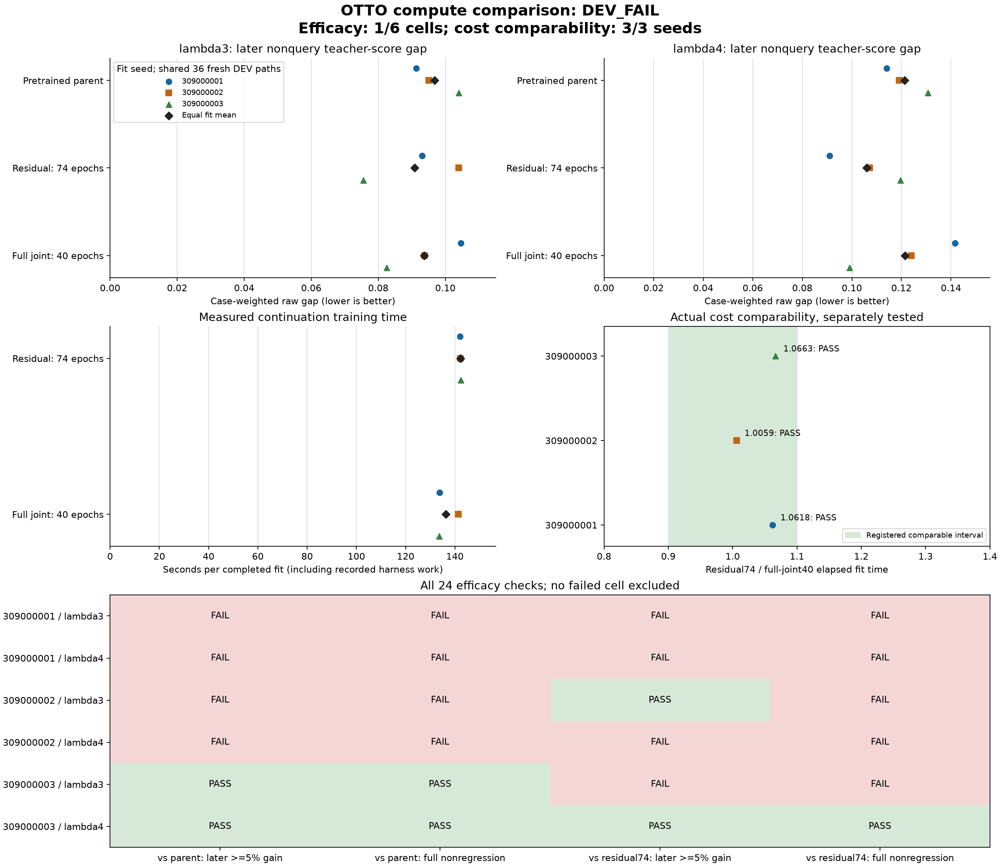

# Recurrent weight updates at comparable continuation cost

**Audited DEV_FAIL: 1/6 efficacy cells passed. Measured cost comparability passed
for all three fit seeds.** Updating the recurrent weights did not earn a
consistent advantage over training only the action readout on fresh development
paths. Both methods retain the same recurrent network at inference time.

The readout-only arm has lower mean later teacher-cost gaps by **3.01% / 12.82%**
relative to full joint, and **6.17% / 12.64%** relative to its pretrained parent,
in lambda3/lambda4. It wins four of six later-gap cells against joint training
and four of six against the parent, with three simultaneous wins. These means
support a stronger conventional baseline, not universal
superiority, autonomous control gains or a novel architecture.

[Every view and paired check](otto-readout-compute-results/README.md) ·
[Fixed protocol](otto-readout-compute-protocol.md) ·
[Checkpoints and complete evidence](https://github.com/kw2828/OpenJev/releases/tag/otto-readout-compute-v1).

## What was compared

The earlier equal-update ablation suggested that the action readout was a cheap
strong control. This separate study fixed **74 readout epochs versus 40 joint
epochs** from those historical timings, before collecting new paths. It did not
stop either fit when a live timer or score looked favorable. All three original
80-epoch parents and all 54 original TRAIN paths were retained.

The readout arm trains 116 parameters and the joint arm trains 6,112. Both use
the same model, ordinary Adam, supervised loss, learning rate, batch geometry
and first 40 epochs of episode orders. All six final fits closed before fresh
DEV decoding. There were 3,078 updates and 18,468 episode exposures.

DEV contains 36 newly collected complete paths, 14,338 states, six environment
cases per setting and three fixed collectors per case. All nine final/parent
views use the same paths. These are held out from training, but remain a
development screen, not the closed earlier study's confirmation or TEST panel.

## Mean scores and actual costs

Values below are equal means across all three fits of each fit's case-weighted
raw teacher-cost gap. Lower is better. Full covers every nonquery action; later
covers nonquery steps at or after step five. The fit seeds share the same
evaluation paths, so they are not independent evaluation cohorts.

| Arm | lambda3 full | lambda3 later | lambda4 full | lambda4 later |
| --- | ---: | ---: | ---: | ---: |
| Pretrained parent | 0.085830745 | 0.096793920 | 0.098638627 | 0.121238352 |
| Readout only, 74 epochs | 0.079307997 | 0.090825247 | 0.089889451 | 0.105909377 |
| Full joint, 40 epochs | 0.091204945 | 0.093645988 | 0.101804900 | 0.121489170 |

The readout's full-gap reductions relative to joint are **13.04% / 11.70%**.
Full joint's later mean improves slightly over its parent in lambda3 but is
slightly worse in lambda4; its full mean is worse than the parent in both.

| Fit seed | Readout74 seconds | Joint40 seconds | Readout / joint |
| --- | ---: | ---: | ---: |
| 309000001 | 142.122500 | 133.847100 | 1.061827 |
| 309000002 | 142.208501 | 141.369192 | 1.005937 |
| 309000003 | 142.439939 | 133.582818 | 1.066304 |

All three ratios satisfy the prospectively fixed **[0.90, 1.10]** interval.
Readout74 actually takes **0.59% to 6.63% more elapsed fit time**. This is
comparable cost under the registered definition, not a training speedup. Fit
time includes the recorded harness, construction, validation and serialization;
shared historical pretraining and data collection are excluded from these ratios.
No inference-speed improvement is established by changing which weights train.

The original process durations, including parent cleanup, were **608.144 seconds**
for fresh collection, **850.429 seconds** for training/evaluation, and **4.203
seconds** for the independent audit. Collection paid for all **14,338 teacher
scores**. No Astra, old TEST or reserved-confirmation calls occurred.

## The registered decision

Full joint had to reduce later gap by at least 5% against both the readout and
parent, with no full-gap regression against either, for every seed and setting.
Only **seed 309000003 / lambda4** passed all four checks. The complete six-cell
table and every failed check remain visible in the linked report.

Residual-only loses later gap to joint at seed 309000002 / lambda3 and seed
309000003 / lambda4. It also loses later gap to its parent for the first two
fit seeds in lambda3. Its lower means must not be presented as an all-seed win.
Neither arm chose the actions that generated the evaluation paths: these are
fixed-path score-imitation results, not autonomous gameplay or search utility.

Both arms retain GRU memory. This result concerns recurrent **weight updates**,
not whether memory is useful. It establishes no connectome effect, learned world
model, Bayesian advantage or new reinforcement-learning algorithm.

## Next controlled question

Test the [direct-solve readout control](otto-linear-probe-proposal.md) against
ordinary Adam before adding another architecture. Conditional on fixed features,
the real-arithmetic readout objective is a quadratic with at most 87 identifiable
contrast coefficients. Charge feature extraction and solving, then validate the
exported float32 head through ordinary inference. Cache geometry and numerical
rounding need their own qualification; no such fit or speedup is claimed here.

This is an unregistered proposal. Solver choices must use TRAIN-only evidence;
the now-exposed fresh panel cannot become untouched confirmation. Earlier
failures and their unused confirmation/TEST allocations remain closed.

## Closure and publication

Qualification passed 218 fabricated tests, lint, bounded capacity and the
original native-runtime metadata handoff. Both original scientific workers
closed successfully; the independent saved-output audit reconciled all nine
views, six fits, 3,078 updates and 18,468 exposures without model or optimizer
calls. Actual neural inference and training remain source-tested producer evidence.

The [closure](../output/otto-readout-compute-v1/closure-01.json) has SHA256
`8ba451fb8f8e46c60e08d453f2b7be5808b3010f6af65bf33d8563e2b30da518`.
Collection sources and protocol were published at commit `22b627b9`; the
completed collection and training registration at `495ad102`, before gradients.
The release retains checkpoints, predictions, journals, source hashes and all
checks. Its manifest identifies external native assets and pinned environments;
absolute registered paths mean it is not a portable, self-contained installation.
