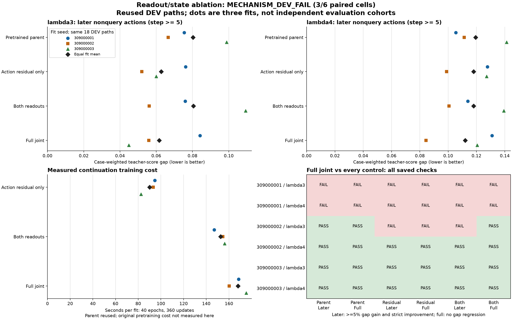

# OTTO readout/state ablation: mixed evidence for recurrent weight updates

**The registered diagnostic failed: 3/6 paired seed/setting cells passed.**
All nine training fits, twelve development evaluations and the independent
saved-output audit completed. The comparison uses previously exposed development
paths; it is not held-out evidence or autonomous control.

## What changed

Starting from the same three pretrained parents, continue training only the
action-residual readout (116 parameters), both readouts (232), or the whole GRU
and readouts (6,112). All arms receive the same 54 TRAIN paths, 40 epochs,
360 updates, loss and seed-specific episode order. Evaluate the three unchanged
parents alongside the nine final fits on the same 18 DEV paths.

| Model | Mean later gap, lambda3 | Mean later gap, lambda4 | Mean continuation seconds |
| --- | ---: | ---: | ---: |
| Unchanged parent | 0.080296 | 0.119326 | No new training |
| Action-residual readout only | 0.062747 | 0.117948 | 90.10 |
| Both readouts | 0.080491 | 0.117975 | 152.63 |
| Full joint | 0.061615 | 0.112005 | 168.05 |

Lower gap is better. Entries average the three fits' case-weighted raw
teacher-cost gaps on later nonquery actions. These are repeated fits on shared
paths, not three independent evaluation cohorts.

The action-only readout costs **46.38% less continuation time** than full joint.
Its mean gap is **1.84% higher at lambda3 and 5.31% higher at lambda4**. That makes
it a useful cheaper training baseline. It does not establish equivalent quality:
its gap is within 5% of full joint in only three of six paired cells.

Full joint beats all three controls by the required margin in seed 309000002 at
lambda4 and seed 309000003 in both settings. It fails the complete rule in the
other three cells. For seed 309000001, full joint is worse than the parent in
both settings. A mean improvement therefore does not establish a consistent
benefit from recurrent weight adaptation.

The two-readout arm can alter hidden trajectories through prediction-error
feedback even though GRU weights are frozen. The action-only arm's readout does
not enter that feedback path. Neither result makes recurrent memory unnecessary,
nor validates a learned world model, biological wiring or a new learning rule.

## Validation and limits

- 106 fabricated tests, lint and synthetic capacity passed before registration.
- All 3,240 returned optimizer updates and 19,440 episode exposures were audited.
- All frozen tensors, same-seed parent forks, training orders, observed query
  bytes, complete metrics and paired comparisons were checked independently.
- Original supervised train/evaluate time: **1,241.23 seconds**; audit: **4.31
  seconds**. Producer peak RSS: **316,735,488 bytes**. Per-arm timers exclude
  historical pretraining and collection. Fewer trainable weights do not imply
  a smaller or faster inference network.
- No new teacher, native simulator, Astra, TEST or confirmation calls occurred.
  The audit replayed saved metrics and checked provenance; it did not rerun
  gradients or model inference. Both earlier failed screens remain closed.

[All views, costs and checks](otto-readout-state-ablation-results/README.md) ·
[Registered protocol](otto-readout-state-ablation-protocol.md) ·
[Original closure](../output/otto-readout-state-ablation-v1/closure-01.json) ·
[Checkpoints and evidence](https://github.com/kw2828/OpenJev/releases/tag/otto-readout-state-ablation-v1).

## Next decision

Keep the action-only readout as a strong, inexpensive control. The mixed result
supports neither discarding recurrent updates nor moving directly to a new
local recurrent learning rule. The next useful comparison would match continuation compute between the
action-only readout and full joint, use separately registered fresh paths, and
retain every seed. This would test whether recurrent updates earn their extra
cost. Any later adaptive readout must also compete against the offline readout,
ordinary online SGD and the existing RLS reference, with equal observation access
and paid update cost.

[TTT, e-prop and DeltaNet research notes](otto-readout-learning-directions.md)
describe conditional mechanisms and controls. They are proposals, not execution
admission. A new generalization claim requires a separately registered fresh cohort.
