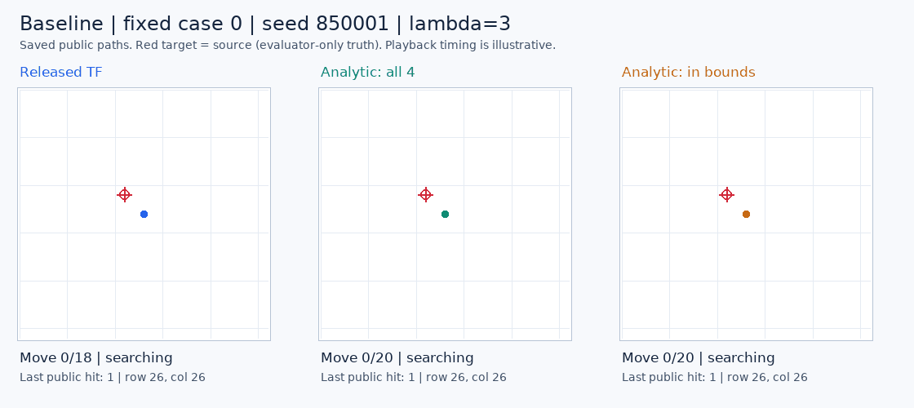
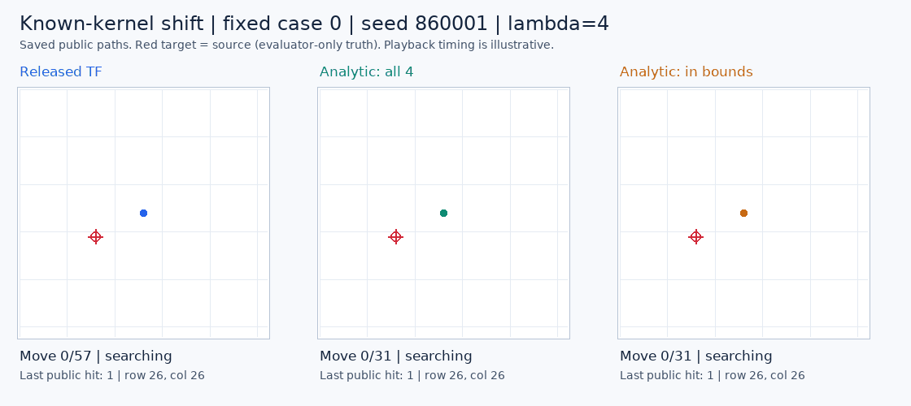

# Released OTTO policy: baseline gain, failure under sensing shift

**The original learned policy uses 7.29% fewer moves in the baseline, but 94.88% more under a known sensing-kernel shift. All three overall continuation rules fail.** This is a completed comparison of an existing pretrained model, not a new architecture or training result.

All **576 autonomous searches** finished under the frozen plan. The independent saved-output audit agrees on **717,193 checks**, including every public belief, recorded action selection, cost component, paired case and declared condition.

## Complete comparison

There are 96 paired cases per regime, with all three controllers starting from the same sampled source and initial public observation. Means below use the regime's fixed initial-hit mixture. Raw successes have a denominator of 96 per row. Unsuccessful searches contribute the complete **2,188-move horizon**.

| Regime | Controller | Raw found | Weighted success | Weighted capped moves | Controller seconds/episode |
| --- | --- | ---: | ---: | ---: | ---: |
| Baseline | Original released TensorFlow policy | 96/96 | 100.00% | 32.1011 | 1.072940 |
| Baseline | Analytic, all four actions | 96/96 | 100.00% | 34.6238 | 0.011050 |
| Baseline | Analytic, in-bounds actions | 96/96 | 100.00% | 34.6238 | 0.010897 |
| Known-kernel shift | Original released TensorFlow policy | 95/96 | 97.36% | 105.7751 | 3.466565 |
| Known-kernel shift | Analytic, all four actions | 96/96 | 100.00% | 54.2777 | 0.017957 |
| Known-kernel shift | Analytic, in-bounds actions | 96/96 | 100.00% | 54.2777 | 0.017768 |

The baseline learned policy improves weighted moves in **7/8 paired blocks**; the shifted policy improves in **3/8**. Both analytic variants have identical found/move outcomes on every paired case and make no blocked moves. Their measured costs differ slightly because each runs separately. These data do not establish a general equivalence between the two analytic action sets.

The sole censored search is the released policy on shifted seed **860074**, initial hit one. It takes 2,188 moves, including **1,928 blocked stays**, while each analytic control finds the source in 218 moves. The failure remains in all primary results. Its larger initial-hit weight explains why weighted success is 97.36%, while the raw fraction is 95/96.

## Predeclared decisions

| Rule | Baseline | Shift | Overall |
| --- | ---: | ---: | --- |
| Competent reference | 3/3 | 1/3 | **FAIL, 4/6** |
| Promising teacher candidate | 6/6 | 0/6 | **FAIL, 6/12** |
| Utility versus complete computation | 6/8 | 0/8 | **FAIL, 6/16** |

Competence requires at least 95% weighted success and no more than 105% of each analytic control's capped moves in both regimes. The teacher screen requires no success loss, at least 5% fewer moves and improvement in at least six of eight paired blocks against both controls in both regimes. The separate utility/computation rule also requires no greater complete controller cost. These are prospective engineering thresholds, not statistical significance tests.

The baseline result identifies a potentially useful behavior of the released model. The shift failure prevents admitting it as a robust teacher under this plan. No distillation benefit, learned-memory advantage, biological-wiring advantage or new-model claim follows. Earlier action-head and compact-memory failures remain unchanged.

## What the run measures

The released model has **13,390,849 parameters**, with 53,563,396 bytes of tensors. It uses the original TensorFlow implementation and original RLPolicy, eight-way symmetry averaging and all sixteen action/observation branches. The unqualified NumPy port is not used. Before this run, both analytic readouts matched the original heuristic exactly on all sixteen saved mechanical comparisons.

All three actors maintain their own exact posterior from public observations. The evaluator checks every reset and update against the native posterior without giving the actor the source, random seed or native state. All four directions are legal; a blocked direction stays in place and obtains an observation. The second analytic arm preserves the upstream heuristic's restriction to directions that change position.

Both regimes use a fixed 53x53 grid. Sensing length changes from three to four, and actors receive the applicable exact kernel. This is a **known-kernel shift with an unchanged value network**, not unknown sensor identification, the automatically resized upstream lambda-four setting, or proof that the released model's training distribution excludes these environments. The local seeds were new to the inspected OpenJev studies.

Complete controller time includes initialization, all choices and posterior updates, and the full model-specific setup allocation. Measured artifact serialization and journal I/O are excluded; raw instrumented intervals are also saved. The 2.5997 seconds of model setup are allocated across the 192 released-policy episodes, and the first cold forward remains in its episode. Model-forward time is a subset of choice time, never added twice. Shared imports, evaluator checks and environment work are separate.

The original model uses approximately **97x / 193x** the all-four analytic controller's weighted episode computation in this single rotated, instrumented CPU run. These are not deployment benchmarks, repeated latency estimates or comparisons with autoregressive text generation. Mutable belief arrays, immutable kernels/cached geometry, model tensors and process RSS are separately reported in the saved records.

## Saved failure diagnosis

An outcome-selected [saved-only diagnostic](../output/otto-released-reference-v1/diagnostic-01/summary.json) reconstructs all 2,624 updates of failed seed 860074 and its two controls. The released policy reaches corner `(52,0)` at step 260, then repeatedly chooses the same blocked direction through step 2,188. Both blocked directions tie for minimum recorded cost; the lowest-cost direction that would move remains **0.311-0.616 higher** throughout the stall. This is a persistent preference for staying, not a near tie with an escape direction. Blocked moves are legal stay-and-observe actions in this environment.

The posterior remains normalized, with at least **2,593 positive cells** throughout the released episode. Branch-mass floors first appear at step 728, after the stall has already begun. These observations do not support belief collapse or branch floors as the onset explanation for this particular failure. They do not identify why the learned value function assigns those costs.

Under the unchanged original weights, this case contributes **51.98967 moves** to the shift's **51.49747-move** net disadvantage; the other 95 cases together contribute -0.49220 moves. This describes concentration without removing the failure or renormalizing the cohort. Both analytic controls find the source at `(6,4)` in 218 moves. The diagnostic makes no intervention and cannot establish that a movement restriction would rescue the learned trajectory. [Receipt and exact inputs](../output/otto-released-reference-v1/diagnostic-01/receipt.json).

## Fixed-case replays

Both cases were selected in the protocol before execution. They illustrate trajectories, not aggregate effectiveness. All three controllers are retained, playback timing is illustrative, and the source marker is evaluator-only truth exposed to the viewer.

## Evidence and next step

The plan was committed and pushed as `d49053d` before the first autonomous call. Runtime closure remained unchanged: 71 source pins and 43 installed distributions. All **576 resets, 17,391 native steps and 7,021 actual neural forwards** returned; every final observation was incorporated, including the censored case. There were zero training updates or remote model calls. The worker took 285.11 seconds, the supervising process 285.41 seconds, and peak worker RSS was 759,939,072 bytes. Both processes exited and the process group was absent.

The independent reader reconstructs public posteriors, recorded neural branch masses and value-to-cost arithmetic, chosen actions, complete grouping, timing sums and all rules. It does not regenerate neural outputs, analytic scores or random draws, or independently measure runtime. Those remain authenticated producer evidence. The audit took 4.71 seconds with no model or simulator calls. Final engineering qualification passed 87 synthetic tests; earlier fixture, lint and test-path setup failures remain preserved.

The next useful control is a prospective comparison of the unchanged learned policy with a version restricted to directions that change position, alongside both analytic baselines. It would test the identified boundary behavior before attributing a gain to new memory or recurrence. Any repair, sensor-conditioned value model or distillation recipe still requires fresh cases and complete cost accounting. This study's failed rules cannot be reversed by inspecting or omitting the failure.

- [Frozen protocol](otto-released-reference-protocol.md) and [machine-readable plan](../output/otto-released-reference-v1/plan-01.json).
- [Independent complete aggregates, strata, blocks and paired cases](../output/otto-released-reference-v1/audit-01/summary.json), [audit receipt](../output/otto-released-reference-v1/audit-01/receipt.json), and [execution witness](../output/otto-released-reference-v1/execution-witness.json).
- [Run summary](../output/otto-released-reference-v1/run-01/summary.json), [worker receipt](../output/otto-released-reference-v1/run-01/receipt.json), and [supervisor terminal](../output/otto-released-reference-v1/run-process-01.terminal.json).
- [Complete raw execution archive](https://github.com/kw2828/OpenJev/releases/tag/otto-released-reference-v1), including all transitions, forwards, episodes and attempted/returned work. Extract at the repository root to restore the paths listed in the worker receipt.
- [Original integration qualification](otto-released-native-qualification-results.md), [analytic preflight](../output/otto-released-reference-v1/analytic-preflight-01/receipt.json), [independent reader](../scripts/audit_otto_released_reference.py), and [visualization receipt](../output/otto-released-reference-v1/figure-01/receipt.json).
