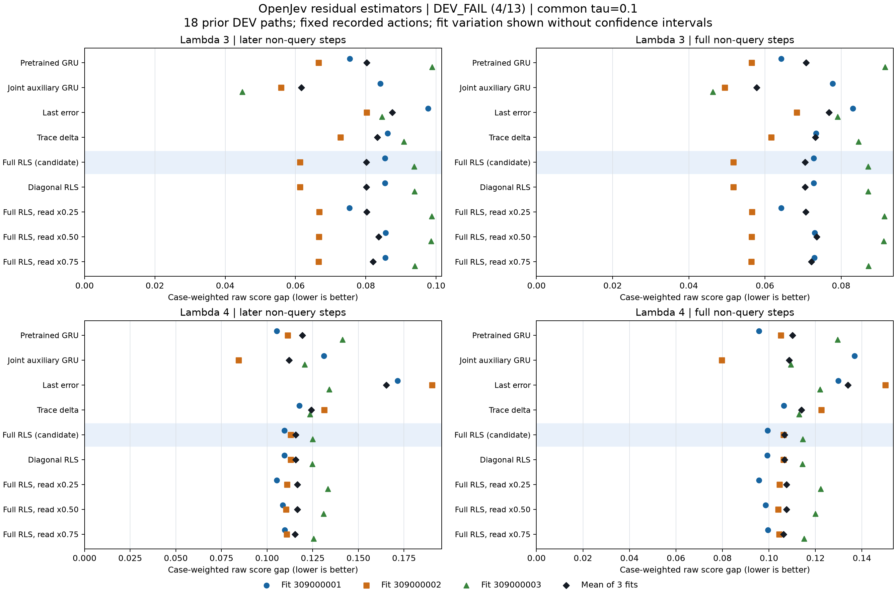

# OpenJev residual-estimator DEV reanalysis

**DEV_FAIL: 4/13 conditions passed.** The sole candidate is full RLS, selected at tau=0.1 by the registered worst-setting mean later-gap rule.

This separately registered reanalysis uses 18 previously collected development paths (4,816 retained rows), two settings and three fit seeds. The first screen remains closed after its technical failure. These are fixed-path score-imitation results, not independent held-out evidence or autonomous gameplay. No novelty, world-model, biological-learning, calibration or speedup claim follows from this screen. Neither prior confirmation nor the earlier study's TEST is opened. Confirmation execution is not admitted.

Lower raw score gap is better. Full covers all non-query steps; later covers non-query steps at step 5 or later (zero-based). Query period is four. Each point is one fit; diamonds average all three fits. These fits share the same paths and are not three independent environment samples. No confidence intervals are estimated.

## Every method and fit seed

All RLS methods use the same selected tau=0.1; ordinary controls have no tau. No control or best seed replaces the registered candidate.

| Method | Fit seed | Lambda 3 later | Lambda 3 full | Lambda 4 later | Lambda 4 full |
| --- | --- | --- | --- | --- | --- |
| pretrained | 309000001 | 0.0754422871 | 0.0642943963 | 0.105356751 | 0.0957248924 |
| pretrained | 309000002 | 0.0665799087 | 0.0564876525 | 0.111298087 | 0.105048203 |
| pretrained | 309000003 | 0.0988648198 | 0.0915056234 | 0.141324248 | 0.129506915 |
| joint_aux | 309000001 | 0.0840905512 | 0.077757574 | 0.131028309 | 0.136862761 |
| joint_aux | 309000002 | 0.0558552862 | 0.0494127397 | 0.0843956871 | 0.0797164838 |
| joint_aux | 309000003 | 0.0448989681 | 0.0463351968 | 0.12059105 | 0.109357236 |
| last_error | 309000001 | 0.0977282488 | 0.0830959766 | 0.171411326 | 0.129836343 |
| last_error | 309000002 | 0.080217961 | 0.0683291097 | 0.190314234 | 0.150051131 |
| last_error | 309000003 | 0.0845575697 | 0.0790947949 | 0.134054859 | 0.121939255 |
| trace_delta | 309000001 | 0.0861605496 | 0.0734067415 | 0.117652229 | 0.106433206 |
| trace_delta | 309000002 | 0.0727955564 | 0.0616520658 | 0.131239529 | 0.122565501 |
| trace_delta | 309000003 | 0.0908676647 | 0.0845782136 | 0.123459285 | 0.112935083 |
| rls_full | 309000001 | 0.0854725379 | 0.0728405148 | 0.109483997 | 0.0993765724 |
| rls_full | 309000002 | 0.0612416462 | 0.0517380466 | 0.112903491 | 0.106309678 |
| rls_full | 309000003 | 0.0937878527 | 0.087063954 | 0.124870946 | 0.114524272 |
| rls_diagonal | 309000001 | 0.085437257 | 0.0728052984 | 0.109406483 | 0.0992991994 |
| rls_diagonal | 309000002 | 0.0612375813 | 0.0517339891 | 0.112873265 | 0.106279506 |
| rls_diagonal | 309000003 | 0.093840157 | 0.0871161626 | 0.124747163 | 0.114411035 |
| rls_shrink_025 | 309000001 | 0.0753819306 | 0.0642341501 | 0.105282579 | 0.0956508554 |
| rls_shrink_025 | 309000002 | 0.0667547492 | 0.0566259874 | 0.110978174 | 0.104583335 |
| rls_shrink_025 | 309000003 | 0.09873225 | 0.0913732959 | 0.133381906 | 0.122304208 |
| rls_shrink_050 | 309000001 | 0.0856770305 | 0.0730446335 | 0.108553117 | 0.0985162167 |
| rls_shrink_050 | 309000002 | 0.0666327346 | 0.0565041959 | 0.110431092 | 0.10403787 |
| rls_shrink_050 | 309000003 | 0.0985672144 | 0.0912085621 | 0.130851359 | 0.119915589 |
| rls_shrink_075 | 309000001 | 0.0855826659 | 0.0729504415 | 0.109611445 | 0.0995031085 |
| rls_shrink_075 | 309000002 | 0.0665243211 | 0.0563959805 | 0.110789744 | 0.104360198 |
| rls_shrink_075 | 309000003 | 0.0939261518 | 0.0872020002 | 0.125472394 | 0.115072817 |

## Full-RLS selection grid

| Tau | Lambda 3 mean later | Lambda 4 mean later | Worst setting | Selected |
| --- | --- | --- | --- | --- |
| 0.01 | 0.080142451 | 0.118194458 | 0.118194458 |  |
| 0.1 | 0.0801673456 | 0.115752812 | 0.115752812 | yes |
| 1 | 0.0838229083 | 0.120914482 | 0.120914482 |  |
| 10 | 0.0873781814 | 0.141292994 | 0.141292994 |  |

| Tau | Fit seed | Lambda 3 later | Lambda 3 full | Lambda 4 later | Lambda 4 full |
| --- | --- | --- | --- | --- | --- |
| 0.01 | 309000001 | 0.0752582502 | 0.0641106958 | 0.105150078 | 0.0955185968 |
| 0.01 | 309000002 | 0.0666540657 | 0.056525488 | 0.110702613 | 0.104308277 |
| 0.01 | 309000003 | 0.0985150369 | 0.09115648 | 0.138730682 | 0.127066622 |
| 0.1 | 309000001 | 0.0854725379 | 0.0728405148 | 0.109483997 | 0.0993765724 |
| 0.1 | 309000002 | 0.0612416462 | 0.0517380466 | 0.112903491 | 0.106309678 |
| 0.1 | 309000003 | 0.0937878527 | 0.087063954 | 0.124870946 | 0.114524272 |
| 1 | 309000001 | 0.0948617906 | 0.0802723573 | 0.143781793 | 0.118479676 |
| 1 | 309000002 | 0.0746462979 | 0.0632188526 | 0.126815627 | 0.118378399 |
| 1 | 309000003 | 0.0819606363 | 0.0770422228 | 0.0921460249 | 0.0843435013 |
| 10 | 309000001 | 0.109815136 | 0.0932538468 | 0.18722919 | 0.143877542 |
| 10 | 309000002 | 0.0656187066 | 0.0557210262 | 0.127982588 | 0.118891714 |
| 10 | 309000003 | 0.0867007019 | 0.0811019391 | 0.108667203 | 0.0991977065 |

## Ordinary usefulness controls

All four registered controls are shown below. Bold values mark the lowest mean within each column; ties remain ties.

| Control | Lambda 3 later | Lambda 3 full | Lambda 4 later | Lambda 4 full |
| --- | --- | --- | --- | --- |
| pretrained | 0.0802956719 | 0.0707625574 | 0.119326362 | 0.110093337 |
| joint_aux | **0.0616149351** | **0.0578351702** | **0.112005015** | **0.108645494** |
| last_error | 0.0875012598 | 0.0768399604 | 0.16526014 | 0.133942243 |
| trace_delta | 0.0832745902 | 0.0732123403 | 0.124117014 | 0.11397793 |

## All 13 continuation conditions

| Condition | Saved result | Evidence |
| --- | --- | --- |
| technical_completion | PASS | Original producer and audit completed successfully. |
| lambda3:P4:supported_cases | PASS | Supported cases 3; required 2. |
| lambda3:P4:later_gap_10pct | FAIL | Candidate 0.0801673456; controls joint_aux=0.0616149351, last_error=0.0875012598, pretrained=0.0802956719, trace_delta=0.0832745902 |
| lambda3:P4:full_gap_nonregression | FAIL | Candidate 0.0705475051; controls joint_aux=0.0578351702, last_error=0.0768399604, pretrained=0.0707625574, trace_delta=0.0732123403 |
| lambda3:P4:seed_309000001_nonregression | FAIL | Candidate 0.0854725379; controls joint_aux=0.0840905512, last_error=0.0977282488, pretrained=0.0754422871, trace_delta=0.0861605496 |
| lambda3:P4:seed_309000002_nonregression | FAIL | Candidate 0.0612416462; controls joint_aux=0.0558552862, last_error=0.080217961, pretrained=0.0665799087, trace_delta=0.0727955564 |
| lambda3:P4:seed_309000003_nonregression | FAIL | Candidate 0.0937878527; controls joint_aux=0.0448989681, last_error=0.0845575697, pretrained=0.0988648198, trace_delta=0.0908676647 |
| lambda4:P4:supported_cases | PASS | Supported cases 3; required 2. |
| lambda4:P4:later_gap_10pct | FAIL | Candidate 0.115752812; controls joint_aux=0.112005015, last_error=0.16526014, pretrained=0.119326362, trace_delta=0.124117014 |
| lambda4:P4:full_gap_nonregression | PASS | Candidate 0.106736841; controls joint_aux=0.108645494, last_error=0.133942243, pretrained=0.110093337, trace_delta=0.11397793 |
| lambda4:P4:seed_309000001_nonregression | FAIL | Candidate 0.109483997; controls joint_aux=0.131028309, last_error=0.171411326, pretrained=0.105356751, trace_delta=0.117652229 |
| lambda4:P4:seed_309000002_nonregression | FAIL | Candidate 0.112903491; controls joint_aux=0.0843956871, last_error=0.190314234, pretrained=0.111298087, trace_delta=0.131239529 |
| lambda4:P4:seed_309000003_nonregression | FAIL | Candidate 0.124870946; controls joint_aux=0.12059105, last_error=0.134054859, pretrained=0.141324248, trace_delta=0.123459285 |

Later improvement requires at least 10% below the best ordinary control and strict improvement. Full-gap and each paired-fit later-gap checks require no regression against the best ordinary control. All 13 conditions must pass; displayed rounding does not change the saved decision.

## Separate mechanism comparisons

The diagonal covariance and weaker-read controls do not select tau or replace the full-RLS candidate. Weaker reads share the full posterior and writes; only the applied correction is scaled. The table uses the selected common tau and saved audited mean comparisons.

| Control | Setting | Full RLS later | Control later | Full RLS full | Control full |
| --- | --- | --- | --- | --- | --- |
| rls_diagonal@tau=0.1 | lambda3 | 0.0801673456 | 0.0801716651 | 0.0705475051 | 0.0705518167 |
| rls_diagonal@tau=0.1 | lambda4 | 0.115752812 | 0.115675637 | 0.106736841 | 0.106663247 |
| rls_shrink_025@tau=0.1 | lambda3 | 0.0801673456 | 0.0802896433 | 0.0705475051 | 0.0707444778 |
| rls_shrink_025@tau=0.1 | lambda4 | 0.115752812 | 0.116547553 | 0.106736841 | 0.107512799 |
| rls_shrink_050@tau=0.1 | lambda3 | 0.0801673456 | 0.0836256598 | 0.0705475051 | 0.0735857972 |
| rls_shrink_050@tau=0.1 | lambda4 | 0.115752812 | 0.116611856 | 0.106736841 | 0.107489892 |
| rls_shrink_075@tau=0.1 | lambda3 | 0.0801673456 | 0.0820110462 | 0.0705475051 | 0.0721828074 |
| rls_shrink_075@tau=0.1 | lambda4 | 0.115752812 | 0.115291194 | 0.106736841 | 0.106312041 |

| Tau | Full-vs-diagonal condition conjunction | Confirmed with usefulness |
| --- | --- | --- |
| 0.01 | FAIL | false |
| 0.1 | FAIL | false |
| 1 | FAIL | false |
| 10 | FAIL | false |

A DEV covariance contrast is a separate diagnostic, not a confirmation or an overall usefulness pass.

## Recorded execution cost

| Phase | Original supervisor seconds | Worker seconds | Peak RSS MiB | Array decodes | Models | Views |
| --- | --- | --- | --- | --- | --- | --- |
| Producer | 16.8835544 | 16.3910563 | 267.46875 | 85 | 6 | 72 |
| Independent saved-output audit | 9.86091729 | 9.78164054 | 135.65625 | 76 | 0 | 72 |

These are total instrumented process costs, including IO and checks, not matched algorithm latency benchmarks. The collector scans resource usage at every callback. Evaluation and audit check the deadline on each callback and poll RSS/output usage every 250 ms, with forced IO-boundary checks.

## Evidence

Closure: [dev-closure-01.json](<../../output/otto-residual-reanalysis-v1/dev-closure-01.json>). Saved audited reports: [audit.json in complete evidence archive](https://github.com/kw2828/OpenJev/releases/tag/otto-residual-reanalysis-v1).
Audit evidence: [dev-audit-plan-01.json](<../../output/otto-residual-reanalysis-v1/dev-audit-plan-01.json>), [receipt.json](<../../output/otto-residual-reanalysis-v1/dev-audit-01/receipt.json>), [dev-audit-native-01.terminal.json](<../../output/otto-residual-reanalysis-v1/dev-audit-native-01.terminal.json>).
Producer evidence: [dev-evaluation-plan-01.json](<../../output/otto-residual-reanalysis-v1/dev-evaluation-plan-01.json>), [receipt.json](<../../output/otto-residual-reanalysis-v1/dev-evaluation-01/receipt.json>), [dev-evaluation-native-01.terminal.json](<../../output/otto-residual-reanalysis-v1/dev-evaluation-native-01.terminal.json>).
Protocol: [otto-residual-reanalysis-protocol.md](<../otto-residual-reanalysis-protocol.md>).
The renderer verifies the closure, saved report and metadata hashes, source pins, and original process joins. Numerical payload validation is inherited from the completed audit; this publication step performs no array/checkpoint decode, model call, native simulation, teacher call or gate re-evaluation.
