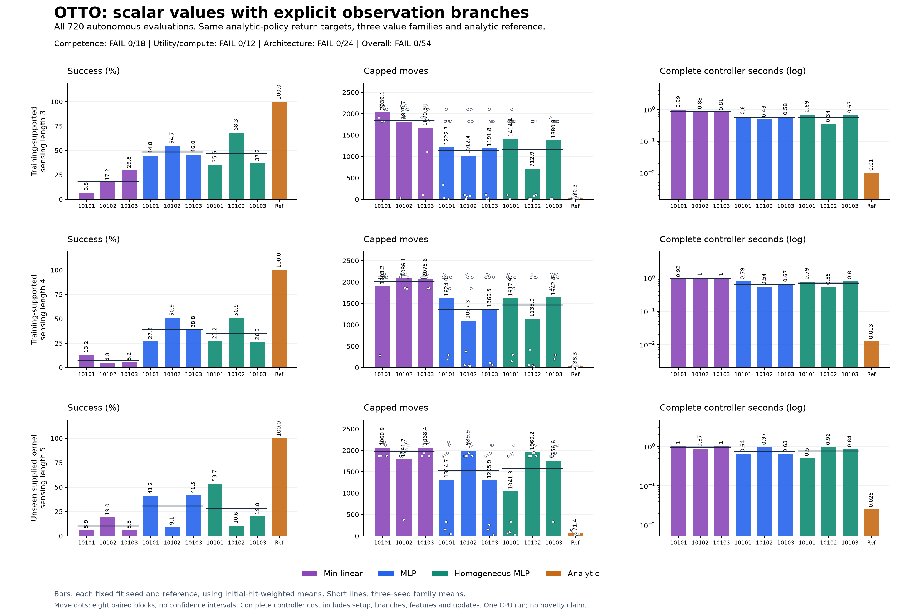

# Explicit branch values: the matched pilot does not qualify

**The completed pilot fails the frozen continuation rule: 0 of 54 conditions pass.** All nine fixed models completed training and all 720 autonomous evaluations finished. The complete cohort retains 332 censored searches, including 332 learned-policy searches.

This experiment estimates the analytic teacher policy's remaining search cost, not optimal value. It does not establish a new architecture, compact memory, recurrent-world-model, biological-wiring or general robotic advantage. Even a passing pilot admits stronger testing only. All earlier failures and decisions remain unchanged.

[Frozen protocol](otto-return-value-protocol.md) · [Plan](../output/otto-return-value-v1/plan-01.json) · [Independent summary](../output/otto-return-value-v1/audit-01/summary.json) · [Worker receipt](../output/otto-return-value-v1/run-01/receipt.json)

## Matched scalar training

All families use the same 192 naturally completed teacher TRAIN episodes and all **5,589 pre-action prefixes**. The 48 separate teacher VALID episodes provide **1,109 prefixes** for descriptive validation. Prior DAgger and EVAL trajectories are excluded from targets and fitting. The target is `(T - t) / 64`; training uses uniform row MSE, with no duration-based sampling or episode weighting. Correlated prefixes are not independent episodes.

The common TRAIN-only baseline is `c0=0.446037978`. Each model takes 11,028 features: the raw centered 105x105 public belief and three mass-scaled position/sensor context values. The complete 53x53 posterior remains the state. min8 has 88,224 trainable parameters; the ordinary width-eight ReLU control has 88,241; the bias-free homogeneous control has 88,232. Predictions are signed, with no clipping or fallback.

Fitting seeds are 10101, 10102 and 10103. Each of nine models trains for 80 epochs with Adam, learning rate 0.001, batch size 128 and gradient norm cap 5, for 31,680 optimizer updates. Families share first-layer initialization and same-seed orders. The fixed epoch-80 checkpoint is used; validation does not select a checkpoint. All 144 predetermined export-parity cases passed the scalar/branch/cost tolerance and exact eligible-action requirement.

Deployment upcasts the stored float32 parameters to float64, constructs all sixteen action/hit branches with the original 1e-10 mass floor, and evaluates physical values as 64 times normalized predictions. All four raw costs are computed before selecting an in-bounds action. The fused homogeneous shortcut is not used.

## Complete autonomous results

Each setting has 24 fresh cases, eight per initial-hit stratum, with all ten arms on every case and rotated arm order. Sensing lengths three and four are training-supported; length five is an unseen supplied kernel on the same grid. Sources and channel-indexed random uniforms are paired. Every failed search contributes the full 2,188-move horizon.

Success, capped moves and complete controller time average within each hit stratum before applying the saved native mixture. Family means average all three fitting seeds. Raw found counts are separate and need not match weighted success.

| Setting | Family/control | Weighted success | Capped moves | Controller ms/search |
| --- | --- | ---: | ---: | ---: |
| lambda3 | analytic_inbounds | 100.00% | 30.28 | 10.216 |
| lambda3 | min8 | 17.97% | 1841.70 | 891.888 |
| lambda3 | mlp8 | 48.51% | 1142.30 | 556.573 |
| lambda3 | homogeneous8 | 47.02% | 1169.20 | 568.973 |
| lambda4 | analytic_inbounds | 100.00% | 38.29 | 12.705 |
| lambda4 | min8 | 7.70% | 2021.62 | 978.125 |
| lambda4 | mlp8 | 38.95% | 1362.58 | 665.308 |
| lambda4 | homogeneous8 | 34.78% | 1465.11 | 709.947 |
| lambda5 | analytic_inbounds | 100.00% | 71.45 | 25.052 |
| lambda5 | min8 | 10.13% | 1973.67 | 959.314 |
| lambda5 | mlp8 | 30.61% | 1533.51 | 748.411 |
| lambda5 | homogeneous8 | 28.01% | 1586.03 | 767.364 |

### Every fit and control

| Setting | Arm | Raw found | Weighted success | Capped moves | Controller ms/search |
| --- | --- | ---: | ---: | ---: | ---: |
| lambda3 | analytic_inbounds | 24/24 | 100.00% | 30.28 | 10.216 |
| lambda3 | min8@10101 | 7/24 | 6.84% | 2039.14 | 987.129 |
| lambda3 | mlp8@10101 | 17/24 | 44.84% | 1222.70 | 596.264 |
| lambda3 | homogeneous8@10101 | 16/24 | 35.56% | 1414.42 | 689.921 |
| lambda3 | min8@10102 | 8/24 | 17.23% | 1815.72 | 879.772 |
| lambda3 | mlp8@10102 | 17/24 | 54.73% | 1012.38 | 491.751 |
| lambda3 | homogeneous8@10102 | 20/24 | 68.34% | 712.86 | 344.528 |
| lambda3 | min8@10103 | 9/24 | 29.83% | 1670.26 | 808.763 |
| lambda3 | mlp8@10103 | 17/24 | 45.95% | 1191.84 | 581.704 |
| lambda3 | homogeneous8@10103 | 17/24 | 37.17% | 1380.32 | 672.471 |
| lambda4 | analytic_inbounds | 24/24 | 100.00% | 38.29 | 12.705 |
| lambda4 | min8@10101 | 7/24 | 13.16% | 1903.17 | 923.766 |
| lambda4 | mlp8@10101 | 11/24 | 27.17% | 1623.96 | 790.080 |
| lambda4 | homogeneous8@10101 | 11/24 | 27.17% | 1617.85 | 785.512 |
| lambda4 | min8@10102 | 6/24 | 4.76% | 2086.08 | 1006.735 |
| lambda4 | mlp8@10102 | 14/24 | 50.87% | 1097.26 | 538.235 |
| lambda4 | homogeneous8@10102 | 14/24 | 50.87% | 1135.05 | 545.525 |
| lambda4 | min8@10103 | 7/24 | 5.19% | 2075.61 | 1003.873 |
| lambda4 | mlp8@10103 | 12/24 | 38.80% | 1366.50 | 667.608 |
| lambda4 | homogeneous8@10103 | 9/24 | 26.30% | 1642.42 | 798.804 |
| lambda5 | analytic_inbounds | 24/24 | 100.00% | 71.45 | 25.052 |
| lambda5 | min8@10101 | 7/24 | 5.87% | 2060.92 | 1004.365 |
| lambda5 | mlp8@10101 | 13/24 | 41.16% | 1314.73 | 642.247 |
| lambda5 | homogeneous8@10101 | 16/24 | 53.66% | 1041.34 | 501.976 |
| lambda5 | min8@10102 | 9/24 | 19.03% | 1791.71 | 869.773 |
| lambda5 | mlp8@10102 | 10/24 | 9.14% | 1989.94 | 972.845 |
| lambda5 | homogeneous8@10102 | 11/24 | 10.58% | 1960.20 | 960.693 |
| lambda5 | min8@10103 | 6/24 | 5.48% | 2068.38 | 1003.802 |
| lambda5 | mlp8@10103 | 14/24 | 41.55% | 1295.86 | 630.141 |
| lambda5 | homogeneous8@10103 | 11/24 | 19.81% | 1756.56 | 839.425 |

All initial-hit strata, eight paired blocks per setting and all 720 paired cases are retained in the [independent summary](../output/otto-return-value-v1/audit-01/summary.json). Block dots are descriptive, not confidence intervals.

## Final fit diagnostics

These independently reconstructed final predictions estimate the teacher-return target. They are not autonomous success measures or calibrated probabilities. MSE is in squared normalized units, with returns divided by 64. Negative predictions are retained. Intermediate ten-epoch curves remain execution evidence.

| Fixed final fit | TRAIN MSE | VALID MSE | TRAIN negative | VALID negative | Checkpoint |
| --- | ---: | ---: | ---: | ---: | --- |
| min8@10101 | 0.0933782 | 0.0681636 | 14/5589 | 4/1109 | [NPZ](../output/otto-return-value-v1/run-01/final-min8-10101.npz) |
| mlp8@10101 | 0.0998751 | 0.0786159 | 7/5589 | 1/1109 | [NPZ](../output/otto-return-value-v1/run-01/final-mlp8-10101.npz) |
| homogeneous8@10101 | 0.0997941 | 0.0785648 | 4/5589 | 0/1109 | [NPZ](../output/otto-return-value-v1/run-01/final-homogeneous8-10101.npz) |
| min8@10102 | 0.09419 | 0.067672 | 18/5589 | 6/1109 | [NPZ](../output/otto-return-value-v1/run-01/final-min8-10102.npz) |
| mlp8@10102 | 0.100311 | 0.0814426 | 3/5589 | 0/1109 | [NPZ](../output/otto-return-value-v1/run-01/final-mlp8-10102.npz) |
| homogeneous8@10102 | 0.100255 | 0.0805376 | 3/5589 | 0/1109 | [NPZ](../output/otto-return-value-v1/run-01/final-homogeneous8-10102.npz) |
| min8@10103 | 0.0947114 | 0.068217 | 17/5589 | 4/1109 | [NPZ](../output/otto-return-value-v1/run-01/final-min8-10103.npz) |
| mlp8@10103 | 0.0999836 | 0.0790031 | 5/5589 | 1/1109 | [NPZ](../output/otto-return-value-v1/run-01/final-mlp8-10103.npz) |
| homogeneous8@10103 | 0.100066 | 0.0785425 | 3/5589 | 0/1109 | [NPZ](../output/otto-return-value-v1/run-01/final-homogeneous8-10103.npz) |

All min8 plane-usage counts and saved final prediction diagnostics remain in the independent summary; no plane or fit was selected or replaced.

## Failure and spatial-repetition description

The following are raw episode counts across three fitting seeds, not mixture-weighted success rates. A complete alternating tail requires 256 pre-action positions and equality at all 254 lag-two comparisons. Short tails are not counted as complete alternating tails. Position repetition does not establish repeated belief state, cause, or the efficacy of an anti-reversal intervention.

| Family/control | Censored searches | Complete alternating tails among censored searches | Episodes with a zero-mass pre-action belief |
| --- | ---: | ---: | ---: |
| min8 | 150/216 | 96/150 | 0/216 |
| mlp8 | 91/216 | 58/91 | 0/216 |
| homogeneous8 | 91/216 | 59/91 | 0/216 |
| analytic_inbounds | 0/72 | Not applicable (no censored searches) | 0/72 |

Zero-mass counts here concern pre-action decision states only. The auditor separately verifies every final found/censored update; this table makes no exact posterior-hash repetition claim.

## Complete computation and execution

Controller time includes initialization, explicit branch construction and copies, context features, scalar readout, cost reduction/masking, all public updates and actual inference setup. Each head load is allocated over 72 episodes; shared model/branch module setup is allocated over 648 learned episodes. The inherited actor includes its allocated but unused analytic distance table. Transient branch arrays are separate from retained belief and weight storage. Only measured nested artifact I/O is excluded. Simulator, preparation and fitting time are reported separately. One rotated CPU run does not establish repeated deployment latency.

| Recorded phase/resource | Value |
| --- | ---: |
| fitting and parity seconds | 65.996 s |
| saved teacher preparation seconds | 4.419 s |
| Common setup | 1.660574 s |
| Model/branch module setup, already allocated in controller cost | 0.002284 s |
| Original worker elapsed | 1978.603 s |
| Original parent elapsed, enclosing the worker | 1979.920 s |
| Original worker peak RSS | 1,233,698,816 bytes |
| Original native resets / steps | 731 / 742,609 |
| Independent saved audit elapsed | 349.586 s |
| Independent saved audit peak RSS | 851,574,784 bytes |

The parent and worker intervals overlap and are not added. Audit/figure/publication time is separate from the scientific worker. The original worker limits were 5,400 suspend-inclusive seconds, 8 GiB RSS and 6 GiB output; the independent audit limits were 1,800 seconds, 4 GiB RSS and 128 MiB output.

The independent auditor agrees across **31,285,560 comparisons**, with maximum summary scalar difference `0` and maximum prediction difference `2.13162820728e-14`. It performed **741,077 local saved-checkpoint readouts** covering **11,907,722 network rows**. Those readouts are included in the audit computation counts. No simulator, training or remote-model call was made by the audit.

Public filtering, all-prefix targets/baseline, final predictions, explicit branch costs/actions, recorded work and aggregate conditions were independently reconstructed. Original optimizer trajectories, native random execution, teacher behavior, Torch parity outputs and timing truth remain authenticated execution evidence.

[Audit receipt](../output/otto-return-value-v1/audit-01/receipt.json) · [Parent terminal](../output/otto-return-value-v1/run-process-01.terminal.json) · [Complete fit records](../output/otto-return-value-v1/run-01/fits.jsonl)

## Fixed illustrative replays and restoration

The three clips show case zero in each setting, with all ten arms. They replay saved trajectories; playback timing is illustrative.

[Length three, seed 11100001](../output/otto-return-value-v1/figure-01/replay-lambda3-case0.gif) · [Length four, seed 11200001](../output/otto-return-value-v1/figure-01/replay-lambda4-case0.gif) · [Length five, seed 11300001](../output/otto-return-value-v1/figure-01/replay-lambda5-case0.gif)

Download and verify the full run using the [release archive](https://github.com/kw2828/OpenJev/releases/tag/otto-return-value-v1), [archive manifest](../output/otto-return-value-v1/release-01/manifest.json) and [restoration instructions](../output/otto-return-value-v1/release-01/RESTORE.md).

## Decision boundary

The prospective continuation rule is not met. Descriptive improvements cannot replace failed conditions or admit architectural escalation.
The comparison concerns three matched full-belief value approximators trained on analytic-policy returns. It does not isolate a biological mechanism, prove optimal control, or establish that compact recurrence would help.

## All frozen conditions

All 54 conditions are required. Values below are rounded for display; decisions retain the frozen full-precision comparisons.

| Rule | Passed | Decision |
| --- | ---: | --- |
| Competence | 0/18 | FAIL |
| Utility/computation | 0/12 | FAIL |
| Architecture | 0/24 | FAIL |

| Condition | Value | Required relation | Threshold | Result |
| --- | ---: | :---: | ---: | :---: |
| competence.lambda3.10101.success | 6.84% | >= | 95.00% | Fail |
| competence.lambda3.10101.moves | 2039.136 | <= | 31.789 | Fail |
| competence.lambda3.10102.success | 17.23% | >= | 95.00% | Fail |
| competence.lambda3.10102.moves | 1815.720 | <= | 31.789 | Fail |
| competence.lambda3.10103.success | 29.83% | >= | 95.00% | Fail |
| competence.lambda3.10103.moves | 1670.256 | <= | 31.789 | Fail |
| competence.lambda4.10101.success | 13.16% | >= | 95.00% | Fail |
| competence.lambda4.10101.moves | 1903.168 | <= | 40.201 | Fail |
| competence.lambda4.10102.success | 4.76% | >= | 95.00% | Fail |
| competence.lambda4.10102.moves | 2086.078 | <= | 40.201 | Fail |
| competence.lambda4.10103.success | 5.19% | >= | 95.00% | Fail |
| competence.lambda4.10103.moves | 2075.608 | <= | 40.201 | Fail |
| competence.lambda5.10101.success | 5.87% | >= | 95.00% | Fail |
| competence.lambda5.10101.moves | 2060.916 | <= | 75.018 | Fail |
| competence.lambda5.10102.success | 19.03% | >= | 95.00% | Fail |
| competence.lambda5.10102.moves | 1791.708 | <= | 75.018 | Fail |
| competence.lambda5.10103.success | 5.48% | >= | 95.00% | Fail |
| competence.lambda5.10103.moves | 2068.379 | <= | 75.018 | Fail |
| utility_compute.lambda3.success | 17.97% | >= | 100.00% | Fail |
| utility_compute.lambda3.moves | 1841.704 | <= | 31.789 | Fail |
| utility_compute.lambda3.cost80 | 0.891888 s | <= | 0.008173 s | Fail |
| utility_compute.lambda3.every_cost | 0.987129 s | < | 0.010216 s | Fail |
| utility_compute.lambda4.success | 7.70% | >= | 100.00% | Fail |
| utility_compute.lambda4.moves | 2021.618 | <= | 40.201 | Fail |
| utility_compute.lambda4.cost80 | 0.978125 s | <= | 0.010164 s | Fail |
| utility_compute.lambda4.every_cost | 1.006735 s | < | 0.012705 s | Fail |
| utility_compute.lambda5.success | 10.13% | >= | 100.00% | Fail |
| utility_compute.lambda5.moves | 1973.668 | <= | 75.018 | Fail |
| utility_compute.lambda5.cost80 | 0.959314 s | <= | 0.020041 s | Fail |
| utility_compute.lambda5.every_cost | 1.004365 s | < | 0.025052 s | Fail |
| architecture.lambda3.mlp8.success | 17.97% | >= | 48.51% | Fail |
| architecture.lambda3.mlp8.moves | 1841.704 | <= | 1085.189 | Fail |
| architecture.lambda3.mlp8.positive_blocks | 1 | >= | 6 | Fail |
| architecture.lambda3.mlp8.cost | 0.891888 s | <= | 0.556573 s | Fail |
| architecture.lambda3.homogeneous8.success | 17.97% | >= | 47.02% | Fail |
| architecture.lambda3.homogeneous8.moves | 1841.704 | <= | 1110.738 | Fail |
| architecture.lambda3.homogeneous8.positive_blocks | 0 | >= | 6 | Fail |
| architecture.lambda3.homogeneous8.cost | 0.891888 s | <= | 0.568973 s | Fail |
| architecture.lambda4.mlp8.success | 7.70% | >= | 38.95% | Fail |
| architecture.lambda4.mlp8.moves | 2021.618 | <= | 1294.446 | Fail |
| architecture.lambda4.mlp8.positive_blocks | 3 | >= | 6 | Fail |
| architecture.lambda4.mlp8.cost | 0.978125 s | <= | 0.665308 s | Fail |
| architecture.lambda4.homogeneous8.success | 7.70% | >= | 34.78% | Fail |
| architecture.lambda4.homogeneous8.moves | 2021.618 | <= | 1391.850 | Fail |
| architecture.lambda4.homogeneous8.positive_blocks | 4 | >= | 6 | Fail |
| architecture.lambda4.homogeneous8.cost | 0.978125 s | <= | 0.709947 s | Fail |
| architecture.lambda5.mlp8.success | 10.13% | >= | 30.61% | Fail |
| architecture.lambda5.mlp8.moves | 1973.668 | <= | 1456.833 | Fail |
| architecture.lambda5.mlp8.positive_blocks | 2 | >= | 6 | Fail |
| architecture.lambda5.mlp8.cost | 0.959314 s | <= | 0.748411 s | Fail |
| architecture.lambda5.homogeneous8.success | 10.13% | >= | 28.01% | Fail |
| architecture.lambda5.homogeneous8.moves | 1973.668 | <= | 1506.731 | Fail |
| architecture.lambda5.homogeneous8.positive_blocks | 1 | >= | 6 | Fail |
| architecture.lambda5.homogeneous8.cost | 0.959314 s | <= | 0.767364 s | Fail |
