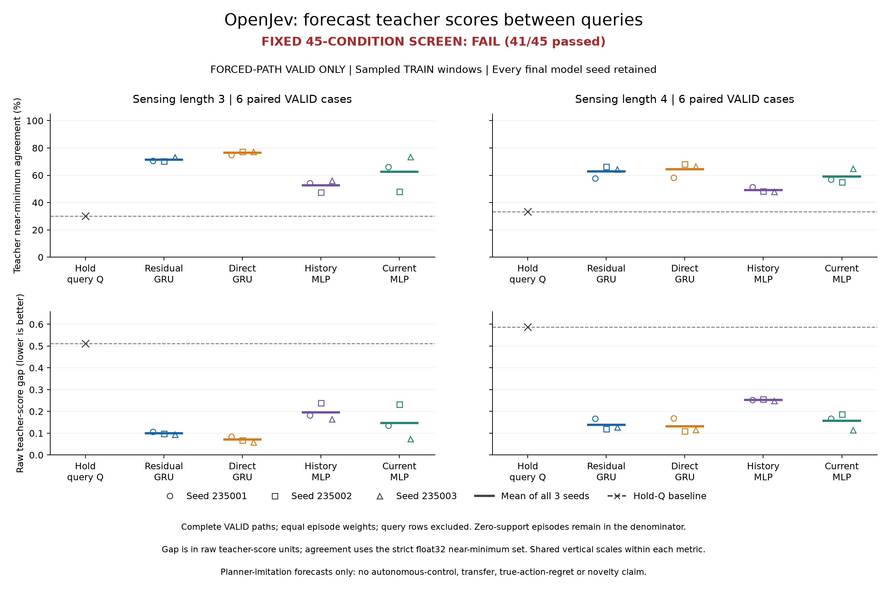

# Sampled TRAIN annotations and complete VALID score forecasts

**FAIL, 41/45 required conditions passed.** Collection, all twelve fits and the
independent saved-output audit completed. The residual-GRU candidate forecasts
teacher choices substantially better than holding the last query scores, and
passes every comparison with history MLP. It fails all four required comparisons
with ordinary direct GRU: direct GRU has higher three-seed mean agreement and
lower mean score gap in both settings. This does not establish an advantage for
the candidate's recursive score-feedback mechanism, and it does not authorize
its autonomous promotion.

The experiment completed 90 paths and 35,310 moves, then fitted all twelve
models with 10,560 optimizer updates. These are **forced-path forecasts**, not
learned autonomous search results. The original collection, training and audit
supervisors all exited successfully within their frozen limits.

The [complete metric CSV](../output/otto-sampled-forecast-v1/figure-01/forecast-metrics.csv)
retains every fit, setting, query age and collector; companion
[family means](../output/otto-sampled-forecast-v1/figure-01/family-means.csv),
[all 45 conditions](../output/otto-sampled-forecast-v1/figure-01/conditions.csv)
and [fit records](../output/otto-sampled-forecast-v1/figure-01/fits.csv) retain the
unrounded values. [Public evidence](https://github.com/kw2828/OpenJev/releases/tag/otto-sampled-forecast-v1)
contains the full phase artifacts. Strict replay also requires the inherited
teacher weights, runtime and inputs bound by the plans.

## Fixed design and weighting

The [sampled-annotation protocol](otto-sampled-forecast-protocol.md) retained the
[original mechanism and 45 conditions](otto-score-forecast-protocol.md). The fresh
cohort comprised 54 TRAIN paths from 18 originating cases and 36 VALID paths
from **12 originating cases**, with analytic, always-neural and period-four-held-Q
paths per case. Each setting has six independent VALID cases and 18 correlated
controller paths. Sensing lengths 3 and 4 both occur in TRAIN and VALID, so this
is not an unseen-domain transfer test.

At each period-four query boundary the predictor receives the exact four raw
teacher costs and resets its hidden state. It forecasts the next three rows from
public features and its own predictions; skipped teacher scores are targets only.
The candidate and direct GRU each have 5,862 parameters and paired initialization.
History MLP has 5,895 parameters and the same causal feature history; current MLP
has 5,826 parameters and query/current features. All output heads initially
reproduce hold-Q. All twelve final checkpoints were retained, with fixed seeds
235001, 235002 and 235003 and no checkpoint or seed selection.

After each complete TRAIN path of length T, selection drew k=min(8,W) of its
W=ceil(T/4) disjoint windows without replacement, using PCG64 seed 23600001 plus
its episode index. Short and query-only tails stayed in the population. Public
replay supplied missing selected scores after selection; annotations did not
change trajectories or held-score memory. Incidental deployed scores outside
the selected windows were excluded from fitting.

There were 6,422 possible TRAIN windows across 25,612 rows. The fixed sample
contained 327 windows, 1,247 rows and 920 nonquery targets, including nine
query-only windows. Full episodes contained 19,190 nonquery rows; two episodes
had no nonquery support. Each selected nonquery row received `(W/k)/(54*M)`,
where M=T-W, with zero query/padding weight. All 54 episodes remained in the
denominator. The realized weight mass was 0.9638149156 and was not renormalized.
All twelve fits used exactly this sample.

Training used float32 legal-action-centered MSE in score units divided by 64,
80 epochs, Adam at 0.003, batch size 32 windows and clipping at norm 5. Each batch
used selected-window count divided by actual batch size; query-only batches
retained ordinary zero-gradient Adam steps. All models closed before the learner
decoded complete VALID arrays. The sampling correction preserves the original
finite-population objective in expectation at fixed parameters, not an unbiased
risk estimate for a model selected by training.

## All model outcomes

Agreement counts membership in the teacher's eligible near-minimum action set
under the original float32 strict tie rule. Raw gap is the teacher's cost for the
predicted action minus its minimum eligible cost, evaluated in float64 from saved
float32 scores. Higher agreement and lower gap are better. These are equal-episode
means, not row-pooled accuracy. Family rows below average all three fixed fit seeds;
MSE is centered over legal actions in **raw score units**.

| Family | Parameters | λ3 agreement | λ3 raw gap | λ3 MSE | λ4 agreement | λ4 raw gap | λ4 MSE |
|---|---:|---:|---:|---:|---:|---:|---:|
| Hold | 0 | 30.24% | 0.511574 | 0.229191 | 33.27% | 0.587326 | 0.360496 |
| Residual GRU | 5,862 | 71.53% | 0.099834 | 0.076324 | 62.74% | 0.138505 | 0.117676 |
| Direct GRU | 5,862 | 76.54% | 0.071218 | 0.068534 | 64.36% | 0.131886 | 0.114686 |
| History MLP | 5,895 | 52.62% | 0.195678 | 0.122418 | 49.23% | 0.252507 | 0.193193 |
| Current MLP | 5,826 | 62.66% | 0.147010 | 0.098154 | 59.01% | 0.156508 | 0.141835 |

Candidate mean gaps were 80.48% and 76.42% below hold in λ3 and λ4. Ordinary
direct GRU nevertheless had better mean agreement and lower mean gap in both.
Its agreement was higher in all six paired seed/setting cells and its gap was
lower in five of six; this is not universal per-fit gap dominance. The frozen
candidate-versus-direct requirement therefore fails on both metrics in both
settings. No best-seed or winning-control substitution is made.

| Model / seed | λ3 agreement | λ3 raw gap | λ4 agreement | λ4 raw gap |
|---|---:|---:|---:|---:|
| Hold | 30.24% | 0.511574 | 33.27% | 0.587326 |
| Residual GRU / 235001 | 70.75% | 0.106931 | 57.64% | 0.167560 |
| Residual GRU / 235002 | 70.43% | 0.098566 | 66.23% | 0.119395 |
| Residual GRU / 235003 | 73.40% | 0.094006 | 64.37% | 0.128561 |
| Direct GRU / 235001 | 74.83% | 0.085286 | 58.37% | 0.168588 |
| Direct GRU / 235002 | 77.40% | 0.068259 | 68.18% | 0.109765 |
| Direct GRU / 235003 | 77.40% | 0.060109 | 66.53% | 0.117306 |
| History MLP / 235001 | 54.27% | 0.182105 | 51.32% | 0.252140 |
| History MLP / 235002 | 47.43% | 0.239605 | 48.39% | 0.255565 |
| History MLP / 235003 | 56.17% | 0.165323 | 47.99% | 0.249818 |
| Current MLP / 235001 | 66.09% | 0.134638 | 56.94% | 0.167624 |
| Current MLP / 235002 | 48.19% | 0.232042 | 55.10% | 0.186879 |
| Current MLP / 235003 | 73.70% | 0.074349 | 65.01% | 0.115021 |

## Coverage and support

All 90 paths completed their declared horizon or discovery, with 75 found and
15 censored. Those are outcomes of the fixed collection controllers, not the
learned forecast models. No path was replaced. VALID includes all 9,698 rows,
2,441 query windows and 7,257 nonquery forecast rows; 19 windows have only a query
row. Every VALID episode has some nonquery support.

| Setting | Forecast age | Nonquery rows | Supported paths / denominator | Effective weight mass | Distinct cases |
|---|---:|---:|---:|---:|---:|
| λ3 | 1 | 666 | 18/18 | 1.000000 | 6 |
| λ3 | 2 | 665 | 18/18 | 1.000000 | 6 |
| λ3 | 3 | 661 | 17/18 | 0.944444 | 6 |
| λ4 | 1 | 1,756 | 18/18 | 1.000000 | 6 |
| λ4 | 2 | 1,755 | 18/18 | 1.000000 | 6 |
| λ4 | 3 | 1,754 | 18/18 | 1.000000 | 6 |

The λ3 age-three cell retains the zero contribution of
`valid:lambda3:23300006:period4_hold`; it is not renormalized to 17 episodes.
Overall setting metrics have weight mass one. Later ages condition on a path
surviving long enough to supply those observations. Fit seeds do not increase
the number of independent VALID cases.

| Collector | λ3 nonquery rows | λ4 nonquery rows | Paths per setting |
|---|---:|---:|---:|
| analytic | 126 | 115 | 6 |
| neural | 153 | 137 | 6 |
| period4_hold | 1,713 | 5,013 | 6 |

Long held-Q paths supply most rows, but each episode receives equal metric mass
within its setting or age. The linked metric CSV reports all collector and age
results for every model, including supported-only diagnostics and weight masses.

## Frozen decision

| Condition group | Passed / required |
|---|---:|
| Technical completion and independent agreement | 1/1 |
| At least four originating cases per age/setting | 6/6 |
| Every candidate fit/setting versus hold | 12/12 |
| Every candidate fit/setting/age gap versus hold | 18/18 |
| Candidate family mean versus history MLP | 4/4 |
| Candidate family mean versus direct GRU | **0/4** |
| **Overall** | **41/45, FAIL** |

The four failed thresholds are explicit below. Agreement thresholds equal the
control mean; gap thresholds are 90% of the control mean. The candidate gap is
also above the unadjusted direct-GRU gap in both settings.

| Setting / metric | Candidate | Required relation | Threshold | Result |
|---|---:|---|---:|---|
| λ3 / agreement | 0.715256266 | >= | 0.765427028 | FAIL |
| λ3 / raw gap | 0.099834323 | <= | 0.064096080 | FAIL |
| λ4 / agreement | 0.627435277 | >= | 0.643640577 | FAIL |
| λ4 / raw gap | 0.138505232 | <= | 0.118697490 | FAIL |

The full 45 checks, with unrounded values, are in the linked conditions CSV and
[closed training summary](../output/otto-sampled-forecast-v1/training-01/summary.json).
No scientific thresholds changed. A zero baseline gap would have required zero
candidate gap without an epsilon ratio. These are practical continuation margins,
not confidence or significance guarantees.

## Fitting and paid costs

Each fit consumed 327 windows per epoch, 26,160 window exposures over 80 epochs,
and 880 Adam updates. All twelve total 10,560 updates. The final sampled TRAIN
loss below rescored every selected window at the final in-memory weights after
all 80 epochs, before checkpoint publication. It uses centered scores divided
by 64 and sampled row weights, so its magnitude is not directly comparable to
raw-unit VALID MSE. This rescore does not reload the saved checkpoint.

| Family / seed | Final sampled TRAIN loss | Fit seconds |
|---|---:|---:|
| Residual GRU / 235001 | 2.10943363e-05 | 0.724890 |
| Residual GRU / 235002 | 1.65542879e-05 | 0.697775 |
| Residual GRU / 235003 | 1.57399172e-05 | 0.738713 |
| Direct GRU / 235001 | 2.17559209e-05 | 0.681755 |
| Direct GRU / 235002 | 1.29588761e-05 | 0.732349 |
| Direct GRU / 235003 | 1.2503675e-05 | 0.708802 |
| History MLP / 235001 | 3.44156797e-05 | 0.476754 |
| History MLP / 235002 | 3.34935539e-05 | 0.506051 |
| History MLP / 235003 | 2.96006747e-05 | 0.510715 |
| Current MLP / 235001 | 2.56871499e-05 | 0.474586 |
| Current MLP / 235002 | 2.96400067e-05 | 0.487553 |
| Current MLP / 235003 | 1.71824158e-05 | 0.521706 |

The full fitting interval was **7.265697 s**, including fit-loop overhead;
individual fit timers sum to 7.261649 s. Setup was 1.098211 s and complete VALID
forecasting took 2.304200 s. The **10.861246 s training worker** includes those
activities and output work; it is not solely optimization time.

| Phase | Worker elapsed | Original parent elapsed | Time cap | Peak RSS bytes | Closed payload bytes |
|---|---:|---:|---:|---:|---:|
| Collection | 698.614555 s | 698.966833 s | 7,200 s | 763,559,936 | 24,792,199 |
| Training | 10.861246 s | 11.129309 s | 600 s | 310,837,248 | 4,706,912 |
| Audit | 1.371525 s | 1.449033 s | 120 s | 68,239,360 | 517,549 |

Collection and fitting were bounded to CPU1, 4 GiB RSS and 2 GiB output; the
saved audit used CPU1, 2 GiB RSS and 128 MiB output. Payload bytes count each
receipt's closed file inventory, excluding the receipt and supervisor files.
These phase costs exclude prior engineering qualification and later presentation
or packaging work.

| Collection work | TRAIN | VALID | Total |
|---|---:|---:|---:|
| Paths | 54 | 36 | 90 |
| Actual moves / feature rows | 25,612 | 9,698 | 35,310 |
| Deployed teacher calls | 6,721 | 2,643 | 9,364 |
| Annotation-only teacher calls | 743 | 7,055 | 7,798 |
| Physical teacher calls | 7,464 | 9,698 | 17,162 |

TRAIN replay used 54 public resets and 25,612 public updates without additional
native paths. Collection setup took 3.460785 s; TRAIN collection including
deferred work took 337.047444 s and VALID collection 357.553793 s. Their separate
serialization intervals were 0.051340 s and 0.019342 s.

Returned teacher-score operations took 582.899462 s, containing 566.698575 s of
TensorFlow forward time. Native steps took 62.385747 s. These operation timers
overlap other phase intervals and exclude measured journal I/O; they must not
be added to parent elapsed or to each other when nested. The partial journal
I/O timer was 4.671435 s. All setup, replay, annotation, logging and closure remain
paid in original worker/parent time. This study did not measure autonomous
utility or a deployment speedup.

## Verification, limits and decision

The independent saved-output audit completed with agreement: 16,370 final
receipt checks, including the 16,116 recorded before final closure. It checked
90 collected episodes, sampled TRAIN selection and exact saved window bytes,
all twelve fit records, 13 prediction files, 94,341 model/nonquery metric rows,
all 45 rules and original process/file joins. It performed no new model,
TensorFlow, native-environment or optimizer calls.

This is a saved-evidence audit. Neural predictions, optimizer gradients/updates,
timings, teacher values and original public-filter numerical truth are inherited
from authenticated producer evidence, not regenerated. Initial GRU pairing is
checked from saved hashes; initial tensors are not retained or reconstructed.
The audit independently reconstructs selection indices and inverse-inclusion
weights and recomputes scalar forecast metrics. It does not certify autonomous
model behavior.

| Phase | Worker receipt | Original supervisor terminal |
|---|---|---|
| Collection | [Receipt](../output/otto-sampled-forecast-v1/collection-01/receipt.json) | [Terminal](../output/otto-sampled-forecast-v1/collection-supervisor-01.terminal.json) |
| Training/forecast | [Receipt](../output/otto-sampled-forecast-v1/training-01/receipt.json) | [Terminal](../output/otto-sampled-forecast-v1/training-supervisor-01.terminal.json) |
| Independent audit | [Receipt](../output/otto-sampled-forecast-v1/audit-01/receipt.json) | [Terminal](../output/otto-sampled-forecast-v1/audit-supervisor-01.terminal.json) |

The [collection plan](../output/otto-sampled-forecast-v1/collection-plan-01.json)
and [training plan](../output/otto-sampled-forecast-v1/training-plan-01.json)
bind the sources, inputs, allocations and qualifications. Receipt SHA-256 values:

- collection-01: `7786818bbb57fef6c76c9546f756b6d6c031e5e05b2dc5d0f44039c5c1aa410b`

- training-01: `1b10e798c08fae5817e092d12447f1ed5e79852da1ba3bcea6eedbe69689b670`

- audit-01: `8afbacf4b22ee33aff46f07756bb20f23c1861b058df661500b8e3fadfed7a0a`

The earlier [full-annotation forecast attempt](otto-score-forecast-results.md)
remains incomplete at 67/90 paths, with no fits and no evaluated scientific
conditions. Its TRAIN arrays were not reused. The
[exact-cache diagnostic](otto-exact-cache-results.md) failed its opportunity
rule; no cache was used here. The prior
[sparse-query study](otto-sparse-query-results.md) passed 14/16 conditions but
failed overall on move quality. Those outcomes remain unchanged.

The current result establishes useful teacher-score forecast improvements over
hold in these cases, while rejecting the proposed candidate's advantage over
ordinary direct GRU. It does not establish true action values, search improvement,
long-term memory, a learned world model, biological wiring or architectural
novelty. The exact public posterior already supplies hidden-source inference.

The frozen rule does **not** admit the candidate to an autonomous follow-up.
Direct GRU's stronger descriptive result does not retrospectively replace the
primary candidate or turn this into a passing study. Any future autonomous
comparison would need its own prospective design, fresh cases, unchanged
competence and move-quality requirements, and fully paid compute accounting.
No automatic epoch, annotation or backbone escalation follows from this failure.
