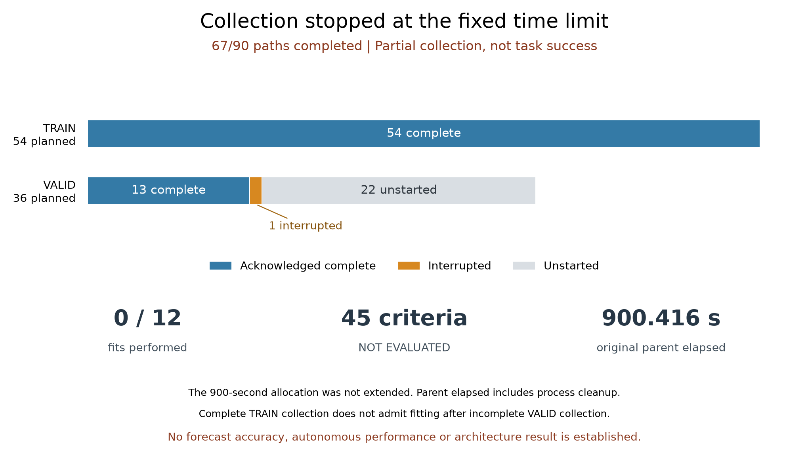

# Recurrent planner-score forecast pilot

**Incomplete collection; forecast rule not evaluated.** The original
900-second allocation completed **67 of 90 episodes**: all 54 TRAIN episodes
and 13 of 36 VALID episodes. One VALID episode was interrupted; 22 never started.
No model was fitted, no forecast was scored, and none of the 45 continuation
conditions was evaluated. This run establishes no architecture advantage.

The new recurrent models and comparison harness passed **72 fabricated
engineering checks**. Those checks establish implementation behavior on their
fixtures, not research effectiveness. The [original failed receipt](../output/otto-score-forecast-v1/collection-01/receipt.json),
[closed supervisor](../output/otto-score-forecast-v1/collection-supervisor-01.terminal.json)
and [verified stop summary](../output/otto-score-forecast-v1/stop-summary-01.json)
remain available.

## What was implemented

The [prospective protocol](otto-score-forecast-protocol.md) asks whether a small
recurrent model can propagate four expensive planner scores over three skipped
decisions. A real query supplies a new anchor every fourth step. The candidate
feeds its predicted scores back into memory; three controls test whether that
feedback helps beyond holding the anchor or seeing recent observations.

| Model | Parameters | Skipped-step prediction |
|---|---:|---|
| Residual GRU, primary candidate | 5,862 | Accumulate predicted increments and feed predicted scores into the next recurrent update. |
| Direct GRU | 5,862 | Repeatedly predict an offset from the fixed query anchor. |
| History MLP | 5,895 | Use every available observation in the current four-step window. |
| Current MLP | 5,826 | Use the query observation and current observation. |
| Hold-Q reference | 0 learned | Retain the last queried scores. |

All learned output heads start at exact hold-Q behavior. Hidden state resets
at each query window. The paired GRUs share initialization; all families were
scheduled for three fixed seeds, identical window shuffles and 80 epochs.
All twelve final checkpoints had to close before VALID arrays could be read.
Those fits remain **unstarted**, and there are no trained checkpoints to report.

The 72 passing checks cover recurrence against an independent scalar fixture,
causality, padding and label isolation, complete tails, equal episode weights,
original float32 action ties, routing before annotation, query-only minibatches,
all 45 rules, collector-specific reporting and primary-error preservation.
The five component test files and their captured logs are retained. A separate
source-reviewed reporter verified this unsuccessful collection's metadata;
the full saved-forecast auditor was not run because forecasts do not exist.

## Preserved execution

The three collectors were analytic control, always-neural control and a fixed
period-four controller that holds its last neural scores. Each paired case
shares its source and indexed observation stream across all three collectors.
An annotation never refreshes the deployed cache or changes an already selected
skipped action. There was one physical teacher call per visited state, including
annotation-only calls.

| Stage | Planned episodes | Complete episodes | Interrupted | Unstarted |
|---|---:|---:|---:|---:|
| TRAIN | 54 | 54 | 0 | 0 |
| VALID | 36 | 13 | 1 | 22 |
| Total | 90 | 67 | 1 | 22 |

“Complete” means the episode's declared termination or horizon was reached and
its records acknowledged. It does **not** mean that the search succeeded.
The complete cohort would contain 18 independent TRAIN cases and 12 independent
VALID cases, each with three collector paths. The partial VALID prefix is not
a replacement evaluation cohort.

The worker returned **22,296 teacher scores and 22,296 native transitions**.
The 22,297th score call was interrupted during a TensorFlow forward in VALID
case `lambda3:22300005:period4_hold`, at preaction step 1,368 (zero-based). The nested teacher
and TensorFlow pending records describe the same unfinished operation, not two
additional completed scores. The interrupted episode receives no completion
credit, and it will not be resumed.

| Recorded cost | Value |
|---|---:|
| Original collection cap | 900 seconds |
| Parent time through termination and cleanup | 900.416207917 seconds |
| Returned teacher-score calls | 815.023995607 seconds |
| Nested returned TensorFlow value calls | 790.285246157 seconds |
| Returned native transitions | 45.388111668 seconds |
| Worker peak RSS | 741,556,224 bytes |
| Training updates | 0 |

Operation timers exclude measured journal I/O and the unfinished call's elapsed
time. TensorFlow value time is nested inside teacher-score time; these rows
must not be added. Parent time includes the entire allocation and its cleanup.
This is a collection bill, not a deployed-policy speed comparison.

## Verification and decision

The metadata-only stop reporter checked every frozen source and input hash,
all retained payload hashes, the original command and supervisor joins, and the
acknowledged episode prefix against its original rows and completion boundaries.
The parent reaped the worker and confirmed the process group absent, with no
cleanup errors. Original failed bytes remain unchanged.

The reporter did not decode the saved TRAIN arrays, replay compressed journals,
run a model or simulator, or evaluate performance. Compressed journals are
authenticated opaque bytes; their internal completeness is not certified by
this check. The partial VALID records remain preserved, with no complete
`valid.npz` and no retrospective cohort selection.

Keep the scientific outcome **not evaluated**. The practical obstacle exposed
here is the cost of collecting teacher scores on full held-score trajectories.
Before another learning run, a separate protocol must establish an affordable
annotation design with explicit coverage, fresh cases and full cost accounting.
The saved TRAIN labels are not silently promoted into a replacement experiment.
There was no scientific retry, budget extension or fitting on a partial cohort.

The [related-work note](otto-score-forecast-related-work.md) explains why
prediction-correction alone is not a novelty claim and describes a later,
separate error-driven memory hypothesis. It does not alter this protocol.
The earlier [sparse-query 14/16 failure](otto-sparse-query-results.md) and
[query-value 7/11 failure](otto-query-advantage-v2-results.md) also remain closed.

[Evidence layout](../output/otto-score-forecast-v1/README.md) ·
[Complete preserved archive](https://github.com/kw2828/OpenJev/releases/tag/otto-score-forecast-v1).
