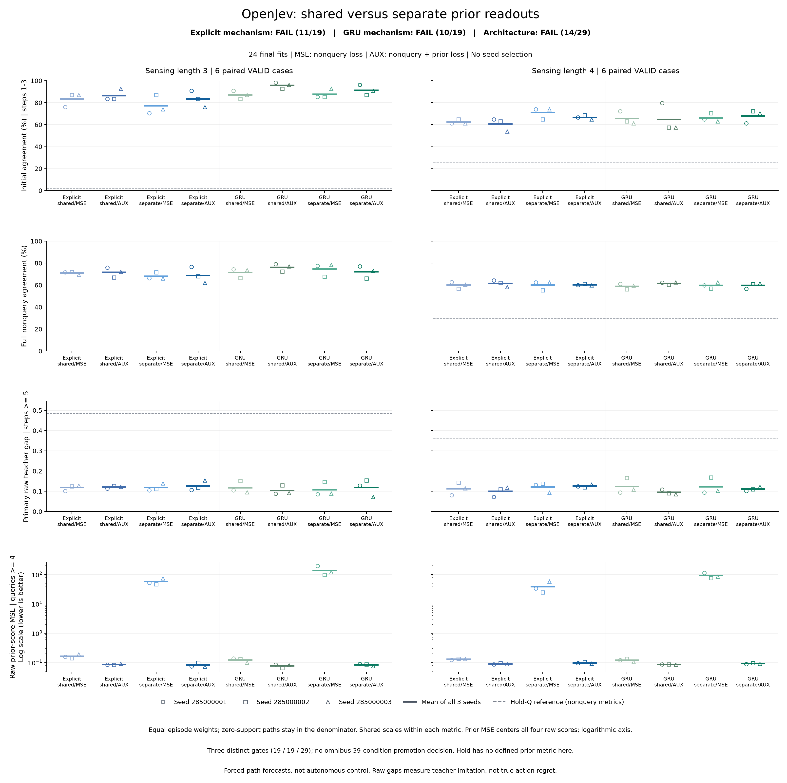
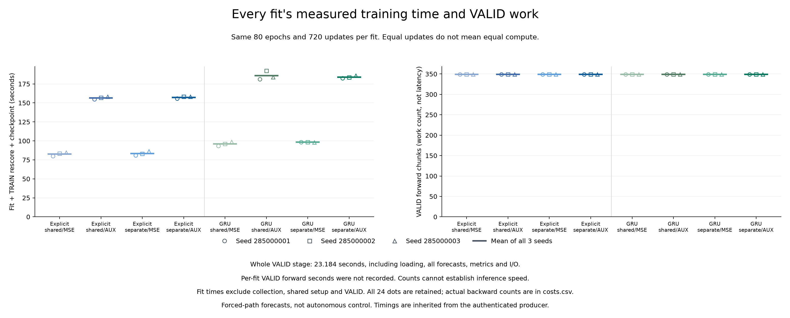

# Separate forecast readouts do not recover decision quality

**All 90 trajectories and 24 fits completed; all three scientific continuation decisions fail.** Separating the forecast and decision outputs lowers full-path agreement and increases the primary teacher-score gap versus shared outputs with the same auxiliary objective in both architectures and both settings. The independent saved-output audit agrees with the complete producer results.

This is a negative development result. It closes this separate-readout recipe without advancing it to autonomous control or a scenario-shift study. It does not establish a novel architecture, connectome advantage, calibrated probabilities, world-model dynamics or an ICLR-ready contribution.

[Frozen protocol](otto-separate-prior-protocol.md) · [Implementation and controls](otto-separate-prior-engineering.md) · [Complete evidence and all checkpoints](https://github.com/kw2828/OpenJev/releases/tag/otto-separate-prior-v1)

## What was compared

The earlier [saved-output diagnosis](otto-prequery-decision-diagnosis-results.md) located a mean early-step regression in an exposed cohort. This fresh screen compares shared versus separate readouts and original nonquery MSE versus MSE plus prequery forecast supervision, in explicit error correction and an ordinary error-fed GRU. All eight configurations use three paired fit seeds, identical trajectories, sampled windows, episode orders, query schedules and 720 optimizer updates per fit. All 24 final checkpoints were closed before VALID was decoded.

The collection contains 54 TRAIN and 36 VALID paths from three collectors per originating case. Each setting has nine TRAIN and six VALID cases. Collector paths are paired observations, not independent cases. Both settings occur in TRAIN and therefore neither is an unseen scenario shift. There were 300 sampled training windows, 837 selected nonquery training labels, 6,268 prior targets and 13,797 complete validation rows. Two TRAIN paths have no prior target; two VALID paths have no nonquery support. Every declared episode retains its denominator share.

## Frozen decisions

| Decision | Passed | Result |
| --- | ---: | --- |
| Explicit readout mechanism | 11/19 | FAIL |
| GRU readout mechanism | 10/19 | FAIL |
| Explicit architecture versus ordinary GRU | 14/29 | FAIL |

All nine common technical/support conditions pass. The two mechanism gates each require those nine plus ten within-architecture conditions; the architecture gate requires the explicit mechanism gate plus ten cross-architecture comparisons. The 39 unique records are not an omnibus promotion score. All initial and age-specific panels have at least five supported originating cases, above the required four. [Every condition](../output/otto-separate-prior-v1/figure-02/conditions.csv) and [gate membership](../output/otto-separate-prior-v1/figure-02/gates.csv) are retained.

## Means across all three fits

Each cell below is **sensing length 3 / sensing length 4**. Agreement is percent. Initial means steps 1-3; full includes every nonquery step; primary includes nonquery steps at or after step 5. Gaps are raw chosen-minus-best teacher scores, not true action regret. Prior MSE centers all four raw scores, including currently illegal actions. These scopes have different within-episode denominators.

| Architecture / readout / loss | Initial agreement (%) | Full agreement (%) | Primary agreement (%) |
| --- | ---: | ---: | ---: |
| Explicit / shared / MSE | 83.33 / 62.35 | 71.02 / 59.91 | 57.41 / 47.74 |
| Explicit / shared / AUX | 86.42 / 60.49 | 71.71 / 61.48 | 54.50 / 50.14 |
| Explicit / separate / MSE | 77.16 / 70.99 | 67.99 / 60.03 | 53.83 / 43.77 |
| Explicit / separate / AUX | 83.33 / 66.67 | 68.86 / 60.27 | 54.24 / 44.38 |
| GRU / shared / MSE | 87.04 / 65.43 | 71.55 / 58.90 | 48.04 / 44.05 |
| GRU / shared / AUX | 95.68 / 64.81 | 76.08 / 61.67 | 50.32 / 47.61 |
| GRU / separate / MSE | 87.65 / 66.05 | 74.52 / 59.76 | 52.47 / 44.36 |
| GRU / separate / AUX | 91.36 / 67.90 | 72.04 / 59.69 | 51.54 / 44.35 |

| Architecture / readout / loss | Full raw gap | Primary raw gap | Prior raw-score MSE |
| --- | ---: | ---: | ---: |
| Explicit / shared / MSE | 0.1196 / 0.0921 | 0.1179 / 0.1128 | 0.1632 / 0.1299 |
| Explicit / shared / AUX | 0.1050 / 0.0803 | 0.1207 / 0.1001 | 0.0868 / 0.0903 |
| Explicit / separate / MSE | 0.1103 / 0.0876 | 0.1180 / 0.1209 | 57.8290 / 38.4959 |
| Explicit / separate / AUX | 0.1047 / 0.0889 | 0.1256 / 0.1253 | 0.0818 / 0.0975 |
| GRU / shared / MSE | 0.0857 / 0.0928 | 0.1173 / 0.1227 | 0.1232 / 0.1203 |
| GRU / shared / AUX | 0.0724 / 0.0754 | 0.1032 / 0.0949 | 0.0769 / 0.0864 |
| GRU / separate / MSE | 0.0684 / 0.0911 | 0.1071 / 0.1218 | 137.7043 / 91.2307 |
| GRU / separate / AUX | 0.0757 / 0.0858 | 0.1179 / 0.1107 | 0.0836 / 0.0914 |

For reference, holding the last teacher scores gives full agreement **29.19% / 29.91%** and primary raw gaps **0.4850 / 0.3593** on these recorded paths. Beating that weak reference does not satisfy the stronger recurrent comparisons. All fit-level values, including support, are available in [individual points](../output/otto-separate-prior-v1/figure-02/individual-points.csv); the complete audit retains every case, collector and age.

## What the intervention changed

Compared with shared-AUX, separate-AUX changes full agreement by **-2.84 / -1.21 percentage points** for explicit correction and **-4.04 / -1.98 points** for the GRU. Its primary raw gap increases **0.00491 / 0.02524** and **0.01471 / 0.01576**, respectively. Initial agreement is mixed: **-3.09 / +6.17 points** for explicit correction and **-4.32 / +3.09 points** for GRU. The split does not reliably preserve early choices or improve later decisions.

Prior MSE versus shared-AUX improves only for explicit correction at length 3, by **5.76%**. It worsens by **8.01%** at length 4, and by **8.70% / 5.81%** for GRU. The much larger apparent prior-error reductions versus separate-MSE are against readouts with no direct prior-accuracy supervision. Those heads can still learn indirectly through later decision losses and correction; they are not untrained. Their very large prior MSE must not be presented as evidence of calibrated forecasting or an architecture advantage.

The previous cohort's early-regression pattern also does not transfer uniformly: shared-AUX now increases full agreement in both settings for both architectures, while its initial effect varies by setting. The earlier result is preserved; this new result shows why a diagnosis from one exposed cohort cannot be assumed to generalize.

### Readout-by-objective interactions

Interaction is `(separate_AUX - separate_MSE) - (shared_AUX - shared_MSE)`. Positive values favor agreement; negative values favor gap or MSE. These are descriptive, not significance tests. The four absolute cell levels above are necessary to interpret them.

| Architecture / setting | Initial agreement (pp) | Full agreement (pp) | Primary gap | Prior MSE |
| --- | ---: | ---: | ---: | ---: |
| Explicit / 3 | +3.08642 | +0.18454 | +0.00487 | -57.67080 |
| Explicit / 4 | -2.46914 | -1.32885 | +0.01718 | -38.35874 |
| GRU / 3 | -4.93827 | -7.00361 | +0.02493 | -137.57440 |
| GRU / 4 | +2.46914 | -2.84545 | +0.01663 | -91.10546 |

Per-seed interactions and both within-readout AUX-minus-MSE effects are retained in [plotted-values.json](../output/otto-separate-prior-v1/figure-02/plotted-values.json). Large favorable prior-MSE interactions are dominated by the poorly forecasting separate-MSE controls. The intervention also changes the prediction used for later correction, adds 120/116 parameters, and leaves recurrent gradients shared. It does not isolate gradient conflict or direct output-parameter sharing.

## Computation and verification

| Configuration | Parameters | Mean fit, rescore and save (seconds) | Mean backward chunks |
| --- | ---: | ---: | ---: |
| Explicit / shared / MSE | 5,978 | 82.62 | 7,732.3 |
| Explicit / shared / AUX | 5,978 | 156.59 | 37,930.7 |
| Explicit / separate / MSE | 6,098 | 83.48 | 7,732.3 |
| Explicit / separate / AUX | 6,098 | 157.33 | 37,930.7 |
| GRU / shared / MSE | 5,996 | 96.03 | 7,732.3 |
| GRU / shared / AUX | 5,996 | 185.75 | 37,930.7 |
| GRU / separate / MSE | 6,112 | 98.28 | 7,732.3 |
| GRU / separate / AUX | 6,112 | 183.94 | 37,930.7 |

All fits have 80 epochs and 720 updates, totaling **17,280 optimizer updates**. Auxiliary objectives cost about **1.87-1.93x** their matched MSE controls in whole-fit wall time and **4.91x** as many backward chunks. Equal updates and equal validation forward counts do not establish equal computation or inference speed.

The original supervised phases closed successfully: collection **905.77 seconds**, training plus validation **3,157.57 seconds**, and independent audit **7.74 seconds**. The worker records **3,132.07 seconds** for fitting, **1.25 seconds** setup and **23.18 seconds** for the whole validation stage. Validation time includes loading, every forecast, metrics and I/O; per-fit inference latency was not recorded. [All measured costs](../output/otto-separate-prior-v1/figure-02/costs.csv).

The audit reconciles 24 fits, 49 saved prediction files, 85 training payloads, 18 collection payloads, 17,280 updates and all 39 condition records against 140 pinned sources. It performs no model, optimizer, teacher or environment calls. The 171 fabricated qualification cases and static checks had passed before collection. Original supervisor records verify successful exit and process cleanup. No scientific retry, replacement seed, resumed fit or cap extension occurred.

## Evidence and continuation

The [release](https://github.com/kw2828/OpenJev/releases/tag/otto-separate-prior-v1) includes all checkpoints, TRAIN and VALID forecasts, raw collection evidence, source pins, original process receipts, independent audit, figures and preparation history. The archive includes dependency identities but is not a standalone runtime; the restore note lists required external pinned assets and paths. Presentation-only changes and their original versions remain preserved.

This recipe does not advance. A useful next step is a separately bounded diagnostic of why lower raw-score error does or does not preserve legal-action rankings, with ordinary shared-GRU as a required control. That is a proposed question, not an executed experiment or a promotion of the best-looking cell. New fitting would require fresh data, a frozen decision-sensitive comparison and matched computation. Autonomous utility, an unseen scenario shift and a second environment remain untested.
