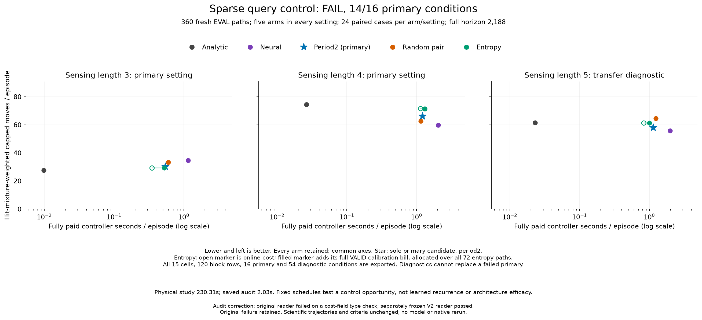

# Sparse-query control opportunity test

**Completed: FAIL, 14/16 primary conditions passed.** Period-two querying cut fully paid controller cost by **53.15% / 40.79%** versus always-neural control at sensing lengths 3 / 4. All 360 evaluation paths found their source. The primary controller nevertheless missed two move-quality requirements, so this allocation does not admit a learned allocation study.

At length 3 it used **9.65% more moves than analytic control**, where the rule required at least 5% fewer. At length 4 it used **10.61% more moves than always-neural control**, exceeding the permitted 5%. Cost saving alone does not pass the rule. This is a fixed-schedule experiment, with no newly trained model or architecture claim.

## Comparison

The [prospective protocol](otto-sparse-query-protocol.md) fixed period-two as the only primary candidate. Every sparse controller obeys `Q_t <= ceil(t/2)` at every prefix. A query uses the unchanged original neural action; a skip uses the current analytic action. Random pair chooses one query position in each pair using a fixed SHA256 schedule. Entropy queries above one fixed threshold when causal credit remains.

The 24 VALID paths produced 603 preaction entropies. The one pooled episode-balanced lower median is **0.5173577666282654**. Every episode has equal mass and divides that mass among its rows. The threshold was durably published before the first EVAL reset, without outcome optimization or length-5 calibration.

EVAL contains 24 paired cases per setting and five arms per case: 360 complete paths. All five arms share each case's native source and indexed observation-uniform stream. Arm order rotates by case. Every case is retained, including its final posterior update; the horizon is 2,188 moves. There are eight initial-hit-balanced blocks per setting. Reported means use the qualified positive-initial-hit mixture, not equal weights over all rows. The raw counts therefore need not rank arms like the weighted means.

## All results

All arms achieve 100% weighted success and **24/24 raw successes in every cell**. Moves and queries below are weighted means. Controller times include construction, filtering, scoring, features, gate execution and allocated fresh setup. Fully paid entropy time also includes its complete calibration bill.

| Length | Controller | Moves | Queries | Online seconds | Fully paid seconds |
|---|---|---:|---:|---:|---:|
| 3 | Analytic | 27.569 | 0.000 | 0.009815 | 0.009815 |
| 3 | Always neural | 34.685 | 34.685 | 1.159578 | 1.159578 |
| 3 | Period-two (primary) | 30.228 | 15.229 | 0.543270 | 0.543270 |
| 3 | Random pair | 33.246 | 16.670 | 0.598811 | 0.598811 |
| 3 | Entropy | 29.213 | 9.473 | 0.350866 | 0.523743 |
| 4 | Analytic | 74.511 | 0.000 | 0.026484 | 0.026484 |
| 4 | Always neural | 59.853 | 59.853 | 2.044272 | 2.044272 |
| 4 | Period-two (primary) | 66.203 | 33.294 | 1.210503 | 1.210503 |
| 4 | Random pair | 62.648 | 31.393 | 1.153460 | 1.153460 |
| 4 | Entropy | 71.478 | 31.465 | 1.145344 | 1.318222 |
| 5 | Analytic | 61.545 | 0.000 | 0.023084 | 0.023084 |
| 5 | Always neural | 55.713 | 55.713 | 1.990711 | 1.990711 |
| 5 | Period-two (primary) | 58.124 | 29.305 | 1.139308 | 1.139308 |
| 5 | Random pair | 64.474 | 32.318 | 1.237121 | 1.237121 |
| 5 | Entropy | 61.260 | 21.688 | 0.834273 | 1.007150 |

Length 5 is a separately reported, previously known type of shift. Period-two uses 4.33% more moves than neural control, 5.56% fewer than analytic, and 42.77% less controller computation than neural. Those diagnostic results cannot replace a failure in the two primary settings. Neither can another controller's result. Across all three sparse arms and all three settings, **35/54 diagnostic conditions pass**.

The [complete metrics](../output/otto-sparse-query-v1/figure-02/metrics.csv) include weighted success and raw totals. [All 120 block rows](../output/otto-sparse-query-v1/figure-02/blocks.csv), [all 70 primary and diagnostic decisions](../output/otto-sparse-query-v1/figure-02/conditions.csv), and [all plotted values](../output/otto-sparse-query-v1/figure-02/plotted-values.json) remain available. This small pilot provides point estimates; it supplies no confidence-coverage or statistical-significance guarantee.

## All primary conditions

Every condition was required. The technical-completion condition is supported by the separately corrected saved audit described below, not by the failed original checker.

| Condition | Observed | Required | Result |
|---|---:|---:|---|
| `technical_complete` | 1 | >= 1 | PASS |
| `causal_quotas` | 1 | >= 1 | PASS |
| `lambda3.analytic.success` | 1 | >= 0.95 | PASS |
| `lambda3.neural.success` | 1 | >= 0.95 | PASS |
| `lambda3.period2.success` | 1 | >= 0.95 | PASS |
| `lambda3.period2.success_vs_references` | 1 | >= 1 | PASS |
| `lambda3.period2.moves_vs_neural` | 30.2282095 | <= 36.4197457 | PASS |
| `lambda3.period2.moves_vs_analytic` | 30.2282095 | <= 26.1904059 | **FAIL** |
| `lambda3.period2.paid_cost_vs_neural` | 0.543270297 | <= 0.695746813 | PASS |
| `lambda4.analytic.success` | 1 | >= 0.95 | PASS |
| `lambda4.neural.success` | 1 | >= 0.95 | PASS |
| `lambda4.period2.success` | 1 | >= 0.95 | PASS |
| `lambda4.period2.success_vs_references` | 1 | >= 1 | PASS |
| `lambda4.period2.moves_vs_neural` | 66.2033398 | <= 62.8461061 | **FAIL** |
| `lambda4.period2.moves_vs_analytic` | 66.2033398 | <= 70.7853061 | PASS |
| `lambda4.period2.paid_cost_vs_neural` | 1.21050281 | <= 1.22656321 | PASS |

## Complete costs and verification

The original scientific supervisor completed in **230.305686 seconds**, with worker time **229.968828 seconds** and peak RSS **768,622,592 bytes**. It retained all 384 paths, 11,728 moves and 5,466 neural forwards. There were zero optimizer updates, skipped-state annotations or scientific retries.

Fresh common setup is allocated over 384 paths, model setup over 312 neural-capable paths, and gate setup over 240 sparse paths, including VALID. Entropy alone pays the full VALID physical interval plus threshold publication and its 24 VALID setup shares: **12.447168 seconds**, or **0.172877 seconds per entropy EVAL path** across all 72 such paths. This bill includes VALID simulation and journaling. Its nested operation times are not added again.

| Scope | Seconds |
|---|---:|
| Original setup phase | 3.037850375 |
| VALID collection | 12.218203541 |
| Threshold selection and publication | 0.001262916 |
| Allocated VALID setup | 0.227701904 |
| Calibration bill, derived total | 12.447168361 |
| EVAL collection | 214.319199667 |
| Journal I/O, overlapping phases | 1.749443207 |
| Original saved audit, failed | 0.206429625 |
| Corrected saved audit | 2.031948125 |

The [complete cost export](../output/otto-sparse-query-v1/figure-02/costs.csv) separates physical phases from nested timers. Measured journal I/O is excluded from controller timers; other in-operation monitoring remains charged. Whole-process wall time retains all overhead. These are local CPU measurements under this instrumented implementation, not a general model latency claim.

The first audit failed because its scalar validator included the nested `operation_seconds` dictionary. The [prospective correction](otto-sparse-query-audit-repair.md) froze a separate verifier, added three fabricated regression tests and retained the original failed receipt, terminal and source. The corrected audit independently agrees on **3,375,702 identity and arithmetic checks**, including every action schedule, causal quota, threshold, cost allocation and condition. It makes no new model, simulator, filter, sampler, numerical-array or optimizer calls. Numerical filtering and neural values remain inherited qualified producer evidence. The count of checks is not a statistical sample size.

Initial engineering qualified 29 distinct cases across 35 executions, including six affected cases repeated after a pre-freeze lint fix. The three added cost-schema regressions bring the total to 32 distinct cases across 38 executions. Original failures remain preserved. The runner's original seven-test log was transcribed from its tool output and bound retrospectively to unchanged bytes, as its receipt states; it is not a contemporaneous before/after capture. The first figure had overlapping labels; the retained presentation revision uses a shared legend without changing data or axes coverage.

## Decision

Keep `pilot_continuation: false`. This result closes the tested periodic recipe under its declared rule. The earlier [7/11 local-advantage pilot](otto-query-advantage-v2-results.md) also remains failed; these results do not authorize fitting its labels or retuning the current threshold on exposed cases.

The bottleneck here is move quality, since both primary computation requirements pass. A bounded next question is whether the skipped-step fallback loses useful information between planner calls. A separately frozen comparison could hold the period-two query schedule fixed and compare current analytic fallback with a cached neural action, using a fixed rule for invalid boundary moves. It needs new paired cases and the same competence and complete-cost standards. This proposed control has not been run. Only evidence of a useful control tradeoff would justify a new learned gate; recurrence would then need to beat current-feature and finite-history controls. No recurrent world model, biological-wiring, RL or ICLR-level novelty is established here.

## Evidence

[Evidence layout](../output/otto-sparse-query-v1/README.md) · [Complete release](https://github.com/kw2828/OpenJev/releases/tag/otto-sparse-query-v1) · [Original scientific plan](../output/otto-sparse-query-v1/plan-01.json) · [Corrected audit](../output/otto-sparse-query-v1/audit-02/audit.json).

| Record | SHA256 |
|---|---|
| [Scientific plan](../output/otto-sparse-query-v1/plan-01.json) | `85774a4bf6168596cb32d6d85dd08c265d4b6ea5d13686f6a80d77d7684096ab` |
| [Producer](../output/otto-sparse-query-v1/run-01/receipt.json) | `5550dc80da6a099be09876a65abeb0ad6905d30141850a1df817174a9aaf60af` |
| [Original scientific terminal](../output/otto-sparse-query-v1/supervision-01.terminal.json) | `5f390b2e4ef29522199a9de88f91b1482216f131703e49d241b792747555fea1` |
| [Failed original audit](../output/otto-sparse-query-v1/audit-01/receipt.json) | `0d648996f7361418753e1d64d9f3c57acce28b89f127fc3456960a0772e0bdf5` |
| [Failed audit terminal](../output/otto-sparse-query-v1/audit-supervision-01.terminal.json) | `531fe587917fa72a2ff925e1829062bf7d42b988dc01f3ee3a08027d6a66b54d` |
| [Repair plan](../output/otto-sparse-query-v1/audit-repair-plan-01.json) | `575806df0feee4af2d8e4ee92a507822c4af75ff7423437a3df8fb2bdd6180a1` |
| [Corrected audit](../output/otto-sparse-query-v1/audit-02/receipt.json) | `4f5e9c2c8cf52f39cd9c7d20fa98494d427344144c453a9af79d48f42e426b4e` |
| [Corrected audit terminal](../output/otto-sparse-query-v1/audit-supervision-02.terminal.json) | `4d4bc8010ca39892ac62df3817476c357bfbada9c64407ec94f2643cbc948973` |
| [Final figure](../output/otto-sparse-query-v1/figure-02/receipt.json) | `ac3d014d80f8e83ff7b516d508e354f8ed6a301a3bb7d52e78c6cf6b46133166` |
