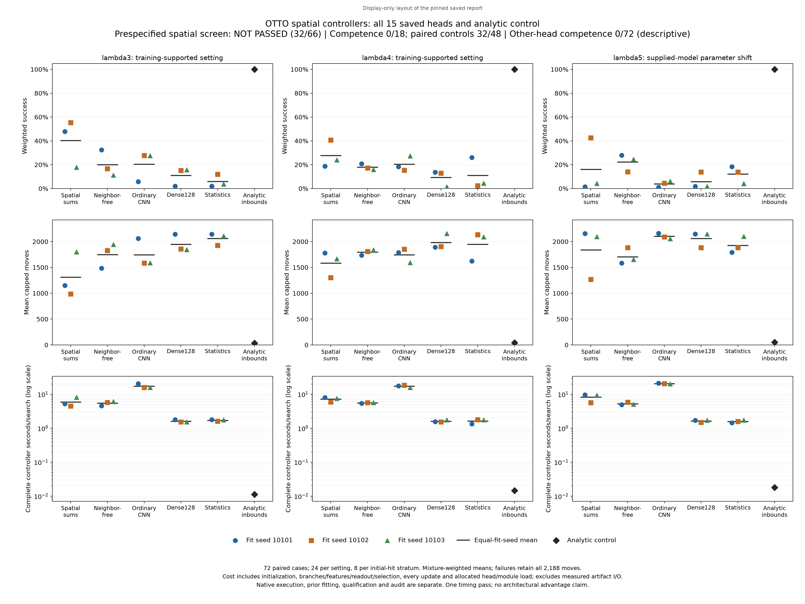

# Spatial value controllers: autonomous screen failed

The spatial candidate passed **32 of 66 conditions and failed the overall continuation rule**. All eighteen spatial competence conditions failed, as did all seventy-two descriptive competence conditions for the other learned heads. Analytic control found the source in **all 72 environmental cases**. No tested learned controller met the absolute competence requirements in any setting.

Spatial achieved higher family success and fewer capped moves than neighbor-free on lambda3 and lambda4, but lower success and more moves on lambda5. It also used more complete controller time than neighbor-free in all three settings. These relative results among weak learned controllers do not establish an architectural or efficiency advantage. The independently completed audit agreed with the preserved results; verification success does not change the scientific failure.

The public figure is a [display-only layout](../scripts/plot_otto_spatial_control_public.py) of the pinned report derivation. It separates the original renderer's overlapping legend and footer while retaining every cell, scale and criterion. Its [receipt](../output/otto-spatial-control-v1/public-figure-01/receipt.json) records the input and output hashes; the original report remains unchanged.

The [frozen protocol](otto-spatial-control-protocol.md) evaluated all fifteen final heads from the [scalar fitting study](otto-spatial-study-results.md): spatial, neighbor-free, CNN, dense128 and statistics, each at fitting seeds 10101, 10102 and 10103. No head was selected, retrained, clipped or replaced. The separate [deployment qualification](otto-spatial-control-qualification.md) passed all 780 prescribed NumPy/Torch64 branch comparisons and exact eligible-action checks before autonomous execution.

Each learned controller received the exact public posterior, position and known observation kernel. It scored all sixteen nonfound observation branches, retaining raw masses, the fixed probability floor and signed value predictions, then selected among in-bounds actions. Analytic control used the unchanged in-bounds space-aware policy. The experiment contained **1,152 full-horizon episodes on 72 paired environmental cases**: 24 cases in each of lambda3, lambda4 and lambda5, with all sixteen arms on every case. Sources and observation-uniform channels were paired within each case; different paths could receive different hits. Arm execution order rotated by case.

Lambda3 and lambda4 were represented in training. Lambda5 supplied a previously unseen sensing length and its exact observation kernel on the same 53x53 board. This is supplied-model parameter extrapolation, not unknown-dynamics adaptation, new geometry or robotics transfer.

Every unsuccessful episode contributes the full **2,188-move cap**. Final found and censored observations were assimilated. There was no early stop for cycling or analytic fallback. Within a setting, each arm's metric first averages the eight cases at each initial hit and then applies the authenticated positive-hit mixture below. Family means give the three fitting seeds equal weight. The published rounded weights are for reading; all decisions use the saved full-precision values.

| Setting | Initial hit 1 | Initial hit 2 | Initial hit 3 |
| --- | ---: | ---: | ---: |
| lambda3 | 0.830998236 | 0.128917967 | 0.040083797 |
| lambda4 | 0.844502282 | 0.120760688 | 0.034737030 |
| lambda5 | 0.853772392 | 0.115065717 | 0.031161891 |

The complete family table retains all settings and all learned families. Seed ranges are the minimum and maximum of the three weighted success rates, not confidence intervals. Raw counts pool the three heads' episodes on the same 24 cases and therefore have denominator 72; analytic has denominator 24. These repeated fitting seeds do not create additional independent environmental cases, and raw pooled fractions are not the mixture-weighted success metric.

| Setting | Family | Weighted success | Seed success range | Raw found / episodes | Capped moves | Controller seconds / search |
| --- | --- | ---: | ---: | ---: | ---: | ---: |
| lambda3 | Spatial | 40.35% | 17.84%-55.34% | 33/72 | 1312.929 | 5.937945 |
| lambda3 | Neighbor-free | 20.08% | 11.17%-32.45% | 30/72 | 1751.286 | 5.458100 |
| lambda3 | CNN | 20.39% | 5.84%-27.72% | 21/72 | 1744.788 | 17.310480 |
| lambda3 | Dense128 | 11.02% | 2.11%-15.72% | 11/72 | 1947.449 | 1.610063 |
| lambda3 | Statistics | 5.91% | 2.11%-11.89% | 9/72 | 2058.947 | 1.709245 |
| lambda3 | Analytic | 100.00% | n/a | 24/24 | 32.551 | 0.011259 |
| lambda4 | Spatial | 27.81% | 18.77%-40.75% | 30/72 | 1583.661 | 7.158846 |
| lambda4 | Neighbor-free | 17.97% | 15.95%-20.71% | 27/72 | 1795.794 | 5.547995 |
| lambda4 | CNN | 20.34% | 15.31%-27.38% | 25/72 | 1745.108 | 17.264074 |
| lambda4 | Dense128 | 9.34% | 1.51%-13.58% | 8/72 | 1984.621 | 1.609820 |
| lambda4 | Statistics | 10.99% | 2.38%-26.08% | 12/72 | 1949.131 | 1.622919 |
| lambda4 | Analytic | 100.00% | n/a | 24/24 | 41.767 | 0.014477 |
| lambda5 | Spatial | 16.12% | 1.44%-42.59% | 18/72 | 1840.006 | 8.225979 |
| lambda5 | Neighbor-free | 22.22% | 14.06%-28.00% | 23/72 | 1706.885 | 5.255323 |
| lambda5 | CNN | 3.92% | 1.17%-6.14% | 14/72 | 2103.123 | 20.632809 |
| lambda5 | Dense128 | 5.86% | 1.83%-13.94% | 8/72 | 2059.985 | 1.629641 |
| lambda5 | Statistics | 12.12% | 4.05%-18.37% | 19/72 | 1925.608 | 1.579712 |
| lambda5 | Analytic | 100.00% | n/a | 24/24 | 52.507 | 0.018024 |

All **48 individual arm/setting cells**, including every seed's capped moves and complete cost, are in [cells.csv](../output/otto-spatial-control-v1/report-01/cells.csv) and the [audited summary](../output/otto-spatial-control-v1/audit-01/summary.json). The figure retains each fitting seed. The summary also preserves all initial-hit strata, raw counts and eight paired blocks per setting. Rounded table values are not used to determine passes.

The eighteen candidate competence checks require each spatial seed in each setting to achieve at least 95% weighted success and at most 1.05 times analytic mean capped moves. **0/18 passed.** The same two requirements applied descriptively to the twelve noncandidate heads yielded **0/72 passed**. The forty-eight candidate-versus-control conditions yielded **32/48 passes**, as shown below; all sixty-six candidate conditions were required together.

| Setting | Spatial versus | Success no lower | Moves at least 5% lower | Positive blocks (need 6/8) | Controller cost no greater |
| --- | --- | --- | --- | --- | --- |
| lambda3 | Neighbor-free | Pass | Pass | 5/8, Fail | Fail |
| lambda3 | CNN | Pass | Pass | 5/8, Fail | Pass |
| lambda3 | Dense128 | Pass | Pass | 6/8, Pass | Fail |
| lambda3 | Statistics | Pass | Pass | 7/8, Pass | Fail |
| lambda4 | Neighbor-free | Pass | Pass | 6/8, Pass | Fail |
| lambda4 | CNN | Pass | Pass | 5/8, Fail | Pass |
| lambda4 | Dense128 | Pass | Pass | 7/8, Pass | Fail |
| lambda4 | Statistics | Pass | Pass | 7/8, Pass | Fail |
| lambda5 | Neighbor-free | Fail | Fail | 5/8, Fail | Fail |
| lambda5 | CNN | Pass | Pass | 7/8, Pass | Pass |
| lambda5 | Dense128 | Pass | Pass | 6/8, Pass | Fail |
| lambda5 | Statistics | Pass | Fail | 6/8, Pass | Fail |

Every exact value, threshold and decision is retained in [conditions.csv](../output/otto-spatial-control-v1/report-01/conditions.csv), including the seventy-two descriptive checks. The 6/8 block rule is a fixed small-cohort continuation condition, not a calibrated significance test. Even the lambda5 CNN comparison, which passed all four relative conditions, leaves spatial far below analytic competence. No ordinary control is promoted because the candidate failed.

Controller seconds are paid time per search on one CPU thread. They include actor initialization, analytic distance-table construction where applicable, all sixteen-branch construction/copies/centering/features, inference, reduction and action selection, and every posterior update. Full head validation/load cost is allocated over that head's 72 searches; shared learned-module setup is allocated over all 1,080 learned searches. Only measured nested artifact I/O is excluded; raw instrumented time and the excluded interval remain in the original records. Environment work, fitting, qualification and replay audit are separate scopes. The rotation provides one measured timing pass, not repeated latency evidence. Long failed searches also increase per-search cost, so this table is not a per-decision inference-speed comparison.

The autonomous worker completed **1,738,066 native steps**, **1,155 resets** including three templates, **1,736,024 learned forwards**, **2,042 analytic choices** and fifteen head loads. Its total elapsed time was **9,850.384311 seconds**. The audited disjoint accounted interval was **9,235.093394 seconds**; the remaining worker interval includes orchestration and other overhead rather than an additional controller measurement. These nested cost scopes must not be added. This stage performed no training, Torch reference execution or external model calls.

Earlier fitting remains paid historical work: the fifteen complete fit intervals totaled **1,460.708027 seconds**, data preparation **2.051429 seconds**, and final fitting diagnostics **44.823477 seconds**. Those intervals are contained in the earlier **1,513.803729-second** training worker, not in the autonomous worker above. All fifteen new deployment loads totaled **0.045304 seconds**, with **0.000920 seconds** of shared learned-module setup, already allocated in controller costs. The separate deployment qualification took **13.806554 worker seconds**, and its saved-output audit took **9.959710 seconds**.

The [audited amortization records](../output/otto-spatial-control-v1/audit-01/summary.json) retain every head and setting at 1, 100 and 10,000 searches. Each scenario removes the deployment setup already allocated per search, then adds `(fit cost + training preparation/15 + head load + learned module setup/15) / number of searches`. Analytic actor initialization stays paid per search. Fitting diagnostics, qualification, historical teacher collection and audit are disclosed separately; these scenarios are not an all-project cost total or an additional efficacy rule.

The full saved-output audit completed **1,736,024 additional NumPy readouts**, covering **27,776,384 branch rows**, with every attempt returned and no pending operation. It reconstructed all public trajectories, observation branches, eligible choices, source/uniform pairing joins, cohort coverage, weights, conditions and recorded cost sums. Replayed network outputs and scalar comparisons matched the saved records exactly. Its final receipt records **76,316,348 comparisons**, including 271 final closure checks after the summary's 76,316,077 count. Audit wall time was **7,231.309063 seconds**, including **5,874.218485 seconds** inside saved-head replay calls. It ran no simulator, optimizer or external model.

The audit shares the separately qualified NumPy neural algebra with the producer. It is not a third independent network implementation. Independent public filtering, branch geometry and aggregation, plus the earlier saved Torch64 qualification, strengthen verification; actual historical training, native randomness and timing truth remain authenticated original-execution evidence. Audit agreement supports fidelity of the preserved experiment, not optimality or generalization.

This result meets the condition in the earlier [action-cost follow-up proposal](otto-action-cost-followup.md): all tested learned controllers fail competence while analytic control succeeds. A bounded next question is whether counterfactual analytic-teacher continuation costs improve an otherwise matched ordinary policy, using a newly frozen TRAIN-only anchor pool and fresh evaluation. The full sampler still requires qualification and a separate protocol before any collection. This experiment does not identify label quality, state coverage or architecture as the cause, and it does not rule out spatial, recurrent or connectome approaches generally. No new learning study is admitted by this report.

| Evidence | Location |
| --- | --- |
| Prospective rules and execution limits | [Protocol](otto-spatial-control-protocol.md), [frozen plan](../output/otto-spatial-control-v1/plan-01.json) |
| Original autonomous completion | [Worker receipt](../output/otto-spatial-control-v1/run-01/receipt.json), [supervisor terminal](../output/otto-spatial-control-v1/process-01.terminal.json) |
| Independent replay and all result details | [Audit receipt](../output/otto-spatial-control-v1/audit-01/receipt.json), [audit summary](../output/otto-spatial-control-v1/audit-01/summary.json) |
| Complete plotted values and condition tables | [Derivation](../output/otto-spatial-control-v1/report-01/derivation.json), [cells](../output/otto-spatial-control-v1/report-01/cells.csv), [conditions](../output/otto-spatial-control-v1/report-01/conditions.csv), [report receipt](../output/otto-spatial-control-v1/report-01/receipt.json) |
| Numerical deployment prerequisite | [Qualification results](otto-spatial-control-qualification.md) |
| Frozen producer and saved-output audit | [Runner](../scripts/study_otto_spatial_control.py), [auditor](../scripts/audit_otto_spatial_control.py) |
| Lossless evidence and restore dependencies | [GitHub release](https://github.com/kw2828/OpenJev/releases/tag/otto-spatial-control-v1) |

The verified archive retains **329 files, 3,867,523,040 original bytes**, in a **1,078,311,885-byte** gzip stream split into two ordered parts. The packer checked every restored member and the complete compressed stream. [Restore instructions](../output/otto-spatial-control-v1/archive-01/RESTORE.md) identify the separately preserved historical training-cache dependencies; [manifest](../output/otto-spatial-control-v1/archive-01/manifest.json), [archive receipt](../output/otto-spatial-control-v1/archive-01/receipt.json) and [original publication execution witness](../output/otto-spatial-control-v1/publication-execution-witness-01.json) preserve the packaging scope and tool completions. Packaging performed no model or simulator calls.

The scientific freeze is commit `e8e97cd1e6bfa58261a8ced0845b597c1c2c0441`, with 219 bound source files. Exact SHA-256 identities are:

| Record | SHA-256 |
| --- | --- |
| Full plan | `fdbcd35a5a8ac990f1221ceb5e6a661f62e04b5d5cf264df6aca2b9224880c51` |
| Worker receipt | `bc3fe905db8c37b4659f3752bd96063123a3bfb7cb93e5de8495858323b438ab` |
| Original supervisor terminal | `d58a16db0a6bb01294c5c540df0275586edb0957b9ce090c2c9cab1a7d68f6ba` |
| Independent audit receipt | `898897adb65e8c46a0434919982cdadd125802eba27133b0d9f18c59f693db96` |
| Audited summary | `27f52051ac46ea405a2c814cc07c7c5a1e9c1aa7d0b1cb920d1f5ca8d1b4b001` |
