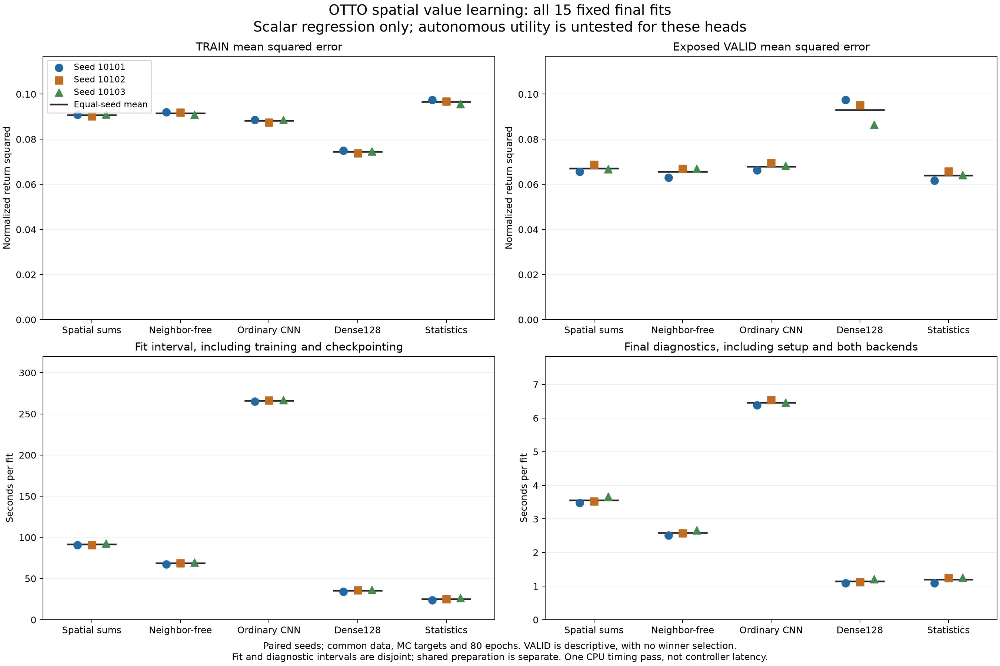

# Spatial value readouts: fixed-data fitting results

The spatial readout did not improve mean validation MSE over its matched neighbor-free control. Across the three fixed seeds, spatial VALID MSE was **2.246% higher than neighbor-free and 4.934% higher than the statistics baseline**. Statistics had the lowest VALID MSE in all three seeds. Dense128 had the lowest TRAIN MSE and the highest VALID MSE in all three seeds. These are descriptive results on an already exposed validation set, not autonomous search results or evidence of an architectural advantage.

All fifteen fits completed, and the independent saved-model audit agreed. The [frozen protocol](otto-spatial-training-protocol.md) specified no scalar admission gate, so this study has no efficacy PASS/FAIL score. It ran no environment episodes, action evaluations or external model calls. All fifteen final heads remain available for a separately qualified and frozen autonomous comparison, irrespective of their scalar ranking.

Every fit used the same 5,589 TRAIN prefixes from 192 complete teacher episodes and 1,109 VALID prefixes from 48 separate teacher episodes, at supplied sensing lengths 3 and 4. Targets were realized teacher remaining moves divided by 64, `(T-t)/64`. They are noisy Monte Carlo returns of that teacher, not optimal costs or action labels. Loss was uniform over rows, so longer episodes contribute more prefixes. VALID was not used for checkpoint selection or early stopping in this run, but has been exposed during this research program and is not an untouched test set.

Each model started fresh and received 80 epochs of Adam at learning rate 0.001, batch size 128 and gradient clipping at 5. The three fitting seeds were 10101, 10102 and 10103, with paired row permutations across families. Spatial and neighbor-free also shared their initial parameter tensors. All families started with zero final readouts and the same TRAIN-derived baseline. Training used float32; final scalar metrics used original float64 public inputs with immutable NumPy readouts of the saved float32 weights. There was no clipping, output repair, replacement seed or best-checkpoint selection.

Family means below weight the three seeds equally. MSE is in normalized return units; physical MAE is in remaining-move units. Neither is a measure of the moves taken by a deployed controller. The earlier legacy-feature duplicate-input floor is not reused for these representations.

| Family | Parameters | TRAIN MSE | VALID MSE | TRAIN physical MAE | VALID physical MAE |
| --- | ---: | ---: | ---: | ---: | ---: |
| Spatial | 737 | 0.0906833063 | 0.0670667082 | 13.198800 | 11.951250 |
| Neighbor-free | 737 | 0.0915927578 | 0.0655934608 | 13.240303 | 11.943854 |
| CNN | 801 | 0.0882042607 | 0.0679650582 | 12.989176 | 12.273871 |
| Dense128 | 1,411,841 | 0.0745315444 | 0.0930130973 | 10.644513 | 14.339690 |
| Statistics | 225 | 0.0966179111 | 0.0639131651 | 13.627927 | 12.133796 |

All fifteen individual final checkpoints are retained:

| Family | Seed | TRAIN MSE | VALID MSE |
| --- | ---: | ---: | ---: |
| Spatial | 10101 | 0.0908673935 | 0.0656024899 |
| Spatial | 10102 | 0.0901991451 | 0.0687474645 |
| Spatial | 10103 | 0.0909833802 | 0.0668501701 |
| Neighbor-free | 10101 | 0.0920347385 | 0.0629439192 |
| Neighbor-free | 10102 | 0.0918132558 | 0.0669212732 |
| Neighbor-free | 10103 | 0.0909302789 | 0.0669151902 |
| CNN | 10101 | 0.0885045909 | 0.0662261626 |
| CNN | 10102 | 0.0875053146 | 0.0694957702 |
| CNN | 10103 | 0.0886028767 | 0.0681732417 |
| Dense128 | 10101 | 0.0750132999 | 0.0974102998 |
| Dense128 | 10102 | 0.0738886574 | 0.0952170875 |
| Dense128 | 10103 | 0.0746926759 | 0.0864119045 |
| Statistics | 10101 | 0.0973842549 | 0.0617710906 |
| Statistics | 10102 | 0.0968454732 | 0.0658713573 |
| Statistics | 10103 | 0.0956240051 | 0.0640970474 |

The percentage comparisons use ratios of equal-seed family means, without rounding before calculation. Spatial was slightly better than neighbor-free on VALID for seed 10103, but worse for the other two. Statistics' lowest MSE did not imply lowest physical MAE: neighbor-free had the lowest mean VALID MAE. Shared episode prefixes and three fitting seeds do not provide independent population-level uncertainty estimates.

Signed negative predictions were preserved in every metric. Summed across the three checkpoints, negative TRAIN/VALID counts were spatial **6/0**, neighbor-free **16/3**, CNN **38/19**, dense128 **595/248**, and statistics **31/8**. Each TRAIN count has 16,767 prediction opportunities and each VALID count 3,327; these repeat the same rows across three models. No output was clipped to make it a feasible remaining-move prediction.

The following costs are measured means per fit, on one CPU thread. Fit intervals include model/optimizer initialization, training, checks, journals and initial/final checkpoint export. Diagnostics are a separate interval covering deployment construction, Torch64 restoration, both full prediction passes, centering, parity checks, metrics and prediction-file publication.

| Family | Mean complete fit seconds | Mean final diagnostics seconds |
| --- | ---: | ---: |
| Spatial | 91.486431 | 3.555627 |
| Neighbor-free | 68.676920 | 2.583636 |
| CNN | 266.106160 | 6.464247 |
| Dense128 | 35.498307 | 1.142717 |
| Statistics | 25.134858 | 1.194932 |

Across all fifteen models, fit intervals totaled **1,460.708027 seconds**, including **1,459.870985 seconds** inside the training loops. Final diagnostics totaled **44.823477 seconds**, comprising **0.062315 seconds** of deployment/reference setup and **44.761162 seconds** for the subsequent prediction/check/save interval. Data preparation took **2.051429 seconds**. Complete worker time was **1,513.803729 seconds**; its original supervisor measured **1,514.278121 seconds**, including process launch and cleanup. Peak recorded worker RSS was **1,240,809,472 bytes**. Worker and parent times enclose the other intervals and must not be added to them.

The producer recorded **52,800 updates**, with one forward and backward per update, plus **6,300 NumPy and 6,300 Torch64 final prediction calls**. Each final backend covered all **100,470 model-row pairs**. The wrapped final forwards took **21.632645 seconds** for NumPy and **13.697056 seconds** for Torch64; those narrow call intervals exclude surrounding centering, metric assembly and output writes, which are included in the diagnostic totals. There were **171,090 recorded operations** overall, with every attempt returned and no pending operation. These timings do not measure sixteen-branch controller decisions or complete autonomous-search cost. Earlier engineering qualification and historical teacher collection are separate work, not included in this worker's elapsed time.

The independent audit authenticated the closed worker, successful original supervisor, source/data lineage and all 56 worker payloads. It checked cache metadata, posterior witnesses, targets, centered inputs, initial zero-final-layer constraints, epoch permutations, batch allocations, optimizer-step records, loss denominators and scalar summaries. It made **6,300 additional saved-checkpoint forwards** over all **100,470 model-row pairs**. Replay matched saved NumPy outputs exactly; the maximum absolute difference from saved Torch64 outputs was **5.88418203051333e-15**, within the frozen normalized-value tolerance `1e-8 + 1e-10*abs(reference)`. Audit wall time was **44.989900 seconds**, including **21.668949 seconds** of replay calls, with peak recorded RSS **866,549,760 bytes**.

The replay uses the separately qualified NumPy implementation also used by producer scoring. It is not a third independent implementation of each network. Data/geometry/metric checks and the saved Torch64 comparison provide additional verification; the engineering tests cover direct neighborhood sums and convolution boundaries. Historical posterior correctness, random initialization draws, actual gradient/optimizer execution and timing truth remain authenticated producer evidence. The audit did not rerun training, environments, action scoring or any efficacy rule. Scalar parity on these recorded states does not guarantee future branch-action tie parity.

This study establishes completed fitting under the frozen protocol and descriptive differences between the five specified representations. It does not establish that spatial features, a CNN, greater capacity, recurrence or a connectome improve search. The [outcome-blind autonomous design](otto-spatial-control-design.md) retains all fifteen heads and the analytic controller; it remains a proposal requiring separate deployed-branch qualification and a frozen execution plan. No family is selected for that comparison by the scalar results above.

| Reproducibility record | Location |
| --- | --- |
| Frozen scientific protocol | [Protocol](otto-spatial-training-protocol.md) |
| Frozen plan and complete source/input pins | [Plan](../output/otto-spatial-study-v1/plan-01.json) |
| Qualified model and training runner | [Model](../src/openjev/research/otto_spatial_value.py), [runner](../scripts/study_otto_spatial.py) |
| Worker metrics and per-fit costs | [Summary](../output/otto-spatial-study-v1/run-01/summary.json), [fits](../output/otto-spatial-study-v1/run-01/fits.jsonl) |
| Original completion and process evidence | [Worker receipt](../output/otto-spatial-study-v1/run-01/receipt.json), [supervisor terminal](../output/otto-spatial-study-v1/process-01.terminal.json), [execution witness](../output/otto-spatial-study-v1/execution-witness-01.json) |
| Independent replay and limitations | [Audit summary](../output/otto-spatial-study-v1/audit-01/summary.json), [audit receipt](../output/otto-spatial-study-v1/audit-01/receipt.json), [auditor source](../scripts/audit_otto_spatial_study.py) |
| Earlier synthetic engineering qualification | [Qualification results](otto-spatial-qualification-results.md) |
| Raw evidence archive | [GitHub release](https://github.com/kw2828/OpenJev/releases/tag/otto-spatial-study-v1) |

The externally checked plan SHA-256 is `2f204b5f3aa98f7aa54e8537ed6df16110596944f54f4b7f63fd39053d9a9a62`; worker receipt `2f2ed04be8b2ba4be8eeb9a3c756035900a91dda31f580c3a06f5c1bc1961c49`; original terminal `6b7d5254a6ec8d2e0c3f89fe7d4b4f155229d3e5db0bb68b08e4b38b731b1178`; independent audit receipt `17c2094ca5a95fec2299a51bd50f0b8956e97da76787b365dd538e4cf3b9736a`.
