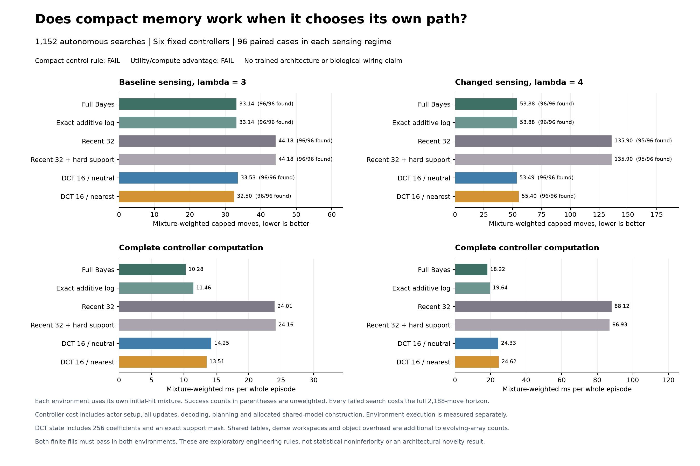
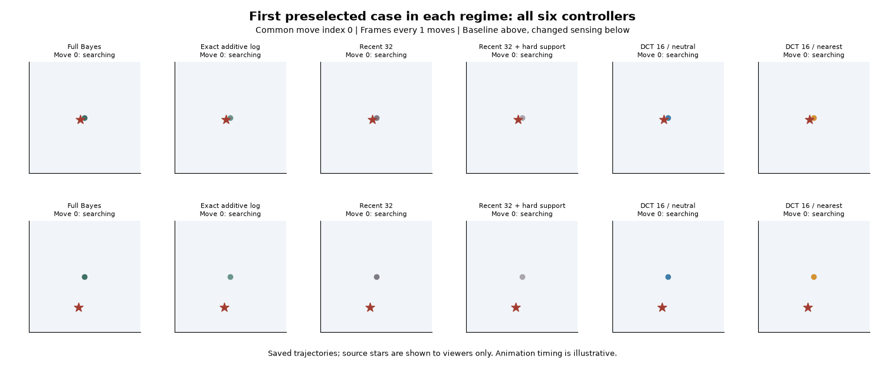

# Compact odor memory choosing its own path

21 September 2026. **1,152 autonomous searches completed.** Both 256-coefficient memories found every source, using **80.79% less evolving array state** than full Bayes. Their mean search lengths were within 2.83% of full Bayes, but controller computation was **31.43-38.67% greater**. The compact-control rule **fails with 39/40 conditions passed**; the stricter utility-versus-compute rule **fails with 8/16 passed**.

This is an implemented classical compression tradeoff. No model was trained, and no learned recurrence, biological-wiring advantage or ICLR contribution is established. The original failed memory-opportunity rule remains unchanged.

## What was tested

The [protocol](otto-spectral-control-protocol.md) and [source-bound plan](../output/otto-spectral-control-v1/plan-01.json) were committed at `a5c742c` before execution. The actor implementations from the [saved-path comparison](otto-spectral-memory-results.md) are unchanged. This time, each actor chooses every action on its own trajectory.

The baseline and shift each contain 96 fresh OTTO cases, eight blocks with four cases per initial-hit category. All six actors share sampled sources and random-number channels within each case. Their actions can produce different observations. Baseline seeds are 630001-630096; shifted seeds are 640001-640096. These integers also occur in unrelated robot studies, but these are previously unused OTTO cases. Actor order rotates across cases.

Both settings use a 53x53 grid, four hit categories, Euclidean sensing, R_dt=2 and a 2,188-move horizon. The sensing length changes from lambda=3 to lambda=4. **Each controller receives the applicable observation model.** This is a known sensing-range change on a fixed grid, not identification of an unknown model or the automatically sized upstream lambda4 benchmark. Source locations, evaluator beliefs and random states are unavailable to actors. Actual numerical likelihood zeros are retained without floors or replacement tails.

All six controllers share the same space-aware action scorer and tie rule. Full Bayes retains the complete posterior; exact log retains additive evidence. Recent32 retains its initial prior, latest readings and visited cells. Recent32_hard also retains all hard exclusions. Each DCT variant retains 256 coefficients and the hard-support mask; the two fixed finite extensions are both evaluated throughout.

## Complete outcomes

Search length includes every unsuccessful episode at the full 2,188-move horizon. Moves and costs below use each regime's qualified initial-hit mixture; found counts are unweighted. The three mixture weights are 0.830998/0.128918/0.040084 for baseline and 0.844502/0.120761/0.034737 for shift. [Saved summary](../output/otto-spectral-control-v1/run-01/summary.json) includes every stratum and block.

| Controller | Base found | Base moves | Base controller ms | Shift found | Shift moves | Shift controller ms |
|---|---:|---:|---:|---:|---:|---:|
| Full Bayes | 96/96 | 33.1368 | 10.2792 | 96/96 | 53.8776 | 18.2194 |
| Exact additive log | 96/96 | 33.1368 | 11.4592 | 96/96 | 53.8776 | 19.6359 |
| Recent 32 | 96/96 | 44.1842 | 24.0071 | 95/96 | 135.9001 | 88.1196 |
| Recent 32 + hard support | 96/96 | 44.1842 | 24.1599 | 95/96 | 135.9001 | 86.9277 |
| DCT16 / neutral | 96/96 | 33.5275 | 14.2538 | 96/96 | 53.4934 | 24.3312 |
| DCT16 / nearest | 96/96 | 32.4988 | 13.5099 | 96/96 | 55.3991 | 24.6203 |

The two recent-history controls each fail only shifted seed **640037**, contributing the full horizon. Their shifted weighted success is **97.3609%**, compared with 100% for full, exact and both DCT variants. All 576 baseline episodes succeed; 574/576 shifted episodes succeed. No episode records a stuck step.

Relative to full Bayes, neutral DCT takes **1.18% more** baseline moves and **0.71% fewer** shifted moves. Nearest DCT takes **1.93% fewer** baseline moves and **2.82% more** shifted moves. The preferred finite fill reverses across settings. Neither can be selected retrospectively to claim a consistent improvement.

Both DCT fills reduce mean moves against recent32 by **24.12-26.45%** at baseline and **59.24-60.64%** under shift. A substantial share of the shifted gain lies in block 3, containing the recent-history failure. Every block remains included below.

## Both frozen decisions fail

The compact-control rule allows up to 5% more moves and 50% more controller computation in exchange for state at most 20% of full Bayes. It also requires no success loss, a mean gain against both recent controls, and positive gains in at least six of eight blocks against recent32_hard. All four fill/regime combinations must pass.

| Combination | Compact conditions passed | Positive blocks / 8 | Strict utility-compute conditions passed |
|---|---:|---:|---:|
| Baseline / neutral | 10/10 | 6 | 1/4 |
| Baseline / nearest | 9/10 | **5, requires 6** | 3/4 |
| Shift / neutral | 10/10 | 8 | 3/4 |
| Shift / nearest | 10/10 | 7 | 1/4 |

The lone compact-rule failure is baseline/nearest block consistency. The stricter rule requires no worse success, moves or total controller computation than full Bayes, with at least one strict time/cost improvement. **All four combinations cost more computation**, so all four fail that rule. Counts of passed conditions do not turn either overall failure into a pass.

Paired block gain below is recent32_hard minus DCT, in mixture-weighted moves; positive favors DCT. These are descriptive engineering checks, not statistical noninferiority tests.

| Block | Base neutral | Base nearest | Shift neutral | Shift nearest |
|---|---:|---:|---:|---:|
| 0 | +8.0304 | +8.5034 | +19.1824 | +21.9914 |
| 1 | -6.2612 | +5.2438 | +39.9410 | +33.3744 |
| 2 | +1.0462 | -7.7438 | +64.8451 | +59.5366 |
| 3 | +43.2991 | +46.8208 | +485.8382 | +484.9507 |
| 4 | +17.8377 | +25.8454 | +3.0261 | +0.3954 |
| 5 | -4.9546 | -4.8971 | +42.5175 | +40.5787 |
| 6 | +26.1120 | +21.0615 | +2.5331 | +5.1878 |
| 7 | +0.1446 | -1.3510 | +1.3697 | -2.0070 |

## State and computation

DCT retains **4,857 bytes** of evolving arrays: 2,048 coefficient bytes and a 2,809-byte support mask. Full Bayes and exact log each retain **25,281 bytes**. Recent32 variants retain 3,577 mutable bytes plus a separate 22,472-byte immutable prior. These counts exclude Python objects, allocator overhead and temporary arrays.

The spectral representation also uses **433,784 bytes** of shared immutable kernel/prior arrays per regime, with an additional 366,368-byte planner kernel. A dense float64 belief grid requires 22,472 bytes; decoding uses dense grids and further transform/planner workspaces. **The 80.79% reduction is in evolving state, not total process memory.** Whole-worker peak RSS was 252,739,584 bytes (241.03 MiB).

Complete controller cost includes initialization, every update, decoding, action scoring and an allocated share of spectral-model construction for exact/DCT actors. Shared-model setup was 0.178667 ms at baseline and 0.188083 ms under shift, charged as setup/96 per applicable episode. Setup was physically performed once per regime, so logical workload allocations are not disjoint contributions to whole-process time. Environment initialization and stepping are reported separately in the saved summary.

The following per-decision costs are **ratios of weighted episode controller time to weighted moves**, not unweighted averages of episode ratios. They retain initialization and the allocated setup cost.

| Controller | Base ms/decision | Shift ms/decision |
|---|---:|---:|
| Full Bayes | 0.3102 | 0.3382 |
| Exact additive log | 0.3458 | 0.3645 |
| Recent 32 | 0.5433 | 0.6484 |
| Recent 32 + hard support | 0.5468 | 0.6396 |
| DCT16 / neutral | 0.4251 | 0.4548 |
| DCT16 / nearest | 0.4157 | 0.4444 |

Updating plus decoding costs **4.28-4.62 ms per baseline DCT episode**, versus **0.893 ms** for full Bayes; shifted costs are **7.43-7.47 ms** versus **1.480 ms**. Accelerating the common planner equally would leave this representation overhead. Timing is one rotated CPU pass, not a repeated deployment latency benchmark.

## Replay and execution evidence

The replay uses case zero in each regime, selected in the protocol before execution. It shows all 139 move indices from 0 through 138, with no frame subsampling. Animation speed is illustrative, and source stars are viewer-only. The favorable first cases do not represent the aggregate comparison. [Replay receipt](../output/otto-spectral-control-v1/figure-01/replay-receipt.json) binds the animation to saved transitions; rendering made no simulator calls.

The native run completed once in **88.896 seconds** under the 900-second supervisor cap, with exit zero and its process group absent. It made **38,636 native calls**: 826 qualification calls plus 37,810 cohort calls. All 20 native qualification checks passed before the cohort, including public/native filtering and full-rank reconstruction. Full/exact cohort beliefs differ from their native reference by at most **5.35e-15 total variation**. The new runner's 39 synthetic tests passed before launch. Those checks establish engineering behavior, not learned efficacy.

An independent saved-output auditor completed **2,819,596 scalar checks** with agreement and a maximum absolute difference of **4.88e-15**. It reconstructs coverage, movement/found joins, recorded action selection, paired cases, component costs, weighted outcomes, block gains and both decision rules, including 1,536 candidate/control episode contrasts. It does not independently reconstruct posteriors, score mathematics, pseudorandom streams or the truth of timing/RSS measurements. Its qualification mathematics are inherited. It made zero simulator or model calls.

- [Worker receipt](../output/otto-spectral-control-v1/run-01/receipt.json), [supervisor terminal](../output/otto-spectral-control-v1/run-process-01.terminal.json) and [execution witness](../output/otto-spectral-control-v1/execution-witness.json).
- [Independent audit receipt](../output/otto-spectral-control-v1/audit-01/receipt.json), [recomputed summary](../output/otto-spectral-control-v1/audit-01/summary.json) and [all paired episode contrasts](../output/otto-spectral-control-v1/audit-01/paired-episodes.jsonl).
- [Runner](../scripts/study_otto_spectral_control.py), [auditor](../scripts/audit_otto_spectral_control.py), [rendering source](../scripts/plot_otto_spectral_control.py) and [upstream source attribution](../third_party/otto/README.md).

## Next hypothesis

A small direct action-score readout could avoid dense belief reconstruction and lookahead. Start with the fixed evidence update, then compare equal-capacity heads using compact evidence, recent history and full belief. Supply only public position, support and prior information; retain every actor's complete state and setup cost. Teacher trajectories must be separate from fresh autonomous evaluation cases.

This is a proposed experiment, not an admitted training run or a contribution claim. It must establish action quality and total cost before adding learned recurrence or biological structure. The present results support compact state retention while leaving both the quality consistency failure and computation penalty unresolved.
