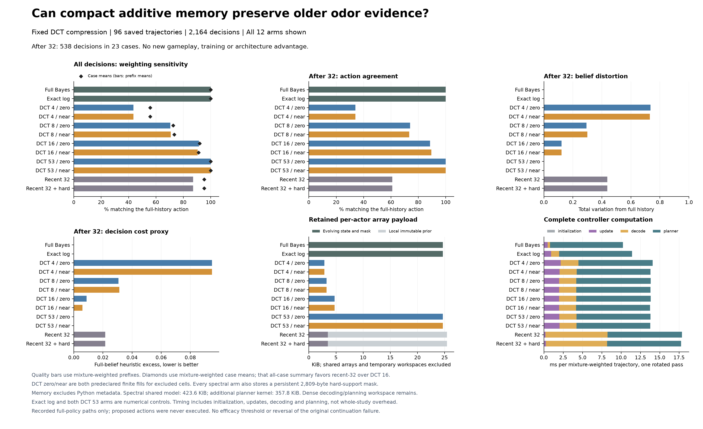

# Compact evidence memory helps long histories, with accuracy and compute costs

21 September 2026. A fixed **256-coefficient additive memory** reproduces
**88.63% / 89.47%** of the full-history controller's decisions after more than
32 observations, versus **60.93%** for retaining the latest 32 observations.
Both predeclared numerical variants improve belief fidelity and the one-step
decision-cost proxy on those recorded prefixes. Their evolving array state is
4,857 bytes, versus 25,281 for the full filter.

This is a useful classical compression baseline. It is **not a trained model,
new architecture result or autonomous search improvement**. Compression also
introduces errors on shorter histories: averaging within each of the 96 cases
before applying the original mixture weights favors recent-32, **95.19% versus
91.84% / 91.17%** agreement. Complete controller computation is about **35% slower
than full Bayes** in this implementation. Shared tables and dense workspaces
remain substantial.

## Fixed comparison

The [protocol](otto-spectral-memory-protocol.md), seven source files and
[plan](../output/otto-spectral-memory-v1/plan-01.json) were frozen in `26f952a`
before the single saved-path run. Every arm receives the same public observations,
initial prior and observation kernel. Every proposed action uses the same
space-aware one-step score function. Execution order rotates across all twelve
arms at each prefix. No proposed action is executed.

All **96 original full-history trajectories and 2,164 decisions** are included.
The after-32 population contains **538 decisions from 23 cases**: 444 decisions
from initial-hit stratum 1, 76 from stratum 2 and 18 from stratum 3. These are
existing development trajectories, not untouched test seeds. A prefix carries
its case's initial-hit mixture weight divided by 32, normalized over the chosen
population. Case-weighted and unweighted summaries are also retained.

The compact state accumulates a truncated orthonormal DCT of each spatial
log-likelihood field, with q=4, 8 or 16 allocating 16, 64 or 256 coefficients.
The exact initial prior is added during decoding. A persistent 2,809-byte mask
excludes the initial zero-support cells, every location visited without finding
the source, and every historical zero-likelihood cell. Both detections and
zero readings update the soft evidence. There are no learned weights, forgetting
gates or historical observation lists inside the compressed actor.

The frozen sensor kernel contains numerical zeros, including 6,993 in its last
category. Before projection, the two variants fill excluded entries with either
zero log evidence or the same category's distance-one log likelihood. Those
entries remain excluded during decoding, but low-rank projection can spread
their influence into permitted cells. Both fills at every rank are reported.
The q=53 controls verify full-rank reconstruction; they are not compression
candidates. Both recent-window controls use stable log arithmetic on their
retained evidence, rather than claiming bitwise probability-product replay.

## Every arm

Quality columns below use the **538 after-32 prefixes** with mixture weighting.
State counts are evolving array payloads, including masks. Time includes
initialization, all updates, decoding and planning over each **whole trajectory**,
then averages over all 96 cases with their original mixture weights. It is one
rotated CPU pass, not a deployment timing benchmark.

| Arm | Late action agreement | Total variation | KL(full to arm) | Heuristic excess | State bytes | ms / whole case |
| --- | ---: | ---: | ---: | ---: | ---: | ---: |
| Full Bayes | 100.00% | 0.00000 | 0.00000 | 0.00000 | 25,281 | 10.242 |
| Exact additive log | 100.00% | 0.00000 | 0.00000 | 0.00000 | 25,281 | 11.417 |
| DCT 4 / neutral | 34.05% | 0.73430 | 2.73966 | 0.09487 | 2,937 | 14.081 |
| DCT 4 / nearest | 34.05% | 0.73067 | 2.68500 | 0.09483 | 2,937 | 13.792 |
| DCT 8 / neutral | 73.95% | 0.29395 | 0.33631 | 0.03063 | 3,321 | 13.828 |
| DCT 8 / nearest | 73.40% | 0.29935 | 0.34043 | 0.03131 | 3,321 | 13.812 |
| DCT 16 / neutral | 88.63% | 0.12187 | 0.05861 | 0.00882 | 4,857 | 13.837 |
| DCT 16 / nearest | 89.47% | 0.12188 | 0.05486 | 0.00594 | 4,857 | 13.755 |
| DCT 53 / neutral | 100.00% | 0.00000 | 0.00000 | 0.00000 | 25,281 | 13.797 |
| DCT 53 / nearest | 100.00% | 0.00000 | 0.00000 | 0.00000 | 25,281 | 13.769 |
| Recent 32 | 60.93% | 0.43743 | 0.80730 | 0.02154 | 3,577 | 17.883 |
| Recent 32 + hard support | 60.93% | 0.43743 | 0.80730 | 0.02154 | 3,577 | 17.766 |

Heuristic excess evaluates the proposed action using the full belief and
subtracts that belief's best available one-step score. It is dimensionless,
not search-time regret, and full Bayes is a reference rather than an optimal
policy oracle. Tiny signed floating-point KL residuals for exact controls
round to zero here; the raw values are preserved without probability floors.

The stronger recent-32 control retains every historical hard exclusion, yet
has the same quality summaries as ordinary recent-32 on this cohort. The
compressed model's improvement therefore concerns retained soft evidence here.
The 64-coefficient variants raise action agreement but **worsen heuristic
excess** versus recent-32. The 16-coefficient variants are poor on all three
late quality measures. More action agreement alone is not a sufficient result.

## Weighting and numerical sensitivity matter

| Action-agreement summary | Recent 32 | DCT 16 neutral | DCT 16 nearest |
| --- | ---: | ---: | ---: |
| All 96 cases, mixture-weighted case means | 95.19% | 91.84% | 91.17% |
| All 2,164 prefixes, mixture-weighted | 87.19% | 91.37% | 90.55% |
| After 32, 23 eligible case means, mixture-weighted | 76.25% | 91.14% | 90.58% |
| After 32, 538 prefixes, mixture-weighted | 60.93% | 88.63% | 89.47% |

Longer cases contribute more to prefix-weighted summaries. Recent-32 preserves
all ordinary observation evidence on short histories; the compressed model
approximates from its first update. Equal weighting of all 96 case means also
favors recent-32: **97.69% versus 93.93% / 94.65%**. No aggregation was selected
as a new success condition. All strata and all per-case values are available
in the saved outputs.

The two fills choose different actions on **1.09%, 3.64% and 3.24%** of weighted
late prefixes for q=4, 8 and 16, respectively. At q=16 their mean belief TV from
one another is **0.05811**. They disagree on **5.28%** of all weighted prefixes.
Their late heuristic excess differs materially, 0.00882 versus 0.00594, even
though both beat recent-32. This representation sensitivity remains unresolved;
the better-looking fill has not been promoted or selected for a claim.

## State reduction is not total-memory or speed reduction

The q=16 evolving state is **80.79% smaller** than the full filter's evolving
arrays. It is larger than recent-32's 3,577-byte ring-and-mask state. Recent
controls additionally retain a 22,472-byte immutable prior. The compressed and
exact-log models share **433,784 bytes** of kernel and prior tables, while the
study also retains a **366,368-byte** read-only kernel for planning. Python
metadata and allocator overhead are excluded from these payload counts.

Every decoded float64 grid occupies 22,472 bytes. Decoding returns both a
probability grid and a log grid, and the transforms and planner allocate further
dense temporary arrays. Small coefficients do not remove those costs. All DCT
ranks have similar runtime because this implementation still transforms and
decodes the full grid. The measured q=16 variants are 34.3-35.1% slower than
full Bayes, although faster than reconstructing recent-32 for every decision.

The full study completed once in **11.609902 seconds**, using **74,448,896 bytes**
peak process RSS. This contains all arms and reporting data, not one deployed
actor's peak memory. Measured controller work totals 9.6740 seconds; import,
authentication, trace reading, checks and serialization account for additional
elapsed time. Runtime was Python 3.12.13, NumPy 2.5.3 and SciPy 1.18.1 on arm64,
with numerical thread counts fixed to one.

## Verification and consequence

There is passing evidence for **42 model and 32 runner synthetic cases**.
The first model test attempt exposed an integer-dtype mistake in the independent
test oracle, not production code. Its failure is preserved; the corrected two
fill cases both passed. Final source review cleared the model and runner before
the source-pinned invocation.

All four reference/qualification arms reproduce all **2,164 saved actions**.
Maximum action-score error is **4.40e-14**, and the maximum full-rank/exact-log
posterior TV is **1.78e-14**. No decoded probability underflow or reference
support-underflow discrepancy was observed. These checks qualify arithmetic;
they do not establish control performance.

An independent saved-output reader agrees on **258,520 checks**, with zero
numerical discrepancy across all twelve arms, 96 cases and 2,164 prefixes.
It recomputes reporting aggregates, conditional weights, score/action joins,
timing sums and storage consistency. It does not independently reconstruct
posteriors or verify the underlying TV/KL and mask contents. The audit completed
once in 0.428707 seconds with zero model or environment calls.

This screen supplies a concrete fixed-memory comparator for later recurrence
research. DCT compression is established mathematics, and the sensor model is
supplied. Nothing here establishes biological wiring, learning, JEPA or a new
world model. [Prior work and mechanism context](otto-compact-evidence-directions.md).
The original autonomous study's **9/10 continuation failure remains unchanged**.

The next meaningful evidence would be a separately frozen autonomous comparison
on fresh cases, retaining both q=16 fills, full Bayes, exact additive memory and
recent-history controls. That would test whether compression errors compound
or preserve utility under actions selected by the compressed controller itself.
Before attributing anything to a learned recurrence, it should also face a
control that preserves recent evidence exactly and compresses only older
evidence. Support-aware projection is another hypothesis for eliminating the
arbitrary-fill influence, but its solver cost and prior-art overlap must be
tested. Neither proposal is an established result or a training admission.

## Artifacts

- [Model](../src/openjev/research/otto_spectral_memory.py),
  [study runner](../scripts/study_otto_spectral_memory.py),
  [model tests](../tests/test_otto_spectral_memory.py),
  [runner tests](../tests/test_otto_spectral_study.py).
- [Plan and source pins](../output/otto-spectral-memory-v1/plan-01.json),
  [synthetic evidence](../output/otto-spectral-memory-v1/engineering-01),
  [actual execution witness](../output/otto-spectral-memory-v1/execution-witness.json).
- [Every prefix](../output/otto-spectral-memory-v1/run-01/prefixes.jsonl),
  [every case](../output/otto-spectral-memory-v1/run-01/cases.jsonl),
  [all summaries](../output/otto-spectral-memory-v1/run-01/summary.json),
  [completed receipt](../output/otto-spectral-memory-v1/run-01/receipt.json).
- [Figure PDF](../output/otto-spectral-memory-v1/figure-04/spectral-memory.pdf),
  [plotted values](../output/otto-spectral-memory-v1/figure-04/plotted-values.json),
  [renderer](../scripts/plot_otto_spectral_memory.py).
- [Independent reporting audit](../output/otto-spectral-memory-v1/audit-01/summary.json),
  [audit receipt](../output/otto-spectral-memory-v1/audit-01/receipt.json),
  [reader source](../scripts/audit_otto_spectral_summary.py).
