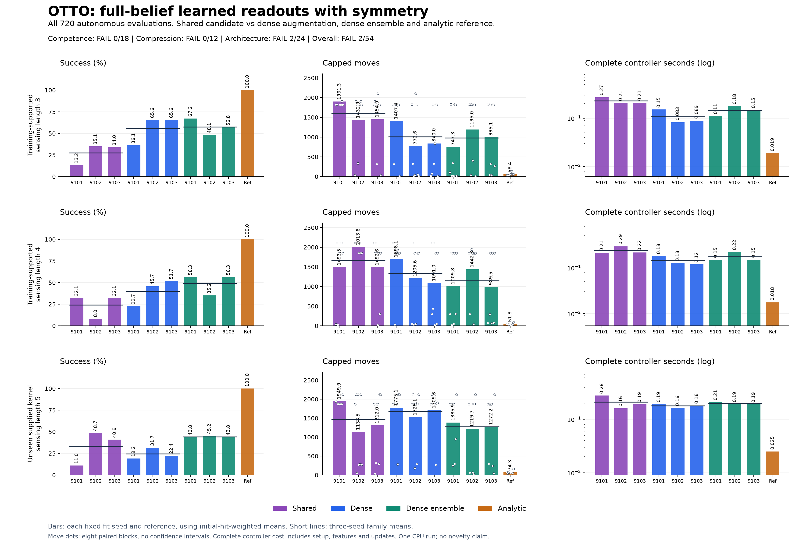
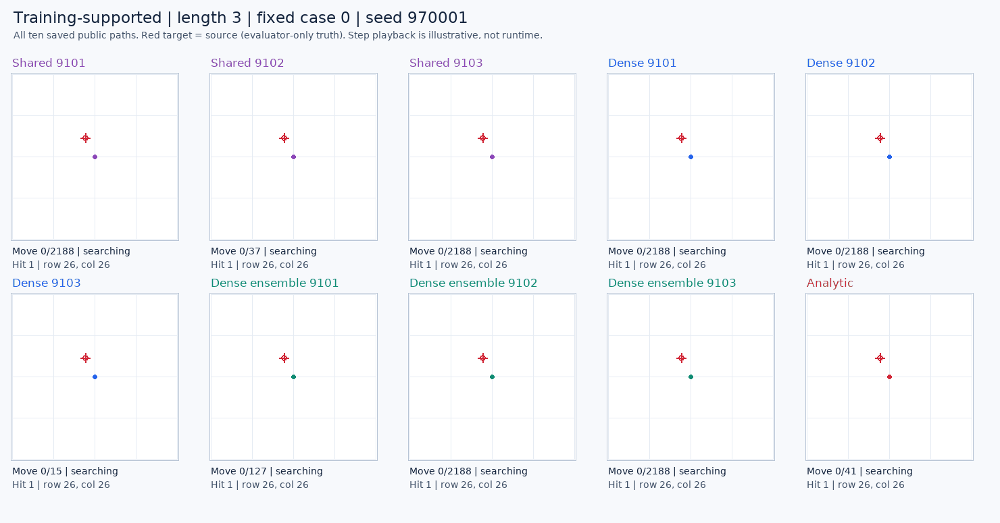

# Symmetry and student-state training did not fix autonomous search

**The completed pilot fails: 2 of 54 conditions pass.** All six models completed both training stages and all 720 autonomous evaluations finished. The shared symmetry candidate fails all 18 competence and all 12 compression conditions. Its weighted success is **27.40%, 24.09% and 33.51%** across sensing lengths three, four and five, versus **100%** for analytic control. Complete controller computation is also higher.

This rejects the tested full-belief scoring recipe. It does not establish a compact-memory, recurrent-world-model, biological-wiring or new architecture advantage. Every earlier failed study remains unchanged.

[Frozen protocol](otto-symmetry-head-protocol.md) · [Plan](../output/otto-symmetry-head-v1/plan-01.json) · [Independent summary](../output/otto-symmetry-head-v1/audit-01/summary.json) · [All checkpoints and raw data](https://github.com/kw2828/OpenJev/releases/tag/otto-symmetry-head-v1)

## What was compared

All models receive the same 2,836 features: the complete public posterior, public position, moving-direction mask, sensing length and twenty local observation forecasts. The shared candidate uses a 91,329-parameter scalar network across eight rotations/reflections. Its dense control uses 91,380 parameters, with eight-view augmentation during training. Dense ensemble averages eight inverse-permuted scores from the exact same dense checkpoint; it is not an additional trained model.

Each architecture uses fitting seeds 9101, 9102 and 9103. Initial training uses 192 analytic-teacher episodes and 5,052 retained prefixes; 48 separate validation episodes supply 1,035 prefixes. Six initial students then collect 144 trajectories, contributing 4,596 prefixes. All six models continue on the identical pooled 9,648-row, 336-episode dataset with continued Adam states. Every model trains for 40 initial and 40 final epochs. Final checkpoints are fixed, with no validation-based selection. Targets are relative analytic action preferences, not optimal Q-values or calibrated probabilities.

Sensing lengths three and four appear in training. Length five is an unseen **supplied-kernel setting** on the same 53x53 grid, not an unknown observation model. Evaluation includes 24 paired cases per setting, with eight cases in each initial-hit stratum and all ten arms on every case. Failed searches contribute the full 2,188 moves. Arm order rotates; sources and channel-indexed random uniforms are paired.

## Complete autonomous results

Family means average all three fitting seeds. Success, capped moves and controller time first average within initial-hit strata and then apply the saved native mixture. Raw counts are separate, so a raw success fraction need not match weighted success.

| Setting | Family | Weighted success | Capped moves | Controller ms/search |
| --- | --- | ---: | ---: | ---: |
| lambda3 | Analytic | 100.00% | 58.36 | 19.001 |
| lambda3 | Shared symmetry | 27.40% | 1596.36 | 229.924 |
| lambda3 | Dense | 55.76% | 1006.68 | 107.734 |
| lambda3 | Dense ensemble | 57.38% | 979.15 | 145.285 |
| lambda4 | Analytic | 100.00% | 51.78 | 17.626 |
| lambda4 | Shared symmetry | 24.09% | 1666.65 | 240.128 |
| lambda4 | Dense | 40.03% | 1331.53 | 142.254 |
| lambda4 | Dense ensemble | 49.23% | 1147.19 | 173.766 |
| lambda5 | Analytic | 100.00% | 74.28 | 24.920 |
| lambda5 | Shared symmetry | 33.51% | 1466.80 | 210.101 |
| lambda5 | Dense | 24.41% | 1669.91 | 179.275 |
| lambda5 | Dense ensemble | 44.24% | 1292.61 | 197.801 |

All **213 censored learned-policy searches** are retained. Every analytic search succeeded. The shared candidate improves on single-view dense only for two criteria in length five; this weaker-comparator result does not satisfy competence, complete-cost or the broader architecture rule.

### Every fit and control

| Setting | Arm / fitting seed | Raw found | Weighted success | Capped moves | Controller ms/search |
| --- | --- | ---: | ---: | ---: | ---: |
| lambda3 | analytic_inbounds | 24/24 | 100.00% | 58.36 | 19.001 |
| lambda3 | shared@9101 | 13/24 | 13.18% | 1901.33 | 271.689 |
| lambda3 | shared@9102 | 15/24 | 35.06% | 1432.85 | 208.381 |
| lambda3 | shared@9103 | 15/24 | 33.95% | 1454.89 | 209.701 |
| lambda3 | dense@9101 | 17/24 | 36.06% | 1407.39 | 151.226 |
| lambda3 | dense@9102 | 19/24 | 65.61% | 772.61 | 82.610 |
| lambda3 | dense@9103 | 19/24 | 65.61% | 840.04 | 89.365 |
| lambda3 | dense_ensemble@9101 | 20/24 | 67.23% | 747.29 | 110.894 |
| lambda3 | dense_ensemble@9102 | 19/24 | 48.06% | 1195.01 | 177.463 |
| lambda3 | dense_ensemble@9103 | 19/24 | 56.84% | 995.15 | 147.500 |
| lambda4 | analytic_inbounds | 24/24 | 100.00% | 51.78 | 17.626 |
| lambda4 | shared@9101 | 15/24 | 32.13% | 1493.55 | 212.785 |
| lambda4 | shared@9102 | 11/24 | 8.00% | 2013.81 | 292.237 |
| lambda4 | shared@9103 | 15/24 | 32.13% | 1492.59 | 215.362 |
| lambda4 | dense@9101 | 14/24 | 22.65% | 1698.08 | 180.904 |
| lambda4 | dense@9102 | 18/24 | 45.71% | 1205.56 | 127.724 |
| lambda4 | dense@9103 | 16/24 | 51.74% | 1090.95 | 118.133 |
| lambda4 | dense_ensemble@9101 | 19/24 | 56.27% | 1009.79 | 150.056 |
| lambda4 | dense_ensemble@9102 | 17/24 | 35.15% | 1442.31 | 220.654 |
| lambda4 | dense_ensemble@9103 | 19/24 | 56.27% | 989.48 | 150.588 |
| lambda5 | analytic_inbounds | 24/24 | 100.00% | 74.28 | 24.920 |
| lambda5 | shared@9101 | 12/24 | 10.97% | 1949.94 | 278.574 |
| lambda5 | shared@9102 | 14/24 | 48.68% | 1138.49 | 160.712 |
| lambda5 | shared@9103 | 15/24 | 40.89% | 1311.97 | 191.017 |
| lambda5 | dense@9101 | 12/24 | 19.15% | 1775.12 | 192.644 |
| lambda5 | dense@9102 | 15/24 | 31.65% | 1525.06 | 164.187 |
| lambda5 | dense@9103 | 15/24 | 22.42% | 1709.55 | 180.994 |
| lambda5 | dense_ensemble@9101 | 17/24 | 43.76% | 1385.90 | 209.795 |
| lambda5 | dense_ensemble@9102 | 18/24 | 45.20% | 1219.70 | 193.472 |
| lambda5 | dense_ensemble@9103 | 17/24 | 43.76% | 1272.23 | 190.137 |

All hit-stratum results, the eight paired blocks per setting, and all 720 paired-case records remain in the [independent summary](../output/otto-symmetry-head-v1/audit-01/summary.json). Block dots in the chart are descriptive; they are not confidence intervals.

## All frozen conditions

All 54 conditions are required. Displayed values are rounded; decisions use the original full-precision values.

| Rule | Passed | Decision |
| --- | ---: | --- |
| Competence | 0/18 | FAIL |
| Compression | 0/12 | FAIL |
| Architecture | 2/24 | FAIL |

| Condition | Value | Required relation | Threshold | Result |
| --- | ---: | :---: | ---: | :---: |
| competence.lambda3.9101.success | 13.18% | >= | 95.00% | Fail |
| competence.lambda3.9101.moves | 1901.325 | <= | 61.276 | Fail |
| competence.lambda3.9102.success | 35.06% | >= | 95.00% | Fail |
| competence.lambda3.9102.moves | 1432.850 | <= | 61.276 | Fail |
| competence.lambda3.9103.success | 33.95% | >= | 95.00% | Fail |
| competence.lambda3.9103.moves | 1454.893 | <= | 61.276 | Fail |
| competence.lambda4.9101.success | 32.13% | >= | 95.00% | Fail |
| competence.lambda4.9101.moves | 1493.548 | <= | 54.372 | Fail |
| competence.lambda4.9102.success | 8.00% | >= | 95.00% | Fail |
| competence.lambda4.9102.moves | 2013.810 | <= | 54.372 | Fail |
| competence.lambda4.9103.success | 32.13% | >= | 95.00% | Fail |
| competence.lambda4.9103.moves | 1492.591 | <= | 54.372 | Fail |
| competence.lambda5.9101.success | 10.97% | >= | 95.00% | Fail |
| competence.lambda5.9101.moves | 1949.936 | <= | 77.997 | Fail |
| competence.lambda5.9102.success | 48.68% | >= | 95.00% | Fail |
| competence.lambda5.9102.moves | 1138.494 | <= | 77.997 | Fail |
| competence.lambda5.9103.success | 40.89% | >= | 95.00% | Fail |
| competence.lambda5.9103.moves | 1311.971 | <= | 77.997 | Fail |
| compression.lambda3.success | 27.40% | >= | 100.00% | Fail |
| compression.lambda3.moves | 1596.356 | <= | 61.276 | Fail |
| compression.lambda3.cost80 | 0.229924 s | <= | 0.015201 s | Fail |
| compression.lambda3.every_cost | 0.271689 s | < | 0.019001 s | Fail |
| compression.lambda4.success | 24.09% | >= | 100.00% | Fail |
| compression.lambda4.moves | 1666.650 | <= | 54.372 | Fail |
| compression.lambda4.cost80 | 0.240128 s | <= | 0.014101 s | Fail |
| compression.lambda4.every_cost | 0.292237 s | < | 0.017626 s | Fail |
| compression.lambda5.success | 33.51% | >= | 100.00% | Fail |
| compression.lambda5.moves | 1466.800 | <= | 77.997 | Fail |
| compression.lambda5.cost80 | 0.210101 s | <= | 0.019936 s | Fail |
| compression.lambda5.every_cost | 0.278574 s | < | 0.024920 s | Fail |
| architecture.lambda3.dense.success | 27.40% | >= | 55.76% | Fail |
| architecture.lambda3.dense.moves | 1596.356 | <= | 956.347 | Fail |
| architecture.lambda3.dense.positive_blocks | 1 | >= | 6 | Fail |
| architecture.lambda3.dense.cost | 0.229924 s | <= | 0.107734 s | Fail |
| architecture.lambda3.dense_ensemble.success | 27.40% | >= | 57.38% | Fail |
| architecture.lambda3.dense_ensemble.moves | 1596.356 | <= | 930.193 | Fail |
| architecture.lambda3.dense_ensemble.positive_blocks | 2 | >= | 6 | Fail |
| architecture.lambda3.dense_ensemble.cost | 0.229924 s | <= | 0.145285 s | Fail |
| architecture.lambda4.dense.success | 24.09% | >= | 40.03% | Fail |
| architecture.lambda4.dense.moves | 1666.650 | <= | 1264.955 | Fail |
| architecture.lambda4.dense.positive_blocks | 3 | >= | 6 | Fail |
| architecture.lambda4.dense.cost | 0.240128 s | <= | 0.142254 s | Fail |
| architecture.lambda4.dense_ensemble.success | 24.09% | >= | 49.23% | Fail |
| architecture.lambda4.dense_ensemble.moves | 1666.650 | <= | 1089.835 | Fail |
| architecture.lambda4.dense_ensemble.positive_blocks | 1 | >= | 6 | Fail |
| architecture.lambda4.dense_ensemble.cost | 0.240128 s | <= | 0.173766 s | Fail |
| architecture.lambda5.dense.success | 33.51% | >= | 24.41% | Pass |
| architecture.lambda5.dense.moves | 1466.800 | <= | 1586.414 | Pass |
| architecture.lambda5.dense.positive_blocks | 4 | >= | 6 | Fail |
| architecture.lambda5.dense.cost | 0.210101 s | <= | 0.179275 s | Fail |
| architecture.lambda5.dense_ensemble.success | 33.51% | >= | 44.24% | Fail |
| architecture.lambda5.dense_ensemble.moves | 1466.800 | <= | 1227.978 | Fail |
| architecture.lambda5.dense_ensemble.positive_blocks | 2 | >= | 6 | Fail |
| architecture.lambda5.dense_ensemble.cost | 0.210101 s | <= | 0.197801 s | Fail |

## Recorded validation and autonomous behavior

Validation teacher-action agreement is higher for the shared model, despite its poor autonomous searches. This illustrates the limited diagnostic value of teacher matching for this recipe. These are descriptive recorded validation metrics; no checkpoint was selected from them. Dense cross entropy averages eight augmented views, while its reported action agreement uses the untransformed readout.

| Final fit | Episode-weighted validation CE | Row-level teacher-action agreement |
| --- | ---: | ---: |
| shared@9101 | 0.9666 | 74.20% |
| dense@9101 | 1.0152 | 65.41% |
| shared@9102 | 0.9750 | 75.36% |
| dense@9102 | 0.9989 | 66.86% |
| shared@9103 | 0.9591 | 77.58% |
| dense@9103 | 1.0006 | 67.15% |

Every learned arm receives the student-data aggregation round. This comparison therefore does not isolate its causal benefit. It tests the final matched recipes and does not establish that symmetry or aggregation generally harms learning.

## Saved failure trajectories

A separate post hoc reader inspected all 720 saved episodes, without new policy or simulator calls. **164 of 213 failed learned searches alternate between two positions throughout the last 256 pre-action positions.** This is 80 of 91 shared failures, 47 of 71 dense failures and 37 of 51 ensemble failures. These are raw episode counts, not the mixture-weighted success rates above.

There are **no exactly-zero-mass posterior packets** and **no exact repeated `(position, posterior hash)` decision states** in any episode. The spatial oscillation therefore occurs while the saved posterior hashes change. This does not prove a causal mechanism, exclude near-zero numerical problems, or show that an anti-reversal rule would help. Immediate reversal can be useful during search.

The diagnostic defines lag-two equality on the last `min(256, steps)` pre-action positions, excluding the final update. It separately includes that final update when checking zero mass. All 720 episode records and all 30 arm/setting summaries are retained. Diagnostic runtime was 15.951 seconds, with peak RSS 36,732,928 bytes. Its definitions were fixed before reading the trajectories; its question was motivated by the completed failed study. The original 2/54 result is unchanged.

[Diagnostic summary and definitions](../output/otto-symmetry-head-v1/diagnostic-01/summary.json) · [All episode records](../output/otto-symmetry-head-v1/diagnostic-01/episodes.jsonl) · [Execution witness](../output/otto-symmetry-head-v1/diagnostic-execution-witness.json)

## Complete computation and execution

Controller time includes each episode's public-filter and feature-map initialization, every posterior update, feature/crop/transform/readout/mask operation, and allocated runtime-head loading. Nine heads are loaded separately, each charged over 72 episodes; one shared model-module setup is charged over all 648 learned episodes. Measured nested artifact I/O is excluded without double-counting inference. Simulator time is separate. These timings come from one rotated CPU run, not repeated deployment benchmarking.

Learned episodes reuse the qualified public actor as a filter, including its allocated but unused Manhattan-distance table. That storage and construction cost are retained. An extra immutable feature kernel is also counted. Learned evaluation never calls the analytic action objective.

| Phase | Seconds |
| --- | ---: |
| dagger collection seconds | 257.081 |
| final fitting seconds | 63.694 |
| initial fitting seconds | 33.352 |
| train collection seconds | 13.761 |
| validation collection seconds | 2.817 |

The worker took **1374.020 seconds**, enclosed by **1374.784 seconds** of suspend-inclusive supervisor time, below the 5,400-second cap. Peak worker RSS was **801,128,448 bytes**, below 8 GiB. All **1,115 resets**, **611,788 native steps** and **27,840 optimizer updates** returned. The 41 closed scientific payloads total **838,294,060 bytes**, below 2 GiB. Both processes exited and their group was absent at readback.

[Worker receipt](../output/otto-symmetry-head-v1/run-01/receipt.json) · [Supervisor](../output/otto-symmetry-head-v1/run-process-01.terminal.json) · [Execution witness](../output/otto-symmetry-head-v1/execution-witness.json)

## Independent audit and reproducibility

The independent reader completed **12,108,280 checks** with exact aggregate agreement. It reconstructed **611,788 public updates** and replayed **602,282 saved NumPy checkpoint decisions**, with maximum score difference **zero** and no near-tie action deviations. All 12 checkpoints, 480 epoch-order witnesses, 96 validation records, retained feature/target rows, pooled weights, costs and 54 conditions were checked. It took **190.310 seconds**, with peak RSS **528,924,672 bytes**.

The audit performs local checkpoint computations, which are counted explicitly. It does not rerun training or the native simulator. Original optimizer trajectories, analytic target generation, native random execution, Torch export checks and timing truth remain authenticated execution evidence. This limits what independent agreement establishes.

[Audit receipt](../output/otto-symmetry-head-v1/audit-01/receipt.json) · [Audit execution witness](../output/otto-symmetry-head-v1/audit-execution-witness.json) · [All fit records](../output/otto-symmetry-head-v1/run-01/fits.jsonl)

All **115** combined engineering tests passed before the study was frozen and pushed in commit `bfe701f`. The earlier synthetic auditor fixture omission and its correction remain preserved in the engineering evidence. These tests establish implementation checks, not efficacy. No scientific run was restarted and no evaluation case was replaced.

## Fixed replays and saved files

All three GIFs use the protocol's first case, with all ten arms. Red source markers show evaluator-only truth that the policies did not receive. Playback timing is illustrative; capped failures remain visible.

[Length-four replay](../output/otto-symmetry-head-v1/figure-01/replay-lambda4-case0.gif) · [Unseen length-five replay](../output/otto-symmetry-head-v1/figure-01/replay-lambda5-case0.gif) · [All replay packets](../output/otto-symmetry-head-v1/figure-01/replay-cases.json) · [Plotted values](../output/otto-symmetry-head-v1/figure-01/plotted-values.json)

The [release archive](https://github.com/kw2828/OpenJev/releases/tag/otto-symmetry-head-v1) preserves all 42 original run files, including twelve checkpoints, full training arrays, complete trajectories and work records, plus five provenance files. The archive manifest and restoration instructions document byte verification. Small summaries, checkpoint files, receipts and figures are available directly in Git.

[Archive manifest](../output/otto-symmetry-head-v1/release-01/manifest.json) · [Restore instructions](../output/otto-symmetry-head-v1/release-01/RESTORE.md)

## Next decision

Full-belief competence failed, so the next experiment should address the action/value readout before adding a compressed recurrent state. The saved trajectories motivate a prospective comparison of value models with explicit observation branches and matched training data. A simple reversal penalty would need its own matched control, since the observed oscillation does not establish that reversal causes failure. Neither this negative result nor applying an established POMDP value representation is a novelty claim.
