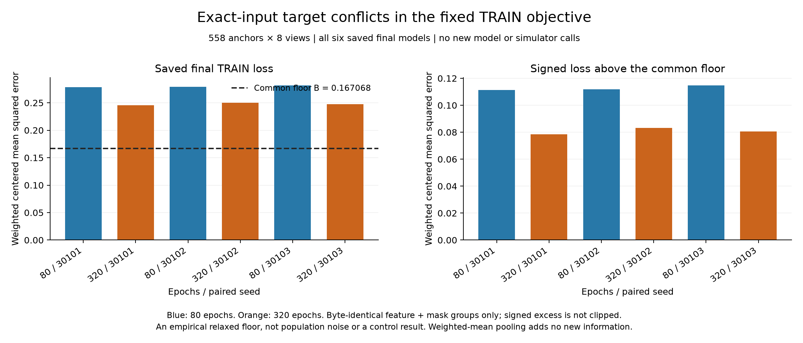

# Exact-input target conflicts in the fixed TRAIN objective

**A common empirical loss component of 0.167067503 accounts for 67.40% of the 320-epoch models' mean final TRAIN loss.** It comes from conflicting saved targets at byte-identical encoded inputs with identical action masks. The independent saved-data audit agrees. This is a descriptive diagnosis, not a new model, an estimate of population noise or a control-performance result.

The calculation retains all **558 anchors from 144 episodes, eight views each, and six fixed final models** from the [80-versus-320-epoch study](otto-training-budget-results.md). That study still fails its autonomous rule, with **10/33 conditions passed**.

## All six fixed models

| Epochs | Seed | Saved loss `L` | Common floor `B` | Signed excess `L-B` |
|---|---:|---:|---:|---:|
| 80 | 30101 | 0.278423330 | 0.167067503 | 0.111355827 |
| 320 | 30101 | 0.245633934 | 0.167067503 | 0.078566432 |
| 80 | 30102 | 0.278784384 | 0.167067503 | 0.111716881 |
| 320 | 30102 | 0.250296412 | 0.167067503 | 0.083228909 |
| 80 | 30103 | 0.281891136 | 0.167067503 | 0.114823634 |
| 320 | 30103 | 0.247688970 | 0.167067503 | 0.080621468 |
| 80 | **All-three mean** | **0.279699617** | **0.167067503** | **0.112632114** |
| 320 | **All-three mean** | **0.247873106** | **0.167067503** | **0.080805603** |

Means give the three fit seeds equal weight. Longer training lowers the remaining empirical excess by 28.26%, but a smaller TRAIN objective does not establish competent action selection. Values are rounded here; [the saved summary](../output/otto-target-conflicts-v1/run-01/summary.json) retains full precision.

## What was measured

The **4,464 view occurrences form 2,672 exact feature-and-mask groups**: 2,360 singletons and 312 duplicate groups containing 2,104 occurrences. All 312 duplicate groups contribute positive within-group target deviation; the largest contains 48 occurrences. Full bytes are checked inside hash buckets. Signed zeros remain distinct, and approximate neighbors or different transformed inputs are never merged.

Within each group, `B` sums weighted squared deviations from the weighted mean target, averaging over eligible actions and dividing the total by **558 × 8**. It uses the original rounded float32 targets and weights upcast to float64. The rounded row-weight sum is 557.9999994040; this does not replace the fixed denominator. Singletons contribute exactly zero.

Every model's maximum within-group centered saved-score spread is **zero**. The largest difference between recomputed `L` and the earlier saved diagnostic is 5.55e-17. The independent checker uses the frozen tolerance `1e-12 + 1e-11 × abs(reference)` and checks all memberships, transformed bytes, group reductions and six losses. It records **160,767 comparisons** with agreement.

## Interpretation and limits

For a deterministic function on these fixed inputs, replacing each group's targets by its weighted mean, **while preserving total group weights**, changes the real squared-error objective only by the additive constant `B`. Pooling therefore supplies no new information and is not, by itself, a new policy-learning mechanism. A minibatch implementation may follow a different optimization path; this diagnostic did not test one.

`B` is an irreducible empirical component under the relaxed identical-input constraint. Free group predictions relax network capacity; separating groups by masks also relaxes their shared raw-output constraint. Floating-point centering/output restrictions are relaxed, so this is not a machine-exact bound on Torch training loss. Neither the floor nor the remaining excess identifies whether conflicts arise from sampling variation, encoded information loss, augmentation or another source. No held-out action ranking, fresh trajectory or architecture advantage was measured.

## Cost and evidence

The diagnostic made **zero model, optimizer, teacher-sampler or native-environment calls**. It performed eight saved-feature transformation batches and six saved-score reductions. Worker time was **0.557947 s**, with **0.651644 s** for the original supervising process; peak worker RSS was **151,715,840 bytes**. Its seven payloads total **3,242,141 bytes**, excluding the receipt. The independent arithmetic check took **0.393203 s** inside a **0.444035 s** supervising process. Each had a separately frozen 120-second, one-thread, 1-GiB-RSS, 64-MiB-output allocation. Figure rendering is a separate presentation cost.

The audit independently reconstructs D4 input bytes and saved arithmetic. Historical feature generation, original neural scores and scientific execution remain inherited from the [completed training-study audit](../output/otto-training-budget-v1/audit-01/receipt.json); it does not regenerate them. The [protocol](otto-target-conflicts-protocol.md), [diagnostic source](../scripts/diagnose_otto_target_conflicts.py) and [independent checker](../scripts/audit_otto_target_conflicts.py) define the complete scope. There is no new pass threshold or checkpoint promotion. Byte inspection is portable; strict numerical replay also requires the recorded absolute paths and runtime, or a separately reviewed relocation adapter.

| Evidence | SHA-256 |
|---|---|
| [plan-01.json](../output/otto-target-conflicts-v1/plan-01.json) | `c0b8cd41d6b72765826cf90c3075e3b27b36d257e44d5f354787062f9e315c43` |
| [run-01/receipt.json](../output/otto-target-conflicts-v1/run-01/receipt.json) | `c7de63b08367989b4cccdd7c8334fa6f6b7fb05d987f2ffd099445461cca47b7` |
| [supervision-01.terminal.json](../output/otto-target-conflicts-v1/supervision-01.terminal.json) | `9b1034dcfae40a58fb5db442db680071a49c0ae4691477545e357b1e395c05e4` |
| [audit-01/receipt.json](../output/otto-target-conflicts-v1/audit-01/receipt.json) | `ccb50d19ec23c5218f715c3825cb3601dad541c2eb3fccc3b0771a2935b23326` |
| [audit-supervision-01.terminal.json](../output/otto-target-conflicts-v1/audit-supervision-01.terminal.json) | `4fe033e7d1f1b2c27513b0568d339c42947f83f1fbb6ce0ffe4236ec8f075329` |
