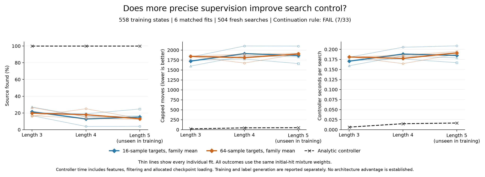

# Teacher-target precision: 16 versus 64 continuations

**The matched precision intervention failed its frozen rule: 7/33 conditions passed, including 0/18 competence conditions.** R64 improved the family mean at sensing length 4, but regressed at lengths 3 and 5 and failed every paired-block consistency condition. The analytic controller found all 72 sources. Sampling, six fits, 504 evaluation episodes and the independent saved-record audit completed successfully; technical completion did not establish a competent learned policy.

## Matched experiment

The [frozen protocol](otto-target-precision-protocol.md) compares labels formed from 16 versus 64 teacher continuations on the same 558 public TRAIN anchors from 144 learner trajectories. Every anchor and eligible action was retained. R16 reuses replicate IDs 0-15 and the original features, masks, centered targets, float32 casts and episode weights. R64 appends IDs 16-63, combines integer cost sums before division by 64, and centers over eligible actions. Both use the original R16 global RMS, **1.9131089760854865**. R64's own RMS is diagnostic only; it does not rescale its training targets.

Both arms use the same ordinary 2,836→32→16→4 Tanh head with 91,380 parameters, identical paired initial weights and minibatch orders, and fresh seeds 20101-20103. Each fit runs 80 epochs, batch size 128, Adam at 0.0003 and gradient clipping 5. Training averages masked, centered cost regression over eight D4 views. Deployment uses a single view, eligible-action selection and the exact public posterior, without a teacher fallback. All six final checkpoints were evaluated; there was no validation-based checkpoint or seed selection.

Evaluation uses 24 fresh paired cases per sensing length, seven arms and the full 2,188-move horizon: 504 episodes on 72 environmental cases. Each arm has eight cases per initial-hit stratum. Means first average within hits 1, 2 and 3, then apply the setting's positive-hit mixture; family means give equal weight to the three fit seeds. Failures receive the full horizon. Length 5 was absent from training, with its known observation kernel supplied at evaluation. Neither the 504 episodes nor the correlated TRAIN anchors are treated as independent samples for a confidence interval.

| Length | Hit 1 weight | Hit 2 weight | Hit 3 weight |
| --- | --- | --- | --- |
| 3 | 0.830998 | 0.128918 | 0.040084 |
| 4 | 0.844502 | 0.120761 | 0.034737 |
| 5 | 0.853772 | 0.115066 | 0.031162 |

## Every family and control

Success is mixture-weighted. Raw found counts are shown separately and are not estimates under that mixture. Controller seconds include initialization, features, selection, filtering and allocated head/module setup; native environment stepping is separate.

| Length | Arm/family | Success | Capped moves | Controller s/episode | Raw found |
| --- | --- | --- | --- | --- | --- |
| 3 | R16 | 21.43% | 1721.91 | 0.170635 | 25/72 |
| 3 | R64 | 19.78% | 1841.77 | 0.181137 | 24/72 |
| 3 | Analytic | 100.00% | 20.52 | 0.006330 | 24/24 |
| 4 | R16 | 12.79% | 1911.09 | 0.188378 | 17/72 |
| 4 | R64 | 17.89% | 1809.07 | 0.177551 | 18/72 |
| 4 | Analytic | 100.00% | 45.92 | 0.014859 | 24/24 |
| 5 | R16 | 15.11% | 1863.42 | 0.184902 | 21/72 |
| 5 | R64 | 13.06% | 1903.74 | 0.191352 | 16/72 |
| 5 | Analytic | 100.00% | 48.98 | 0.016568 | 24/24 |

Across settings, raw counts are **63/216 for R16, 58/216 for R64 and 72/72 for analytic**. These pooled counts do not replace the per-setting weighted comparisons. R64's length-4 mean improvement is observed in these cases, but only three of eight blocks favor it. The length-5 timing condition passes a 5% allowance even though R64 is slower than R16 there; that pass is not a speedup.

All individual fit results remain visible:

| Length | Arm | Success | Capped moves | Controller s/episode | Raw found |
| --- | --- | --- | --- | --- | --- |
| 3 | analytic_inbounds | 100.00% | 20.52 | 0.006330 | 24/24 |
| 3 | r16@20101 | 16.73% | 1824.42 | 0.180530 | 7/24 |
| 3 | r16@20102 | 20.45% | 1743.47 | 0.172023 | 10/24 |
| 3 | r16@20103 | 27.11% | 1597.84 | 0.159353 | 8/24 |
| 3 | r64@20101 | 16.12% | 1837.07 | 0.181568 | 8/24 |
| 3 | r64@20102 | 16.73% | 1851.52 | 0.180958 | 7/24 |
| 3 | r64@20103 | 26.50% | 1836.71 | 0.180885 | 9/24 |
| 4 | analytic_inbounds | 100.00% | 45.92 | 0.014859 | 24/24 |
| 4 | r16@20101 | 3.89% | 2103.19 | 0.205454 | 4/24 |
| 4 | r16@20102 | 18.97% | 1775.49 | 0.176086 | 8/24 |
| 4 | r16@20103 | 15.52% | 1854.61 | 0.183594 | 5/24 |
| 4 | r64@20101 | 25.00% | 1675.17 | 0.164518 | 6/24 |
| 4 | r64@20102 | 13.37% | 1897.30 | 0.185738 | 5/24 |
| 4 | r64@20103 | 15.31% | 1854.74 | 0.182398 | 7/24 |
| 5 | analytic_inbounds | 100.00% | 48.98 | 0.016568 | 24/24 |
| 5 | r16@20101 | 4.05% | 2099.68 | 0.208734 | 5/24 |
| 5 | r16@20102 | 24.73% | 1661.19 | 0.166994 | 8/24 |
| 5 | r16@20103 | 16.55% | 1829.38 | 0.178979 | 8/24 |
| 5 | r64@20101 | 13.28% | 1899.10 | 0.188093 | 5/24 |
| 5 | r64@20102 | 12.23% | 1921.33 | 0.194533 | 5/24 |
| 5 | r64@20103 | 13.67% | 1890.79 | 0.191431 | 6/24 |

The earlier [teacher-target study](otto-teacher-learning-results.md) reported R16 success of 7.75%, 4.11% and 5.83%, compared with 21.43%, 12.79% and 15.11% for this fresh R16 fit/evaluation. The R16 label cache is unchanged, but the fit seeds and evaluation cases changed. This cross-study contrast cannot be attributed to label precision; the causal comparison here is the matched R16 versus R64 pair.

## Paired evaluation blocks

Each entry below is R16 minus R64 family-mean capped moves within one block, with the same hit mixture. Positive values favor R64. All eight blocks are retained; their signs are descriptive and also enter the predeclared count condition.

| Length | Block 0 | Block 1 | Block 2 | Block 3 | Block 4 | Block 5 | Block 6 | Block 7 | Positive |
| --- | --- | --- | --- | --- | --- | --- | --- | --- | --- |
| 3 | -153.94 | -0.39 | 545.06 | -47.38 | 57.75 | -1166.96 | -70.51 | -122.50 | 2/8 |
| 4 | 725.58 | -150.56 | -263.54 | -25.22 | 611.03 | 555.99 | -124.68 | -512.41 | 3/8 |
| 5 | -614.69 | 1266.84 | -83.80 | 0.00 | -0.31 | -643.07 | -128.71 | -118.82 | 1/8 |

## Label precision and sampling cost

The new R48 phase completed **558 panels, 96,912 continuations and 2,708,844 moves**, with all continuations finding the source and none censored. It used 26,784 source draws, 96,912 continuation snapshots, 2,611,932 teacher choices and odor draws, and 2,708,844 public updates including terminal updates. All attempts returned. The 21,973,386 sampler events and 3,348 reductions are retained. Joining the unchanged 32,304 R16 records gives **129,216 combined R64 records**. The forced first move counts toward the horizon; source draws are shared across eligible actions within each replicate, without exposing evaluator truth to the teacher.

All four fixed, disjoint sixteen-replicate blocks are summarized below from [the complete combined-labels.jsonl in the evidence archive](https://github.com/kw2828/OpenJev/releases/tag/otto-target-precision-v1). RMS is over eligible centered means. Paired SE is first averaged over eligible action pairs within an anchor. Both moments and weighted agreement use the original episode-balanced weights, 558/(144 × anchors in the episode). Argmin uses the first numeric action among exact ties; the tie count is also retained.

| Replicate IDs | Centered RMS, moves | Mean paired SE, moves | Argmin match to IDs 0-15 | Weighted match | Tied anchors |
| --- | --- | --- | --- | --- | --- |
| 0-15 | 1.913109 | 2.364714 | 558/558 | 100.00% | 151 |
| 16-31 | 1.943250 | 2.312073 | 260/558 | 46.01% | 151 |
| 32-47 | 2.071386 | 2.352630 | 244/558 | 42.77% | 148 |
| 48-63 | 2.043038 | 2.344355 | 256/558 | 44.79% | 154 |

All four blocks choose the same first argmin on 136/558 anchors. R16 and combined R64 agree on 348/558; combined R64 has 143 tied anchors. Because R16 is part of R64, that agreement is not independent validation. No confidence or agreement threshold filtered the training rows.

The earlier [saved-label noise diagnosis](otto-target-noise-results.md) estimated a centered R16 noise moment of 3.655705 against an observed moment of 3.659986, leaving an untruncated corrected signal of 0.004281; split-half correlation was −0.05218. Those descriptive estimates motivated this trial. The new combined R64 RMS is 1.133757, while the four block RMS values remain near 2 moves. This is consistent with substantial sampling variation, but does not identify a ground-truth action ranking or establish that additional precision improves control.

## All six fits and complete costs

| Fit | Last-epoch weighted MSE | Fit interval, s | Including paired setup, s | Max export difference |
| --- | --- | --- | --- | --- |
| r16@20101 | 0.894571 | 1.300334 | 1.313082 | 2.38e-07 |
| r64@20101 | 0.283690 | 1.281121 | 1.293869 | 2.09e-07 |
| r16@20102 | 0.901945 | 1.313878 | 1.324403 | 2.53e-07 |
| r64@20102 | 0.288864 | 1.314673 | 1.325198 | 1.19e-07 |
| r16@20103 | 0.883063 | 1.332645 | 1.345830 | 1.79e-07 |
| r64@20103 | 0.277881 | 1.301682 | 1.314867 | 1.79e-07 |

Each fit completed 400 updates, for **2,400 total updates and 480 fit-epochs**. All 12 initial/final checkpoint publications and all six export parity checks passed. Parity compares the first 16 TRAIN rows at absolute and relative tolerance 2e-5; it is not an exact action-agreement guarantee near ties. The reported loss is accumulated from the final epoch's pre-update minibatches, not a new fixed-model held-out evaluation. R64's lower loss partly reflects smaller target amplitude under the common scale, so it cannot establish better action rankings.

Fit intervals include optimizer setup, updates, final export, checkpoint reload verification, recorded parity and durable journals. Half of each pair's shared setup is allocated to each arm. The three complete pairs cost 7.917249 seconds. Label generation dominates fitting: historical R16 acquisition cost 342.199729 seconds, newly paid R48 sampling/merging cost **1,028.314761 seconds**, and standalone R64 acquisition therefore totals **1,370.514490 seconds**. The historical work was reused, not rerun or free. Per-fit accounting allocates 114.066576 historical seconds to either standalone family and an additional 342.771587 seconds to each R64 fit; these allocations must not be summed twice into the physical new-study bill.

| Newly paid phase | Seconds |
| --- | --- |
| New R48 collection, merging and storage | 1028.314761 |
| Input authentication | 2.883857 |
| Common input setup | 0.121772 |
| Full evaluation | 1240.614633 |
| Evaluation head restoration | 0.007003 |
| Model module setup | 0.001716 |
| Native setup | 0.662679 |
| Torch setup | 1.195264 |
| Target construction | 0.098968 |
| All three training pairs | 7.917249 |

The disjoint phase sum is **2,281.817903 seconds**. The empirical worker took **2,284.287868 seconds** through final payload hashing; its original supervisor took **2,284.741024 seconds**, including receipt publication and process exit. The separate saved audit took 216.116687 worker seconds and **216.181003 parent seconds**. Recorded journal I/O of 42.808623 seconds overlaps the phase intervals and must not be added again.

Evaluation executed 691,125 native steps, 689,119 learned predictions and 2,006 analytic choices. Each learned head's restoration is allocated over its 72 episodes, with shared module setup over 432 learned episodes. Timing is a single-host, one-thread observation, including this instrumentation and workload. Worker peak RSS was 494,338,048 bytes; its 584 payloads total 1,411,943,348 bytes excluding the receipt, within the frozen 10,800-second, 4-GiB RSS and 32-GiB output bounds.

## Independent audit and interpretation

The [independent audit receipt](../output/otto-target-precision-v1/audit-01/receipt.json) reports **agreement=true and 204,400,013 checks** through payload hashing. It covers 158 source pins, 1,144 input descriptors, 584 worker payloads, all 558 panels, the 96,912 new and 32,304 reused records, 12 checkpoints, six fits, 2,400 updates, 504 episodes and all 33 conditions. Both original supervised processes exited successfully, without timeout or a remaining process group. No empirical sampling, fitting or evaluation was retried.

This is a saved-record audit. It independently checks new source/hit random streams and geometry, complete panel reductions, original R16 preservation, shared-scale target arithmetic, optimizer/checkpoint records and aggregate decisions. Teacher and deployed actions are checked against saved scores; scores, gradients, intermediate posterior filtering and feature generation are not regenerated. Original R16 event replay is inherited from its completed V2 audit. Execution and timing remain authenticated process evidence. The audit does not turn those limits into an independent rerun of learning.

The result rejects this particular R16-to-R64 intervention under the fixed head, optimization recipe, anchors and evaluation rule. It does not show that label precision is irrelevant in general, nor separate optimization limits from representation or data-coverage limits. There is no competent learned controller, architectural advantage, recurrent-memory result or biological-learning claim. Any next experiment needs its own prospective comparison; this failed rule does not authorize promoting an R64 checkpoint.

## All 33 frozen conditions

Totals: **3/3 analytic positive controls, 0/18 R64 competence conditions and 4/12 family-relative conditions**. All 33 were required. Values below are rounded for display; decisions use the saved full precision.

| Group | Named condition | Observed | Required | Result |
| --- | --- | --- | --- | --- |
| Positive control | `lambda3.analytic_control.success` | 1 | ≥ 0.95 | PASS |
| Positive control | `lambda4.analytic_control.success` | 1 | ≥ 0.95 | PASS |
| Positive control | `lambda5.analytic_control.success` | 1 | ≥ 0.95 | PASS |
| R64 competence | `lambda3.20101.success` | 0.161156644 | ≥ 0.95 | FAIL |
| R64 competence | `lambda3.20101.moves` | 1837.074911332 | ≤ 21.542242738 | FAIL |
| R64 competence | `lambda3.20102.success` | 0.167250441 | ≥ 0.95 | FAIL |
| R64 competence | `lambda3.20102.moves` | 1851.520164467 | ≤ 21.542242738 | FAIL |
| R64 competence | `lambda3.20103.success` | 0.265031424 | ≥ 0.95 | FAIL |
| R64 competence | `lambda3.20103.moves` | 1836.705753241 | ≤ 21.542242738 | FAIL |
| R64 competence | `lambda4.20101.success` | 0.25 | ≥ 0.95 | FAIL |
| R64 competence | `lambda4.20101.moves` | 1675.173845867 | ≤ 48.219208999 | FAIL |
| R64 competence | `lambda4.20102.success` | 0.133684257 | ≥ 0.95 | FAIL |
| R64 competence | `lambda4.20102.moves` | 1897.298266387 | ≤ 48.219208999 | FAIL |
| R64 competence | `lambda4.20103.success` | 0.153121472 | ≥ 0.95 | FAIL |
| R64 competence | `lambda4.20103.moves` | 1854.739636353 | ≤ 48.219208999 | FAIL |
| R64 competence | `lambda5.20101.success` | 0.132790473 | ≥ 0.95 | FAIL |
| R64 competence | `lambda5.20101.moves` | 1899.099173237 | ≤ 51.43403104 | FAIL |
| R64 competence | `lambda5.20102.success` | 0.122302495 | ≥ 0.95 | FAIL |
| R64 competence | `lambda5.20102.moves` | 1921.329923593 | ≤ 51.43403104 | FAIL |
| R64 competence | `lambda5.20103.success` | 0.136685709 | ≥ 0.95 | FAIL |
| R64 competence | `lambda5.20103.moves` | 1890.786889878 | ≤ 51.43403104 | FAIL |
| Family relative | `lambda3.success` | 0.197812836 | ≥ 0.21428869 | FAIL |
| Family relative | `lambda3.moves` | 1841.766943013 | ≤ 1635.812995627 | FAIL |
| Family relative | `lambda3.positive_blocks` | 2 | ≥ 6 | FAIL |
| Family relative | `lambda3.controller_cost` | 0.181136984 | ≤ 0.179167061 | FAIL |
| Family relative | `lambda4.success` | 0.178935243 | ≥ 0.127929025 | PASS |
| Family relative | `lambda4.moves` | 1809.070582869 | ≤ 1815.539810008 | PASS |
| Family relative | `lambda4.positive_blocks` | 3 | ≥ 6 | FAIL |
| Family relative | `lambda4.controller_cost` | 0.177551144 | ≤ 0.197796834 | PASS |
| Family relative | `lambda5.success` | 0.130592892 | ≥ 0.151068924 | FAIL |
| Family relative | `lambda5.moves` | 1903.738662236 | ≤ 1770.249608155 | FAIL |
| Family relative | `lambda5.positive_blocks` | 1 | ≥ 6 | FAIL |
| Family relative | `lambda5.controller_cost` | 0.191352304 | ≤ 0.194147449 | PASS |

## Evidence and restoration

- [Frozen protocol](otto-target-precision-protocol.md), [empirical plan](../output/otto-target-precision-v1/plan-01.json), [worker receipt](../output/otto-target-precision-v1/run-01/receipt.json) and [original empirical terminal](../output/otto-target-precision-v1/supervision-01.terminal.json).
- [Complete outcome summary](../output/otto-target-precision-v1/run-01/summary.json), [collection ledger](../output/otto-target-precision-v1/run-01/collection.json), [all fit records](../output/otto-target-precision-v1/run-01/fits.jsonl) and [audit findings](../output/otto-target-precision-v1/audit-01/audit.json).
- [Frozen audit plan](../output/otto-target-precision-v1/audit-plan-01.json), [audit receipt](../output/otto-target-precision-v1/audit-01/receipt.json) and [original audit terminal](../output/otto-target-precision-v1/audit-supervision-01.terminal.json).
- Public evidence: [otto-target-precision-v1](https://github.com/kw2828/OpenJev/releases/tag/otto-target-precision-v1). The current-phase archive requires inherited historical inputs/releases specified by the frozen plan for replay; it is not a standalone reconstruction of the entire lineage.

| Artifact | SHA-256 |
| --- | --- |
| Empirical plan | `921318b9c978b208989ad66210a06adad8f104c827351eda1850f080d9f8a46a` |
| Worker receipt | `34b331507fe8f53058baecdbeed0e3448b91202a6971762949d1ae7017f4bb2a` |
| Empirical parent terminal | `fc3312338d04b5a0955727651e83a62f5907cedff7be007e165d4f4637a71e37` |
| Audit receipt | `549eb00f8a04904f22bb9ff351c35c4e5f965b88a6f1944d0186886ac693baa7` |
| Audit parent terminal | `bf756bbb82639b78de692bf7bc0cba818306ce82d7ca599c99d68ff45b272a34` |
