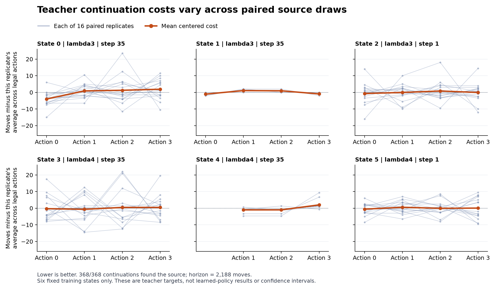

# Teacher continuation costs: six-state feasibility result

**368 paired continuations completed in 6.67 seconds, and the independent saved-output audit agrees.** Every continuation reached the source. This establishes practical label generation at these six fixed learner-visited training states. No model was trained, and no policy or architecture improvement was tested.

Each thin line represents one shared source/observation replicate across legal first actions. Costs are centered within that replicate to show action differences without its common difficulty offset. The orange line is the mean centered cost. These lines are observations, not confidence intervals. [SVG](../output/otto-teacher-label-pilot-v1/report-01/paired-costs.svg) · [Plot data](../output/otto-teacher-label-pilot-v1/report-01/summary.json).

## What was held fixed

The [prospective protocol](otto-teacher-label-pilot-protocol.md) selected one existing learner-TRAIN prefix in each of six sensing-length, initial-hit and collector cells. Selection was lexicographic and did not use teacher scores or continuation outcomes. The [frozen plan](../output/otto-teacher-label-pilot-v1/plan-01.json) and [independent selection check](../output/otto-teacher-label-pilot-v1/selection-review-01.json) agree on all six exact identities and public witnesses.

Four selected prefixes follow 35 observations; two follow one. All six beliefs were reconstructed from original public observations and validated before new source sampling. Original hidden source locations, rewards and native posteriors were excluded. Each anchor has 16 paired replicates, with one fresh source sampled from its public belief per replicate and shared across first actions. Each first action then follows the unchanged analytic teacher, up to H=2,188 total moves. The boundary state has three legal actions; the other five have four. There was one collection, with no replacement, retry or extra samples.

## All action means

Entries are mean total moves, including the forced first action; lower is better. Each entry uses 16 continuations. A dash marks a geometrically unavailable action, not missing work.

| State | Sensing length | Prefix | Action 0 | Action 1 | Action 2 | Action 3 | Lowest-to-next mean gap |
| ---: | ---: | ---: | ---: | ---: | ---: | ---: | ---: |
| 0 | 3 | 35 | 14.7500 | 19.6250 | 20.0000 | 20.6250 | 4.8750 |
| 1 | 3 | 35 | 16.5625 | 18.6875 | 18.5625 | 16.6875 | 0.1250 |
| 2 | 3 | 1 | 14.6250 | 15.2500 | 16.1250 | 15.2500 | 0.6250 |
| 3 | 4 | 35 | 40.8125 | 40.4375 | 41.5625 | 41.5625 | 0.3750 |
| 4 | 4 | 35 | - | 32.8125 | 32.8125 | 35.8125 | 0.0000 |
| 5 | 4 | 1 | 15.1250 | 16.2500 | 15.6250 | 15.7500 | 0.5000 |

All 368 continuations found the source, with no censoring. The longest took 104 moves. This is a deliberately selected feasibility panel, not an estimate of population success, late-state difficulty or performance on untouched evaluation episodes. In five states the two lowest empirical action means differ by at most 0.625 moves; state 4 has an exact lowest-mean tie. All **33 conditional range-only Hoeffding intervals remain unresolved**. The paired standard errors and all individual differences are preserved in the [complete summary](../output/otto-teacher-label-pilot-v1/run-01/summary.json). Neither empirical rankings nor descriptive standard errors establish confident best-action labels.

## Complete generation cost and validation

The original process took **6.6721 seconds** on the local Apple M5 Max CPU, including worker startup, input authentication, all reconstruction, generation, durable journals, reductions and closing checks. The worker recorded 6.5758 seconds through payload hashing; sampler panels accounted for 5.2771 seconds including their checks and I/O. These are nested measurements and must not be added together. Peak worker RSS was **48.6 MiB**, with **17.2 MiB** of output including its receipt. The fixed limits were 1,800 seconds, one numerical thread, 4 GiB RSS and 4 GiB output. This six-state timing does not bound later-state or full-pool costs.

The completed ledger contains 96 source draws, 368 per-action teacher snapshots, 8,197 analytic choices, 8,565 moves and updates, and 8,197 odor draws. Found transitions skip odor draws. The collector also made six anchor-validation and six sampler-validation snapshots. All 69,658 sampler events reconcile with the complete panel. Native simulator, learned-model and optimizer calls were zero. [Worker receipt](../output/otto-teacher-label-pilot-v1/run-01/receipt.json) · [Original supervisor terminal](../output/otto-teacher-label-pilot-v1/supervision-01.terminal.json) · [Execution witness](../output/otto-teacher-label-pilot-v1/execution-witness-01.json).

The independent [auditor](../scripts/audit_otto_teacher_labels.py) checked every saved event, reconstructed 8,293 source/odor categorical selections and all seeded uniforms, verified public movement and update continuity, and independently reduced all six panels. It authenticated 138 source identities, 495 inputs and all 12 worker payloads. Its original process took a separate **2.2468 seconds**, with no fresh rollouts. [Audit receipt](../output/otto-teacher-label-pilot-v1/audit-01/receipt.json) · [Original audit process](../output/otto-teacher-label-pilot-v1/audit-process-01/receipt.json) · [Full audit](../output/otto-teacher-label-pilot-v1/audit-01/audit.json).

Audit limits remain explicit: teacher actions were checked against the saved scores and tie rule, without recomputing analytic scores. Continuation posteriors were independently reconstructed, but the producer did not save posterior witnesses at every continuation step. Exact posterior witness comparisons therefore cover the anchors and original prefix reconstruction. The prior [native qualification](otto-teacher-sampler-qualification-results.md) remains separate mechanical evidence. The root's initial pre-launch check expected a different success-status string from the selection receipt; that check stopped before execution and was corrected without changing the plan or allocation. The correction is preserved in the [execution admission](../output/otto-teacher-label-pilot-v1/execution-admission-01.json).

## What this changes next

The next useful experiment is the [matched supervision comparison](otto-action-cost-followup.md): two copies of one ordinary action policy, trained on the same learner-visited states, using existing analytic-preference targets versus continuous centered teacher-continuation costs. Keep uncertain differences and ties instead of filtering states or assigning hard winners. A larger fixed cohort must cover later retained prefixes and validate every selected belief before sampling; this small pilot establishes neither eligibility nor throughput for that cohort.

The decisive outcome is fresh autonomous competence, with all label-generation, fitting and deployment costs included. Lower target-regression error alone would not establish improved control: after each forced first action here, the analytic teacher repairs subsequent decisions, whereas a deployed student must act repeatedly. Recurrent or connectome-inspired comparisons still need a competent ordinary control and matched conditions. This result is a useful prerequisite, not novel-architecture evidence.
