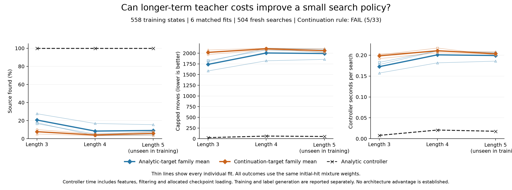

# Matched teacher-cost learning: results

22 September 2026. The single empirical worker completed all labeling, six fits and 504 evaluation episodes. Its saved results **fail the frozen continuation rule: 5/33 conditions pass**, comprising 3/3 analytic positive controls, 0/18 continuation-model competence conditions and 2/12 relative conditions. Continuation-target models have lower family success and higher capped search length than analytic-target models in every setting. The analytic controller finds the source in all 72 cases. No competent learned controller or architectural advantage is established.

The separately frozen V2 saved-output audit completed with agreement on all 558 panels, 32,304 continuations, six fits, 2,400 recorded optimizer updates, 504 episodes and 33 criteria. It performed 88,432,918 checks. This verifies saved-record accounting, random streams, targets and gate calculations; it does not regenerate neural scores, gradients or intermediate posterior filtering. The original failed audit and its narrow arithmetic repair are documented below. No labels, models, evaluation cases or scientific criteria changed.

## Matched experiment

The [frozen protocol](otto-teacher-learning-protocol.md) uses all 558 supported public TRAIN anchors from 144 learner-visited episodes, selected by the earlier [cohort preflight](otto-teacher-cohort-results.md). It retains reset states, repeated states and tied or imprecise panels. No VALID or evaluation data choose targets, checkpoints or hyperparameters.

Both arms use the same ordinary 2,836→32→16→4 Tanh network, with 91,380 parameters. Inputs include the complete square-root public belief, position, legal actions, known sensing length and local forecast masses. The analytic arm regresses centered negative logits derived from the existing heuristic preferences. The continuation arm regresses centered mean capped teacher-search costs from 16 paired replicates per anchor. Each arm uses one episode-weighted TRAIN RMS scale: 1.4264242905605848 and 1.9131089760854865, respectively. This is common cost regression, not a repetition of the older cross-entropy study.

The two arms start from identical weights at each seed 10101, 10102 and 10103. They share episode weights, eight D4 training views, minibatch orders and optimizer settings: fresh Adam at 0.0003, batch 128, gradient clipping 5 and 80 epochs. All six final checkpoints are retained, with 400 updates each and 2,400 total. Deployment uses one view, in-bounds action selection and no teacher fallback.

Fresh evaluation pairs all seven controllers on 24 cases at each sensing length 3, 4 and 5. Every episode continues to discovery or 2,188 moves; unsuccessful runs contribute the full cap. Length 5 is parameter extrapolation with its kernel supplied to the actor. The fixed 72 environmental cases are shared across fit seeds; the 504 episodes are not 504 independent environmental samples.

## Family outcomes and every fit

Success, moves and controller seconds first average within each of the three initial-hit strata, then apply the setting's positive-hit mixture. Family means average all three fit seeds equally. Initial-hit weights for hits 1/2/3 are approximately 0.830998/0.128918/0.040084 at length 3, 0.844502/0.120761/0.034737 at length 4, and 0.853772/0.115066/0.031162 at length 5. Raw fractions use the deliberately balanced cases, so they differ from weighted success.

| Sensing length | Family/controller | Weighted success | Raw found | Capped moves | Controller seconds/episode |
|---|---|---:|---:|---:|---:|
| 3 | Analytic-target | 20.65% | 27/72 | 1738.26 | 0.172452 |
| 3 | Continuation-target | 7.75% | 22/72 | 2019.33 | 0.198380 |
| 3 | Analytic controller | 100.00% | 24/24 | 25.67 | 0.007961 |
| 4 | Analytic-target | 8.42% | 20/72 | 2004.69 | 0.200769 |
| 4 | Continuation-target | 4.11% | 16/72 | 2102.78 | 0.210595 |
| 4 | Analytic controller | 100.00% | 24/24 | 61.35 | 0.020736 |
| 5 | Analytic-target | 9.08% | 22/72 | 1992.70 | 0.199164 |
| 5 | Continuation-target | 5.83% | 18/72 | 2060.94 | 0.203640 |
| 5 | Analytic controller | 100.00% | 24/24 | 52.10 | 0.017800 |

Every seed and the positive control are shown below. There is no best-seed selection.

| Sensing length | Fit/controller | Weighted success | Raw found | Capped moves | Controller seconds/episode |
|---|---|---:|---:|---:|---:|
| 3 | Analytic-target 10101 | 17.73% | 9/24 | 1801.23 | 0.177423 |
| 3 | Analytic-target 10102 | 16.62% | 9/24 | 1827.79 | 0.182737 |
| 3 | Analytic-target 10103 | 27.61% | 9/24 | 1585.75 | 0.157194 |
| 3 | Continuation-target 10101 | 10.06% | 9/24 | 1968.88 | 0.191742 |
| 3 | Continuation-target 10102 | 7.95% | 7/24 | 2015.09 | 0.200854 |
| 3 | Continuation-target 10103 | 5.23% | 6/24 | 2074.00 | 0.202543 |
| 3 | Analytic controller | 100.00% | 24/24 | 25.67 | 0.007961 |
| 4 | Analytic-target 10101 | 3.25% | 5/24 | 2117.31 | 0.210169 |
| 4 | Analytic-target 10102 | 5.19% | 7/24 | 2074.64 | 0.210508 |
| 4 | Analytic-target 10103 | 16.82% | 8/24 | 1822.10 | 0.181631 |
| 4 | Continuation-target 10101 | 5.19% | 7/24 | 2076.31 | 0.205682 |
| 4 | Continuation-target 10102 | 3.89% | 4/24 | 2114.84 | 0.217012 |
| 4 | Continuation-target 10103 | 3.25% | 5/24 | 2117.20 | 0.209090 |
| 4 | Analytic controller | 100.00% | 24/24 | 61.35 | 0.020736 |
| 5 | Analytic-target 10101 | 4.43% | 6/24 | 2091.43 | 0.206836 |
| 5 | Analytic-target 10102 | 7.31% | 8/24 | 2031.19 | 0.204963 |
| 5 | Analytic-target 10103 | 15.50% | 8/24 | 1855.49 | 0.185694 |
| 5 | Continuation-target 10101 | 5.87% | 7/24 | 2060.58 | 0.202531 |
| 5 | Continuation-target 10102 | 7.97% | 7/24 | 2014.13 | 0.200424 |
| 5 | Continuation-target 10103 | 3.66% | 4/24 | 2108.10 | 0.207965 |
| 5 | Analytic controller | 100.00% | 24/24 | 52.10 | 0.017800 |

Across settings, analytic-target models find 69/216 sources, continuation-target models 56/216, and analytic control 72/72. These pooled raw counts are descriptive, not the mixture-weighted gate. All per-hit and eight-block values are retained in the [worker summary](../output/otto-teacher-learning-v1/run-01/summary.json).

## All 33 continuation conditions

The three positive controls pass: each setting has 100% weighted analytic-controller success against a 95% requirement. All 18 individual continuation competence conditions fail. For each of its three fits, each setting requires success at least 95% and capped moves at most 26.956292, 64.417516 and 54.708885, respectively. The nine continuation rows above fail both requirements in every case.

The remaining twelve family-relative conditions are:

| Sensing length | Condition | Continuation value | Required threshold | Result |
|---|---|---:|---:|---|
| 3 | success | 7.75% | >= 20.65% | Fail |
| 3 | moves | 2019.33 | <= 1651.34 | Fail |
| 3 | positive blocks | 2/8 | >= 6/8 | Fail |
| 3 | controller cost | 0.198380 s | <= 0.181074 s | Fail |
| 4 | success | 4.11% | >= 8.42% | Fail |
| 4 | moves | 2102.78 | <= 1904.45 | Fail |
| 4 | positive blocks | 3/8 | >= 6/8 | Fail |
| 4 | controller cost | 0.210595 s | <= 0.210808 s | Pass |
| 5 | success | 5.83% | >= 9.08% | Fail |
| 5 | moves | 2060.94 | <= 1893.07 | Fail |
| 5 | positive blocks | 4/8 | >= 6/8 | Fail |
| 5 | controller cost | 0.203640 s | <= 0.209123 s | Pass |

The only relative passes are controller-cost allowances at lengths 4 and 5. Those costs are within 5% of the analytic-target family; neither is faster. The positive-block counts 2/8, 3/8 and 4/8 are descriptive paired checks, not significance tests. All 33 conditions were required, so `pilot_continuation` is false.

## Labels, fitting and paid work

All 558 anchors and every eligible first action were retained. The sampler drew 8,928 replicate sources from the public posteriors and reused each source across paired first actions. It did not use the original evaluator's hidden source. The 32,304 continuations took 908,718 moves; all 32,304 found the source and none were censored. Every forced first move, teacher choice, hit draw and final update remains in the recorded panel evidence. The worker saved 7,371,738 sampler events. Zero observed censoring does not establish precise action rankings or a confidence-calibrated winning label.

The complete new label phase cost 342.199729 seconds, including sampling, reductions, serialization, gzip, hashing and durable panel boundaries. For method accounting, this is allocated equally across the three continuation fits, 114.066576 seconds each. Analytic labels reuse authenticated historical work. Their new label allocation is zero because generation was not repeated; their historical acquisition cost is not claimed to be zero. Equal optimizer updates do not mean equal total compute.

| Fit | Last-epoch weighted MSE | Fit interval, seconds | Fit plus paired setup, seconds | Export maximum absolute difference |
|---|---:|---:|---:|---:|
| Analytic-target 10101 | 0.498983 | 1.349492 | 1.362278 | 3.58e-07 |
| Continuation-target 10101 | 0.886221 | 1.292369 | 1.305155 | 2.24e-07 |
| Analytic-target 10102 | 0.485991 | 1.316157 | 1.327509 | 5.96e-07 |
| Continuation-target 10102 | 0.882382 | 1.282837 | 1.294188 | 2.38e-07 |
| Analytic-target 10103 | 0.476538 | 1.272769 | 1.283902 | 3.58e-07 |
| Continuation-target 10103 | 0.882932 | 1.312328 | 1.323461 | 2.38e-07 |

These are training-epoch losses on different scaled targets, not held-out accuracy or directly comparable evidence of control quality. The fit interval includes optimizer initialization, updates, final export, checkpoint publication/reload verification, export parity and durable training records. Paired model initialization and initial exports are allocated separately. The six intervals sum to 7.825953 seconds; including paired setup, 7.896493 seconds. All six saved export diagnostics pass NumPy/Torch tolerances `atol=2e-5, rtol=2e-5` on the first 16 TRAIN rows. They do not guarantee exact actions near ties.

The worker's disjoint stage accounting is:

| Stage | Seconds |
|---|---:|
| Authentication | 0.852086 |
| Common input setup | 0.038130 |
| Continuation label collection | 342.199729 |
| Feature and target preparation | 0.150361 |
| Six fits including paired setup | 7.896493 |
| Torch setup | 1.134618 |
| Native setup | 0.668734 |
| Six deployment head loads | 0.007192 |
| Shared model-module setup | 0.001660 |
| Evaluation | 1210.948968 |
| Stage total | 1563.897971 |
| Worker through final payload hashing | 1565.370112 |
| Original supervisor through process exit | 1565.801537 |

Evaluation records 504 resets, 677,488 native moves and public updates, 675,348 learned-head predictions and 2,140 analytic choices. Controller costs include feature construction, choice, public filtering and setup allocation. Each learned checkpoint load is divided across its 72 episodes; shared model-module setup is divided across 432 learned episodes. Native simulation is separate. The measured journal timer is 41.448664 seconds and overlaps stage totals; it must not be added again. Controller intervals exclude only measured work-journal I/O. These are single-pass CPU timings, not isolated latency benchmarks or full historical research cost.

The successful worker used one numerical thread and peak RSS 454,443,008 bytes. Its 583 payloads total 1,042,905,604 bytes before the receipt. It remained within the frozen 7,200-second, 4-GiB RSS and 16-GiB output limits. These completion facts are separate from scientific success and independent audit agreement.

## Original audit failure, V2 agreement and scope

The [original audit receipt](../output/otto-teacher-learning-v1/audit-01/receipt.json) and [original audit supervisor terminal](../output/otto-teacher-learning-v1/audit-supervision-01.terminal.json) preserve the failed attempt. A [saved-data diagnosis](../output/otto-teacher-learning-v1/target-centering-diagnosis-01.json) reproduced both arms' saved targets, scales and casts with the qualified NumPy recipe. The first auditor used `math.fsum` for centering: a one-ULP mean difference, amplified by the analytic denominator floor of 2.5e-9, caused 96 entries across 24 nearly tied analytic rows to fail its fixed comparison. The largest centered discrepancy was 3.552714e-7; it was a row-constant shift to numerical precision. Pairwise gap differences were at most 8.881784e-16 and argmins were unchanged. Continuation centered targets agreed exactly.

The original audit failed after 60.724460 seconds, with original supervisor exit 1. The separately frozen [V2 audit plan](../output/otto-teacher-learning-v1/audit-plan-02.json) requires byte-exact reproduction of the qualified target recipe plus rational roundoff checks in the original cost units. It changes the target-arithmetic check, not the scientific criteria, and preserves the original failure. The [V2 audit result](../output/otto-teacher-learning-v1/audit-02/audit.json) and [receipt](../output/otto-teacher-learning-v1/audit-02/receipt.json) report agreement on all 33 conditions and 88,432,918 checks. Its worker took 96.094924 seconds; its [successful original supervisor](../output/otto-teacher-learning-v1/audit-supervision-02.terminal.json) took 96.195385 seconds. Both audit attempts are additional work beyond the empirical stage costs above.

The audit reconstructs source/hit random streams and geometry, verifies complete panels and saved targets, checks checkpoint arrays and recorded TRAIN parity, and recomputes aggregate outcomes and gates. Teacher and deployed actions are checked against saved scores. Neural scores, teacher scores, optimizer gradients, feature generation and intermediate posterior filtering are not independently rerun. Execution and timing remain authenticated original-process evidence. Thus the checked technical completion supports the reported scientific failure, not a stronger claim of fully independent numerical replay.

This comparison rejects the tested continuation-target recipe and does not isolate why it regressed. Label precision, state coverage, target scaling, representation and optimization remain distinct hypotheses. The exact public posterior also prevents a claim that recurrence would recover missing history in this setup. The previously written [conditional next-decisions note](otto-teacher-learning-next-decisions.md) remains unchanged; it is not admission of another collection or fit.

## Evidence

- [Protocol](otto-teacher-learning-protocol.md), [frozen empirical plan](../output/otto-teacher-learning-v1/plan-01.json), [worker receipt](../output/otto-teacher-learning-v1/run-01/receipt.json) and [successful original terminal](../output/otto-teacher-learning-v1/supervision-01.terminal.json).
- [Collection accounting](../output/otto-teacher-learning-v1/run-01/collection.json), [all six fit records](../output/otto-teacher-learning-v1/run-01/fits.jsonl), [training summary](../output/otto-teacher-learning-v1/run-01/training-summary.json), [deployment accounting](../output/otto-teacher-learning-v1/run-01/deployment.json) and [all aggregate outcomes and criteria](../output/otto-teacher-learning-v1/run-01/summary.json).
- [Original audit plan](../output/otto-teacher-learning-v1/audit-plan-01.json), [V2 audit plan](../output/otto-teacher-learning-v1/audit-plan-02.json), [completed V2 audit](../output/otto-teacher-learning-v1/audit-02/receipt.json) and [successful audit supervisor](../output/otto-teacher-learning-v1/audit-supervision-02.terminal.json).
- [Evidence release: otto-teacher-learning-v1](https://github.com/kw2828/OpenJev/releases/tag/otto-teacher-learning-v1). The full-phase archive retains current evidence; replay also requires the inherited historical inputs and release dependencies identified by the frozen plan. It is not a standalone replacement for that prior closure.

Exact empirical plan SHA-256: `7c155b10b630ee6fb7b16e302accfc0883b4a39ff7a0cb6f94fe4b6ffb0bec90`. Worker receipt: `f55f19acc8b8b22ca936b78a1023835556b1ecb80b9bb84bbaa1b3dc661a0bf3`. Original successful terminal: `4dd9a826c8bfd0747e429ac0f3471b5e1614b03fe78f16f87e6a7834e19ebdf7`. V2 audit receipt: `3ef858eb393a2896a48e9ec7bd9a9feb4600a3c4c3111b8ec3484829a56826d0`. The frozen empirical plan binds 151 source files. Sampling, fitting and evaluation completed once; no empirical retry is represented here.
