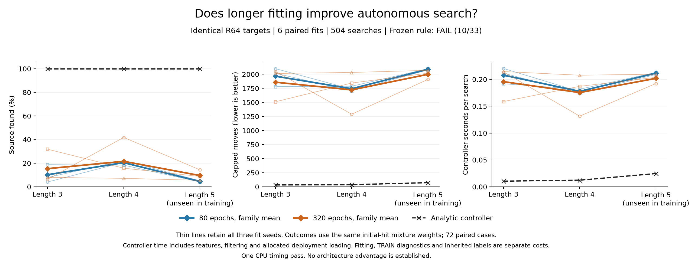
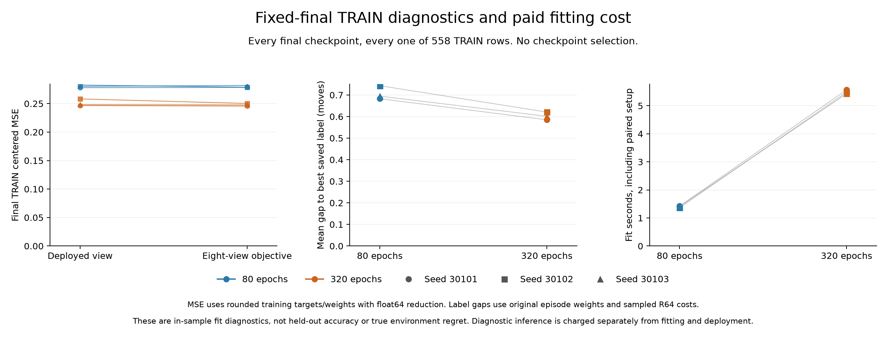

# Fixed training budget: 80 versus 320 epochs

**Longer fitting improved the saved TRAIN objective but failed the autonomous rule: 10/33 conditions passed, including 0/18 competence conditions.** Across the three paired seeds, final eight-view TRAIN MSE fell **11.38%** and the sampled-label cost gap fell **14.78%**. Long-family weighted success improved in all three settings but remained **15.34%, 21.57% and 9.52%**. The analytic controller found all 72 sources. All six fits, fixed TRAIN diagnostics and 504 evaluation episodes completed, and the independent saved-record audit agreed with the result.

## One changed training allocation

The [frozen protocol](otto-training-budget-protocol.md) compares 80 and 320 epochs on the same 558 public TRAIN anchors from 144 learner trajectories. Both arms reuse the completed [target-precision study's](otto-target-precision-results.md) R64 features, raw costs, centered targets, float32 casts, masks and episode weights byte-for-byte. The common original R16 scale remains **1.9131089760854865**. There was no new teacher sampling, label generation, row selection or target rescaling.

Both arms use the ordinary 2,836→32→16→4 Tanh head with 91,380 parameters, eight D4 training views, masked centered MSE, Adam at 0.0003, batch size 128 and gradient clipping 5. Fresh paired seeds are 30101, 30102 and 30103. Short fits received 400 updates; long fits received 1,600: **six fits, 6,000 updates, 1,200 fit-epochs and 5,356,800 augmented row presentations**. Every final fit was retained, without checkpoint selection, early stopping, changed learning rate or teacher fallback.

Each pair started with identical saved weights and separate fresh Adam states. All three long epoch-80 checkpoints matched their paired short final checkpoints byte-for-byte, with matching first-80-epoch orders, losses, gradient records and optimizer steps. Long then continued its existing optimizer to epoch 320. The three prefix checkpoints were never selectable candidates. All 15 checkpoint publications were reloaded and checked. All six final export parity checks passed on the first 16 TRAIN rows at absolute and relative tolerance 2e-5; that tolerance does not guarantee the same action near a tie.

## Final TRAIN fit and label-relative decisions

Six separately restored final checkpoints scored all 558 rows under all eight D4 views: **240 NumPy calls and 26,784 transformed row predictions**. No initial or prefix checkpoint was scored. Diagnostic heads were discarded before six fresh deployment loads.

For MSE, saved float32 outputs and rounded float32 targets are upcast to float64 and centered independently over eligible actions. Eight-view row losses use the stored float32 training weights upcast to float64, summed and divided by 558 without renormalization. This fixed-final measurement has a different floating-point reduction route from the Torch float32 online training loss. The online column below comes from pre-update minibatches in the final epoch, not a single fixed checkpoint.

View-zero decisions follow deployment: first ascending eligible action whose Python-float score difference is strictly below 1e-10 from the minimum. The sampled-label gap is its saved R64 mean cost minus the lowest eligible R64 mean, in moves. Gap and exact argmin agreements use the original float64 episode weights divided by 558. They measure fit to finite-sample TRAIN labels, not true environment regret or held-out action accuracy.

| Fit | Final online MSE | Single-view TRAIN MSE | Eight-view TRAIN MSE | Sampled-label gap, moves | Optimal-set agreement | First-argmin agreement |
| --- | --- | --- | --- | --- | --- | --- |
| short@30101 | 0.278487 | 0.278013 | 0.278423 | 0.682816 | 53.07% | 36.00% |
| long@30101 | 0.247591 | 0.246652 | 0.245634 | 0.584943 | 59.09% | 45.02% |
| short@30102 | 0.279571 | 0.282632 | 0.278784 | 0.743146 | 49.83% | 33.62% |
| long@30102 | 0.248913 | 0.258224 | 0.250296 | 0.620804 | 57.47% | 44.39% |
| short@30103 | 0.282342 | 0.280394 | 0.281891 | 0.694535 | 52.03% | 37.56% |
| long@30103 | 0.248180 | 0.248119 | 0.247689 | 0.601309 | 56.66% | 45.14% |

| Equal-seed mean | Single-view TRAIN MSE | Eight-view TRAIN MSE | Sampled-label gap, moves | Optimal-set agreement | First-argmin agreement |
| --- | --- | --- | --- | --- | --- |
| short | 0.280346 | 0.279700 | 0.706832 | 51.64% | 35.73% |
| long | 0.250998 | 0.247873 | 0.602352 | 57.74% | 44.85% |

The mean eight-view MSE changed from 0.2796996166 to 0.2478731055; the sampled-label gap changed from 0.7068323206 to 0.6023521894. Both improved in every seed. These are better fitted decisions on the existing TRAIN anchors. They did not establish competent behavior on the fresh autonomous trajectories.

## Fresh autonomous control

Evaluation retained 24 cases at each sensing length 3, 4 and 5 and all seven arms: **504 episodes sharing 72 environmental cases**. Fresh seeds are 1080001-1080024, 1090001-1090024 and 1100001-1100024. Every arm has eight cases per initial-hit stratum. Arm order rotates, and source plus overlapping hit random streams are paired. Hidden source coordinates and random witnesses remain evaluator-only.

Episodes run until discovery or **2,188 moves**, with every final observation assimilated. Every failure receives the full horizon. Means first average within initial hits 1, 2 and 3, then use the setting's positive-hit mixture. Family means weight the three fit seeds equally. Raw found counts are separate. Length 5 is absent from TRAIN, while its known observation kernel is supplied at evaluation. The shared cases and correlated TRAIN anchors are not treated as independent observations for a confidence interval.

| Length | Hit 1 weight | Hit 2 weight | Hit 3 weight |
| --- | --- | --- | --- |
| 3 | 0.830998 | 0.128918 | 0.040084 |
| 4 | 0.844502 | 0.120761 | 0.034737 |
| 5 | 0.853772 | 0.115066 | 0.031162 |

### Families and analytic control

| Length | Arm/family | Weighted success | Capped moves | Complete controller s/episode | Raw found |
| --- | --- | --- | --- | --- | --- |
| 3 | short | 10.19% | 1966.14 | 0.207855 | 28/72 |
| 3 | long | 15.34% | 1859.23 | 0.195673 | 28/72 |
| 3 | Analytic | 100.00% | 32.73 | 0.010475 | 24/24 |
| 4 | short | 20.42% | 1742.94 | 0.177647 | 34/72 |
| 4 | long | 21.57% | 1722.53 | 0.175396 | 31/72 |
| 4 | Analytic | 100.00% | 37.11 | 0.012326 | 24/24 |
| 5 | short | 4.52% | 2089.59 | 0.211545 | 16/72 |
| 5 | long | 9.52% | 1999.37 | 0.201839 | 20/72 |
| 5 | Analytic | 100.00% | 73.32 | 0.024581 | 24/24 |

Long improved the family means for success and capped moves in all three settings, but only length 3 met the required 5% move reduction. No setting met the six-positive-block requirement. Complete controller means were lower for long in this timing pass, yet remained substantially above analytic because learned searches ran much longer. Raw totals were **78/216 short, 79/216 long and 72/72 analytic**; they do not replace the mixture-weighted comparisons.

The fresh short-family success rates of 10.19%, 20.42% and 4.52% differ from the earlier precision study's R64 rates. Seeds and evaluation cases changed, so that cross-study contrast cannot be attributed to optimization allocation. The matched comparison here is short versus long within this run.

### Every fit and setting

| Length | Arm | Weighted success | Capped moves | Complete controller s/episode | Raw found |
| --- | --- | --- | --- | --- | --- |
| 3 | analytic_inbounds | 100.00% | 32.73 | 0.010475 | 24/24 |
| 3 | long@30101 | 6.23% | 2051.93 | 0.213860 | 8/24 |
| 3 | long@30102 | 31.84% | 1511.20 | 0.158661 | 13/24 |
| 3 | long@30103 | 7.95% | 2014.57 | 0.214498 | 7/24 |
| 3 | short@30101 | 4.01% | 2100.55 | 0.220274 | 8/24 |
| 3 | short@30102 | 18.73% | 1780.14 | 0.191790 | 11/24 |
| 3 | short@30103 | 7.84% | 2017.74 | 0.211501 | 9/24 |
| 4 | analytic_inbounds | 100.00% | 37.11 | 0.012326 | 24/24 |
| 4 | long@30101 | 41.82% | 1290.25 | 0.131518 | 14/24 |
| 4 | long@30102 | 15.75% | 1844.51 | 0.186981 | 8/24 |
| 4 | long@30103 | 7.13% | 2032.83 | 0.207688 | 9/24 |
| 4 | short@30101 | 20.71% | 1735.71 | 0.177250 | 12/24 |
| 4 | short@30102 | 18.33% | 1787.53 | 0.181559 | 9/24 |
| 4 | short@30103 | 22.22% | 1705.57 | 0.174133 | 13/24 |
| 5 | analytic_inbounds | 100.00% | 73.32 | 0.024581 | 24/24 |
| 5 | long@30101 | 14.33% | 1909.06 | 0.192221 | 5/24 |
| 5 | long@30102 | 8.75% | 2019.10 | 0.203700 | 9/24 |
| 5 | long@30103 | 5.48% | 2069.94 | 0.209597 | 6/24 |
| 5 | short@30101 | 4.43% | 2091.45 | 0.212589 | 6/24 |
| 5 | short@30102 | 4.05% | 2099.73 | 0.212995 | 5/24 |
| 5 | short@30103 | 5.09% | 2077.59 | 0.209050 | 5/24 |

### Every paired block

Each entry is short minus long family-mean capped moves within a block, using the same hit mixture. Positive values favor long. All eight blocks are retained; their signs enter the frozen count condition but are not a significance test.

| Length | Block 0 | Block 1 | Block 2 | Block 3 | Block 4 | Block 5 | Block 6 | Block 7 | Positive |
| --- | --- | --- | --- | --- | --- | --- | --- | --- | --- |
| 3 | -148.69 | 157.92 | 0.03 | 744.02 | 64.50 | -91.96 | 158.58 | -29.11 | 5/8 |
| 4 | -698.61 | -201.47 | -99.30 | 112.85 | 614.77 | 522.95 | -1.15 | -86.79 | 3/8 |
| 5 | 0.02 | -1.80 | 101.48 | -17.82 | -0.55 | 21.31 | 619.14 | 0.00 | 4/8 |

## All 33 conditions

The result is **10/33: 3/3 analytic positive controls, 0/18 long-fit competence conditions and 7/12 family-relative conditions**. All 33 were required. Every long fit missed both the 95% weighted-success threshold and the maximum of 105% of analytic capped moves. Lower TRAIN MSE cannot pass this rule. Values below are rounded for display; decisions use saved full precision.

| Group | Named condition | Observed | Required | Result |
| --- | --- | --- | --- | --- |
| Positive control | `lambda3.analytic_control.success` | 1 | ≥ 0.95 | PASS |
| Positive control | `lambda4.analytic_control.success` | 1 | ≥ 0.95 | PASS |
| Positive control | `lambda5.analytic_control.success` | 1 | ≥ 0.95 | PASS |
| Long competence | `lambda3.30101.success` | 0.06229234 | ≥ 0.95 | FAIL |
| Long competence | `lambda3.30101.moves` | 2051.931321672 | ≤ 34.362436731 | FAIL |
| Long competence | `lambda3.30102.success` | 0.318386136 | ≥ 0.95 | FAIL |
| Long competence | `lambda3.30102.moves` | 1511.204091361 | ≤ 34.362436731 | FAIL |
| Long competence | `lambda3.30103.success` | 0.079490407 | ≥ 0.95 | FAIL |
| Long competence | `lambda3.30103.moves` | 2014.565201788 | ≤ 34.362436731 | FAIL |
| Long competence | `lambda4.30101.success` | 0.418216558 | ≥ 0.95 | FAIL |
| Long competence | `lambda4.30101.moves` | 1290.252288853 | ≤ 38.970699587 | FAIL |
| Long competence | `lambda4.30102.success` | 0.157463601 | ≥ 0.95 | FAIL |
| Long competence | `lambda4.30102.moves` | 1844.513125056 | ≤ 38.970699587 | FAIL |
| Long competence | `lambda4.30103.success` | 0.071338031 | ≥ 0.95 | FAIL |
| Long competence | `lambda4.30103.moves` | 2032.829871024 | ≤ 38.970699587 | FAIL |
| Long competence | `lambda5.30101.success` | 0.143278451 | ≥ 0.95 | FAIL |
| Long competence | `lambda5.30101.moves` | 1909.059946956 | ≤ 76.981340554 | FAIL |
| Long competence | `lambda5.30102.success` | 0.087497019 | ≥ 0.95 | FAIL |
| Long competence | `lambda5.30102.moves` | 2019.096998659 | ≤ 76.981340554 | FAIL |
| Long competence | `lambda5.30103.success` | 0.054835353 | ≥ 0.95 | FAIL |
| Long competence | `lambda5.30103.moves` | 2069.940640612 | ≤ 76.981340554 | FAIL |
| Family relative | `lambda3.success` | 0.153389628 | ≥ 0.101927741 | PASS |
| Family relative | `lambda3.moves` | 1859.233538274 | ≤ 1867.837551664 | PASS |
| Family relative | `lambda3.positive_blocks` | 5 | ≥ 6 | FAIL |
| Family relative | `lambda3.controller_cost` | 0.195673277 | ≤ 0.218247944 | PASS |
| Family relative | `lambda4.success` | 0.21567273 | ≥ 0.204196235 | PASS |
| Family relative | `lambda4.moves` | 1722.531761644 | ≤ 1655.791416292 | FAIL |
| Family relative | `lambda4.positive_blocks` | 3 | ≥ 6 | FAIL |
| Family relative | `lambda4.controller_cost` | 0.175395521 | ≤ 0.186529328 | PASS |
| Family relative | `lambda5.success` | 0.095203608 | ≥ 0.045246543 | PASS |
| Family relative | `lambda5.moves` | 1999.365862076 | ≤ 1985.110088247 | FAIL |
| Family relative | `lambda5.positive_blocks` | 4 | ≥ 6 | FAIL |
| Family relative | `lambda5.controller_cost` | 0.201839428 | ≤ 0.222121825 | PASS |

## Complete costs

Fit intervals include optimizer setup, updates, final export, checkpoint reload verification, parity and journals. Long intervals also include the epoch-80 prefix publication and equality check. Half of each pair's shared setup is allocated to each arm. Final TRAIN diagnostic intervals include restore, transformations, predictions, reductions, saved arrays and hashing; the forward and restore columns are subsets, not extra costs.

| Fit | Fit interval, s | Including paired setup, s | Complete TRAIN diagnostic, s | Diagnostic restore, s | Diagnostic forwards, s |
| --- | --- | --- | --- | --- | --- |
| short@30101 | 1.406939 | 1.423240 | 0.017112 | 0.001454 | 0.002165 |
| long@30101 | 5.550031 | 5.566332 | 0.016768 | 0.001241 | 0.002127 |
| short@30102 | 1.352446 | 1.363699 | 0.017135 | 0.001266 | 0.002181 |
| long@30102 | 5.472322 | 5.483575 | 0.016650 | 0.001258 | 0.002108 |
| short@30103 | 1.393952 | 1.405390 | 0.016599 | 0.001416 | 0.002165 |
| long@30103 | 5.416859 | 5.428298 | 0.016607 | 0.001310 | 0.002131 |

Including paired setup, the three short fits cost **4.192328 seconds** and the three long fits **16.478204 seconds**, a 3.931× ratio. The complete diagnostic phase cost 0.102619 seconds, including all 240 forward calls (0.012876 seconds) and six diagnostic restores (0.007946 seconds). Phase-level timing also includes work outside those wrapped calls.

No labels were generated. The common historical R64 acquisition cost was **1370.514490 seconds**. A standalone family allocates one third, 456.838163 seconds, to each fit. Both families reuse that same paid evidence; summing both standalone allocations would double-count historical work.

| Newly paid phase | Seconds |
| --- | --- |
| Input authentication | 4.501024 |
| Common input setup | 0.056215 |
| Training cache preparation | 0.100089 |
| Torch setup | 1.303705 |
| All three training pairs | 20.670533 |
| Complete final TRAIN diagnostics | 0.102619 |
| Native adapter setup | 0.500992 |
| Model module setup | 0.001501 |
| Six fresh evaluation head restores | 0.007354 |
| Full evaluation | 1092.873340 |

The disjoint phase sum is **1120.117371 seconds**. The worker took **1122.924460 seconds** through final payload hashing; its original supervisor took **1123.378582 seconds**, including process exit and cleanup. The 39.115674-second journal timer overlaps those phases and is not added again. It covers specified work, training, diagnostic and transition journal writes, not every serialization operation. The separate saved audit took **36.150666 worker seconds** and **36.259107 parent seconds**.

Evaluation used **611,540 native steps, 609,451 learned predictions and 2,089 analytic choices**, with 504 resets and the same 611,540 final-inclusive public updates. Each learned head's fresh restore cost is allocated over 72 episodes and model-module setup over 432 learned episodes. Complete controller cost includes actor/feature initialization, features, scoring, selection and filtering. Native stepping is separate. Only measured work-journal I/O is excluded from controller intervals; first inference is included.

This is one instrumented CPU timing pass, not a portable speed benchmark. Worker peak RSS was **467,812,352 bytes**. Its **34 payloads total 759,796,142 bytes**, excluding the receipt. The original process completed within the frozen 7,200-second, one-thread, 4-GiB RSS and 16-GiB output bounds, without timeout or a remaining process group.

## Independent audit and interpretation

The [independent audit receipt](../output/otto-training-budget-v1/audit-01/receipt.json) reports **agreement=true and 27,768,190 checks** through payload hashing. It verified 164 source pins, 1,748 input descriptors, all 34 worker payloads, 558 TRAIN rows from 144 episodes, 15 checkpoints, three matched prefixes, six fits, 6,000 updates, 1,200 fit-epochs, 240 diagnostic forwards, 504 episodes and all 33 conditions. Both original supervised processes completed successfully without timeout or remaining process groups. No empirical fitting, evaluation or saved audit was retried.

That audit does not regenerate neural scores, gradients, public filtering or feature construction. Score-based choices and diagnostic arithmetic are checked against saved predictions; training execution and timing remain authenticated records. Successful saved-record verification is not an independent rerun of fitting or evaluation.

The fixed intervention improved fit and sampled-label decisions on the retained TRAIN anchors but did not achieve competence on fresh searches. Longer optimization is insufficient under this head, target cache and recipe. This result does not isolate coverage, target noise, representation or objective choice as the cause. It establishes no recurrent, connectome or other architectural advantage. The prior precision study remains unchanged, and this failed rule does not authorize promoting a checkpoint or automatically adding another training-budget round.

## Evidence and restoration

- [Frozen protocol](otto-training-budget-protocol.md), [empirical plan](../output/otto-training-budget-v1/plan-01.json), [worker receipt](../output/otto-training-budget-v1/run-01/receipt.json) and [original empirical terminal](../output/otto-training-budget-v1/supervision-01.terminal.json).
- [All outcomes, strata and blocks](../output/otto-training-budget-v1/run-01/summary.json), [all final TRAIN diagnostics](../output/otto-training-budget-v1/run-01/diagnostic-summary.json), [six fit records](../output/otto-training-budget-v1/run-01/fits.jsonl) and [training/prefix summary](../output/otto-training-budget-v1/run-01/training-summary.json).
- [Frozen saved-audit plan](../output/otto-training-budget-v1/audit-plan-01.json), [audit findings](../output/otto-training-budget-v1/audit-01/audit.json), [audit receipt](../output/otto-training-budget-v1/audit-01/receipt.json) and [original audit terminal](../output/otto-training-budget-v1/audit-supervision-01.terminal.json).
- [Saved-only figure receipt](../output/otto-training-budget-v1/figure-01/receipt.json), [all plotted values](../output/otto-training-budget-v1/figure-01/plotted-values.json) and [six-row diagnostic table](../output/otto-training-budget-v1/figure-01/train-diagnostics.csv).
- Public evidence release: [otto-training-budget-v1](https://github.com/kw2828/OpenJev/releases/tag/otto-training-budget-v1).

The current-phase archive requires inherited caches and earlier releases identified in the frozen plan. It is not a standalone reconstruction of the entire historical lineage. Byte verification and inspection are portable; strict numerical authentication also requires the recorded absolute path layout and runtime, or a separately reviewed relocation adapter. No such adapter is supplied and historical evidence is not rewritten.

| Artifact | SHA-256 |
| --- | --- |
| Empirical plan | `a204495fb0fd66ea3e7ea7c5052315f85bf3fa75438c243cf6a6f17e92e4099a` |
| Worker receipt | `47004eb796ac7ab9a836f88c2942dd6b6f00e008d277b205afbdf85e3a8eb182` |
| Empirical parent terminal | `d99dbbd53bb3ca281b15db82f577f5e8ea6e62ddecb210a40b86e73004b2d276` |
| Audit plan | `c0660c831d254b1334448663f3ace3f6c8809935f8a4aeb0b1601ab9a5173714` |
| Audit receipt | `c3ddca8593fb5ffe9f7b01b69728f22f64d80217deb1f38472417fb0c8422b84` |
| Audit parent terminal | `1bea061a7463349c0787896300d569453b09eb1fdbd4a1fb96102beab4f68bb9` |
