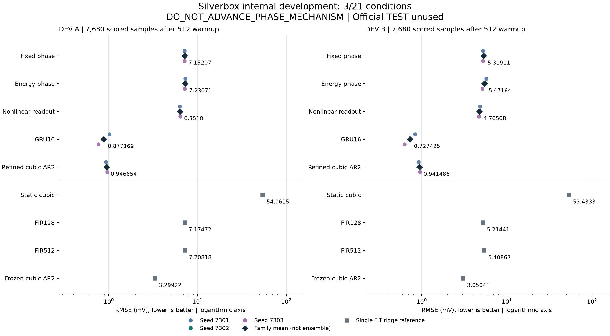

# State-dependent phase does not improve this small recurrent model

**The candidate fails its registered rule: 3/21 conditions pass.** All 15 fits
complete, and the independent numerical audit agrees. Changing rotation speed
with state energy does not beat fixed rotation or an equally small nonlinear
output layer on these internal Silverbox development sequences.

| Model | Parameters | DEV A RMSE, mV | DEV B RMSE, mV |
| --- | ---: | ---: | ---: |
| Fixed phase | 14 | 7.15207 | 5.31911 |
| Energy-dependent phase, candidate | 18 | 7.23071 | 5.47164 |
| Nonlinear readout, matched control | 18 | 6.35180 | 4.76508 |
| GRU16 | 929 | 0.87717 | 0.72743 |
| Simulation-refined cubic AR2 | 7 | 0.94665 | 0.94149 |
| Static cubic | 4 | 54.06149 | 53.43332 |
| FIR128 | 129 | 7.17472 | 5.21441 |
| FIR512 | 513 | 7.20818 | 5.40867 |
| Frozen cubic AR2 | 7 | 3.29922 | 3.05041 |

The five trained rows are means of three individual fits, not ensemble
predictions. The other four rows are single FIT ridge references. The
[complete table](phase-results/report.md) retains all 19 rows, both error
metrics, all 21 conditions, logical storage and optimizer-loop times.

The candidate's mean error is **1.10% / 2.87% higher than fixed phase** and
**13.84% / 14.83% higher than the matched nonlinear readout** on DEV A / B.
Only one of six paired candidate-versus-fixed comparisons passes; all six
candidate-versus-readout comparisons fail. The global finite-output condition
and DEV B competence condition are the other two passes. Neither development
sequence meets the strong-baseline requirement.

The useful finding is the strength of conventional nonlinear dynamics models:
the refined seven-parameter AR2 reaches roughly 0.94 mV, while GRU16 is best
among these compared families. This is a specific baseline result on one
measured system. It does not establish an optimal model, long-memory necessity,
or a novel recurrent architecture.

The dataset comes from a measured electronic oscillator. FIT uses 43,296
records inside the official training split. Each development sequence contains
8,192 records, with a shared 512-sample warmup and 7,680 scored samples.
Every scored rollout starts from zero state and receives inputs only.
Measured outputs never initialize or feed a scored rollout. All final fits
precede numerical DEV loading; the official TEST remains unparsed.

Each trained model receives the same per-seed windows and 2,048 updates,
for 30,720 updates in total. This matches training exposure, not computation
across families. The two 18-parameter arms are parameter matched. The
seven-parameter AR2 receives FIT-only supervised initialization before
simulation training, and its unchanged ridge version remains in the table.
The candidate's logical deployment state is 120 bytes including parameters,
four recurrent values and normalizers; AR2 uses 72 bytes and GRU16 uses 3,812.
Those counts exclude runtime workspace and do not establish a speed advantage.

**Validation:** all 131 fabricated-data tests pass. The independent audit
checks 135 original payload files and 504 arrays across 64 NPZ and 41 NPY files,
including 30 initial/final checkpoints, 15 Adam states and 38 prediction
reconstructions. Four independent ridge certificates and twelve additional
solution-prediction comparisons pass. Optimizer updates are documented by
receipts and traces, not independently replayed. The original study takes
442.44 seconds; the independent audit takes 2.26 seconds. No scientific retry
or extra test evaluation occurred.

The [registration](phase-registration.json) and nine scientific sources were
committed at `b1395f4e924d5bc19bc3a12cdb8104a49a51fa48` before measurement
loading. Registration SHA256:
`258725c1db149c76ec54070e0ec236367489a096554f658b2fe8a9e5066cc2ce`.

[Protocol](phase-protocol.md) · [Independent audit](phase-results/audit.json) ·
[All model checkpoints and traces](phase-results/study/models) ·
[Public manifest](phase-results/manifest.json) ·
[PDF chart](phase-results/benchmark.pdf) · [Next research constraint](phase-next.md).

Source: [Silverbox benchmark](https://www.nonlinearbenchmark.org/benchmarks/silverbox).
This internal split and zero-state evaluation differ from the official test
procedure. The public bundle contains derived predictions, checkpoints and
process evidence. The original archive, CSV and three measured-partition files
remain local because explicit data redistribution permission was not established.
Their hashes and retrieval source are retained in the
[provenance record](phase-results/source-provenance.json).
