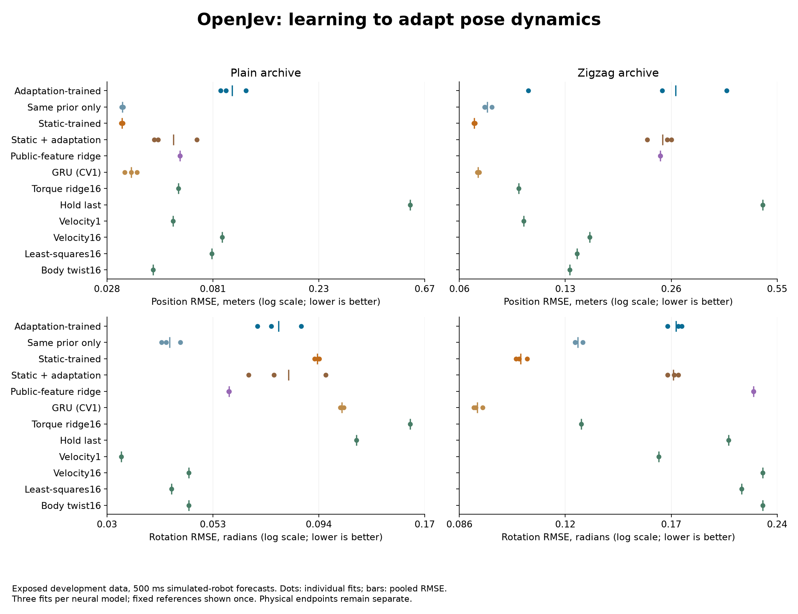
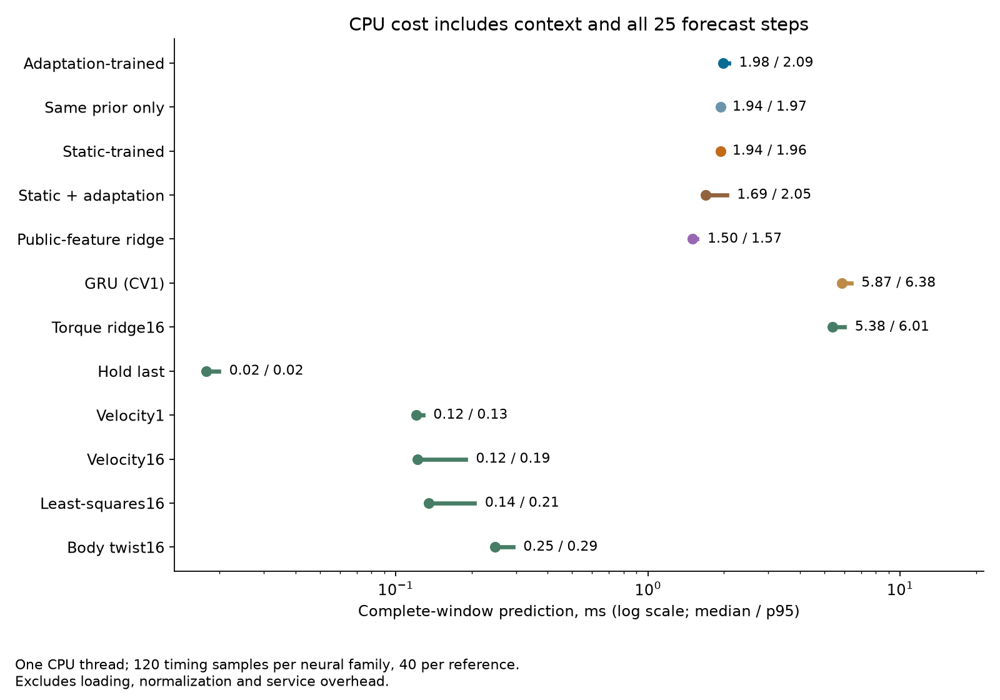

# Context adaptation hurts the learned pose predictor

September 19, 2026. **The context update made this model worse.** Disabling
adaptation in the same trained checkpoint lowered position and rotation error
on both simulated-robot archives, for every training seed. The continuation
rule failed: **1/17 requirements and 185/661 underlying comparisons passed**.
Only the latency requirement passed. We will not scale this adaptation recipe.

All twelve fits completed. These are already exposed development archives,
not independent confirmation. The earlier residual-dynamics and transported
memory experiments retain their failed results.

## What we tested

A small feature network and global prior are trained through a differentiable
ridge fit on the latest 30 completed transitions, then through the full
25-step physical rollout. The fitted weights remain fixed during forecasting.
Future observations cannot enter the update or forecast API. Position uses
meters and rotation uses geodesic radians, with fixed 0.1 scales in training.

This is related to [ALPaCA](https://arxiv.org/abs/1807.08912),
[Learning to Adapt](https://arxiv.org/abs/1803.11347) and
[Adapting Neural Robot Dynamics on the Fly](https://arxiv.org/abs/2604.04039).
Learned features, a learned prior and analytic context regression are established
ideas. This fixed-precision ridge implementation does not provide calibrated
Bayesian uncertainty or establish a new learning algorithm.

Four arms were trained for three seeds each: adaptation-trained learned
features, the identical architecture trained without adaptation, public features
with a trained prior, and a fresh body-coordinate GRU. Meta and static models
share exact initial tensors and batch order. Each fit uses 690 updates and its
final checkpoint. Two additional configurations reuse checkpoints: disable
adaptation in the meta model, and enable it in the static model. Six motion or
regression references remain in the comparison.

Every newly trained model begins with actual motion between the last two
observations. This controls the previous experiment's longer starting-motion
estimate. The new GRU versus the old GRU is not a paired initialization-only
experiment; changes across studies cannot be attributed solely to that estimate.
See the [prospective protocol](pose-adaptation-protocol.md) and
[prior saved-output diagnosis](pose-adaptation-diagnosis.md).

## Physical results

Pooled RMSE across all 25 steps, 160 windows per archive and all three fits
per neural configuration. Each archive contains ten parent trajectories.
Lower is better. Bold identifies the smallest value in each column among
these configurations; it does not designate a selected model for confirmation.

| Configuration | Plain position, m | Plain rotation, rad | Zigzag position, m | Zigzag rotation, rad |
| --- | ---: | ---: | ---: | ---: |
| Adaptation-trained | 0.09841 | 0.07583 | 0.27013 | 0.17523 |
| Same checkpoint, prior only | 0.03288 | 0.04214 | 0.07247 | 0.12657 |
| Static-trained | **0.03283** | 0.09341 | **0.06621** | 0.10484 |
| Static plus adaptation | 0.05487 | 0.07999 | 0.24702 | 0.17377 |
| Public-feature ridge | 0.05836 | 0.05803 | 0.24310 | 0.22639 |
| Fresh GRU, CV1 | 0.03589 | 0.10670 | 0.06800 | **0.09086** |
| Hold last | 0.58387 | 0.11531 | 0.49674 | 0.20860 |
| World velocity1 | 0.05446 | **0.03249** | 0.09346 | 0.16561 |
| World velocity16 | 0.08910 | 0.04677 | 0.14836 | 0.23343 |
| Rooted least-squares16 | 0.08040 | 0.04256 | 0.13570 | 0.21773 |
| Constant body twist16 | 0.04477 | 0.04677 | 0.12887 | 0.23343 |
| Torque-conditioned ridge16 | 0.05758 | 0.15425 | 0.09029 | 0.12810 |

The strongest comparison uses exactly the same weights with the context fit
switched off. Enabling adaptation makes position RMSE **2.99 times** as high
on plain and **3.73 times** on zigzag; rotation RMSE rises by **80.0%** and
**38.5%**. This direction holds in every seed and after removing any one parent.
It is not a failure caused only by missing the required 10% improvement margin.

Training through adaptation helps plain rotation versus the static-trained
model, but harms both position endpoints and zigzag rotation. Adding adaptation
to the static checkpoint also worsens both position endpoints and zigzag rotation.
No learned configuration is best on every physical endpoint; constant velocity
still wins plain rotation. The smaller static predictor's position results are
useful baseline evidence, not a demonstrated adaptation or recurrent advantage.

The 17 requirements retain all 661 underlying comparisons. Of 44 aggregate
margin checks, 11 pass; of 132 paired checks, 42 pass; of 44 parent-count checks,
10 pass; and of 440 leave-one-parent-out checks, 121 pass. These are dependent
diagnostics, not 661 independent statistical tests. All sixteen grouped accuracy
requirements fail.

## Compute and validation

| Configuration | Median, ms | p95, ms |
| --- | ---: | ---: |
| Adaptation-trained | 1.983 | 2.088 |
| Same checkpoint, prior only | 1.941 | 1.966 |
| Static-trained | 1.936 | 1.965 |
| Static plus adaptation | 1.693 | 2.049 |
| Public-feature ridge | 1.503 | 1.565 |
| Fresh GRU, CV1 | 5.868 | 6.380 |
| Hold last | 0.018 | 0.020 |
| World velocity1 | 0.120 | 0.128 |
| World velocity16 | 0.122 | 0.189 |
| Rooted least-squares16 | 0.135 | 0.205 |
| Constant body twist16 | 0.247 | 0.291 |
| Torque-conditioned ridge16 | 5.379 | 6.014 |

One Apple M5 Max CPU thread. Each neural configuration has 120 measured
windows across panels and fits; each reference has 40. Timings include the
context fit where applicable and all 25 forecast steps, excluding loading,
normalization and service overhead. They are sequential local measurements,
not hardware-independent speed claims. The candidate costs 0.338 times the
new GRU, satisfying the cost requirement while failing accuracy.

The twelve fits have 8,280 total updates. The producer records **91.72 seconds**
through evaluation, including **87.75 seconds** of neural training and
0.37 seconds of reference fitting. These components are included in total time.
No extra seeds, retries, selected intermediate checkpoints or parameter sweep
were used. Learned-feature models have 3,066 parameters, the public-feature
control 300 and the GRU 23,046; the latter two are not parameter matched.

All **71 focused implementation tests passed**, including support alignment,
future-pose isolation, gradients through the context solve and rollout, shared
initialization, and audit failure cases. Ruff passed. A separate source review
checked the producer/auditor contract before freezing. The independent numerical
audit verified all 150 execution artifacts and all 48 evaluation rows using
saved predictions, without training or forecasting again. It does not
independently replay the optimizer or verify predictions by rerunning weights.

## Evidence and next decision

- [Frozen protocol and source snapshot](../output/pose-adaptation-v1/experiment-01/protocol.json).
- [Training log](../output/pose-adaptation-v1/experiment-01/training.log),
  [weights and fit records](../output/pose-adaptation-v1/experiment-01/run-01),
  [completion](../output/pose-adaptation-v1/experiment-01/run-01/completed.json).
- [Independent summary](../output/pose-adaptation-v1/report-01/summary.json),
  [audit receipt](../output/pose-adaptation-v1/report-01/receipt.json),
  [numeric errors](../output/pose-adaptation-v1/report-01/window-errors.npz).
- [Implementation checks](../output/pose-adaptation-v1/experiment-01/preflight-validation.json)
  and [plot receipt](../output/pose-adaptation-v1/visualization-01/receipt.json).

The next question is why this short-context fit corrupts a more useful prior,
including whether its fitted correction transfers across the forecast's changing
state and torque sequence. That explanation remains a hypothesis. The current
evidence does not justify claiming that online adaptation works or scaling this
recipe. Preserve the prior-only, static and cheap motion controls in any new
experiment, with a separately frozen rule and eventually fresh confirmation.

These are offline forecasts on simulated data conditioned on recorded future
applied torques. They do not establish real-robot control, issued-command
causality, connectome superiority or ICLR-level novelty. Euler conventions are
inferred because original quaternions and collection code are absent. Raw and
prepared data, targets and source-derived forecasts remain local because
upstream data licensing is not explicit. Our weights, source and numeric
error reports are published.
