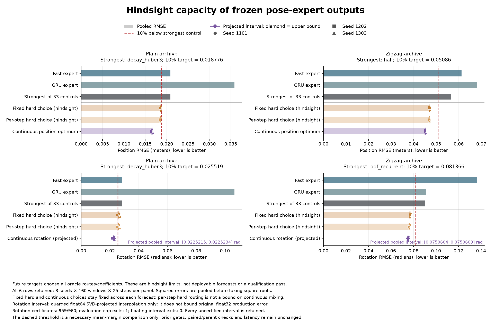

# Can these two predictors support a better selector?

**Continuous blending has room; hard switching does not meet the required margin.** A hindsight calculation using the saved forecasts finds about **17-21% lower error** than the strongest retained control for each measurement. Those coefficients use future targets. This is evidence of available capacity, not an achieved model improvement.

Even allowing a perfect selector to switch experts independently at every forecast step, plain rotation improves by only **8.06%**, below the unchanged 10% requirement. Further hard-routing work with these fixed, privately generated forecasts cannot satisfy that necessary condition. Continuous mixtures can exploit error cancellation between the forecasts.

[Protocol](pose-capacity-protocol.md) · [Audited numbers](../output/pose-capacity-v1/report-01/summary.json) · [Audit receipt](../output/pose-capacity-v1/report-01/receipt.json) · [Previous selector experiment](pose-crossfit-results.md)

## What was measured

The two experts are the existing recency-and-robustness predictor and the existing GRU. Their forecasts, targets and identities are unchanged. We use both exposed simulated-robot archives, all three seeds and all 160 windows per seed and archive. Each forecast covers 25 steps, or 500 ms.

For each physical endpoint separately, the analysis computes:

- **Fixed hard choice:** the better expert over the complete forecast.
- **Stepwise hard choice:** the better expert at every future step.
- **Continuous mixture:** the best coefficient between zero and one, fixed over the complete forecast. Position and rotation have separate coefficients.

All three choices use future answers. The stepwise hard choice bounds hard routing of these same saved forecasts, including routing that changes with lead time. It does not bound continuous mixtures, changed expert rollouts, or a system that feeds combined predictions back into its dynamics.

Position uses the exact clipped least-squares solution, up to numerical arithmetic. Rotation uses a guarded search over geodesic interpolation after projecting inputs to SO(3) in float64. Its lower and upper bounds cover that projected calculation, not every value of the original float32 production interpolation. The certificates are numerical bounds with explicit guards, not formal interval-arithmetic proofs.

## Results

RMSE pools squared errors over all 480 seed-window pairs per archive before taking the square root. Lower is better. The strongest reference is selected from all 33 retained configurations for each endpoint; it is not one model that attains all four numbers.

| Forecast or hindsight choice | Plain position, m | Plain rotation, rad | Zigzag position, m | Zigzag rotation, rad |
|---|---:|---:|---:|---:|
| Fast expert | 0.020862 | 0.028355 | 0.061292 | 0.136142 |
| GRU expert | 0.035888 | 0.106702 | 0.067998 | 0.090861 |
| Strongest retained control | 0.020862 | 0.028355 | 0.056511 | 0.090407 |
| Required 10% improvement | 0.018776 | 0.025519 | 0.050860 | 0.081366 |
| Fixed hard hindsight | 0.018577 | 0.026170 | 0.047055 | 0.076834 |
| Stepwise hard hindsight | 0.018498 | 0.026070 | 0.046950 | 0.076198 |
| Continuous hindsight | 0.016567 | [0.02252148, 0.02252338] | 0.045147 | [0.07506035, 0.07506093] |

Rotation intervals in the last row are projected lower/upper bounds, rounded outward for display. They are comparisons to the original reported control thresholds, not production-error certificates. The strongest controls are `decay_huber3` for both plain endpoints, `half` for zigzag position and `oof_recurrent` for zigzag rotation.

| Hindsight choice | Plain position improvement | Plain rotation improvement | Zigzag position improvement | Zigzag rotation improvement |
|---|---:|---:|---:|---:|
| Fixed hard | 10.95% | 7.71% | 16.73% | 15.01% |
| Stepwise hard | 11.33% | 8.06% | 16.92% | 15.72% |
| Continuous | 20.59% | 20.57% projected | 20.11% | 16.97% projected |

Continuous rotation percentages use the conservative upper-error endpoints. The full machine-readable result retains lower and upper comparisons against every control, without relying on rounded percentages.

## Search limits and evidence

All **960 searches** completed and all saved traces passed independent verification. **959 reached the declared 1e-7 rad² gap tolerance; one hit its 4,095-evaluation cap.** It remains in every aggregate. The capped case is zigzag, seed 1303, window index 36; its remaining gap is 1.16097e-7 rad². We did not extend the budget, rerun it or replace it. Its retained interval still supports the reported aggregate bounds, but we do not claim all searches were certified.

The run used **257,508 scalar objective evaluations** and took **11.464 seconds**, including 9.012 seconds inside the searches. Independent verification took **8.104 seconds**. These are numerical diagnostic costs, not forecast latency. There were no new model-training, model-inference or environment calls. Original training and forecasting costs are inherited.

- [Frozen protocol and 30 source snapshots](../output/pose-capacity-v1/experiment-01/protocol.json), [99-test preflight](../output/pose-capacity-v1/experiment-01/preflight-validation.json).
- [Execution log](../output/pose-capacity-v1/experiment-01/execution.log), [20-file execution seal](../output/pose-capacity-v1/experiment-01/run-01/completed.json), including all compressed optimization traces and bound arrays.
- [Independent audit](../output/pose-capacity-v1/report-01/receipt.json), [numerical arrays](../output/pose-capacity-v1/report-01/window-errors.npz), [figure receipt](../output/pose-capacity-v1/visualization-01/receipt.json).

The independent audit recomputes errors, least-squares solutions, rotation objectives, complete search partitions and all pooled comparisons from saved evidence. It uses the previously reviewed signed-scalar validation repair. No search or forecast was repeated by the audit. Original target and forecast arrays remain in their sealed local archives because upstream licensing remains unresolved; numerical results, traces, code and receipts are published.

## Next experiment

The next useful baseline is a continuous blend estimated from completed past prediction errors. It should account for whether the two experts make correlated errors, rather than weighting them only by separate error magnitudes. A fixed retrospective probe can fit the position coefficient analytically and compare a prospectively fixed rotation grid. All probe computation must be included in latency.

The available short probe covers only 100 ms; the forecast covers 500 ms. Whether a coefficient transfers across that gap is a hypothesis to test. A favorable hindsight optimum does not establish that past observations contain enough information to recover it. This baseline should face the optimized constant, fixed-half blend, both experts and all retained controls under the unchanged continuation rule.

No qualification gate is assigned to this capacity diagnosis. It checks a necessary mean-error condition, not the paired-seed, parent, leave-one-parent-out or computation requirements. The previous model experiment still failed. These repeatedly exposed archives provide development evidence, with no fresh confirmation, closed-loop robot improvement, connectome advantage or ICLR-ready contribution established.
