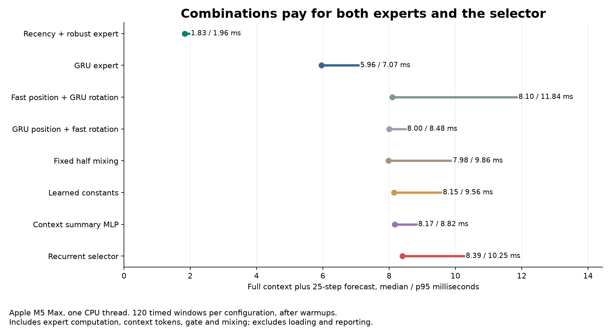

# Can a recurrent selector coordinate two pose predictors?

**No continuation: 1/17 requirements passed, with 871/1,501 underlying comparisons passing.** Only the latency requirement passed. All nine selector fits and all 48 new evaluation rows completed. The recurrent selector learned almost the same GRU-heavy mixture as the non-recurrent summary model; it did not improve the tradeoff between forecast error and computation.

[Protocol](pose-coordination-protocol.md) · [Audited results](../output/pose-coordination-v1/report-01/summary.json) · [Receipt](../output/pose-coordination-v1/report-01/receipt.json)

## What was tested

Two existing predictors remained frozen: the recency-plus-Huber adapter and the body-frame GRU. Both privately predict 25 future poses. A selector supplies one position weight and one rotation weight, fixed throughout the forecast. Position mixes linearly; rotation follows the geometric interpolation between the two predictions. No composed pose feeds back into an expert.

We trained three selector types with the same 720 training windows, paired batch orders and 690 updates per seed: two constant logits, a 3,302-parameter context-summary MLP, and a 3,250-parameter recurrent selector. Three seeds per type give nine fits and 6,210 new updates. Fixed cross-compositions and half mixing provide additional controls. The full gate retains all 20 previous configurations.

The recurrent selector sees all 31 completed action-observation transitions. The MLP sees the last token, mean token and last-minus-first token. Its different temporal compression is a limitation of this comparison. No selector sees future observations, future actions, archive names or source indices. Future recorded applied torques remain inputs to both forecasting experts.

## Physical forecast errors

Family RMSE pools squared errors over all three fits, all 160 windows per archive and all 25 forecast steps before taking a square root. Lower is better.

| Configuration | Plain position, m | Plain rotation, rad | Zigzag position, m | Zigzag rotation, rad |
|---|---:|---:|---:|---:|
| Recency + robust expert | 0.020862 | 0.028355 | 0.061292 | 0.136142 |
| GRU expert | 0.035888 | 0.106702 | 0.067998 | 0.090861 |
| Fast position + GRU rotation | 0.020862 | 0.106702 | 0.061292 | 0.090861 |
| GRU position + fast rotation | 0.035888 | 0.028355 | 0.067998 | 0.136142 |
| Fixed half mixing | 0.022780 | 0.058363 | 0.056511 | 0.104390 |
| Learned constants | 0.025987 | 0.072154 | 0.058390 | 0.097958 |
| Context summary MLP | 0.034906 | 0.104287 | 0.066795 | 0.090708 |
| Recurrent selector | 0.034906 | 0.104281 | 0.066880 | 0.090935 |

The recurrent selector improves only 2.74% / 1.64% in position versus the GRU. Plain rotation improves 2.27%, while zigzag rotation is 0.08% worse. Relative to the stronger fast expert, its plain position error is 67.3% higher and plain rotation error is 267.8% higher.

Compared with the summary MLP, recurrent selection is 0.002% worse on plain position and 0.006% better on plain rotation; it is 0.126% worse on zigzag position and 0.250% worse on zigzag rotation. These results provide no recurrent-coordination advantage.

Fixed half mixing lowers zigzag position error by 7.80% versus the fast expert and 16.89% versus the GRU. This is evidence of complementary prediction errors, but it comes with worse rotation than the GRU and worse plain forecasts than the fast expert. It does not rescue the primary failed gate.

## Training errors and selector weights

The saved gate values put almost the same weights on both archives. These are mixture coefficients, not probabilities of expert correctness. The following values average all cases and all three fits:

| Selector | Plain fast position weight | Plain fast rotation weight | Zigzag fast position weight | Zigzag fast rotation weight |
|---|---:|---:|---:|---:|
| Learned constants | 35.186% | 35.212% | 35.186% | 35.212% |
| Context summary MLP | 3.239% | 2.405% | 3.140% | 2.359% |
| Recurrent selector | 3.192% | 2.428% | 3.195% | 2.431% |

A post-outcome diagnostic used only the sealed training caches, with no new model or optimizer calls. The GRU has much lower error on the examples used to train the selectors:

| Frozen expert, training windows | Position RMSE, m | Rotation RMSE, rad |
|---|---:|---:|
| Recency + robust | 0.021551 | 0.032940 |
| GRU | 0.006651 | 0.008454 |

The experts previously trained on these same windows. The selector therefore learns from in-sample expert errors, whose ordering reverses on the plain archive. This is consistent with its preference for the GRU, but it is not a causal proof that out-of-fold training would fix the result. [Saved-cache diagnostic](../output/pose-coordination-v1/diagnosis-01/training-experts.json) and [receipt](../output/pose-coordination-v1/diagnosis-01/receipt.json). The [executed source](../output/pose-coordination-v1/diagnosis-01/executed-source.py) is retained; a later import-formatting change has an [AST equality receipt](../output/pose-coordination-v1/diagnosis-01/formatting-receipt.json).

The learned constant control also had the fixed 690-update budget; its loss was not optimized to a certified global minimum. Fixed endpoints and half mixing remain additional controls. More recurrent capacity is not justified by this comparison. A future selector test should first use expert predictions from parents excluded from expert fitting and compare against a fully optimized constant mixture. That would be a training-protocol test, not a new architecture claim.

## Complete continuation rule

The unchanged standard requires at least 10% lower RMSE against every control on both endpoints and archives, no paired-fit regression, at least 8/10 source parents nonworse, lower error after every leave-one-parent-out removal, and complete forecast latency at most 1.5 times the GRU.

| Endpoint | Margin comparisons | Paired comparisons | Parent-count comparisons | Leave-one-parent-out comparisons |
|---|---:|---:|---:|---:|
| Plain position | 12/25 | 48/75 | 11/25 | 152/250 |
| Plain rotation | 1/25 | 14/75 | 3/25 | 46/250 |
| Zigzag position | 13/25 | 52/75 | 16/25 | 170/250 |
| Zigzag rotation | 21/25 | 66/75 | 21/25 | 224/250 |

Each of the 16 accuracy groups requires every constituent comparison to pass; none does. The single latency group passes. These are dependent checks, not 1,501 independent statistical tests. Earlier failed studies remain failed.

## Computation

| Configuration | Fresh median, ms | Fresh p95, ms |
|---|---:|---:|
| Recency + robust expert | 1.828 | 1.958 |
| GRU expert | 5.957 | 7.069 |
| Fast position + GRU rotation | 8.096 | 11.843 |
| GRU position + fast rotation | 8.003 | 8.484 |
| Fixed half mixing | 7.984 | 9.860 |
| Learned constants | 8.151 | 9.562 |
| Context summary MLP | 8.167 | 8.819 |
| Recurrent selector | 8.394 | 10.252 |

Recurrent coordination costs 8.394 ms versus 5.957 ms for the GRU, about 41% more. It also costs about 4.6 times the fast expert. Each timing includes context processing and all 25 forecasts; mixed configurations pay for both experts, token processing, the selector and blending. No expert is skipped.

Timings use one Apple M5 Max CPU thread, three warmups and 20 individual timed windows per row, totaling 120 samples per configuration. They exclude loading, normalization, artifact I/O and metrics. Sequential measurements do not establish a hardware-independent speedup.

The run recorded 18.570 seconds through evaluation: 8.145 seconds in gate fitting and 0.405 seconds preparing expert caches, with 6.983 seconds in timed evaluation calls nested within the total. The final console total including artifact sealing was 18.590 seconds. Earlier expert training is inherited, not included in this new-run cost.

## Evidence and limits

- [Frozen protocol and source snapshots](../output/pose-coordination-v1/experiment-01/protocol.json), [execution log](../output/pose-coordination-v1/experiment-01/execution.log), [completion](../output/pose-coordination-v1/experiment-01/run-01/completed.json).
- [Preflight](../output/pose-coordination-v1/experiment-01/preflight-validation.json): 80 synthetic tests passed; Ruff clean; source/data/checkpoint lineage validated before fitting.
- [Independent audit](../output/pose-coordination-v1/report-01/summary.json): 147 new artifacts, all 48 new rows and 96 inherited rows checked; 132 distinct rows after expert aliases are deduplicated.
- [Per-window errors](../output/pose-coordination-v1/report-01/window-errors.npz) and [figure receipt](../output/pose-coordination-v1/visualization-01/receipt.json).

All 12 active expert rows reproduce their previous forecast arrays exactly. Independent blend reconstruction differs by at most 1.91e-6 meters and 1.20e-7 in rotation-matrix entries; exact expert endpoints remain exact. Training-token reconstruction differs by at most 3.12e-6. No expert-relative rotation enters the declared near-pi branch; the largest angle is 0.881 radians.

The auditor does no model inference or optimization. It reconstructs all blend arithmetic and numerical errors; learned selector outputs, cached training forecasts and optimizer steps remain bound to source and saved artifacts rather than independently regenerated.

Both archives are already exposed simulated-robot development data. We have not established fresh-seed confirmation, real-robot or closed-loop control gains, calibrated uncertainty, biological learning, a connectome advantage or an ICLR-ready contribution. Ordinary recurrent expert gating already has [prior art](https://arxiv.org/abs/0706.1317v2). The test has not earned larger-scale training.

Our implementation, selector weights, numerical errors, diagnostics and receipts are published. Raw/prepared data, training tokens, cached forecasts, targets and full evaluation forecasts remain local because upstream licensing is unresolved.

All retained configurations

| Configuration | Plain position, m | Plain rotation, rad | Zigzag position, m | Zigzag rotation, rad |
|---|---:|---:|---:|---:|
| constant | 0.025987 | 0.072154 | 0.058390 | 0.097958 |
| decay5 | 0.022759 | 0.030200 | 0.063419 | 0.136657 |
| decay5_mass | 0.042387 | 0.039200 | 0.128887 | 0.146706 |
| decay_huber3 | 0.020862 | 0.028355 | 0.061292 | 0.136142 |
| decay_huber3_mass | 0.038787 | 0.036711 | 0.125003 | 0.145747 |
| full | 0.098412 | 0.075829 | 0.270129 | 0.175235 |
| gru | 0.035888 | 0.106702 | 0.067998 | 0.090861 |
| half | 0.022780 | 0.058363 | 0.056511 | 0.104390 |
| huber3 | 0.034440 | 0.031780 | 0.072407 | 0.141513 |
| huber3_mass | 0.077483 | 0.062061 | 0.220453 | 0.164992 |
| position_fast | 0.020862 | 0.106702 | 0.061292 | 0.090861 |
| position_slow | 0.035888 | 0.028355 | 0.067998 | 0.136142 |
| prior | 0.032881 | 0.042138 | 0.072468 | 0.126567 |
| public | 0.058359 | 0.058031 | 0.243096 | 0.226393 |
| recent5 | 0.021153 | 0.036673 | 0.061965 | 0.143649 |
| recent5_mass | 0.034940 | 0.033483 | 0.108665 | 0.143409 |
| recurrent | 0.034906 | 0.104281 | 0.066880 | 0.090935 |
| static | 0.032829 | 0.093414 | 0.066212 | 0.104842 |
| static_adapt | 0.054866 | 0.079994 | 0.247021 | 0.173765 |
| summary | 0.034906 | 0.104287 | 0.066795 | 0.090708 |
| body16 | 0.044768 | 0.046767 | 0.128874 | 0.233431 |
| cv1 | 0.054460 | 0.032490 | 0.093457 | 0.165614 |
| cv16 | 0.089104 | 0.046767 | 0.148362 | 0.233431 |
| hold | 0.583865 | 0.115307 | 0.496740 | 0.208605 |
| ls16 | 0.080405 | 0.042556 | 0.135700 | 0.217734 |
| ridge16 | 0.057583 | 0.154251 | 0.090286 | 0.128104 |

