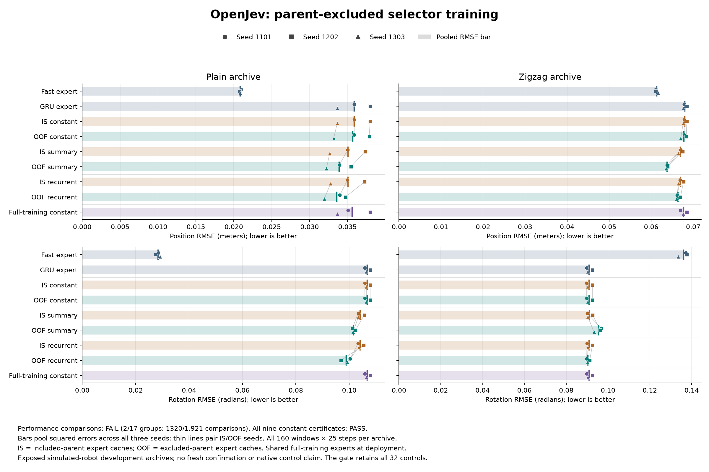
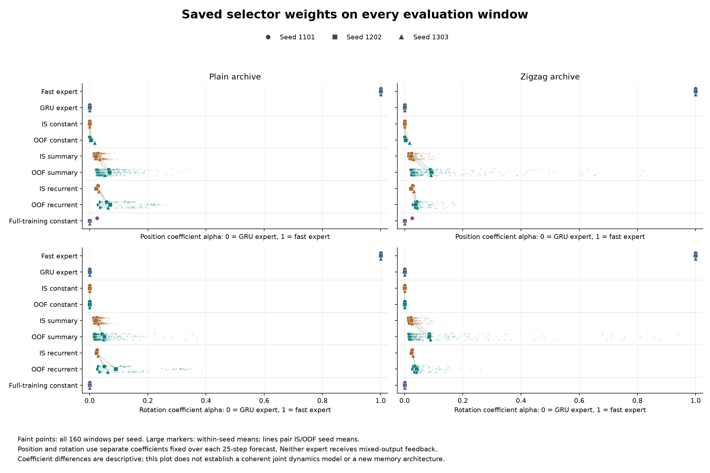
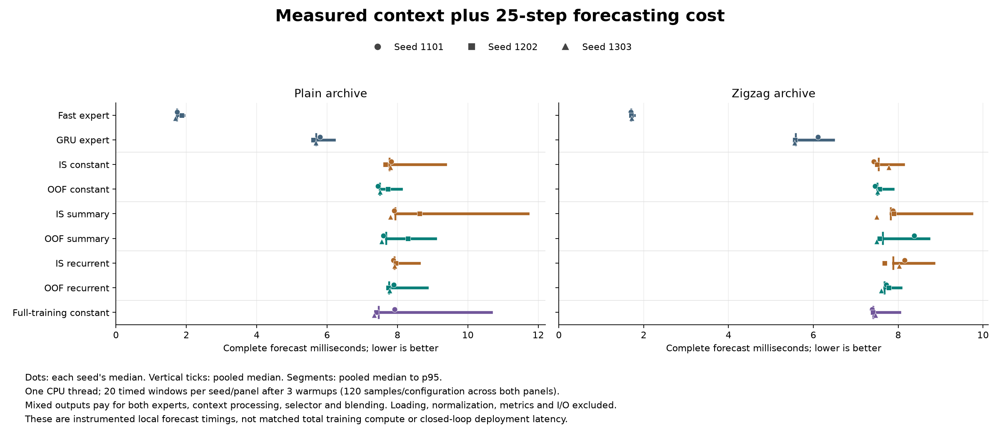

# Does parent-excluded training improve expert selection?

**Modestly, but the experiment fails its continuation rule: 2/17 requirements, with 1,320/1,921 underlying comparisons passing.** Training the recurrent selector on predictions from experts that excluded the queried trajectory improves all four pooled measurements versus its matched in-sample version. Every paired seed improves. The gains do not establish a useful new architecture or justify a larger run.

[Protocol](pose-crossfit-protocol.md) · [Audited results](../output/pose-crossfit-v1/report-02/summary.json) · [Receipt](../output/pose-crossfit-v1/report-02/receipt.json) · [Earlier coordination screen](pose-coordination-results.md)

## What changed

The earlier selectors learned from experts' own training predictions. Here each of three expert pairs excludes ten whole training trajectories and trains on the remaining twenty. For every one of the same 720 selector-training windows, the OOF cache uses the pair that excluded its parent; the IS cache uses a pair that included it. Both regimes use each pair equally, identical selector initializations and identical batch orders.

Eighteen expert fits and twelve selector fits completed, each with 690 updates: **30 neural fits and 20,700 updates**. Nine separate constant-mixture searches strengthen the baseline. All selectors deploy with the same original six full-training expert checkpoints. This creates a shared shift from twenty-parent training experts to thirty-parent deployment experts. The IS/OOF comparison also changes expert training composition, so it does not isolate prior exposure as the sole cause.

The 3,250-parameter recurrent selector sees all 31 completed transitions. The 3,302-parameter summary MLP sees the last, mean and last-minus-first token. Neither sees future observations, archive IDs or future actions. The two forecasting experts condition on the supplied recorded future applied torques. Each rolls out privately; mixed predictions do not feed back into an expert.

## Results

RMSE pools squared errors across all three seeds, all 160 windows per panel and all 25 forecast steps. Lower is better. IS means included-parent training predictions; OOF means excluded-parent predictions.

| Configuration | Plain position, m | Plain rotation, rad | Zigzag position, m | Zigzag rotation, rad |
|---|---:|---:|---:|---:|
| Recency + robust expert | 0.020862 | 0.028355 | 0.061292 | 0.136142 |
| GRU expert | 0.035888 | 0.106702 | 0.067998 | 0.090861 |
| IS constant | 0.035888 | 0.106702 | 0.067998 | 0.090861 |
| IS summary MLP | 0.035058 | 0.104124 | 0.066976 | 0.091022 |
| IS recurrent | 0.035060 | 0.104129 | 0.067037 | 0.090940 |
| OOF constant | 0.035700 | 0.106702 | 0.067759 | 0.090861 |
| OOF summary MLP | 0.033898 | 0.101660 | 0.063754 | 0.095458 |
| OOF recurrent (primary) | 0.033587 | 0.098852 | 0.066409 | 0.090407 |
| Full-training constant | 0.035618 | 0.106702 | 0.067695 | 0.090861 |

Compared with IS recurrent, OOF recurrent improves plain position by **4.20%** and plain rotation by **5.07%**. Zigzag position improves **0.94%** and rotation **0.59%**. All twelve paired seed/endpoint/panel differences favor OOF.

Against OOF summary, recurrence improves plain position by 0.92% and rotation by 2.76%, but zigzag position is **4.17% worse** while rotation is 5.29% better. There is no consistent recurrent advantage. The primary model is still 61.0% worse than the fast expert on plain position and 248.6% worse on plain rotation.

Only the zigzag-rotation leave-one-parent-out group and the latency group pass. The complete gate retains all 32 controls, not just the configurations in the main table. The 1,921 checks are overlapping deterministic comparisons, not independent statistical tests. Previous failures remain failures.

## What the training forecasts explain

The [post-outcome cache diagnosis](../output/pose-crossfit-v1/diagnosis-01/training-experts.json) uses saved predictions only. It was not used to change any fit or criterion.

| Prediction cache | Fast position, m | GRU position, m | Fast rotation, rad | GRU rotation, rad |
|---|---:|---:|---:|---:|
| Included parent, 20-parent experts | 0.019936 | 0.006007 | 0.032998 | 0.007441 |
| Excluded parent, 20-parent experts | 0.022482 | 0.009588 | 0.040791 | 0.015052 |
| Original 30-parent experts | 0.021551 | 0.006651 | 0.032940 | 0.008454 |

The GRU remains better on both training-domain endpoints even when its queried parent was excluded. Excluded-parent forecasts have higher training-domain errors, especially for the GRU, but the expert ranking does not reverse. The revised training protocol helps modestly, but excluded-parent scoring alone does not resolve transfer to the exposed archives. It does not prove a specific cause of that remaining shift.

All nine rotation constant searches select the GRU endpoint. Position constants give the fast expert zero weight in all IS fits, zero to 1.69% in OOF fits, and zero to 2.60% with the original full-training cache. Better optimization of training loss does not make these constants generalize better than every older fixed mixture.

The context selectors also remain strongly weighted toward the GRU. These are mixture coefficients, not probabilities of correctness:

| Selector | Plain fast position weight | Plain fast rotation weight | Zigzag fast position weight | Zigzag fast rotation weight |
|---|---:|---:|---:|---:|
| IS summary MLP | 2.779% | 2.542% | 2.511% | 2.315% |
| IS recurrent | 2.738% | 2.580% | 2.741% | 2.584% |
| OOF summary MLP | 6.186% | 4.696% | 9.033% | 8.610% |
| OOF recurrent (primary) | 6.395% | 6.744% | 4.085% | 3.881% |

## Computation and constant-search checks

| Configuration | Median, ms | p95, ms |
|---|---:|---:|
| Recency + robust expert | 1.716 | 1.903 |
| GRU expert | 5.618 | 6.455 |
| IS constant | 7.688 | 8.656 |
| IS summary MLP | 7.888 | 10.343 |
| IS recurrent | 7.909 | 8.840 |
| OOF constant | 7.505 | 8.104 |
| OOF summary MLP | 7.651 | 8.886 |
| OOF recurrent (primary) | 7.733 | 8.358 |
| Full-training constant | 7.433 | 10.536 |

The primary recurrent selector takes **7.733 ms**, versus **5.618 ms** for the GRU, or 37.6% more. Every mixed forecast pays for both experts, context processing, selection and blending. Timing uses an Apple M5 Max, one CPU thread, three warmups and twenty timed windows per seed/panel. Loading, normalization, reporting and artifact I/O are excluded. These sequential measurements are not a hardware-independent speed claim.

The recorded run took 176.133 seconds through evaluation: 150.530 seconds fitting fold experts, 11.727 fitting selectors, 1.670 in constant searches and 1.177 preparing caches. Timed evaluation calls account for 7.520 seconds within that total. The final console time including sealing is 176.176 seconds. Earlier deployment-expert training is inherited.

All nine constant searches meet their declared 1e-7 rad² numerical gap tolerance, using 423 objective evaluations in total. Their certificates concern the float64 SO(3)-projected objective, not exact float32 deployment optimality or formal interval arithmetic. The independent NumPy reconstruction differs from the projected rotation objective by at most 1.04e-11 rad²; this reconstruction is not an additional Torch evaluation.

## Evidence and the retained audit repair

- [Frozen protocol and 24 source snapshots](../output/pose-crossfit-v1/experiment-01/protocol.json), [execution log](../output/pose-crossfit-v1/experiment-01/execution.log), [completion](../output/pose-crossfit-v1/experiment-01/run-01/completed.json).
- [Preflight](../output/pose-crossfit-v1/experiment-01/preflight-validation.json): 166 tests passed; Ruff and source/data/checkpoint checks passed before fitting.
- [Completed independent audit](../output/pose-crossfit-v1/report-02/receipt.json): all 288 execution files, 54 new rows and 174 distinct combined rows checked. All twelve fresh expert forecasts reproduce the previous arrays exactly.
- [Numerical errors](../output/pose-crossfit-v1/report-02/window-errors.npz), [diagnosis receipt](../output/pose-crossfit-v1/diagnosis-01/receipt.json), [figure receipt](../output/pose-crossfit-v1/visualization-01/receipt.json).

The [first audit failed](../output/pose-crossfit-v1/report-01/failed.json) because a generic scalar check wrongly required a nonnegative least-squares numerator. Valid negative numerators produce a clipped coefficient of zero. A [separate, source-bound repair](../scripts/audit_pose_crossfit_repair.py) permits signed finite values with the original comparison tolerances. Its [23 regression tests and preflight](../output/pose-crossfit-v1/audit-repair-01/preflight-validation.json) passed. The original auditor, its tests and all 24 frozen source files remain unchanged. The corrected report binds the original failure and repair hashes. No model, training step or measured evaluation was repeated.

The audit reconstructs errors, blends, cache assignments, fold preprocessing and scalar-search bounds. Neural training, cached expert forecasts and learned gate outputs remain bound to source and saved artifacts rather than independently regenerated.

These repeatedly exposed simulated-robot archives are development evidence. They do not establish fresh confirmation, closed-loop control, real-robot gains, connectome superiority, calibrated uncertainty or an ICLR-ready contribution. Cross-validated stacking is established [prior art](https://arxiv.org/abs/1105.5466), not a new architecture. Raw/prepared data, training tokens, cached forecasts and full target/prediction arrays remain local because upstream licensing is unresolved. Our code, learned weights, numerical errors, traces and receipts are published.

All retained configurations

| Configuration | Plain position, m | Plain rotation, rad | Zigzag position, m | Zigzag rotation, rad |
|---|---:|---:|---:|---:|
| constant | 0.025987 | 0.072154 | 0.058390 | 0.097958 |
| decay5 | 0.022759 | 0.030200 | 0.063419 | 0.136657 |
| decay5_mass | 0.042387 | 0.039200 | 0.128887 | 0.146706 |
| decay_huber3 | 0.020862 | 0.028355 | 0.061292 | 0.136142 |
| decay_huber3_mass | 0.038787 | 0.036711 | 0.125003 | 0.145747 |
| full | 0.098412 | 0.075829 | 0.270129 | 0.175235 |
| full_constant | 0.035618 | 0.106702 | 0.067695 | 0.090861 |
| gru | 0.035888 | 0.106702 | 0.067998 | 0.090861 |
| half | 0.022780 | 0.058363 | 0.056511 | 0.104390 |
| huber3 | 0.034440 | 0.031780 | 0.072407 | 0.141513 |
| huber3_mass | 0.077483 | 0.062061 | 0.220453 | 0.164992 |
| is_constant | 0.035888 | 0.106702 | 0.067998 | 0.090861 |
| is_recurrent | 0.035060 | 0.104129 | 0.067037 | 0.090940 |
| is_summary | 0.035058 | 0.104124 | 0.066976 | 0.091022 |
| oof_constant | 0.035700 | 0.106702 | 0.067759 | 0.090861 |
| oof_recurrent | 0.033587 | 0.098852 | 0.066409 | 0.090407 |
| oof_summary | 0.033898 | 0.101660 | 0.063754 | 0.095458 |
| position_fast | 0.020862 | 0.106702 | 0.061292 | 0.090861 |
| position_slow | 0.035888 | 0.028355 | 0.067998 | 0.136142 |
| prior | 0.032881 | 0.042138 | 0.072468 | 0.126567 |
| public | 0.058359 | 0.058031 | 0.243096 | 0.226393 |
| recent5 | 0.021153 | 0.036673 | 0.061965 | 0.143649 |
| recent5_mass | 0.034940 | 0.033483 | 0.108665 | 0.143409 |
| recurrent | 0.034906 | 0.104281 | 0.066880 | 0.090935 |
| static | 0.032829 | 0.093414 | 0.066212 | 0.104842 |
| static_adapt | 0.054866 | 0.079994 | 0.247021 | 0.173765 |
| summary | 0.034906 | 0.104287 | 0.066795 | 0.090708 |

| Configuration | Plain position, m | Plain rotation, rad | Zigzag position, m | Zigzag rotation, rad |
|---|---:|---:|---:|---:|
| body16 | 0.044768 | 0.046767 | 0.128874 | 0.233431 |
| cv1 | 0.054460 | 0.032490 | 0.093457 | 0.165614 |
| cv16 | 0.089104 | 0.046767 | 0.148362 | 0.233431 |
| hold | 0.583865 | 0.115307 | 0.496740 | 0.208605 |
| ls16 | 0.080405 | 0.042556 | 0.135700 | 0.217734 |
| ridge16 | 0.057583 | 0.154251 | 0.090286 | 0.128104 |

