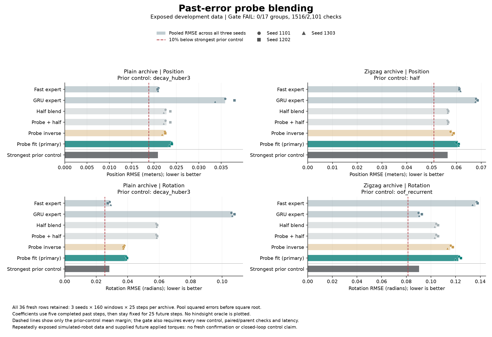
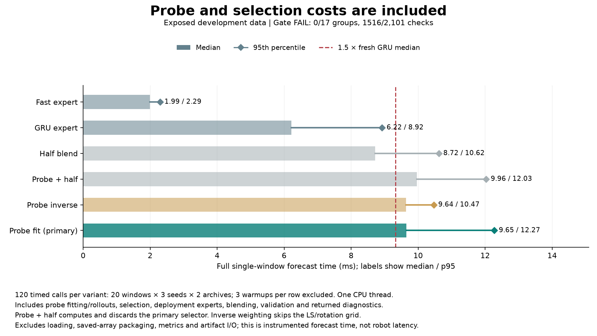

# Can past prediction errors choose the blend?

**This recipe failed: 0/17 continuation requirements passed, with 1,516/2,101 underlying comparisons passing.** Fitting blend weights to a short completed probe performed worse than simple inverse-error weights on all four pooled measurements and all twelve paired seed comparisons. It also exceeded the computation limit. The previous hindsight result showed available capacity; this experiment did not turn that capacity into a useful controller.

[Protocol](pose-probe-blend-protocol.md) · [Audited results](../output/pose-probe-blend-v1/report-01/summary.json) · [Receipt](../output/pose-probe-blend-v1/report-01/receipt.json) · [Earlier capacity diagnosis](pose-capacity-results.md)

## What changed

Both predictors keep their original weights. At the current root, the controller uses an earlier part of the observed context to forecast the last five completed steps. It compares those predictions with observations that are already available, then chooses separate position and rotation blend weights for the next 25 steps.

The primary, `probe_fit`, minimizes past position error with clipped least squares. For rotation it selects the best of seventeen predetermined coefficients, using the actual production blend. The simpler `probe_inverse` weights experts using their individual past errors. Both use the same probe predictions. A null control, `probe_half`, computes and discards the primary's fitted weights, then uses an exact half-and-half blend.

The probe sees 27 poses and forecasts five steps, or 100 ms. Deployment sees 32 poses and forecasts 25 steps, or 500 ms. Probe predictions evolve privately; they never replace actual observations in the GRU state. At the current root, all probe targets and action blocks are completed history. The recorded applied actions were not necessarily knowable at the historical probe origin, so this is a retrospective conditional probe rather than a forecast claimed to have been issued then. Full forecasts use the supplied recorded future applied torques, as in the preceding studies.

## Results

RMSE pools squared errors over all three seeds, 160 windows per archive and 25 future steps before taking the square root. Lower is better. No future observations enter coefficient selection.

| Configuration | Plain position, m | Plain rotation, rad | Zigzag position, m | Zigzag rotation, rad |
|---|---:|---:|---:|---:|
| Fast expert | 0.020862 | 0.028355 | 0.061292 | 0.136142 |
| GRU expert | 0.035888 | 0.106702 | 0.067998 | 0.090861 |
| Half blend | 0.022780 | 0.058363 | 0.056511 | 0.104390 |
| Probe + discarded fit + half | 0.022780 | 0.058363 | 0.056511 | 0.104390 |
| Probe inverse | 0.022243 | 0.037458 | 0.058285 | 0.115686 |
| Probe fit, primary | 0.023748 | 0.039178 | 0.060599 | 0.122273 |

Compared with inverse weighting, the primary has **6.77% / 4.59% more error** on plain position/rotation and **3.97% / 5.69% more error** on zigzag. Inverse wins every paired seed comparison and all forty pooled leave-one-parent-out comparisons between these two methods. Pooling seeds, it wins on 10/10, 8/10, 7/10 and 8/10 parents respectively. Individual-parent gains are not universal.

Compared with the fast expert, the primary worsens plain position by 13.83% and rotation by 38.17%. It improves zigzag position by 1.13% and rotation by 10.19%, but the fixed-half control still has lower zigzag position error, and the GRU has substantially lower zigzag rotation error. The primary's zigzag rotation error is 34.57% higher than the GRU's.

The full gate retains all 35 controls, including the earlier trained selectors and motion references. None of its seventeen groups passes. The 2,101 comparisons overlap and are not independent statistical tests. No control, seed or parent was dropped to improve the conclusion.

All **24 replay checks are bitwise identical**, including the eighteen fresh expert/half replays and six null-control replays. The shared probe arrays are also identical across the three probe variants. This supports attributing differences within these variants to their coefficient rules, while leaving the broader cause of poor transfer unresolved.

## Full computation cost

| Configuration | Median, ms | p95, ms |
|---|---:|---:|
| Fast expert | 1.992 | 2.294 |
| GRU expert | 6.215 | 8.924 |
| Half blend | 8.721 | 10.616 |
| Probe + discarded fit + half | 9.961 | 12.032 |
| Probe inverse | 9.642 | 10.465 |
| Probe fit, primary | 9.653 | 12.274 |

The primary takes **1.553 times** the fresh GRU median, exceeding the fixed 1.5 limit. The small median difference between the two probe selectors does not establish a speed advantage; these are sequential measurements on one machine.

Timing uses an Apple M5 Max, one CPU thread, three warmups and twenty timed single-window calls per seed and archive. It includes validation, probe fitting and rollouts, coefficient selection, full expert rollouts, blending and returned diagnostics. It excludes loading, saved-array packaging, metric reporting and artifact I/O. This is conditional forecast latency, not closed-loop robot latency.

The single execution made **864 forecast calls**: 36 batch forecasts and 828 single-window calls, including warmups. There were no new neural fits, optimizer updates or environment calls. Recorded execution time was **8.846 seconds**, including 0.873 seconds in batch forecasts, 5.653 in timed single calls and 0.841 in warmups. These components are nested, not additional costs. The console total including final completion writing was 8.937 seconds; independent audit took 2.199 seconds. Original training costs are inherited.

## Evidence and limits

- [Frozen protocol and 36 source snapshots](../output/pose-probe-blend-v1/experiment-01/protocol.json), [92-test preflight](../output/pose-probe-blend-v1/experiment-01/preflight-validation.json).
- [Execution log](../output/pose-probe-blend-v1/experiment-01/execution.log), [94-file completion seal](../output/pose-probe-blend-v1/experiment-01/run-01/completed.json), [independent audit](../output/pose-probe-blend-v1/report-01/receipt.json).
- [Numerical errors](../output/pose-probe-blend-v1/report-01/window-errors.npz), [final chart receipt](../output/pose-probe-blend-v1/visualization-02/receipt.json). The [first render](../output/pose-probe-blend-v1/visualization-01/receipt.json) is preserved; only an overlapping legend was corrected, with identical numeric values and no new forecasts.

The audit reconstructs completed-past errors, least-squares calculations, actual production grid losses, coefficient selection, output blends and all physical metrics. It checks all 94 execution files and 192 canonical rows. Raw probe forecasts and timed-call outputs remain bound to source, tests and saved records rather than independently regenerated. Probe arrays are persisted after return; no separate pre-scoring artifact seal is claimed. Original data, full forecasts and probe rotation arrays remain local under unresolved upstream licensing; numerical results, code, tests and receipts are published.

Using past errors to combine forecasts is established, including [Bates and Granger (1969)](https://www.tandfonline.com/doi/abs/10.1057/jors.1969.103). These blend weights are not calibrated probabilities or a new biological-learning mechanism.

We stop this fitted-probe recipe. The horizon and support-size changes are plausible contributors, but this experiment does not isolate them as causes. Another coefficient-fitting variant does not automatically earn a larger run. A subsequent predictor change should test a specific mechanism against simple controls and the existing correction/adaptation failures. These exposed simulated-robot archives do not establish fresh generalization, closed-loop robot improvement, connectome superiority or an ICLR-ready architecture.
