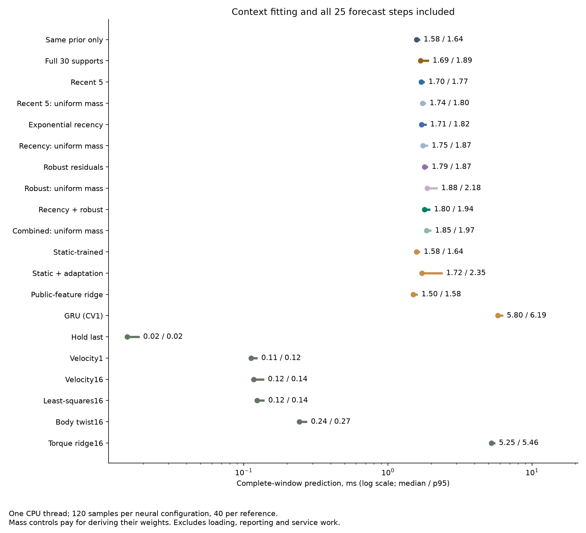

# Recent evidence improves prediction; rotational memory remains unresolved

September 19, 2026. With exactly the same learned features and prior weights,
recency plus robust residual weighting reduces position RMSE by **36.55% on
plain and 15.42% on zigzag** versus leaving the model unadapted. Plain rotation
also improves **32.71%**. Which transitions receive weight matters: a control
with the same total weight distributed uniformly performs substantially worse.

The full continuation rule still **fails: 5/17 requirements and 1,057/1,141
underlying comparisons pass**. Zigzag rotation is **7.56% worse than the prior**
and **49.84% worse than GRU**. Using only the most recent five transitions
explains most of the position gain. This is a useful mechanism diagnosis and
engineering improvement on exposed data, not a new architecture result.

## The change

The [previous diagnosis](pose-adaptation-failure-diagnosis.md) localized most
excess position error to each trajectory's first window. Its context includes
large early motion changes that are much smaller near the forecast root.
Those changes may reflect real dynamics; we do not label them corrupted data.

This screen preserves all observations, windows, checkpoints, features, motion
initialization and rollout equations. It changes the context regression only:

- Recent-five uses the last five completed transitions.
- Exponential recency halves support weight every five transitions.
- Robust weighting uses three Huber IRLS steps, starting at the global prior.
  Each output has its own residual weights; the threshold is 1.5 in the existing
  normalized target units, not an estimated noise standard deviation.
- The prespecified primary combines exponential recency and robust weighting.
- Four uniform-mass controls derive the corresponding weights, then redistribute
  the same per-output total uniformly over all 30 transitions. This tests
  whether a gain is simply stronger shrinkage toward the prior.

Each forecast uses the fitted weights without changing them during its
25-step rollout. Future poses cannot enter the update. Mass controls pay for
deriving their weights as well as their additional uniform fit.

There is **no new neural training or checkpoint selection**. Ten configurations
reuse the same three meta checkpoints. Four earlier neural configurations and
six motion/regression references complete the screen: 20 configurations and
96 evaluation rows. The [prospective protocol](pose-support-protocol.md) binds
the exact support rules, controls, costs and continuation criteria.

## Physical results

RMSE pools squared errors before square roots over all three fits, all 160
windows per archive and all 25 forecast steps. Each archive has ten parent
trajectories. Position and rotation are separate endpoints. Bold marks the
lowest error per column, without changing the prespecified primary method.

| Configuration | Plain position, m | Plain rotation, rad | Zigzag position, m | Zigzag rotation, rad |
| --- | ---: | ---: | ---: | ---: |
| Same prior only | 0.03288 | 0.04214 | 0.07247 | 0.12657 |
| Full 30 supports | 0.09841 | 0.07583 | 0.27013 | 0.17523 |
| Recent five | 0.02115 | 0.03667 | 0.06197 | 0.14365 |
| Recent-five uniform mass | 0.03494 | 0.03348 | 0.10867 | 0.14341 |
| Exponential recency | 0.02276 | 0.03020 | 0.06342 | 0.13666 |
| Recency uniform mass | 0.04239 | 0.03920 | 0.12889 | 0.14671 |
| Robust residuals | 0.03444 | 0.03178 | 0.07241 | 0.14151 |
| Robust uniform mass | 0.07748 | 0.06206 | 0.22045 | 0.16499 |
| **Recency + robust, primary** | **0.02086** | **0.02835** | **0.06129** | 0.13614 |
| Combined uniform mass | 0.03879 | 0.03671 | 0.12500 | 0.14575 |
| Static-trained | 0.03283 | 0.09341 | 0.06621 | 0.10484 |
| Static + adaptation | 0.05487 | 0.07999 | 0.24702 | 0.17377 |
| Public-feature ridge | 0.05836 | 0.05803 | 0.24310 | 0.22639 |
| GRU, CV1 | 0.03589 | 0.10670 | 0.06800 | **0.09086** |
| Hold last | 0.58387 | 0.11531 | 0.49674 | 0.20860 |
| World velocity1 | 0.05446 | 0.03249 | 0.09346 | 0.16561 |
| World velocity16 | 0.08910 | 0.04677 | 0.14836 | 0.23343 |
| Rooted least-squares16 | 0.08040 | 0.04256 | 0.13570 | 0.21773 |
| Constant body twist16 | 0.04477 | 0.04677 | 0.12887 | 0.23343 |
| Torque ridge16 | 0.05758 | 0.15425 | 0.09029 | 0.12810 |

The primary's position gains over the unadapted checkpoint occur in every
seed on both panels, with 10/10 plain and 9/10 zigzag parents improving. Plain
rotation improves in every seed and all ten parents. Zigzag rotation worsens
in every seed; only five parents improve. The tradeoff is repeatable.

Compared with the primary's uniform-mass control, position error is 46.21%
lower on plain and 50.97% lower on zigzag. Thus matching total evidence mass
does not reproduce the position benefit. These controls preserve weight sum,
not the full information matrix or statistical independence of observations.

However, the primary improves position over recent-five by only **1.37% and
1.09%**, and over exponential recency by **8.34% and 3.35%**. Plain rotation
improves 22.68% over recent-five, but only 6.11% over exponential recency;
one of three paired fits loses that latter comparison. On zigzag rotation,
the improvement over exponential recency is only 0.38%. The robust extension
does not consistently clear the simpler recency controls.

The primary beats CV1 on all four pooled endpoints, including 12.73% lower
plain rotation error. It also has the smallest pooled position error in this
screen, but the zigzag gains over static and GRU are only 7.43% and 9.86%.
GRU remains substantially better at zigzag rotation. These limitations prevent
a broad architecture or uniformly better predictor claim.

## Where the improvement occurs

All source-start windows remain in the primary result. The following is a
descriptive breakdown, not an exclusion or new selection criterion.

| Panel / position RMSE | Prior only | Full support | Recency + robust |
| --- | ---: | ---: | ---: |
| Plain, ten source-start windows | 0.02561 | 0.38079 | 0.01864 |
| Plain, remaining 150 windows | 0.03331 | 0.02577 | 0.02100 |
| Zigzag, ten source-start windows | 0.04061 | 1.04677 | 0.03577 |
| Zigzag, remaining 150 windows | 0.07411 | 0.06918 | 0.06262 |

Source-start windows account for 97.74% and 98.83% of the position-MSE
improvement over full support. Position RMSE on the remaining windows still
improves by 18.50% and 9.48%. This supports the diagnosis that the unweighted
fit carried early changes forward too strongly, while showing some benefit
beyond those windows. It does not identify the physical cause of the transient.

Rotational memory has a separate weakness. On remaining zigzag windows,
primary rotation RMSE is 0.13998 rad versus 0.12984 for the prior. Fixing the
initial transient alone cannot solve that gap.

## Continuation and cost

The gate required at least 10% improvement over every other configuration on
all four endpoints, paired-seed and parent consistency, and bounded latency.

| Panel / endpoint | Aggregate margins | Paired fits | Parent counts | Leave-one-parent-out |
| --- | ---: | ---: | ---: | ---: |
| Plain position | 17/19 | 57/57 | 18/19 | 190/190 |
| Plain rotation | 18/19 | 56/57 | 17/19 | 190/190 |
| Zigzag position | 15/19 | 57/57 | 16/19 | 189/190 |
| Zigzag rotation | 9/19 | 44/57 | 13/19 | 150/190 |

A group passes only when every entry passes. Four accuracy groups and the
latency group pass; twelve requirements fail. The 1,141 underlying comparisons
are dependent diagnostics, not independent statistical tests. A high fraction
of passing individual comparisons does not override the failed gate.

Median complete-window prediction is **1.796 ms** for the primary, versus
1.583 ms for prior-only, 1.700 ms for recent-five, 1.708 ms for exponential
recency, 5.804 ms for GRU and 0.112 ms for CV1. Primary p95 is 1.936 ms.
The primary adds 13.4% to the prior's median cost and uses 30.9% of GRU's cost
in this implementation. It is about 16 times the cheap CV1 reference.

Measurements use one Apple M5 Max CPU thread, 120 timed windows per neural
configuration and 40 per reference after warmups. They include context fitting
and all 25 rollout steps, excluding loading, metric/diagnostic reporting,
normalization and service overhead. Row order is fixed, so these local timings
do not establish a hardware-independent speedup. The producer records 6.181
seconds through evaluation, excluding final artifact hashing/write; its final
console total is 6.352 seconds. No neural weights were retrained.

## Evidence and next architecture question

- [Frozen protocol and source hashes](../output/pose-support-v1/experiment-01/protocol.json),
  [execution log](../output/pose-support-v1/experiment-01/execution.log) and
  [completion](../output/pose-support-v1/experiment-01/run-01/completed.json).
- [Independent numerical audit](../output/pose-support-v1/report-01/summary.json),
  [receipt](../output/pose-support-v1/report-01/receipt.json) and
  [numeric window errors](../output/pose-support-v1/report-01/window-errors.npz).
- [Implementation checks](../output/pose-support-v1/experiment-01/preflight-validation.json):
  87 tests passed, Ruff clean. Tests include weighted solves, IRLS ordering,
  mass controls, causal inputs and deliberately invalid audit artifacts.
- [Figure receipt](../output/pose-support-v1/visualization-01/receipt.json).

The audit verified 196 artifacts, all 96 rows, unchanged checkpoints and
cross-configuration support-mass identities. All 48 repeated prior/full and
retained-control rows match their earlier position and rotation arrays exactly,
with maximum difference zero. The auditor performs no model inference. Compact
diagnostics support independent mass/bounds checks; learned features, exact
Huber weights and posterior solves remain source-bound rather than replayed.

The evidence favors retaining recency as a strong baseline. The unresolved
architecture question is how to retain useful rotational memory under changing
motion without reintroducing stale updates. A next model must improve on both
the inexpensive recent-five update and the GRU, with future observations
unavailable to any selector. Adding robust fitting alone has not earned scaling.

Robust weighting and forgetting have substantial prior art, including
[Kovacevic et al.](https://pmc.ncbi.nlm.nih.gov/articles/PMC4962952/) and
[Bruce et al.](https://arxiv.org/abs/2003.02737). No biological-learning,
connectome or novel architecture claim follows from this screen. Results are
development evidence on already exposed simulated data, conditioned on recorded
future applied torques, with inferred Euler conventions. Fresh confirmation
and closed-loop control remain unproven. Raw/prepared data, targets and forecasts
stay local because upstream licensing is unclear; our code, diagnostics,
numeric errors and receipts are published. Earlier failed studies stay failed.
