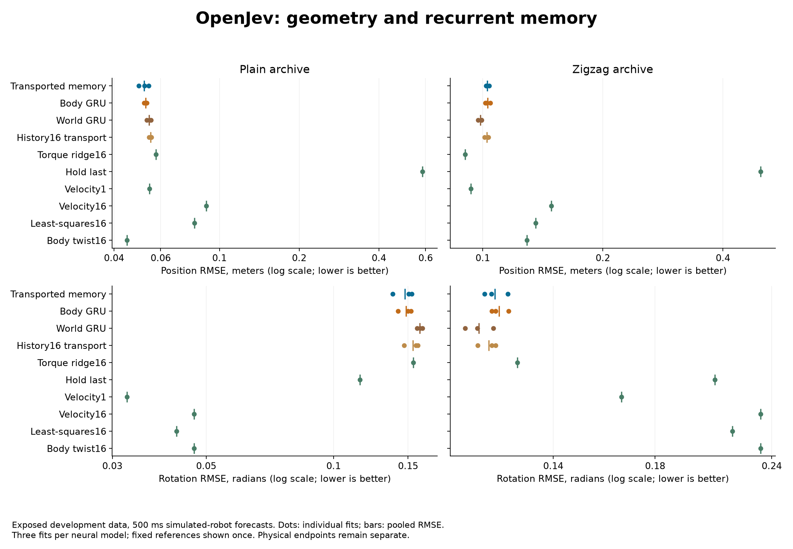
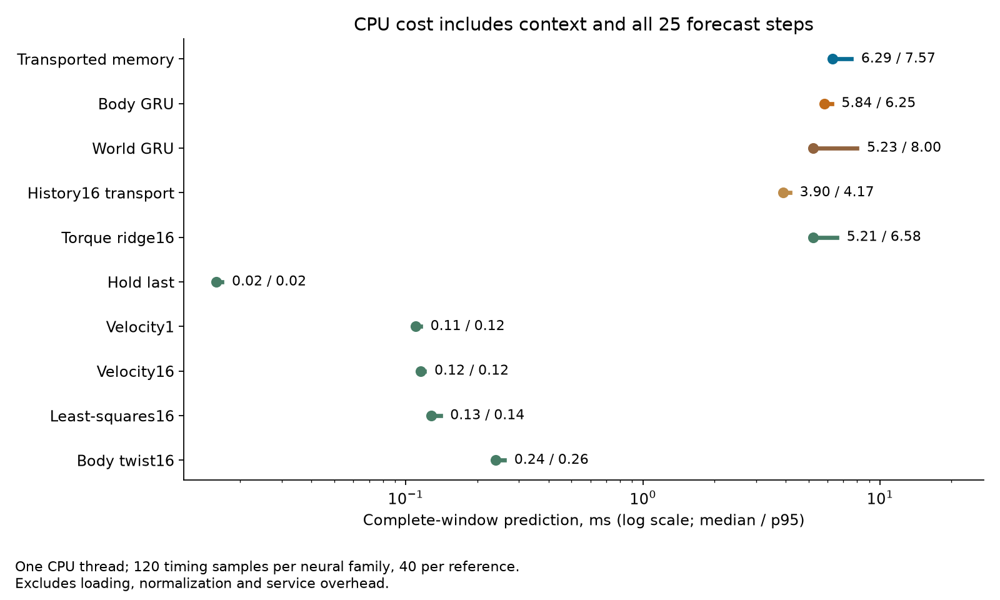

# Geometry-correct forecasts, no transported-memory advantage

September 19, 2026. **Rotating the recurrent memory produced only 0.1% to 1.4%
lower pooled error than the matched body-frame GRU.** None of the four primary
matched margins reached the required 10%. The development continuation rule
failed: **345/541 checks passed**. Simple motion references still win several
endpoints. We will not scale up this memory intervention on this evidence.

This run corrected the previous experiment's problematic orientation loss and
added stronger controls. It used new training and a new protocol; the earlier
residual-dynamics result remains failed at 36/49. Both robot archives had already
been evaluated, so these results are development evidence, not confirmation.

## The intervention

All learned models predict changes in displacement and angular increments,
starting from a valid constant-motion prediction. Position error is measured
in meters; orientation error is the shortest rotation angle in radians. The
training loss uses fixed scales of 0.1 meter and 0.1 radian instead of separately
standardizing six redundant sine/cosine coordinates.

The main pair has identical initial weights, 23,046 parameters, batch order,
optimizer and output rule. Both process motion in body coordinates. The
candidate additionally treats its 48 hidden values as sixteen three-dimensional
vectors and rotates them when the body frame changes. This tests the value of
that specific memory operation. The ordinary GRU nonlinearities do not provide
full vector equivariance, and this is not a biological connectome model.

We also trained a history16 version and a world-coordinate version. The latter
receives six additional orientation features and has 24,774 parameters, so its
comparison is not a pure coordinate-only ablation. Each family has three fits.
Six fixed or linear references complete the comparison. See the
[prospective protocol](pose-transport-protocol.md) for exact definitions.

## Physical results

Pooled RMSE across all 25 forecast steps, 160 windows per archive and all three
fits for each neural family. Each archive contains ten parent trajectories.
Lower is better; position and orientation remain separate endpoints.

Velocity1 uses the latest two observations, spanning one interval; velocity16
uses the endpoints of sixteen observations, spanning fifteen intervals. The
frozen protocol's phrase "using1 and16 observations" is imprecise for velocity1.
The frozen code and tests use indices30 and31; no computation or result changes.

| Configuration | Plain position, m | Plain rotation, rad | Zigzag position, m | Zigzag rotation, rad |
| --- | ---: | ---: | ---: | ---: |
| Transported memory | 0.05195 | 0.14727 | 0.10264 | 0.12118 |
| Matched body GRU | 0.05270 | 0.14822 | 0.10275 | 0.12242 |
| World GRU | 0.05423 | 0.15996 | 0.09866 | **0.11651** |
| History16 transport | 0.05496 | 0.15392 | 0.10243 | 0.11934 |
| Hold last | 0.58387 | 0.11531 | 0.49674 | 0.20860 |
| World velocity1 | 0.05446 | **0.03249** | 0.09346 | 0.16561 |
| World velocity16 | 0.08910 | 0.04677 | 0.14836 | 0.23343 |
| Rooted least-squares16 | 0.08040 | 0.04256 | 0.13570 | 0.21773 |
| Constant body twist16 | **0.04477** | 0.04677 | 0.12887 | 0.23343 |
| Torque-conditioned ridge16 | 0.05758 | 0.15425 | **0.09029** | 0.12810 |

The matched candidate/body improvements are 1.418% and 0.642% on plain position
and rotation, and 0.104% and 1.014% on zigzag. Only one of three paired fits
improves both plain endpoints. On zigzag, two fits improve position and all
three improve rotation. Those differences do not support a dependable advantage.

Pooled parent errors improve on 10/10, 10/10, 6/10 and 9/10 parents respectively.
Removing any one parent preserves each small aggregate gain over the body
control. Unlike the earlier result, a single trajectory does not erase that
gain, but its size and seed consistency remain inadequate.

The failures are substantive, not only a missed numerical cutoff. Constant
body twist beats the candidate's plain position error, the candidate's plain
rotation error is about 4.5 times velocity1's, and torque ridge wins zigzag position.
The shorter-history model also has lower pooled errors on both zigzag endpoints.
The gate failed 196 checks: 24 family margins, 38 paired comparisons, 14 parent
requirements and 120 leave-one-parent-out comparisons. The latency check passed.

## Cost and execution

| Configuration | Median, ms | p95, ms |
| --- | ---: | ---: |
| Transported memory | 6.294 | 7.566 |
| Matched body GRU | 5.838 | 6.249 |
| World GRU | 5.227 | 8.000 |
| History16 transport | 3.901 | 4.168 |
| Torque ridge16 | 5.211 | 6.578 |
| Hold last | 0.016 | 0.017 |
| World velocity1 | 0.110 | 0.115 |
| World velocity16 | 0.115 | 0.120 |
| Rooted least-squares16 | 0.128 | 0.140 |
| Constant body twist16 | 0.240 | 0.261 |

Measured on one Apple M5 Max CPU thread. Timing includes context reconstruction
and all 25 forecast steps, excluding loading, normalization and service work.
Neural families have 120 measured windows, references 40, after warmups. The
candidate costs 1.078 times the body control and about 57 times velocity1 in
this implementation. These are implementation timings, not hardware-independent
algorithmic speed claims.

All twelve fits and planned evaluations completed in 150.26 seconds, including
145.56 seconds of training. There were 8,280 recorded updates, no retries,
replacement seeds, parameter sweeps or selected intermediate checkpoints.
The candidate has a 312-byte per-case state tensor payload and 16 bytes of
model-shared scale buffers;
this excludes activations, temporary copies, Python objects and optimizer state.

## Evidence and next decision

- [Frozen protocol and source hashes](../output/pose-transport-v1/experiment-01/protocol.json).
- [Training log](../output/pose-transport-v1/experiment-01/training.log),
  [weights and fit records](../output/pose-transport-v1/experiment-01/run-01),
  and [producer completion](../output/pose-transport-v1/experiment-01/run-01/completed.json).
- [Independent numerical audit](../output/pose-transport-v1/report-01/summary.json)
  and [receipt](../output/pose-transport-v1/report-01/receipt.json): all 126 files,
  36 prediction rows, initial-weight pairing and 541 checks verified from saved
  evidence without new forecasts or training.
- [Preflight](../output/pose-transport-v1/preflight.json): 116 focused tests passed,
  covering geometry, causal inputs, gradients, references and audit arithmetic.

This establishes a usable physical-pose benchmark and rules out scaling the
current transported-GRU recipe. The next architectural question should address
adaptation to changing dynamics or reliable use of the learned correction,
with these cheap motion models retained as controls. It should not assume that
more history or rotating an ordinary GRU is already beneficial.

The data are simulated and predictions condition on recorded future applied
torques. There is no closed-loop control or issued-command causality result.
Euler convention is inferred from Bullet documentation because original
quaternions and collection code are absent. Raw data, prepared arrays, targets
and source-derived predictions remain local because upstream licensing is not
explicit. The audit's numeric error arrays, our weights and source are published.

Moving-frame recurrence is established prior art, including
[Flow Equivariant Recurrent Neural Networks, section 4](https://arxiv.org/html/2507.14793v2#S4).
Our pose-driven rotation of an ordinary GRU neither reproduces that model nor
inherits its guarantees. There is no ICLR-level novelty or robust architectural
advantage established by this screen.
