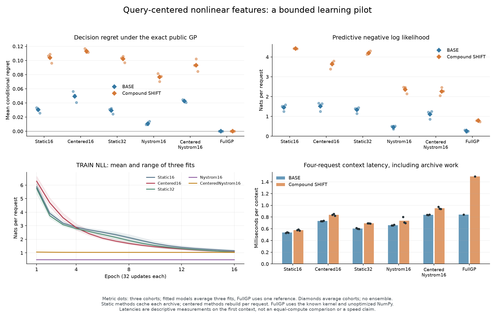

# Query-centered nonlinear features: the candidate does not advance

**Fifteen completed fits, 3,072 fresh requests, continuation rule failed: 2/24 conditions pass.** Query centering raises mean decision regret by **63.09% on BASE and 8.98% on SHIFT** against the same-sized static model. Every cohort favors every practical control over the candidate on regret. The lower SHIFT NLL against the static neural models does not translate into better decisions.

## What was trained

The new model learns 16 nonlinear features, then maintains a Bayesian linear predictor for each archived function. Four noisy examples determine a mixture over plausible function identities. The candidate recomputes all features relative to the query coordinate. It uses the joint example likelihood and conditions on each observation once. This is an implemented learned predictor, but it has no learned recurrent computation policy or environment dynamics.

Five arms share 1,024 TRAIN contexts, three paired fit seeds, 16 epochs and 512 updates per fit. All final checkpoints precede evaluation generation. BASE and a compound SHIFT each contain three fresh cohorts of 128 contexts, four requests per context. SHIFT changes both the coordinate range and the number of archived functions. Contexts are independent; requests within a context and fits trained on the same TRAIN set are not independent datasets.

The task is a controlled noisy RBF function family. Static Nyström knows that kernel family and fits only length and amplitude. The full GP receives the exact generating kernel, so it is a privileged reference. These are synthetic decision results, not chess, text, robotics or a reproduction of proprietary Jev.

## All mean results

Lower is better. Regret is excess expected negative/defer/positive decision cost under the exact public-information mixture. The wrong sign costs 1 and defer costs 0.2. The full GP has zero regret by construction, not because it observes the hidden identity or query answer. NLL is measured on noisy held-out targets in nats/request.

| Model | BASE regret | SHIFT regret | BASE NLL | SHIFT NLL |
| --- | ---: | ---: | ---: | ---: |
| Static learned features (16) | 0.030249 | 0.103991 | 1.4502 | 4.4220 |
| Query-centered learned features (16) | 0.049332 | 0.113326 | 1.5193 | 3.6368 |
| Static learned features (32) | 0.029288 | 0.102159 | 1.3302 | 4.2013 |
| Static Nyström (16) | 0.010892 | 0.076546 | 0.4578 | 2.3597 |
| Query-centered Nyström (16) | 0.042539 | 0.093320 | 1.1055 | 2.2624 |
| Full GP, supplied true kernel | 0.000000 | 0.000000 | 0.2592 | 0.7872 |
| Always defer | 0.120655 | 0.064101 | Not a density model | Not a density model |

All five fitted arms have worse **mean SHIFT regret than always deferring**. The candidate defers on 16.54% / 22.79% of BASE / SHIFT requests; the exact reference defers on 25.26% / 51.76%. This is a concrete decision-quality failure. It does not by itself identify the cause or establish a calibration guarantee for any alternative.

The frozen rule required at least 10% lower regret, NLL no more than 0.02 nat worse, and regret wins on all three cohort means against each of four controls in both populations. Only the two SHIFT NLL conditions against static neural models pass. All eight regret-gain requirements and all eight cohort-consistency requirements fail. No arm, epoch, inference budget or continuation criterion was selected after evaluation.

## Computation and storage

One-thread CPU float64, macOS arm64, PyTorch 2.14.0, NumPy 2.5.3. Each timing below averages fit-specific medians of 20 repeats on the first evaluation context. Each repeat includes four sequential requests and all archive work. Static arms cache once per archive; centered arms rebuild every request. The full GP uses an unoptimized NumPy implementation that recomputes each request. This is descriptive timing, not an equal-compute or cross-language speed comparison.

| Model | BASE ms/context | SHIFT ms/context |
| --- | ---: | ---: |
| Static learned features (16) | 0.535 | 0.577 |
| Query-centered learned features (16) | 0.733 | 0.838 |
| Static learned features (32) | 0.603 | 0.692 |
| Static Nyström (16) | 0.661 | 0.735 |
| Query-centered Nyström (16) | 0.837 | 0.951 |
| Full GP, supplied true kernel | 0.843 | 1.492 |

Total recorded training time is 50.87 seconds. The complete original run process exited successfully in 56.81 seconds; the independent audit process took 0.71 seconds. No fit was retried or extended.

Static16 and centered16 each have 624 parameters; static32 has 1,152, and each Nyström arm fits two. Raw archives occupy 1,536 / 3,072 array bytes in BASE / SHIFT. Static16 additionally caches 25,600 / 51,200 tensor bytes. Centered models retain no cross-query posterior cache, but must rebuild temporary state. These figures exclude Python overhead and transient workspace and are not peak process memory. Complete per-arm resource records are preserved.

## Validation and artifacts

**107 fabricated tests pass.** They check joint likelihoods, Gaussian conditioning, replay identity, public/private boundaries, cache equivalence and invalidation, failure retention, metric formulas and artifact joins. The independent audit decodes all 103 data/prediction archives, reconstructs the exact GP on all 768 evaluation contexts, independently scores 49,152 stored query predictions and agrees with all 96 metric rows and the continuation rule.

Neural checkpoint files are authenticated as bytes; the auditor does not execute their predictions or replay training. Historical generation order, training counts and wall time remain producer/source evidence, with separate original process closures. Eleven registered sources and their snapshots remain unchanged.

- [Protocol](query-feature-protocol.md) and [pre-training registration](query-feature-registration.json), committed in `f3ffb084` before collection.
- [Audited summary](query-feature-results/summary.json), [full independent audit](query-feature-results/audit.json), and [unrounded plotted records](query-feature-results/plotted-values.json).
- [All data, 15 final checkpoints, source snapshots, original logs and closures](query-feature-results/evidence.tar.gz), with a [file and hash index](query-feature-results/archive-index.json).
- [PNG](query-feature-results/benchmark.png) and [PDF](query-feature-results/benchmark.pdf).

## What follows from this result

Do not advance this candidate to a learned recurrent refinement gate. Its predictive representation needs to justify itself before paying for a selector. The tested candidate fails even against a smaller static kernel baseline, and all fitted models have poor shifted decisions relative to abstention. A future proposal should first distinguish kernel/feature misspecification, finite training and uncertainty errors with established controls. Those are hypotheses for a separate experiment, not explanations proved here.

Learned features with Bayesian last layers already appear in [ALPaCA](https://arxiv.org/abs/1807.08912); [deep kernel learning](https://proceedings.mlr.press/v51/wilson16.html), [MOCA](https://arxiv.org/abs/1912.08866), and [Attentive Neural Processes](https://arxiv.org/abs/1901.05761) are related. Query centering is not an architectural novelty claim. This pilot establishes neither a recurrent-world-model improvement nor a biological-connectivity advantage or an ICLR-level result.
