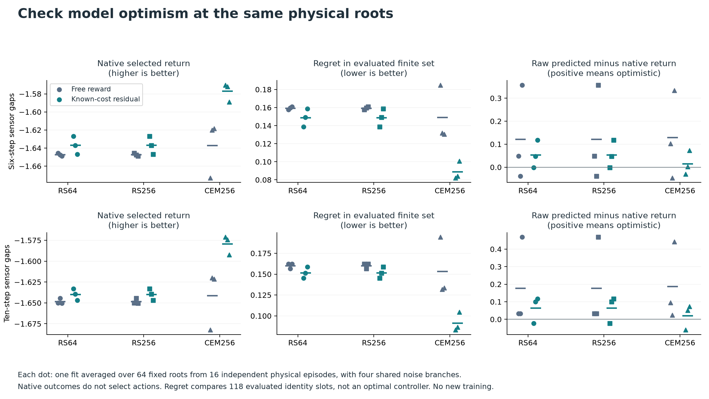

# Can better search make the existing world model useful?

Status: completed and independently audited, September 18, 2026.
Adaptive search reduced residual-model control cost by **25.48% with ordinary
sensing gaps and 25.26% with longer gaps**, compared with random shooting at
the same candidate-scoring budget. All three residual fits improved on both
panels. The primary continuation gate passed **8/8** checks; CEM256 passed
**15/15** fresh control-competence checks.

The six models were inherited unchanged from the
[earlier study](reacher-reward-residual-control.md). No new model was trained
or selected. No inherited checkpoint was scored on the new cohorts before
freezing the [protocol](../evidence/reacher-search-v1/protocol/plan.json), SHA-256
`8d5da5ee146c95532721fd1b6582bc37a091d5417e5d8b68f73e241379f2428b`.
The [saved-output audit](../evidence/reacher-search-v1/audit/summary.json) supports
a conventional planning result: better search makes these existing models more
useful. It does not establish memory use, a new architecture, or a JEPA,
connectome or reinforcement-learning contribution.

## Completed control results

Cost is the negative sum of native rewards over 50 executed steps; lower is
better. Each cell averages all three fixed fits in its family over the same 64
paired cases. Ordinary sensing has two six-packet gaps; shifted sensing extends
each gap to ten packets. All six fits, all panels and all planners are retained.

| Sensing | Reward head | RS64 | RS256 | CEM256 |
|---|---|---:|---:|---:|
| Full | Free | 11.516684 | 11.517127 | 9.341138 |
| Full | Residual | 11.101120 | 11.080222 | 8.239324 |
| Ordinary | Free | 11.540183 | 11.540065 | 9.462354 |
| Ordinary | Residual | 11.180601 | 11.166587 | 8.321801 |
| Shifted | Free | 11.562838 | 11.562287 | 9.548385 |
| Shifted | Residual | 11.200686 | 11.190381 | 8.363617 |


For CEM256 minus RS256, the residual-family mean cost difference is
**-2.844786** on ordinary sensing, with an episode-paired percentile 95% interval
of **[-3.427438, -2.240798]**. Under shift it is **-2.826764**, with interval
**[-3.404254, -2.233626]**. These descriptive bootstrap intervals condition on
the three saved fits; they are not uncertainty estimates across newly trained
models. Individual residual fit improvements on the two primary panels range
from 21.80% to 28.48%.

| Prespecified check | Result |
|---|---|
| CEM256 versus RS256: both residual-family means improve at least 5%, every paired fit improves | **8/8, passed** |
| Fresh control competence with RS64 | 5/15, failed |
| Fresh control competence with RS256 | 7/15, failed |
| Fresh control competence with CEM256 | **15/15, passed** |
| Earlier combined prediction/control gate | 9/17, failed; historical, not rerun |

Increasing independent random proposals from 64 to 256 had little practical
effect: residual-family cost fell only 0.014014 ordinarily and 0.010305 under
shift. The larger CEM gains therefore support adaptive proposal allocation,
rather than merely evaluating more candidates. Free-head models also improve
with CEM, although their family means remain worse than the residual models.

The reference controllers retain their privileges and original budgets:

| Sensing | Known state + supplied physics | Particle belief + supplied physics | Zero command | Uniform command |
|---|---:|---:|---:|---:|
| Full | 7.259323 | 7.403523 | 11.642618 | 42.437480 |
| Ordinary | 7.259323 | 7.450230 | 11.642618 | 42.437480 |
| Shifted | 7.259323 | 7.490604 | 11.642618 | 42.437480 |

Both physics planners use 64 candidates; the two command baselines do not
search. These references are not equal-access or equal-compute learned-model
comparators. CEM residual models still have higher cost than either physics
reference. Exact per-fit results and timings are in
[all control rows](../evidence/reacher-search-v1/figures/all-control-rows.csv).

## Mechanism and sources

[PlaNet](https://arxiv.org/abs/1811.04551) uses iterative Gaussian proposal
fitting for latent planning. [iCEM](https://arxiv.org/html/2008.06389v1), section
3, additionally studies correlated actions, elite reuse, boundary clipping,
mean evaluation and selection of an evaluated sequence. We borrow adaptive
Gaussian search and explicitly paid mean evaluation. This is an anchored CEM
adaptation, not a reproduction of either system. No warm start, colored noise,
proposal momentum or cross-decision elite reuse enters the first comparison.

The [search component](../src/openjev/research/reacher_adaptive_search.py)
accepts explicit innovation arrays and a score callback. It does not access a
simulator, model weights or a random generator. This separates proposal
accounting from both model inference and the experiment's stream manifest.
Its synthetic checks cannot establish control effectiveness.

The component passes 54 synthetic checks for exact budgets and call schedules,
paid mean evaluation, global-best retention, input immutability, shared prefixes,
clipping, invalid scores and terminal boundaries. Independent review caught and
corrected an extra random-shooting score call before any scored experiment.
The complete runner and independent auditor add 124 checks, for 178 passing
checks in the combined suite. A random-weight rehearsal reconstructed every
saved proposal and replayed native transitions. These checks establish harness
behavior, not model effectiveness.

## Fixed comparison

| Planner | Scored sequences per decision | Allocation |
|---|---:|---|
| RS64 | 64 | Common bank with the original seven anchors and variance split |
| RS256 | 256 | Same 64 plus 192 independent proposals |
| CEM256 | 256 | Same 64, then three adapted generations of 64 |

Scorer call sizes are exactly `[64]`, `[256]` and `[64, 64, 64, 64]`.
Random shooting scores its full bank in one call, so extra batching overhead
is not quietly charged only to that baseline.

All three arms receive the identical new common bank. It retains the original
anchor values and proposal distribution, not the old run's exact draw assignment.
Innovation arrays always cover the full planning horizon, even near termination;
unused trailing blocks are recorded but never scored. This differs from the
legacy helper's shortened random-array shape and must be declared in the new
stream contract. Additional random-search samples
split evenly between standard deviations .25 and .75. Do not create the common
bank as a prefix of an array whose shape changes with the planner budget:
case/sample RNG assignment and the original variance split would change.

CEM fits a diagonal Gaussian to the best eight candidates of each current
generation, with a standard-deviation floor of .001. Subsequent generations
use 64, 64 and 63 innovations. The last generation's remaining slot evaluates
the current proposal mean. Fixed anchors are evaluated once; elites only fit
the distribution. Select the globally best evaluated sequence, with earliest
candidate ID breaking ties. There is no unpaid final score.

Commands use the existing three-step blocks, clipping and float32 conversion.
The horizon is `min(12, 50 - decision_step)`. Both 256-sequence planners perform
136,704 imagined transitions per 50-step case, versus 34,176 for RS64. These
counts exclude shared observation assimilation and executed-action state
updates, which must also be reported. Proposal generation, sorting, fitting,
clipping, copying and trace storage all enter decision timing.

The experiment evaluated all six unchanged free/residual fits at seeds 271,
283 and 293 on 64 fresh paired cases under full, ordinary and shifted sensing.
This gives 54 learned controller/panel rows plus 12 reference rows. The physics
references retain their original 64-sequence budget and supplied-physics access.
Reset interventions required for memory qualification belong in a separately
explicit schedule; this comparison does not earn that qualification.

CEM256 versus RS256 is the primary equal-scoring-budget contrast. RS256 versus
RS64 measures spending more computation. Neither contrast implies equal wall
time. All six fits were used without selecting a best seed or reward head.

## Compute and measured timing

| Planner | Scored sequences per 50-step case | Imagined transitions per case | Residual decision time, all three fits and panels |
|---|---:|---:|---:|
| RS64 | 3,200 | 34,176 | 17.913258 s |
| RS256 | 12,800 | 136,704 | 60.719423 s |
| CEM256 | 12,800 | 136,704 | 60.946594 s |


The primary contrast matches scored candidates and imagined transitions, not
total FLOPs or wall time. CEM's measured residual decision total was 0.37% above
RS256 and 3.40 times RS64. These are descriptive timings from one fixed-order
execution, not a repeated speed benchmark. Decision timing includes loading,
proposals, model scoring, belief updates, sorting and trace writes. Whole-row
timing additionally includes setup, native execution and final storage.

Each decision processes 64 cases together. Dividing batch time by case count
gives amortized throughput, not the latency of a single agent. Shared
observation assimilation and executed-action updates are paid and recorded in
the row timings even though they are excluded from imagined-transition counts.
The complete learned-control evaluation scored 354,336,768 imagined transitions.

## Separate prediction error from search exploitation

[MOPO](https://arxiv.org/abs/2005.13239) treats distribution shift as a central
problem for offline model-based control. Better predicted reward under stronger
search can reflect model error. Test this on common states rather than comparing
optimistic scores from controllers that have reached different states.

The diagnostic uses 16 fresh mixed-policy episodes, with four prespecified roots
per episode: step 6, two steps into the ordinary blackout, the first observation
after that blackout, and step 47. Replay all three sensor histories over the
same physical records. Reconstruct each model's state solely from public
observation packets and issued commands.

At each root, evaluate a common 64-sequence bank and every model/planner's
selected sequence in cloned native states under four shared, independent noise
branches. Retain all 118 identity slots across all sensing panels, including
duplicate sequences. Report the number of unique sequences separately; retaining
duplicates keeps the native evaluation budget fixed and the identity mapping
explicit.
Native results are diagnostic labels only, never selection inputs. Save commands,
noise, integration state, time index, observations and rewards for replay.

Report common-bank rank agreement, native selected return, prediction error,
clipping frequency and regret within the evaluated candidate union. This is
finite-set regret, not regret against an optimal controller. More optimistic
CEM scores combined with worse native selected return would favor a model-error
explanation. It would not justify a stronger-search promotion.

The last root has only three remaining physical transitions. No terminal value,
post-terminal simulator step or imaginary advance of physical time is permitted.
Restore native integration state and the time-limit index; supply the recorded
branch noise explicitly because restoring physics alone does not restore the
wrapper's noise generator.

The completed diagnostic covers all 64 prespecified roots, with four noise
branches per sequence and 118 retained identity slots per root. There are
67 to 82 unique sequences per root, averaging 73.84; duplicate identities are
not extra independent samples. The table below averages the three residual fits
and equally weights the prespecified physical roots. Selected native return is
higher-is-better; finite-set regret is lower-is-better.

| Sensing | Planner | Selected native return | Finite-set regret | Signed raw prediction bias |
|---|---|---:|---:|---:|
| Ordinary | RS256 | -1.636874 | 0.148853 | 0.054191 |
| Ordinary | CEM256 | -1.577046 | 0.089026 | 0.015248 |
| Shifted | RS256 | -1.639736 | 0.151715 | 0.064690 |
| Shifted | CEM256 | -1.579318 | 0.091298 | 0.021265 |



Common-bank rank agreement is identical across planners for a given model,
history and root, because both the model and common-bank predictions are fixed.
The result supports better proposal allocation and selected native returns;
it does not show that CEM improves the model's ranking function. The residual
family has no reward-prediction clipping in these diagnostic traces, so its
aggregate improvement is not explained by a change in clipping frequency.

Failures remain visible. At the near-terminal roots, CEM residual selected
return is slightly worse on average: CEM minus RS256 is -0.000227 ordinarily
and -0.000205 under shift. The free-271 model also has worse average diagnostic
selected return with CEM on both primary panels. Stronger search therefore
does not improve every root or every model's diagnostic decisions. The
[complete diagnostic table](../evidence/reacher-search-v1/figures/all-diagnostic-rows.csv)
retains these rows.

These roots come from separate mixed-policy episodes, not the controllers'
own state distributions. Four branches estimate return conditional on each
root; they are not independent training runs. Regret is against the evaluated
finite union, not the best possible action sequence. Signed bias can cancel
across roots, and the raw/clipped errors remain available separately. Root
averages mix twelve-step windows with the prespecified three-step terminal
windows, so their magnitudes should not be read as full-episode control costs.

## Freeze and continuation

Before scored calls, bind all six checkpoint hashes, source, runtime, exact
execution order, fresh cohorts and role-separated generators. Enumerate initial
states against original training and every prior evaluation. Common banks,
actuator noise and bootstrap pairing require named intentional reuse; noise
must never share a candidate generator. Separate random-search extensions,
CEM innovations, diagnostic collection and native diagnostic branches.

The frozen full-run cap is 3,600 seconds, including diagnostics and final
artifact hashing. Before freezing, use separate engineering fixtures to verify
that the required scope fits. No retries, replacement seeds or budget extensions
are allowed after the scored run begins. A failure becomes a preserved attempt.
The independent auditor reads saved predictions/proposals and replays native
transitions; it must not rerun learned candidate scoring.

Planning continuation requires at least 5% lower residual-family mean
cost for CEM256 versus RS256 in both ordinary and shifted panels, with every
paired residual fit improving. Publish free-head controls, all seeds, all costs
and diagnostic failures regardless of outcome.

The scored namespace is `reacher-search-v1-scored`. Before freeze, random-weight
engineering fixtures had exercised the initial draft namespace. The final
protocol excludes that namespace and three separately named engineering
namespaces at full production role coverage. Its 1,277 generator states are
disjoint from 5,108 enumerated engineering states and all three earlier study
namespaces, including original training. No inherited checkpoint was evaluated
during those engineering fixtures. The
[preflight note](../evidence/reacher-search-v1/engineering-namespace-note.json)
preserves this correction.

The earlier 9/17 failed gate remains authenticated historical context. This
study passes the new planning continuation rule and CEM's fresh control-only
checks. It does not rerun the earlier held-out prediction qualification or
perform a memory-reset qualification, so it cannot claim to have passed the
earlier full rule or established memory use. Longer sensing gaps are one narrow
scenario shift within Reacher, not evidence of transfer to another environment.

The next experiment can hold CEM fixed and compare the unchanged training
objective with a public raw-endpoint auxiliary and an EMA latent auxiliary.
That would test whether representation training adds value after correcting
the planning bottleneck. It needs fresh paired evaluation, explicit teacher and
decoder compute, declared loss-scale choices, and reset interventions for any
memory claim. Connectome comparisons and a second environment remain future
work. The present result is a useful baseline, not an architecture novelty claim.

## Costs and verification

The independent [audit receipt](../evidence/reacher-search-v1/audit/receipt.json)
has SHA-256
`a510adcbc19d7dd6cb292d520a417f9e7d6146da8a6a8b16f605c54a6f4fa93f`.
It binds the protocol, implementation, runtime, inherited lineage, execution
members and [summary](../evidence/reacher-search-v1/audit/summary.json). The
summary SHA-256 is
`a3b323e449aa97e9c51bec53b2903161f72fa4ebce897ec8124f0e2cbf48bc32`.
The [figure receipt](../evidence/reacher-search-v1/figures/receipt.json) records
the rendered figures and complete CSV tables separately.

| Cost scope | Seconds |
|---|---:|
| Inherited fitting, already included in earlier attempts | 209.151973 |
| Earlier cumulative attempt execution | 606.558388 |
| New scored execution, including diagnostics and final hashing | 482.220110 |
| Cumulative attempt execution after this study | 1,088.778498 |
| Independent audit validation, outside execution timing | 43.828583 |

The new execution finished within its frozen 3,600-second cap and performed no
new fitting or Astra calls. Cumulative execution adds the new 482.22 seconds
once to the earlier 606.56 seconds; inherited fitting must not be added again.
Audit validation, publication and packaging are outside that execution total.

The auditor reconstructed stored proposals and checked **544,928 native
transitions with maximum absolute replay error 0**: 506,528 fresh evaluation
transitions plus 38,400 inherited training transitions. It made no new learned
model, policy or MPC-scoring calls. Native replay verifies saved actions and
physical outcomes; reconstructing proposals from recorded scores does not
independently verify neural forward outputs. Phase receipts bind the logged
execution order but are not an independent process observer.

## Reproduce

The [GitHub release](https://github.com/kw2828/OpenJev/releases/tag/research-reacher-search-v1)
contains the complete saved execution in three parts. Their sizes and hashes
are recorded in the [multipart manifest](../evidence/reacher-search-v1/execution-parts.json);
the [archive manifest](../evidence/reacher-search-v1/execution-artifact.json)
binds the packaged execution. Concatenate `.part-000`, `.part-001` and `.part-002`
in that order. The combined archive is **2,507,605,067 bytes**, SHA-256
`fe36acf0842da8e827067d521a52f595101b12417b65ee1c8ef8873f3d48455e`.

From a clean checkout, download, assemble and verify:

```bash
gh release download research-reacher-search-v1 --repo kw2828/OpenJev \
  --pattern 'reacher-search-v1-execution.tar.gz.part-*' \
  --dir output/reacher-search-v1-release
cat output/reacher-search-v1-release/reacher-search-v1-execution.tar.gz.part-000 \
    output/reacher-search-v1-release/reacher-search-v1-execution.tar.gz.part-001 \
    output/reacher-search-v1-release/reacher-search-v1-execution.tar.gz.part-002 \
  > output/reacher-search-v1-release/reacher-search-v1-execution.tar.gz
printf '%s  %s\n' \
  fe36acf0842da8e827067d521a52f595101b12417b65ee1c8ef8873f3d48455e \
  output/reacher-search-v1-release/reacher-search-v1-execution.tar.gz \
  | shasum -a 256 -c -
```

After verification reports `OK`, extract without overwriting an existing
attempt. Archive members start with `execution/`, so the extraction target is
`runs/reacher-search-v1`, not the repository root:

```bash
mkdir -p runs/reacher-search-v1
tar -xzf output/reacher-search-v1-release/reacher-search-v1-execution.tar.gz \
  -C runs/reacher-search-v1
```

Use the pinned [robotics runtime](robotics-requirements.txt) and restore the
complete upstream artifacts documented in the
[six-fit report](reacher-reward-residual-control.md#costs-and-verification).
Authentication still checks that inherited lineage. Reproduce the saved-output
audit into a new output directory:

```bash
PYTHONPATH=src:scripts .venv-robotics/bin/python scripts/reacher_search_study.py audit \
  --plan evidence/reacher-search-v1/protocol/plan.json \
  --expected-plan-sha256 8d5da5ee146c95532721fd1b6582bc37a091d5417e5d8b68f73e241379f2428b \
  --execution runs/reacher-search-v1/execution \
  --out output/reacher-search-v1-reproduced-audit
```

The audit reconstructs proposals from saved scores and replays native actions;
it performs no new learned inference. To reproduce execution itself, the same
runner accepts `run` with the frozen plan and external SHA above, plus a new
exclusive `--out` directory. That performs learned inference and must preserve
all fits, cases, diagnostics and the original cap. Reproduction is not a fresh
held-out evaluation for tuning another method. Existing attempts, cases and
audit artifacts must remain intact.
