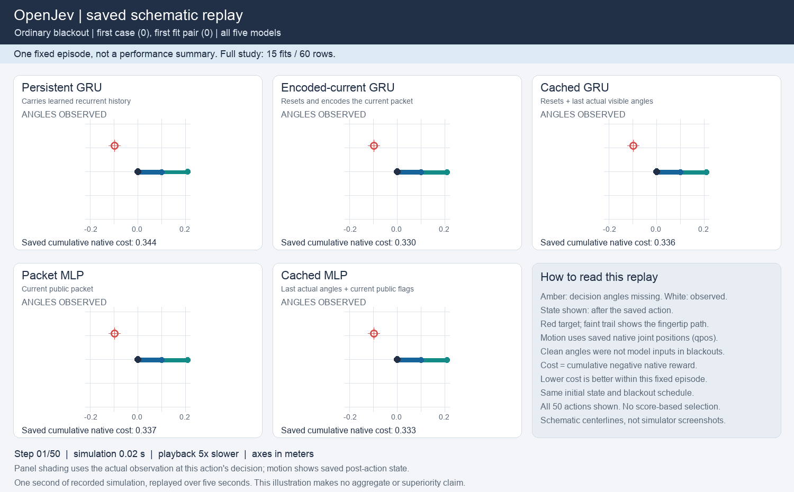

# Does recurrent memory outperform an explicit angle cache?

**No incremental recurrent advantage was established: 15 of 28 continuation checks passed.** The cached MLP achieved **6.32% lower control cost with six-step sensing gaps and 5.57% lower cost with ten-step gaps** than the persistent GRU, improving every paired fit on both panels. Persistent GRU and cached GRU had close family means, with inconsistent paired differences. This is a completed development comparison, not evidence that recurrence is generally unnecessary or that the models are equivalent.

The earlier [memory study](reacher-memory-ablation.md) passed its own, weaker comparisons. Its original result remains intact. This follow-up adds explicit caches and a current-packet GRU that encodes missing packets too, using fresh fits and evaluation cases. It does not support advancing a recurrent or biological architecture claim on the strength of the earlier result.

## All models and outcomes

Lower native episode cost is better. Each learned entry averages all three fits over the same 64 cases. Full sensing supplies angles, not velocity. The 60 rows comprise 45 learned-model rows and 15 reference rows; they are not 60 independent datasets.

| Controller | Full sensing | Six-step gaps | Ten-step gaps |
| --- | ---: | ---: | ---: |
| Persistent GRU | 8.7942 | 8.9008 | 8.9766 |
| Current GRU, unconditional encoding | 8.6628 | 8.6870 | 8.7384 |
| Cached-angle GRU | 8.7988 | 8.8739 | 8.9344 |
| Current-packet MLP | 8.6245 | 8.7813 | 8.9439 |
| Cached-angle MLP | 8.1966 | 8.3383 | 8.4767 |
| Supplied physics, known state | 8.1718 | 8.1718 | 8.1718 |
| Supplied physics, particle filter | 8.3007 | 8.3246 | 8.3951 |
| Supplied physics, public kinematics | 8.1336 | 8.1611 | 8.2508 |
| Zero action | 12.4011 | 12.4011 | 12.4011 |
| Uniform action | 43.4380 | 43.4380 | 43.4380 |

All four required 3% persistent-versus-cache mean improvements failed. Persistent recurrence also lost every gap-panel pair against the cached MLP, lost pair 1 against the cached GRU on both gap panels, and exceeded the allowed 2% full-sensing degradation against the cached MLP. These are the 13 failed checks. The competence checks passed; they cannot compensate for failed primary comparisons.

Caching helped the MLP: its mean cost fell **5.04%/5.22%** versus the current-packet MLP on ordinary/long gaps, with every paired fit improving. Caching the GRU instead increased mean cost **2.15%/2.24%** versus the unconditionally encoded current GRU, with every paired fit worsening. These secondary contrasts do not rescue the failed primary rule.

The MLP cache advantage is also present under full sensing, where it lowers cost by 4.96% versus the packet MLP. Its training still included missing observations, so this is a comparison of separately trained policies, not a same-weights test of cache access at deployment. It does not isolate a benefit specific to bridging blackouts. The old current GRU's missing-packet gate is absent from this experiment; its isolated removal effect is not measured.

The paired figure retains all fits. Its 95% case-bootstrap intervals condition on these three saved fits and one training corpus; they are descriptive, not multiplicity-adjusted or uncertainty over new training fits. All persistent-minus-cached-MLP intervals are positive. Persistent-minus-cached-GRU intervals span zero, which does not prove equivalence. [Every fit, prediction, timing and check](../evidence/reacher-cache-ablation-v1/figures/tables.md).

## Prediction is not control

On the separate 96-episode prediction cohort, persistent GRU has much lower one-step missing-endpoint angle-feature MSE: **0.02932**, versus **0.10170** for cached MLP and **0.10487** for cached GRU. Mean one-step reward MSE is also lower for persistence: **0.00420**, versus **0.00500** and **0.00467** respectively. The controller nevertheless performs worse than cached MLP.

The angle metric uses four sine/cosine components, not squared angular radians. Clean missing-endpoint values are audit-only labels. These predictive gains neither establish useful velocity inference nor identify the cause of the utility loss. The [prior reward diagnostic](../output/reacher-memory-ablation-v1/reward-bottleneck-diagnostic.md) and this result motivate a separate reward-scoring intervention before enlarging memory.

## See the recorded behavior

This schematic replay shows **case 0, pair 0, all five arms**, selected before outcomes. Its single episode favors persistent GRU despite the aggregate failure. It is not a performance summary. All 50 native steps are shown over five seconds, five times slower than the simulated episode. Shading marks unavailable observations. Clean positions come from saved audit state and were not supplied to the policies; centerlines use recorded joint positions and XML geometry rather than native camera pixels.

## Matched training, measured computation

All models use the same inherited 768 public training episodes, loss, optimizer, minibatch order, 48 epochs and 1,152 updates per fit. The three GRUs have 36,805 parameters each; the two MLPs have 36,599 each. Starting tensors match within each architecture family and fit pair. All 15 fits were restored using their actual classes before fresh evaluation.

Cache entries contain only actually observed angles plus their age. Every real assimilation resets the cached models' learned/predicted state; imagined branches cannot update their real measurement cache. The two reset GRUs encode every packet, including missing ones. Actual packet validity, clocks and target masks stay unchanged.

| Model | All three fit walls, seconds | Six-step gaps, ms per case/decision | Ten-step gaps, ms per case/decision | Root state bytes per case |
| --- | ---: | ---: | ---: | ---: |
| Persistent GRU | 95.88 | 2.228 | 2.222 | 288 |
| Current GRU, unconditional encoding | 134.57 | 2.615 | 2.566 | 320 |
| Cached-angle GRU | 132.61 | 2.627 | 2.637 | 336 |
| Current-packet MLP | 94.10 | 2.677 | 2.707 | 32 |
| Cached-angle MLP | 134.75 | 3.075 | 3.079 | 112 |

The cached MLP is more expensive here: about 38% more whole-row time than persistence on the gap panels. These times include setup, native stepping and traces, amortized over 64 cases; training and global hashing are separate. Cache validation and copying are charged. Equal parameters and updates do not match compute. Measurements used CPU float32, two Torch threads and a shared Apple M5 Max host; they are not isolated latency or a Rust/Python comparison.

All learned controllers use CEM256, horizon 12 and action block 3. Initial proposal banks and random innovations are paired; later proposals adapt to each model's scores. Physics references know supplied dynamics and use 64 proposals, so they are competence references rather than matched architecture controls.

The complete execution took **1,234.34 seconds**, including **591.91 seconds** fitting and **630.00 seconds** in controller rows. Its separate audit took **36.72 seconds**, replaying **235,200 native transitions with zero discrepancy**, plus checking 9,408 nominal public-observer transitions. The audit validates saved outputs and native replay; it does not independently rerun optimizer updates or neural inference.

## Protocol, release and next decision

The [frozen protocol](../evidence/reacher-cache-ablation-v1/protocol/plan.json) required at least 3% lower persistent mean cost against both cached families on each gap panel, no losing paired fit, at most 2% full-sensing degradation, and designated competence checks. All 28 were required. The single scored run had no retry, seed replacement, selected checkpoint or post-outcome rule change. Before launch, 351 component tests passed and a complete engineering rehearsal passed its saved-output audit; those are implementation checks, not efficacy evidence.

- Protocol SHA-256: `7868daa12242df37f020946f9d3b279811a0e97547eef4d8b179da6e9394cefa`.
- Completed execution SHA-256: `08f5f700d7214d58a26c4b89368da1ecdfe9afb87ce1ff3628713eebdc4e3d5a`.
- [Audit receipt](../evidence/reacher-cache-ablation-v1/audit/receipt.json) SHA-256: `d1a6e486fde8823f5a760af8036e79af4fc57b452bc5fa0c8d184093ce2a1790`.
- [Independent results review](../output/reacher-cache-ablation-v1/independent-results-review.md) recomputes all native-cost rows, paired-fit signs and continuation checks from authenticated saved arrays.
- [Complete release](https://github.com/kw2828/OpenJev/releases/tag/research-reacher-cache-ablation-v1): all checkpoints, traces, frozen sources, audit, figures and replay. Capacity and rehearsal evidence are separate engineering assets; historical dependencies retain separate release identities.

**Next: test whether reward scoring limits control, with frozen transitions.** The prospective [reward-intervention design](../output/reacher-cache-ablation-v1/reward-intervention-design.md), written before reading this outcome, compares the learned reward head with an explicitly approximate geometry score. It requires zero new fits and separate native branch-ranking and fresh closed-loop comparisons. It is not implemented or measured here. The [two-observation design](../output/reacher-cache-ablation-v1/two-observation-design.md) remains deferred because persistent superiority did not survive the simpler cache controls.

No biological-wiring advantage, new RL method, calibrated uncertainty, second-environment transfer or ICLR-level novelty is established by this experiment.
