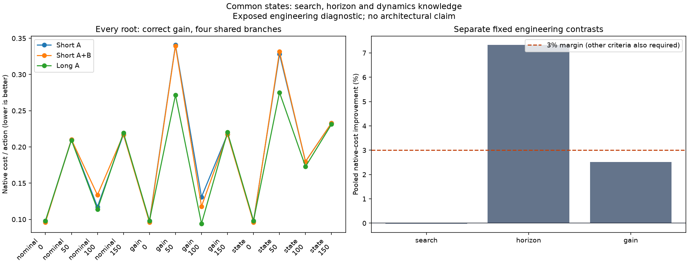

# What limits the tracking controller?

**Longer planning helped on average, but none of the three comparisons met its continuation rule.** A 24-step horizon lowered native branch cost by **7.33%** versus two 12-step search restarts. It was nonworse on only **7 of 12** state slots, below the required eight. Correct dynamics improved candidate ranking by **2.51%**, below the required 3%. We are closing this task/controller configuration as evidence for learned adaptation.

## Comparison

The [previous plan-memory experiment](reacher-proposal-memory.md) followed different closed-loop trajectories. This diagnostic instead starts each comparison from the same saved native state and current target, separating search effort, horizon and dynamics-dependent ranking.

We used all four target-change states from each of three existing reference trajectories. There are twelve identity slots but only **ten distinct native states** because the startup is repeated. These are exposed engineering histories from one initial condition, not twelve independent test episodes.

- **Search:** two independent short searches versus one, with the first search reused in the two-search condition.
- **Horizon:** one 24-step search versus two 12-step searches. Both pay 6,144 candidate transitions per root and dynamics assumption. Their setup, scoring-call and selected-advance costs differ.
- **Dynamics knowledge:** nominal versus correct-gain scoring over the exact same candidate union, with state fixed. The union contains proposals from both dynamics-conditioned searches, so this isolates ranking rather than a deployable online estimator.

All methods use the unchanged CEM256 search and native physics. Selection depends only on modeled scores. Each unique plan is evaluated under four shared, preallocated noise sequences. Short plans hold their final command through action 24. These are **open-loop branches**; a short-horizon controller would normally replan after acting.

## Results

Cost is native distance plus squared applied command, per action, averaged over all four branches and twelve slots. Lower is better.

| Contrast | Baseline cost | Candidate cost | Improvement | Nonworse slots | Fixed rule |
|---|---:|---:|---:|---:|---|
| More short search | 0.189007 | 0.189041 | -0.018% | 10/12 | Fail |
| Longer horizon | 0.189041 | 0.175190 | +7.327% | 7/12 | Fail |
| Correct dynamics, common union | 0.178382 | 0.173904 | +2.510% | 10/12 | Fail |

The fixed rule required at least **3%** relative and **0.001/action** absolute improvement, no worse average on any source trajectory, and at least eight nonworse slots. The longer horizon improved each trajectory's average but missed the slot criterion. Dynamics knowledge met the consistency and absolute criteria but missed the relative margin. More short search offered no average benefit. No failed criterion was relaxed.

The horizon signal is useful diagnostic evidence. It does not establish a robust closed-loop improvement, a recurrent model advantage or an architectural contribution. [Every slot, branch mean and comparison](../output/reacher-common-root-diagnostic-v1/review-01/report.md).

## Verification

The protocol, source and all new inputs were published before execution at commit `c9a428ad9341db2aa74fe71f8fb6c3c8cc16f00f`. **111 focused tests** passed across branch execution, native audit and reporting. A documented pre-execution arithmetic clarification fixed exact-threshold comparisons without changing margins or regenerating inputs.

All twelve slots passed independent replay, covering **413,928 transitions**: 294,912 search candidates, 72 selected advances, 39,648 cross-scoring transitions and 79,296 noisy branch transitions. Native replay error was zero; independent geometry arithmetic differed by at most `2.384185791015625e-7`, within the fixed tolerance.

Execution took **7.324 seconds**, replay **13.034 seconds**, and the enclosing process **21.302 seconds**. Thirty bound source files and the earlier protected source sets remained unchanged. These are complete instrumented shared-host timings, not deployment latency claims.

[Protocol and arithmetic clarification](../output/reacher-common-root-diagnostic-v1/README.md) · [Protocol review](../output/reacher-common-root-diagnostic-v1/protocol-review.md) · [Reporting review](../output/reacher-common-root-diagnostic-v1/report-review.md) · [Independent results review](../output/reacher-common-root-diagnostic-v1/results-review.md).

[Download the full evidence](https://github.com/kw2828/OpenJev/releases/tag/research-reacher-common-root-v1), including all raw searches, native branches, paired inputs, source snapshots and audits. Original path bindings and runtime assumptions are retained.

## Decision

Close this tracking configuration. The specified diagnostic did not establish enough consistent utility from correct dynamics to justify training an adaptive model on it. Further horizon, terminal-cost or memory tuning would be a new study, not a rescue of this result.

The broader recurrent-learning objective remains open. Its next benchmark must establish a useful hidden-state or dynamics problem against strong finite-history and conventional estimation baselines. [Decision record](../output/reacher-common-root-diagnostic-v1/next-decision.md).
