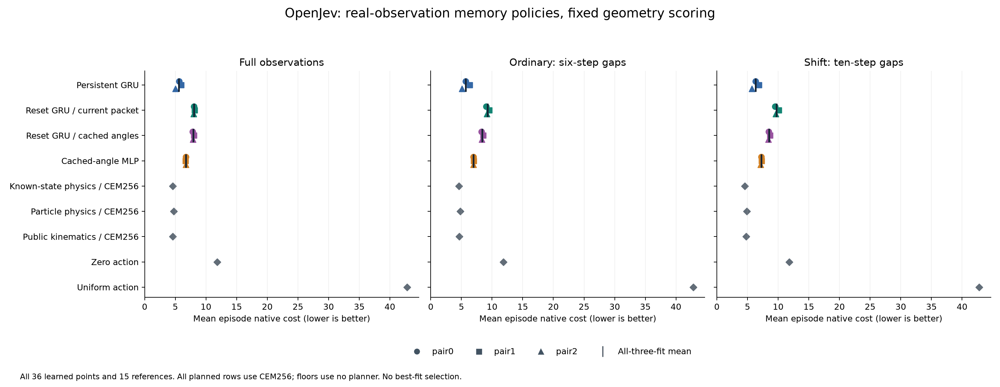
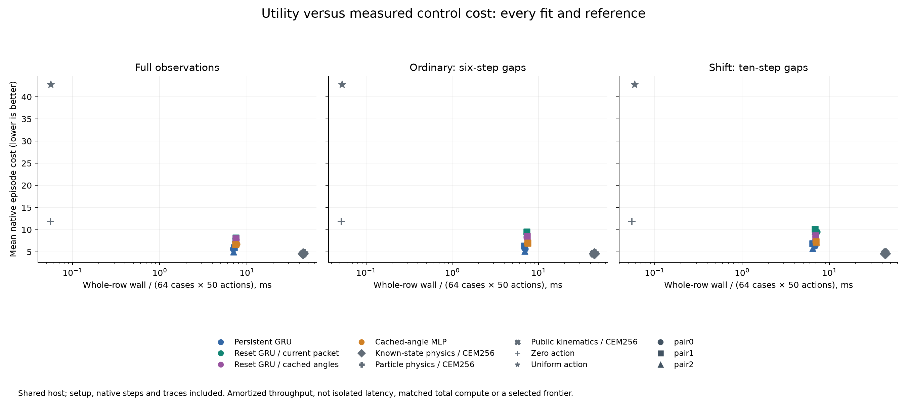
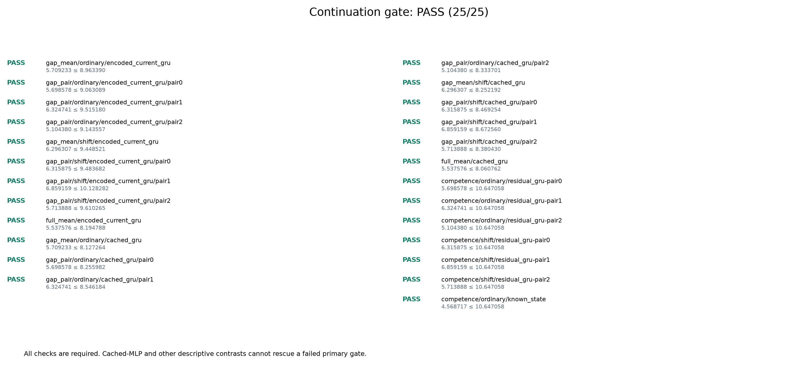

# Persistent memory helps with a fixed geometry score

**Completed: all 25 frozen continuation checks passed.** Persistent GRU lowered native control cost by **31.86% on six-step sensing gaps and 25.99% on ten-step gaps** versus the GRU retaining only the last observed angles. Against current-packet GRU, the reductions were **38.22% and 35.36%**. Every paired fit improved in all four primary gap comparisons.

This supports a useful trained memory policy in this Reacher task. It does not establish a new architecture, biological-wiring advantage or general robotics performance. All twelve checkpoints were inherited: **zero new fits, optimizer updates or Astra calls**.

## Comparison

Each learned family has three saved fits. The three GRU families share the same 36,805-parameter schema and paired original initialization, training data and update counts, but separately trained final weights. Cached MLP has 36,599 parameters. All three GRUs remain recurrent during imagined rollouts. The treatment is their trained update policy across real observations, including different validity gating, rather than recurrence in isolation.

| Model | Information carried across real decisions |
|---|---|
| Persistent GRU | Learned state updated by observations and issued actions |
| Current-packet GRU | Hidden state resets at each real observation packet |
| Cached-observation GRU | Hidden state resets; input retains last observed angles and age |
| Cached-observation MLP | The same observation cache, with a feedforward predictor |

All twelve fits saw the same 64 fresh paired cases, each with 50 actions, under full sensing, six-step gaps and ten-step gaps. Reset states, hidden disturbances and planner innovations are paired. Later adaptive proposals can differ as model scores differ. There are **36 learned rows and 15 reference rows**.

All planned controllers use geometry scoring and CEM256: horizon 12, action blocks of three, clipping, a paid mean candidate and terminal truncation. Original learned reward heads still execute and are charged. Physics controllers use supplied nominal simulator dynamics; known-state physics additionally receives the true current state. Equal candidate budgets do not equalize information or total compute.

## Results

Mean native episode cost, lower is better. Learned rows average all three fits; the [full table](../evidence/reacher-geometry-memory-v1/report/tables.md) retains every fit and timing.

| Controller | Full sensing | Six-step gaps | Ten-step gaps |
|---|---:|---:|---:|
| Persistent GRU | 5.537576 | 5.709233 | 6.296307 |
| Current-packet GRU | 8.034106 | 9.240609 | 9.740743 |
| Cached-observation GRU | 7.902708 | 8.378622 | 8.507414 |
| Cached-observation MLP | 6.705506 | 6.975331 | 7.234155 |
| Known-state physics | 4.568717 | 4.568717 | 4.568717 |
| Particle physics | 4.731065 | 4.786677 | 4.892595 |
| Public-kinematic physics | 4.580680 | 4.640030 | 4.755555 |
| Zero action | 11.830064 | 11.830064 | 11.830064 |
| Uniform action | 42.796284 | 42.796284 | 42.796284 |

Persistent GRU also beats cached MLP by **18.15%/12.96%** on the gap panels, in all three fit pairs. That secondary comparison cannot rescue a failed primary rule. All three supplied-physics references remain better than every learned fit on every panel; they are not optimal stochastic-control oracles. Persistent cost is **23.04%/32.40% higher** than public-kinematic physics on the gap panels.

Persistence improves full-sensing cost by 31.07% against current-packet GRU and 29.93% against cached GRU. Full sensing still excludes native velocity. The benefit is not specific to missing observations, and this comparison does not identify velocity inference as its mechanism. Fit-level gap improvements versus cached GRU range from 20.91% to 38.75%; these aggregate gains do not imply winning every case.

For persistent minus cached GRU, conditional paired-case 95% cost-difference intervals are **[-3.1291, -2.2102]** ordinarily and **[-2.5642, -1.8672]** under shift. They fix the three saved fits and one training corpus. They do not quantify population uncertainty over new training seeds or correct for multiple comparisons. Fresh evaluation seeds in a repeatedly studied simulator remain development evidence.

## Computation and replay

Persistent-GRU rows took 20.49-22.85 seconds for 64 cases and 50 actions; the other learned rows took 21.76-24.62 seconds, and physics rows 138.31-143.96 seconds. Shared-host batched timings include row setup, native steps and trace work. They are neither isolated action latency nor matched total compute. Historical fitting and global validation costs remain separately recorded. The MLP executes about 1.64 times the counted dense affine MACs of each GRU despite similar parameter counts.

Execution took **2,109.20 seconds** within the frozen 5,700-second cap; independent audit took **1,384.44 seconds** within its 3,300-second cap. Learned planning evaluated 29,491,200 candidate sequences and 314,966,016 imagined transitions, plus 115,200 selected advances. Physics planning evaluated 7,372,800 sequences and 78,741,504 nominal transitions, plus 28,800 selected advances. Observer propagation is separate.

The GIF shows all 50 saved actions from **ordinary case 0, pair 0**, selected before outcome inspection. It is a schematic replay of native joint positions, not an aggregate summary or selected winning episode. One simulated second plays over five seconds. Amber marks missing observations; clean angles shown in the replay were not model inputs during those gaps.

## Verification and next experiment

The frozen rule requires at least 3% mean improvement against both reset GRUs on both gap panels, no worse result in any paired fit, at most 2% full-sensing degradation, and the specified zero-action competence checks. **25/25 passed** without changing thresholds.

The saved-output auditor checked **163,200 executed native transitions**, replayed **78,741,504 physics candidate transitions and 28,800 selected advances**, and separately checked **310,464 public-observer transitions**. Maximum native and observer replay discrepancy was **zero**. It authenticated all 90 frozen sources, checkpoints, search arithmetic and public-history boundaries. It made no learned-model calls: neural predictions remain source-bound saved evidence rather than independently recomputed predictions. Equal before/after tensors alone do not prove the absence of intermediate updates.

The next experiment can proceed under the [prospective history-control design](../output/reacher-geometry-memory-v1/history-control-design.md): train the parameter-identical GRU to reconstruct state from its last two valid observations and intervening issued commands. Its [model component](../output/reacher-two-observation-control-v1/integration-review.md), [resumable training adapter](../output/reacher-two-observation-control-v1/training-review.md) and [controller](../output/reacher-two-observation-control-v1/control-review.md) have passed 49, 63 and 24 synthetic tests respectively and independent source review. These are separate component checks, not a complete study rehearsal or effectiveness result. A trained comparison still needs a complete runner/auditor, rehearsal, capacity measurement and separately frozen protocol. This is a stronger conventional control before testing biological adaptation or claiming architectural novelty.

The earlier [cache study's 15/28 failure](reacher-cache-ablation.md) and [geometry intervention's 25/25 success](reacher-geometry-score.md) remain separate results. Geometry approximates native reward through predicted final angles; distance at a predicted mean need not equal expected distance. These results do not establish calibrated uncertainty, biological superiority or transfer to a second environment.

## Evidence

- [Four-page development report](../output/pdf/openjev-reacher-geometry-memory-study.pdf), [LaTeX source](../paper/reacher-geometry-memory-study.tex), [build and page-review receipt](../output/reacher-geometry-memory-v1/paper-build/receipt.json)
- [Every fit, reference, timing, interval and check](../evidence/reacher-geometry-memory-v1/report/tables.md)
- [Frozen protocol](../evidence/reacher-geometry-memory-v1/protocol/plan.json), [readiness](../evidence/reacher-geometry-memory-v1/protocol/readiness.json), [freeze review](../output/reacher-geometry-memory-v1/freeze-review.md)
- [Audit summary](../evidence/reacher-geometry-memory-v1/audit/summary.json), [audit receipt](../evidence/reacher-geometry-memory-v1/audit/receipt.json), [actual audit exit](../evidence/reacher-geometry-memory-v1/audit-process.json)
- [Terminal verification](../evidence/reacher-geometry-memory-v1/terminal-verification.json), [figure and replay receipt](../evidence/reacher-geometry-memory-v1/report/receipt.json)
- [Independent arithmetic and interpretation review](../output/reacher-geometry-memory-v1/independent-results-review.md), [actual figure/GIF review](../evidence/reacher-geometry-memory-v1/report-visual-review.json)
- [Original launch](../evidence/reacher-geometry-memory-v1/launch.json), [audit launch and completion binding](../evidence/reacher-geometry-memory-v1/audit-launch.json)

The complete raw execution and new engineering preparation have been [packaged and byte-verified](../evidence/reacher-geometry-memory-v1/scored-publication/receipt.json): 19,826 archive members, including all 51 comparisons and twelve inherited models. The [packaging process exited successfully](../output/reacher-geometry-memory-v1/package-process.json). Earlier historical dependencies remain bound to the preceding verified release.

The [public evidence release](https://github.com/kw2828/OpenJev/releases/tag/research-reacher-geometry-memory-v1) is published with all 24 uploaded assets verified at tag commit `644edc448531e7e5679c6ddba4ac250f86d79e41`. The [publication receipt](../evidence/reacher-geometry-memory-v1/scored-publication/release-verification.json) and [independent live check](../output/reacher-geometry-memory-v1/root-publication-check.json) verify remote upload states, sizes and SHA-256 digests. Three public sidecars (`receipt.json`, `manifest.json` and `SHA256SUMS`) were downloaded and hashed; large archive parts were verified through GitHub digests without downloading them again. This page and the small repository artifacts do not by themselves contain all raw traces. The [next history-control implementation status](../output/reacher-two-observation-control-v1/README.md) is separate from these completed results.
