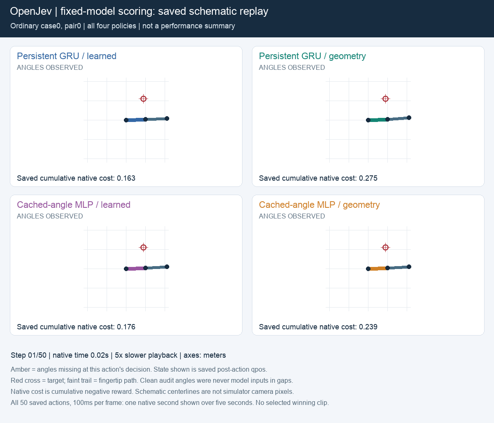
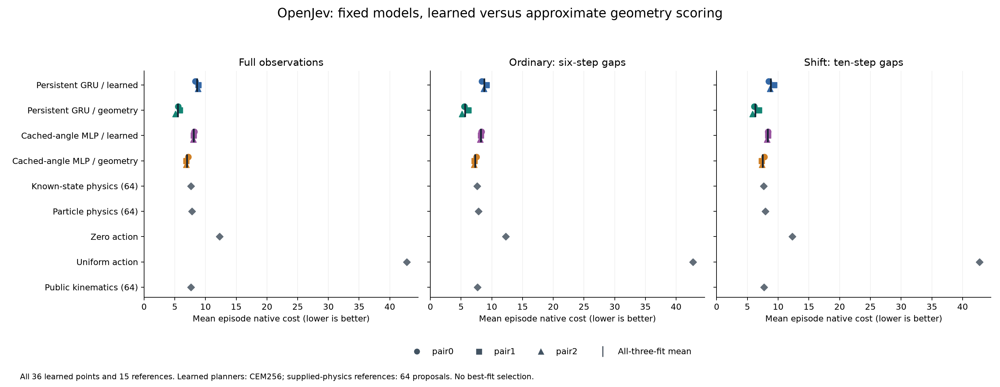
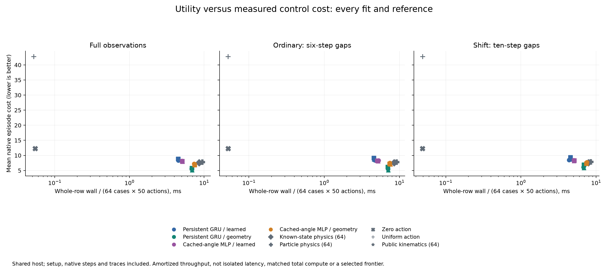
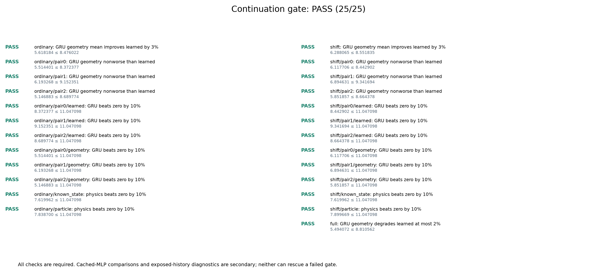

# Reacher: better scoring unlocked useful recurrent predictions

**Completed: all 25 prespecified checks passed.** Replacing the learned reward score with approximate geometry reduced persistent-GRU native control cost by **35.7% with six-step sensing gaps and 28.7% with ten-step gaps**. We reused all six trained models without changing their weights or transition functions.

GRU with geometry also beat cached MLP with geometry by **22.6% and 15.7%**, improving every paired fit. This is useful evidence for the scoring intervention. It does not establish a new recurrent architecture, biological advantage or general robotics capability.

The GIF uses the preselected first case and all four policies. It draws saved native angles schematically, including angles that were hidden from the controller. One simulation second plays over five seconds. It is not a selected winning episode or an aggregate result.

## Results

Each entry below averages all three saved fits over the same 64 fresh cases. Lower native episode cost is better. Episodes contain 50 control steps; the shift lengthens the observation gap from six to ten steps.

| Model and score | Full sensing | Six-step gaps | Ten-step gaps |
|---|---:|---:|---:|
| Persistent GRU, learned | 8.638 | 8.738 | 8.816 |
| Persistent GRU, geometry | **5.494** | **5.618** | **6.288** |
| Cached-angle MLP, learned | 8.084 | 8.216 | 8.305 |
| Cached-angle MLP, geometry | 6.967 | 7.256 | 7.457 |
| Known-state physics reference | 7.620 | 7.620 | 7.620 |
| Particle physics reference | 7.789 | 7.839 | 7.900 |
| Public kinematic reference | 7.610 | 7.639 | 7.718 |
| Zero action | 12.275 | 12.275 | 12.275 |
| Uniform action | 42.761 | 42.761 | 42.761 |

The physics references select from one common bank of 64 proposals; learned planners use CEM256 with adaptive search rounds. Physics also plans nominal trajectories, while geometry includes the expected clipped-actuator cost. These are competence references, not equally searched or compute-matched physics bounds. The GRU-versus-MLP comparisons using geometry are secondary descriptive results. The primary gate tests geometry against each GRU's original learned score.

The [previous cache study](reacher-cache-ablation.md) remains failed at 15/28 checks. Cached MLP won under learned rewards even though GRU predicted missing angles better. This new, separately frozen intervention provides evidence that the original reward head limited control performance. It does not retroactively change the earlier study's result.

The benefit is not specific to missing observations: full-sensing GRU cost also fell **36.4%**, and geometry-GRU beat geometry-MLP there by **21.1%**. Isolating persistent memory still requires the same scoring intervention on the existing GRUs trained with current-only inputs and explicit observation caches.

## What changed

We kept all three persistent GRUs and all three cached MLPs, their weights, transitions, public inputs, initial candidate innovations, horizon and planner settings. Both modes still compute the original reward head. Geometry replaces its scalar score with negative target distance from predicted angles, minus the expected cost of the noisy, clipped actuator command, charged once.

This score is approximate. Forward kinematics at the projected angles is not MuJoCo's exact RK4 cached-body reward, and distance at the projected mean is not expected distance under uncertainty. It uses known arm geometry, so this is not reward learning from pixels or a task-agnostic solution.

All 51 controller rows share the same fresh resets and exogenous actuator noise. Later search proposals and visited states can diverge as scoring changes the selected actions. Every fit, action, native state, candidate prediction, score component and timing is retained.

## Compute and scope

| Three-fit mean whole-controller time | Full sensing | Six-step gaps | Ten-step gaps |
|---|---:|---:|---:|
| GRU, learned | 14.44 s | 14.77 s | 14.31 s |
| GRU, geometry | 21.95 s | 22.56 s | 21.95 s |
| Cached MLP, learned | 16.25 s | 16.56 s | 16.23 s |
| Cached MLP, geometry | 23.76 s | 23.97 s | 23.90 s |

Geometry increased GRU controller time by **52.8%/53.4%** on the two gap panels. GRU with geometry used less controller time and achieved lower native control cost than MLP with geometry on this host, but took more time than either learned-score model. Equal candidate counts do not make the intervention compute-matched.

Times include setup, planning, native steps and trace writes for 64 batched cases. They are shared-host throughput measurements, not isolated single-agent latency. CPU float32, two Torch threads, Apple M5 Max. The full new execution took **982.92 seconds**; the saved-output audit took **121.52 seconds**. No new fitting, optimizer steps or Astra calls occurred. Earlier training costs remain in the cumulative ledger.

## Qualification and audit

The frozen rule requires at least 3% lower mean GRU cost on both gap panels, no worse mean cost in any paired fit, at most 2% degradation under full sensing, and the specified competence margins against zero action. **Every one of the 25 checks passed.**

The independent auditor replayed **329,088 native transitions with zero maximum discrepancy**: 163,200 control transitions plus 165,888 diagnostic transitions. It reconstructed search decisions from saved scores, checked geometry with independent NumPy arithmetic, authenticated all 80 frozen sources and checked equal before/after model tensors. It made no learned-model calls. Neural predictions remain saved, source-bound evidence rather than independently recomputed predictions; endpoints alone do not prove the absence of intermediate updates.

The 48 diagnostic roots came from already exposed prior trajectories. Their finite candidate unions and four common noise branches are descriptive evidence only. They do not constitute independent validation or an optimal-action oracle. Three saved fit pairs on one training corpus also do not quantify population-level training uncertainty. Fresh seeds in the same repeatedly studied simulator remain development evidence.

On those exposed roots, mean GRU regret within the evaluated candidate union fell from **0.0794 to 0.0321** ordinarily and **0.0612 to 0.0248** under shift. The [independent results review](../output/reacher-geometry-score-v1/independent-results-review.md) checks these diagnostics, all 51 costs and all 25 thresholds from authenticated saved outputs. It also explains why high overall rank correlation and lower prediction optimism are not a complete account of the control gain.

## Next experiment

Apply the same geometry score to the already-trained GRUs that use only the current packet or an explicit observation cache, alongside persistent GRU and cached MLP. Keep every saved fit, use fresh paired cases and change no weights. This will test whether the trained persistent update policy remains useful once scoring is held constant. It will not isolate every difference in how those models assimilate observations.

The [proposed design](../output/reacher-geometry-score-v1/next-experiment-design.md) is not yet frozen or run. Ranking-head training waits for this comparison. A biological claim would require a specific new mechanism and conventional history controls; the present result supplies neither.

## Evidence

- [All 51 rows, timings and gate arithmetic](../evidence/reacher-geometry-score-v1/report/tables.md)
- [Frozen protocol](../evidence/reacher-geometry-score-v1/protocol/plan.json), [readiness](../evidence/reacher-geometry-score-v1/protocol/readiness.json), [independent audit](../evidence/reacher-geometry-score-v1/audit/summary.json), [audit receipt](../evidence/reacher-geometry-score-v1/audit/receipt.json)
- [Figure and replay receipt](../evidence/reacher-geometry-score-v1/report/receipt.json)
- [Independent arithmetic and interpretation review](../output/reacher-geometry-score-v1/independent-results-review.md)
- [Prospective conditional follow-ups and primary papers](../output/reacher-geometry-score-v1/conditional-followups.md)

The full source, checkpoints and traces are being packaged separately from the complete preparation archive, which preserves unsuccessful engineering attempts. No raw-release publication is claimed until its verification receipt exists.
