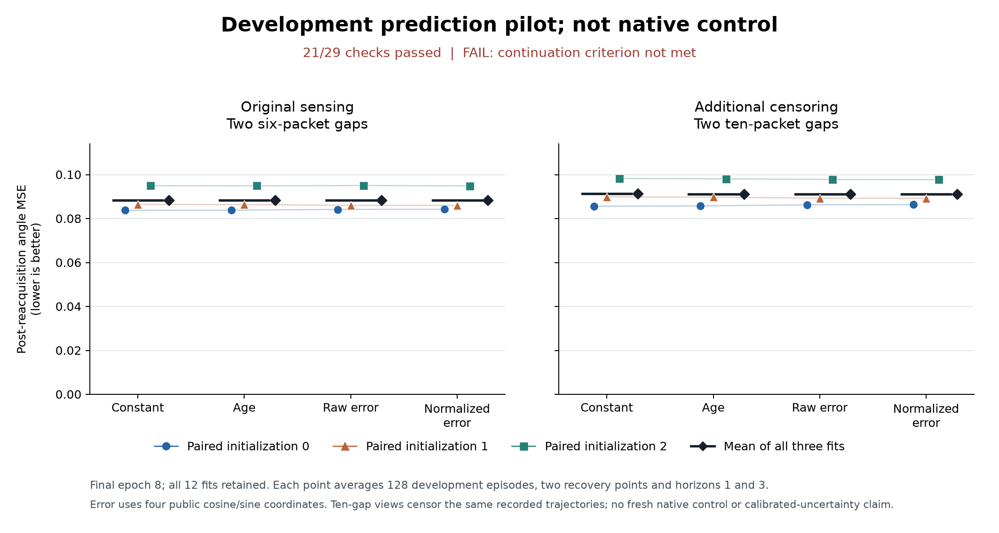

# Error-gated memory: development pilot

**The normalized-error gate did not earn continuation.** All twelve fits and
48 evaluations completed, but only 21 of 29 predeclared checks passed. All four
required 3% improvement checks failed. These are development prediction results;
they establish no improvement in robot control or new architectural advantage.

## What we measured

Each model has a 64-wide recurrent state and 16-wide slow context. The slow
memory update uses either a learned constant, observation age, raw prediction
error, or error divided by predicted residual second moments. Every variant
has the same parameter shapes, training recipe, three paired initializations
and complete episode orders. [Model and loss](../output/reacher-innovation-context-v1/README.md).

We trained on 640 recorded episodes and withheld 128 whole episodes from the
same previously used training corpus. All fits completed before evaluation.
The second panel hides four additional observations after each original
six-packet sensing gap. It retains the original actions and outcomes, so this
is a censoring stress test, not a fresh closed-loop scenario.

The primary metric predicts one and three steps ahead **after** assimilating
an observation that ends a gap. It averages squared error over four public
cosine/sine coordinates, both horizons, both recovery points and every episode.
Lower is better. The table averages all three paired fits.

| Memory-update gate | Original six-packet gaps | Additional censoring: ten-packet gaps |
| --- | ---: | ---: |
| Constant | 0.088436 | 0.091303 |
| Age | 0.088411 | 0.091247 |
| Raw error | 0.088459 | 0.091165 |
| Normalized error | 0.088407 | 0.091135 |

Normalized gating improved family-average error by only **0.004% / 0.122%**
versus age gating and **0.058% / 0.032%** versus raw-error gating. The first
paired initialization was worse than both controls on both panels. Those four
paired failures and four failed improvement thresholds account for all eight
failed checks. Passing the other 21 checks does not qualify the method.

All four families reduced ordinary-panel error by roughly 82% from their own
initializations. That confirms learning occurred; it does not establish
convergence or equivalence between the methods.

## Residual-scale diagnostic

Saved predictions show that the normalized model's average predicted residual
second moment exceeded empirical squared error by **17.73x / 14.64x** on visible
targets. At the returning observations specifically, the ratios were
**3.30x / 2.72x**. This is a marginal scale mismatch, not proof of conditional
calibration, an uncertainty guarantee, or the cause of the failed comparison.
The diagnostic was computed after the result and changes none of the 29 rules.

[Training logs](../output/reacher-innovation-pilot-v1/training-diagnostic.md)
show an active auxiliary objective: finite, nonzero variance-head gradients on
all 1,920 updates, no clipping, and parameter changes in every fit. The score
improved in all twelve fits. This rules out an omitted objective; it does not
prove convergence or justify extending training after seeing the result.

The current gate is not promoted to confirmation or native control. A future
scale-learning diagnostic would need its own declared question and controls;
this run will not be extended or relabeled as a success. The separate frozen
two-observation control study continues unchanged.

## Evidence and reproduction

The source and protocol were published before training. Eight epochs at
batch 32 produced 1,920 optimizer updates. The entire pilot process took 100.61
seconds on this shared Apple Silicon host with one Torch thread. This includes
all twelve fits and 48 evaluations; it is descriptive cost, not a comparative
speed benchmark. The saved-output audit took 1.43 seconds including process
startup. No model or simulator calls were made during either results review.

- [Frozen design](../output/reacher-innovation-pilot-v1/design.md) and [published protocol](https://github.com/kw2828/OpenJev/tree/9c7151a1892b0ccf15d122965339cf258971c245/evidence/reacher-innovation-pilot-v1/protocol).
- [All metrics and 29 checks](../evidence/reacher-innovation-pilot-v1/audit/summary.json), [audit receipt](../evidence/reacher-innovation-pilot-v1/audit/receipt.json), and [independent arithmetic review](../output/reacher-innovation-pilot-v1/results-review.json).
- [Actual process receipt](../output/reacher-innovation-pilot-v1/process/completed.json) and [178-check engineering validation](../output/reacher-innovation-pilot-v1/validation.json). The first synthetic capacity failure is retained.
- [All twelve fitted models, every prediction, logs, public inputs and frozen source](https://github.com/kw2828/OpenJev/releases/tag/research-reacher-innovation-pilot-v1).

The [prior-art screen](../output/reacher-two-observation-control-v1/error-gated-mechanism-screen.md)
identifies close filtering and selective-memory precedents. This experiment
contains no biological wiring and makes no connectome-specific claim.
